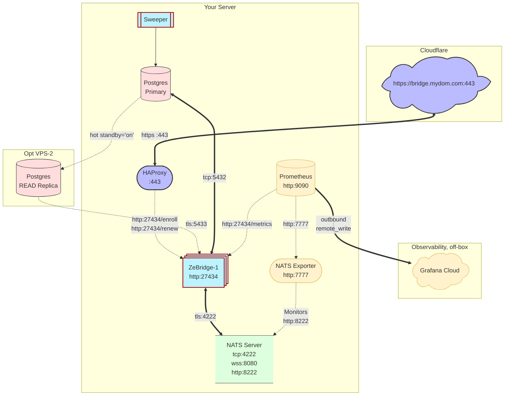
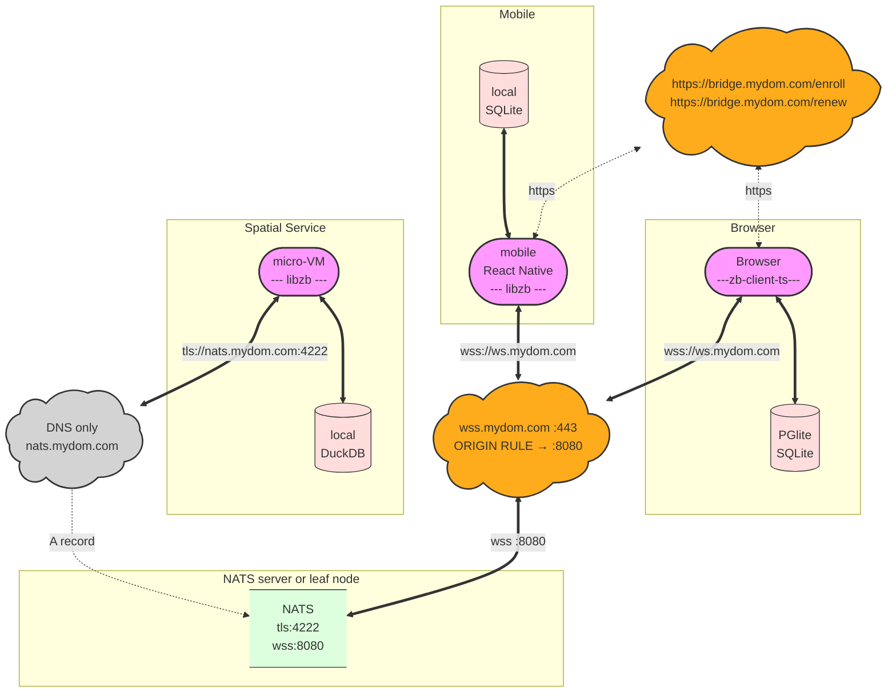
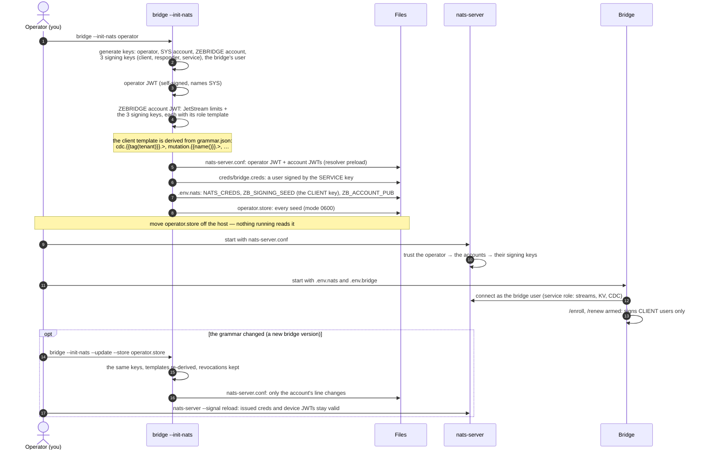

# Deploying ZeBridge

How to install ZeBridge on a server and open it to devices: the architecture and its routing, the host setup step by step, leaf nodes, a cloud PostgreSQL, running the bridge, and the NATS identity with its keys. What ZeBridge is and how an app uses it: the [README](README.md). Running it day to day: [OPERATIONS](OPERATIONS.md).

## Table of Contents

- [Architecture Example](#architecture-example)
- [Topology](#topology)
- [A standby for the reads](#a-standby-for-the-reads)
- [Encryption](#encryption)
- [The bridge and PostgreSQL](#the-bridge-and-postgresql)
- [Setup \& Deployment](#setup--deployment)
  - [Host setup on VPS or bare-metal](#host-setup-on-vps-or-bare-metal)
    - [1. Prerequisites](#1-prerequisites)
    - [2. Generate the configuration](#2-generate-the-configuration)
    - [3. Prepare PostgreSQL](#3-prepare-postgresql)
    - [4. Declare your tables and diagnose](#4-declare-your-tables-and-diagnose)
    - [5. Start NATS, then the bridge](#5-start-nats-then-the-bridge)
    - [6. Secure the credentials](#6-secure-the-credentials)
    - [7. Verify the wiring](#7-verify-the-wiring)
    - [8. Invite the first user](#8-invite-the-first-user)
  - [Adding a leaf node](#adding-a-leaf-node)
- [Using a cloud PostgreSQL](#using-a-cloud-postgresql)
- [Running the Bridge](#running-the-bridge)
- [The NATS identity](#the-nats-identity)

## Architecture Example

**Server-side connections**:



<br>

**Client side connection**:
<br>



**Routing**: given a domain 'mydom.com', we use the subdomains 'nats', 'ws' and 'bridge' with the following routes:

- Cloudflare **orange** proxies <https://bridge.mydom.com> on :443 (long-term CF certs) to HAProxy, which terminates TLS and forwards to the bridge on 127.0.0.1:27434.
- Cloudflare **orange** proxies <wss://ws.mydom.com> on :443, and an Origin Rule rewrites the destination port to :8080. This port 8080 is on Cloudflare's plain-HTTP port list, so a secure websocket cannot open on it directly — it has to arrive on an HTTPS port (443, 2053, 2083, 2087, 2096, 8443) and be redirected at the edge.
- Cloudflare **grey** (DNS only) resolves nats.mydom.com; the connection is joined directly, and NATS presents its own publicly-trusted certificate on tls:4222. A Cloudflare origin certificate will not do here, because phones connect without Cloudflare in between.

**Why the two websocket-facing ports go through Cloudflare.** It is not for caching or inspection — Cloudflare caches no websocket frame, and the WAF only sees the opening HTTP 101 upgrade. It is for the firewall rule that becomes possible once it does: **443 and 8080 accept only Cloudflare's published ranges**, so neither port answers a scan or a flood, even though the grey nats.mydom.com record makes the origin address public. Only 4222 is open to the world, because `libzb` clients join it directly. The proxy also supplies the certificate on 8080, where a Cloudflare origin certificate is enough.

The cost is that Cloudflare closes a proxied websocket after about 100 seconds with no traffic in either direction. The config file `nats-server.conf.template` answers that server-side with `ping_interval: 45s` on the websocket block, so the server keeps the socket warm and no client needs configuring.

|     client  |   address  |  route    |
|    --  |   --  |  --    |
| native (libzb)  | <tls://nats.mydom.com:4222>       | Cloudflare **DNS only**, straight to nats-server  |
| TS client        | <wss://ws.mydom.com>, port 443 at Cloudflare | Cloudflare, then an **Origin Rule** to nats-server's websocket on 8080 |
| any         | <https://bridge.mydom.com>, port 443 at Cloudflare        | Cloudflare, then HAProxy on 443, then http to the bridge on 127.0.0.1:27434   |
| Prometheus on the VPS | remote_write, outbound              | straight to Grafana Cloud, no inbound rule     |

You can test on bare metal or a VPS with for example 6-vCPU, 24 GB RAM and 200GB NVMe SSD, and run comfortably the following stack:

- a master `PostgreSQL` (colocated in this example to communicate over plain TCP, but a remote on an EC2 instance over TLS is possible),
- a `NATS` server and its companion `NATS-exporter` for telemetry,
- a daemon `ZeBridge` on one publication, one slot, and the sweeper companion,
- a TSDB `Prometheus` (scraping telemetry from ZeBridge and NATS-exporter, and pushing to a cloud `Grafana`),
- the reverse-proxy `HAProxy` for TLS termination of the bridge's endpoints _/enroll_ and _/renew_,

This can serve the following clients:

- browsers with a local `PGlite` (or `SQLite`) replica that connects over WSS to NATS,
- mobiles with their native in-process `SQLite` replica that connects to NATS over TLS (React Native and Flutter through libzb),
- a warm micro-VM with an in-process `DuckDB` replica for fast analytics, geo-computations... that connects to NATS over TLS.

[⬆️](#table-of-contents)

---

## Topology

The preferred topology is the daemon colocated with the NATS server over TLS (as opposed to terminating TLS at a reverse-proxy). Since clients join NATS over TLS on the same port, the bridge talks to NATS over TLS too. Ideally PostgreSQL, NATS and ZeBridge are colocated; a cloud PostgreSQL works too, tested on Supabase (see [Using a cloud PostgreSQL](DEPLOYMENT.md#using-a-cloud-postgresql)).

**Multiple instances**: possible, not recommended yet; see [Running the Bridge](#running-the-bridge).

## A standby for the reads

You can use a dedicated Postgres standby replica for all the reads as ZeBridge uses separate reader and writer roles. Point `DATABASE_READER_URL` at the standby and `DATABASE_WRITER_URL` at the primary: the slot and every read stay on the standby, and the bridge's few writes go to the primary. The standby needs PostgreSQL 16+, `wal_level=logical` and `hot_standby_feedback=on` (the bridge warns when it is off). Tested by `scripts/scenarios/standby.py`.

## Encryption

In transit, TLS. At rest, the PostgreSQL disk can be encrypted, and so can NATS's store. The replicas are normally not encrypted (plain SQLite does not offer it).

> [!WARNING]
> Encryption protects data between two points, not at the points themselves. Wherever TLS ends, the data is readable by whoever runs that point: a proxy that terminates TLS (in the demo, Cloudflare in front of the bridge and the browsers' WebSocket), a managed PostgreSQL (the database reads every row it judges), a hosted telemetry service. Each of these operators, and the rules they answer to, can see what passes through them. If you need full control over who may read your data, run the database yourself, and choose the services in the chain with care, or leave them out: clients can reach NATS and the bridge directly, without a proxy.

[⬆️](#table-of-contents)

---

## The bridge and PostgreSQL

The bridge connects with two PostgreSQL roles, one URL each in `.env.bridge`:

| variable | role | can |
| --- | --- | --- |
| `DATABASE_READER_URL` | `bridge_reader` | read the published tables and the WAL (`SELECT` + `REPLICATION`); cannot write |
| `DATABASE_WRITER_URL` | `bridge_writer` | apply client writes, only on tables enabled with `writable => true`. Unset: no writes from clients |

These two URLs are the only place the role names and passwords are written. The init SQL creates the roles from them. The DBA's superuser (`ADMIN_DATABASE_URL`, in `.env.admin`) is used only to install the SQL and for admin commands such as `--revoke`; the bridge never runs as it.

```sh
set -a; . ./.env.admin; . ./.env.bridge; set +a
bridge --init-sql | psql "$ADMIN_DATABASE_URL" -v ON_ERROR_STOP=1
psql "$ADMIN_DATABASE_URL" -c "SELECT * FROM zebridge_create_publication('my_pub')"
```

> Nb: A password with `@` or `:` must be percent-encoded in the URL, as libpq requires.

[⬆️](#table-of-contents)

---

## Setup & Deployment

ZeBridge runs in three contexts:

- **the test suite** runs Postgres and NATS natively on the host — fast to iterate, and driven by the test scenarios. For development only.
- **the docker compose evaluation** — trying ZeBridge out — is best as a `docker compose` stack: all the infrastructure in one code file, Postgres, NATS, NATS-exporter, Prometheus, Grafana, bridge_sweeper, ZeBridge and the reverse proxy HAProxy.
- **Production** is your own topology, and here compose is not a recommendation to avoid any overhead. Postgres may be a managed or remote instance and the system will inevitably suffer from latency. NATS may be remote too, although for performance the bridge should sit next to `nats-server`; they talk over TLS, which measured no throughput cost.

For example, with all three on one host during a write burst, PostgreSQL takes around 70% of the CPU, ZeBridge ~20-25% and NATS ~5-10%.

 So what actually matters is **colocation**: the bridge should sit next to `nats-server`, so their hop does not cross a network.

The strong setup puts **Postgres + bridge + nats-server + Prometheus + nats-exporter + bridge_sweeper + HAProxy** together behind one boundary, one domain. Consumers connect directly to NATS (TLS or WSS); the reverse proxy fronts the bridge's HTTP surface over TLS for the consumer **JWT enrollment** (`/enroll`, `/renew`), and the metrics and logs go to Grafana: a local Prometheus, or Grafana Alloy pushing to Grafana Cloud (`telemetry/vps/`, see [Observability](OBSERVABILITY_TELEMETRY.md)).

The bridge holds no certificates of its own, and HAProxy should terminate the SSL (or slightly less secure, Cloudflare's own certificate).

### Host setup on VPS or bare-metal

The production procedure, in order. For the development stack of this repository (`up.sh`, the test principals), see [scripts/native/README.md](scripts/native/README.md).

The whole procedure is also automated, for a Debian server behind Cloudflare: [deploy/ansible](deploy/ansible/README.md). Its `site.yml` sets up the hub. HAProxy serves `bridge.<domain>` (`/enroll`, `/renew`, `/status`) with Cloudflare's origin certificate, which lasts years, and accepts Cloudflare's addresses only; NATS takes phones and services on `nats.<domain>:4222` with a Let's Encrypt certificate, and browsers on its websocket through Cloudflare. It installs the bridge and the sweeper as systemd services, the telemetry to Grafana Cloud, and optionally the example responders, then ends with `bridge --diagnose`. Its `leaf.yml` sets up [leaf nodes](#adding-a-leaf-node). Run again, either playbook changes only what differs.

#### 1. Prerequisites

- PostgreSQL with logical replication on. In `postgresql.conf`, then restart PostgreSQL:

  ```sh
  wal_level = logical
  max_replication_slots = 10   # also the most bridge instances you can run
  max_wal_senders = 10
  max_slot_wal_keep_size = 10GB
  wal_sender_timeout = 300s
  ```

- `nats-server`, and the `bridge` binary (`zig build -Doptimize=ReleaseFast`, then `zig-out/bin/bridge`), with `libpq` and `zstd` installed on the host. The DBA needs only this binary and `psql`: the init SQL is inside it. From a Mac, `deploy/build-linux.sh` builds the Linux `bridge`, `bridge_sweeper` and `libzbcore.so` in a Debian container (x86_64 by default, `aarch64` for an ARM server); they run on Debian 12+ and Ubuntu 22.04+.

#### 2. Generate the configuration

On the server that will run NATS and the bridge, once:

```sh
bridge --init-nats operator --dir /etc/zebridge
```

`operator` is the mode for every real deployment; `dev` is only a local smoke test ([the two modes](README.md#authentication)).

It writes four files, `nats-server.conf`, `.env.nats`, `creds/bridge.creds` and `operator.store` into `/etc/zebridge` (what each file is: [Set up, once per deployment](README.md#1-set-up-once-per-deployment)). The paths written inside them point into `--dir`; if NATS runs on another host, copy `nats-server.conf` there and change its `store_dir`. `--port`, `--http-port` and `--ws-port` choose the server's ports. `.env.nats` holds the NATS settings only: the URL, the bridge's credentials, the enrollment keys.

Then create `/etc/zebridge/.env.bridge` (mode 0600), the bridge's database side:

- `DATABASE_READER_URL` and `DATABASE_WRITER_URL`: choose the two roles' passwords here. The next step creates the roles from these URLs.
- `BRIDGE_CDC_PUBLICATION` and `BRIDGE_CDC_SLOT`: the publication you will create, and a slot name for this bridge.
- `GENERATIONS_ENABLED=1`: the snapshots new clients seed from.
- `ENROLL_NATS_URL` and `ENROLL_NATS_WS_URL`: the NATS addresses clients are given.

Clients on the internet need TLS: add a `tls` block to `nats-server.conf` (see the NATS documentation), and give clients `tls://` and `wss://` addresses. Every client checks the server's certificate: libzb against the system's roots on macOS, Linux and Windows, and against its own copy of Mozilla's bundle on iOS and Android ([CLIENTS](CLIENTS.md#tls-on-ios-and-android)); zb-client-ts against Node's built-in roots on Node (the same bundle), and the browser's in a browser. So a certificate from a public authority (Let's Encrypt) needs nothing on the clients. A private CA does: `caFile` in libzb, `NODE_EXTRA_CA_CERTS` on Node.

#### 3. Prepare PostgreSQL

As the DBA, once per database:

```sh
set -a; . /etc/zebridge/.env.bridge; set +a

bridge --init-sql | psql "postgres://postgres:…@db-host:5432/app" -v ON_ERROR_STOP=1
```

`bridge --init-sql` prints the init SQL, filled in from `.env.bridge`: the two roles with their names and passwords from the two URLs, and the publication named by `BRIDGE_CDC_PUBLICATION`.

🔔 Without `DATABASE_WRITER_URL` it prints the read-only setup (no writes from clients). The superuser URL is used for this pipe only; the bridge never runs with it.

⚠️ Always create the publication this way (or with `zebridge_create_publication`), never with `CREATE PUBLICATION`: four tables every bridge needs (`zebridge_ddl_events`, `zebridge_gc_watermark`, `zebridge_user_tenants`, `zebridge_catalogue`) are added only by that function.

#### 4. Declare your tables and diagnose

After your own migrations, once per table. Preview with `dry_run => true`, then apply:

```sql
SELECT * FROM zebridge_enable('public.notes',
  tenant_col  => 'tenant_id',       -- or public_reason => '…' for a table every client reads
  writable    => true,              -- leave out for a read-only table
  version_col => 'updated_at',
  publication => 'my_pub',
  dry_run     => false);            -- first run 'true', then set 'false'
```

One call writes the table's catalogue row, installs its guards, scopes RLS and adds it to the publication, atomically. Its last two steps, `T3 bridge` and `T4 nats`, say what the bridge and NATS need: nothing, see [Restart rules](OPERATIONS.md#restart-rules).

Then check everything the bridge will meet at its start. It changes nothing:

```sh
set -a; . /etc/zebridge/.env.nats; . /etc/zebridge/.env.bridge; set +a
bridge --diagnose
```

It ends with `🩺 DIAGNOSE: all clear` (exit 0), or lists what to fix (exit 1).

#### 5. Start NATS, then the bridge

Run them under your service manager. With systemd, three units:

```ini
# /etc/systemd/system/nats.service
[Unit]
After=network-online.target

[Service]
User=nats
ExecStart=/usr/local/bin/nats-server -c /etc/zebridge/nats-server.conf
ExecReload=/bin/kill -s HUP $MAINPID
Restart=on-failure

[Install]
WantedBy=multi-user.target
```

```ini
# /etc/systemd/system/zebridge.service
[Unit]
After=nats.service
Wants=nats.service

[Service]
User=zebridge
EnvironmentFile=/etc/zebridge/.env.nats
EnvironmentFile=/etc/zebridge/.env.bridge
ExecStart=/usr/local/bin/bridge
Restart=on-failure

[Install]
WantedBy=multi-user.target
```

```ini
# /etc/systemd/system/zebridge-sweeper.service — reaps old tombstones (see Sweeper)
[Unit]
After=zebridge.service

[Service]
User=zebridge
EnvironmentFile=/etc/zebridge/.env.nats
EnvironmentFile=/etc/zebridge/.env.bridge
ExecStart=/usr/local/bin/bridge_sweeper
Restart=on-failure

[Install]
WantedBy=multi-user.target
```

```sh
install -d -o nats /etc/zebridge/nats-data                               # JetStream's store_dir
chown zebridge /etc/zebridge/.env.nats /etc/zebridge/.env.bridge /etc/zebridge/creds/bridge.creds  # the bridge's secrets, 0600
systemctl enable --now nats zebridge zebridge-sweeper
```

At its first start the bridge creates the streams and buckets it needs in NATS: nothing to provision by hand.

`systemctl reload nats` is the same as `nats-server --signal reload`. The bridge stops cleanly on `SIGTERM` (`systemctl stop zebridge`) and resumes from its slot.

#### 6. Secure the credentials

Move `operator.store` off the server, and keep the other files readable by their service's user only. The full list: [where the credentials live](README.md#1-set-up-once-per-deployment).

```sh
mv /etc/zebridge/operator.store /your/offline/place/
```

#### 7. Verify the wiring

The bridge is up and running: run the same doctor again. It now also checks the running bridge and what a fresh client finds:

```sh
set -a; . /etc/zebridge/.env.nats; . /etc/zebridge/.env.bridge; set +a
bridge --diagnose
```

#### 8. Invite the first user

A new user's app sends their `principal` (their ID) to the backend (today, the DBA). The backend (DBA here) assigns them a `tenant_id`.

```sql
INSERT INTO zebridge_invites (principal, tenant_id)
VALUES ('alice', 'acme')
RETURNING code;
```

The app passes that code to the library once, with the bridge's URL: [Onboard a device](README.md#2-onboard-a-device).

### Adding a leaf node

A leaf node is a second `nats-server` close to a group of devices. It has no JetStream of its own: the devices' stream calls cross to the hub's JetStream through a **domain**, and their writes and questions cross like any other message. The hub keeps the only copy of the streams; the leaf shortens the devices' path to it.

1. **Give the hub a domain.** A new stack: `bridge --init-nats operator --js-domain hub`. A running one: `bridge --init-nats --update --dir /etc/zebridge --js-domain hub`, then restart NATS and the bridge. The grants then allow both `$JS.API.` and `$JS.hub.API.`, and `/enroll` hands `js_domain` to every device. Devices enrolled before keep working on the hub, and receive the domain at their next renewal (within a quarter of the JWT's life), after which they can use a leaf too.

2. **Open the hub to leaves.** In the hub's `nats-server.conf`, then restart NATS:

   ```
   leafnodes {
     port: 7422
     no_advertise: true
     tls { cert_file: "/etc/zebridge/tls/nats.crt", key_file: "/etc/zebridge/tls/nats.key" }
   }
   ```

   Open 7422 in the firewall to the leaf's addresses: one rule per address family, IPv4 and IPv6.

3. **Mint the leaf's credentials**, where `operator.store` lives:

   ```sh
   bridge --mint-leaf --name leaf1 --store operator.store > leaf1.creds
   ```

   They allow what the devices may do, and nothing more (see [SECURITY](SECURITY.md)). Mint them again after a grammar change.

4. **Configure the leaf.** Copy the trust lines of the hub's `nats-server.conf` into the leaf's `trust.conf`: `operator`, `system_account`, `resolver: MEMORY` and the `resolver_preload` block. The leaf's own `nats-server.conf`, with no `jetstream` block:

   ```
   include ./trust.conf
   port: 4222
   http: "127.0.0.1:8222"
   tls { cert_file: "/etc/zebridge/tls/leaf.crt", key_file: "/etc/zebridge/tls/leaf.key" }

   websocket {                                   # for browsers
     port: 8443
     tls { cert_file: "/etc/zebridge/tls/leaf.crt", key_file: "/etc/zebridge/tls/leaf.key" }
     allowed_origins: ["https://app.example.com"]
   }

   leafnodes {
     remotes: [{
       url: "tls://nats.example.com:7422"
       credentials: "/etc/zebridge/creds/leaf1.creds"
       account: "<ZB_ACCOUNT_PUB from the hub's .env.nats>"
     }]
   }
   ```

   The creds file must be readable by the user `nats-server` runs as. Both servers log `Leafnode connection created`. The `tls` files are a certificate from a public authority, Let's Encrypt for example (`leaf.yml` gets one with certbot): a self-signed pair works only if every client is given its CA.

5. **Point the devices at the leaf.** A device still enrolls at the hub's bridge; only its NATS address changes: `natsUrl` is `tls://leaf.example.com:4222`, or `wss://leaf.example.com:8443` in a browser. The `js_domain` from its enrollment carries its stream calls across the leaf.

6. **After every `--update` on the hub**, copy the new ZEBRIDGE account JWT into the leaf's `trust.conf` and reload the leaf: the leaf checks the devices' JWTs against its own copy.

[⬆️](#table-of-contents)

---

## Using a cloud PostgreSQL

Tested on **Supabase** (PostgreSQL 17, free tier): the init SQL applies unchanged, and the bridge, a client, writes and live schema changes all work. Other providers (RDS, Cloud SQL, Neon…) are untested; the same conditions apply.

- **What the provider must allow.** No managed service gives a true superuser, and the init SQL needs two things vanilla PostgreSQL reserves for one: **event triggers** (four of them: they carry schema changes to the bridge and install two guards) and the **replication** right for the reader role (`ALTER USER … WITH REPLICATION`). Supabase's `postgres` role can do both. On RDS, event triggers are allowed to `rds_superuser`, and replication is granted with `GRANT rds_replication TO <reader role>`. Neon allows both, but a connected replication client keeps its compute running around the clock, billed by the hour, and Neon drops a slot left inactive for about 40 hours.
- **Logical replication** is a provider setting, not a `postgresql.conf` line. Supabase has it on (`wal_level = logical`); RDS: `rds.logical_replication = 1` in the parameter group; Cloud SQL: the `cloudsql.logical_decoding` flag.
- **The direct connection, never the pooler.** Replication does not pass through a connection pooler (Supabase's Supavisor, PgBouncer): both URLs use the provider's direct connection. Supabase's is IPv6 only unless you buy its IPv4 add-on, so check that the bridge's host has IPv6: `curl -6 https://ifconfig.co`.
- **The URLs** name the provider's host with TLS: `?sslmode=require`, or `verify-full` with the provider's CA.
- **Install**: `bridge --init-sql | psql "<admin URL>"`, the admin URL being the provider's admin role (`postgres` on Supabase) over the direct connection. If a provider refuses `ALTER USER … WITH REPLICATION`, grant replication its own way.
- **Running it.**
  - A stopped bridge makes the provider keep WAL for its slot, up to `max_slot_wal_keep_size` (512 MB on Supabase's free tier, already set). Past it the slot is dropped, and the bridge refuses to start and says how to recover.
  - A failover to a standby usually loses logical slots; the bridge then needs one start with `ZB_FEED_RESTART=1`.
  - Run the bridge in the database's region. Measured with the bridge on a laptop in France and Supabase in London (its recommended region), a new `psql` connection costing about 200 ms: a write's verdict in about 40 ms, a change made in Supabase reaching a client in 20 ms, an `ALTER TABLE … ADD COLUMN` reaching the client's table in about a second.

[⬆️](#table-of-contents)

---

## Running the Bridge

A bridge instance is one slot, one port, and reads its slot in order:

```txt
one bridge instance = one replication slot = sequential processing
```

You declare which slot and which publication to use; the bridge refuses to start without both. One bridge serves every tenant of its publication.

The memory each instance takes is fixed at startup: see [Sizing the ring](OPERATIONS.md#sizing-the-ring).

The slot is created by the bridge if it does not exist; the publication is not — ❗️ the publication must already exist, and the bridge stops at boot if it does not (it is created by `bridge --init-sql`, or `zebridge_create_publication`).

⚠️ If you retire an instance, drop its slot! [Replication Slot Management](OPERATIONS.md#replication-slot-management).

The bridge accepts runtime env var configuration:

- a memory budget: `BASE_BUF` (default 2^12 = 4 KB) and `RING_BUFFER_COUNT` (default 32_768), sized to the tables this instance handles — see [Sizing the ring](OPERATIONS.md#sizing-the-ring). `MAX_COLUMNS` is usually left unset and auto-detected.
- a unique `--slot` — the WAL pointer PostgreSQL keeps for this instance. Each running instance needs its own.
- a unique `--port` for its telemetry webserver. Each running instance needs its own.
- the NATS credential: `NATS_CREDS`, the creds file `--init-nats operator` wrote (or `NATS_BRIDGE_NKEY_SEED` on a server without operator mode).
- `DATABASE_READER_URL`, `DATABASE_WRITER_URL`, `NATS_URL` — the connection strings.
- `NATS_JS_DOMAIN` — optional: the JetStream domain, when JetStream is reached across a leaf link. The bridge then addresses `$JS.<domain>.API.`, and `/enroll` hands the name to every client as `js_domain` (they pass it as `jsDomain`). Generate the matching server conf and grants with `--init-nats operator --js-domain <name>`.

For example, a second instance next to the one in `.env.bridge`, on its own publication, slot and port, with a smaller buffer:

```sh
set -a; . /etc/zebridge/.env.nats; . /etc/zebridge/.env.bridge; set +a
BASE_BUF=10 RING_BUFFER_COUNT=4096 bridge --pub my_pub_2 --slot my_slot_2 --port 27435
```

⚠️ Never point two bridges at the same publication: each publishes what its publication carries and builds those tables' chains, so both would publish every change and race on the same chain manifests. Create the second publication with `zebridge_create_publication('my_pub_2')`, and enable each table into one publication only (`zebridge_enable(..., publication => 'my_pub_2')`).

Possible, not recommended yet: one bridge is the setup we run and recommend. Two bridges side by side, on one database and one NATS, pass `scripts/scenarios/multi_bridge.py`: each publishes and snapshots only its own tables, neither touches the other's snapshots, a client enrolled at one follows and writes the tables of both, and a schema change is published once. Three things to know:

- each bridge serves the fleet series (`bridge_fleet_*`) on its `/metrics`, so a dashboard that sums them counts every client twice;
- `ZB_FEED_RESTART=1` on one bridge's new slot deletes the CDC streams the other bridge still feeds;
- the bridges of one database use one JetStream: one server, or one cluster, with leaf nodes around it if you like. A few internal tables are in every publication, and their snapshot records in PostgreSQL are shared: two bridges on two independent JetStreams would each rebuild those snapshots on every tick.

The flags win over the environment, so `.env.bridge` can carry the usual pair and a one-off run can still point at another publication.

[⬆️](#table-of-contents)

---

## The NATS identity

`bridge --init-nats operator` generates the whole chain, with no `nsc`. The templates come from the grammar, so there is no policy to write. The commands, in order, are in [Host setup](#host-setup-on-vps-or-bare-metal).

<details>
<summary>Details of what <code>--init-nats operator</code> builds</summary>



</details>
<br>

**Enrollment settings.** The bridge reads them from its environment:

| variable | default | what it sets |
| --- | --- | --- |
| `ZB_SIGNING_SEED` | — | the account's scoped **client** signing seed; the bridge mints client users with it, nothing else |
| `ZB_ACCOUNT_PUB` | — | the account's public key, named in every JWT the bridge mints |
| `ENROLL_JWT_TTL_SECONDS` | 86400 (24 h) | how long a minted JWT lives; clients renew by themselves with a quarter of it left |
| `ENROLL_NATS_URL` | — | the NATS URL handed to clients over TCP (native, Node) in their identity, e.g. `tls://nats.example.com:4222` |
| `ENROLL_NATS_WS_URL` | — | the same for browsers, e.g. `wss://nats.example.com` |

**If a client gets ❗️ `enrollment not configured`**, the bridge is missing one of three settings: `ZB_SIGNING_SEED` or `ZB_ACCOUNT_PUB`, which `--init-nats operator` writes into `.env.nats`, or `DATABASE_WRITER_URL`, from `.env.bridge` (redeeming an invite is a write). Usually the bridge was started without `.env.nats` loaded, or the stack was set up with `--init-nats dev`. When all three are there, the boot log shows `🎟️ enrollment endpoint armed`.

🔔 **`operator.store` is your root key**: Like the private key of a certificate authority, it signs everything else, and nothing running needs it: the bridge, nats-server and the devices work without it. Keep it offline (a password manager, an encrypted disk), and bring it to a **trusted machine** only to:

- re-sign the account after a grammar change: `bridge --init-nats --update`;
- mint the creds of a responder or a leaf: `--mint-responder`, `--mint-leaf`;
- cut a revoked user off at NATS: `--revoke --conf` (it needs `OPERATOR_SEED`, from the store);
- replace a leaked `ZB_SIGNING_SEED`: `--init-nats --rotate-client-key` (below).

A **trusted machine** is any machine you control, your laptop for example, with the `bridge` binary and the two libraries it needs (`libpq5` and `libzstd1` on Debian). Run the command there, with `--store` pointing at the file, then copy what it wrote to the server: the updated `nats-server.conf`, or the new `.creds`. Passing the flag `--revoke` also needs to reach PostgreSQL (`ADMIN_DATABASE_URL`).

**Where the credentials live, and how to keep them safe**:

| file | holds | keep it |
| --- | --- | --- |
| `operator.store` | every seed: the operator, the accounts, the three signing keys | **off the server**, offline (see above) |
| `.env.bridge` | the database passwords | on the bridge host only, readable by the bridge's user only |
| `.env.nats` | `ZB_SIGNING_SEED`, which can mint a client for any principal | on the bridge host only, readable by the bridge's user only |
| `creds/bridge.creds` | the bridge's own NATS identity: publish and subscribe on every subject of the account | on the bridge host only, readable by the bridge's user only |
| `nats-server.conf` | public JWTs, no secret | on the NATS host |

- `--init-nats` writes the three secret files with mode `0600`. Keep it that way, and run the bridge under its own system user.
- Never commit `zb-nats/`. This repository's `.gitignore` excludes it.
- 🔔 If `operator.store` leaks, anyone can sign an account: generate a new stack, and every device enrolls again.
- 🔔 If `ZB_SIGNING_SEED` leaks, anyone can make a client JWT for any user and any tenant. Replace the key, with `operator.store`:

  ```sh
  bridge --init-nats --rotate-client-key --dir /etc/zebridge --store /path/to/operator.store
  nats-server --signal reload
  systemctl restart zebridge   # the bridge must start with the new ZB_SIGNING_SEED
  ```

  It writes a new client signing key into the account, the store and `.env.nats`; the responder and service keys, the bridge's creds and the revocations stay. From the reload, NATS refuses every client JWT the old key signed, forged or genuine. The old client signing key is removed from the account. A real device is refused once, renews on its own, and is back on a JWT from the new key: no new invite. `/renew` still works because the device signs it with its own key, not with the client signing key, and the bridge checks it against the key on record. Reload NATS and restart the bridge together: until the bridge has restarted, a device that renews gets a JWT from the old key and is refused again. A new device that enrolls in that window is in the same case: its first JWT comes from the old key and is refused, and it renews onto the new key once the bridge has restarted.

**Services that answer queries (responders).** A responder is a service that keeps its own replica and answers the questions clients ask on `query.<tenant>.<name>` (for example, "points of interest near here"). **It reads like a client and never writes**, and the broker enforces it: the responder's signing key grants no `mutation.*` subject, so NATS refuses a write from its creds. Give it its own creds, minted on the machine that holds `operator.store`, not on the bridge host. The command connects to nothing: a copy of the `bridge` binary runs it anywhere libpq and zstd are installed.

```sh
bridge --mint-responder --store operator.store --name pois --tenant globex > pois.creds
```

🔔 The creds are valid ten years by default (`--ttl-days`): a service is replaced with a redeploy, not renewed.

A new tenant needs none of this again: its grants are the template, filled with the tenant tag the JWT carries. A new _role_ (other permissions) is a new signing key in the account.

**After a grammar change** (a new bridge version that adds a table or a subject), the templates must follow. Bring `operator.store` back and run:

```sh
bridge --init-nats --update --dir /etc/zebridge --store /path/to/operator.store
nats-server --signal reload
```

It re-signs the account with the same keys, with the templates re-derived and the revocations kept, and rewrites only the account's line in `nats-server.conf`. Every issued JWT stays valid, so no device needs a new invite. The grants live in the account, not in the clients' JWTs, so a client gets a new subject at its next connection, without renewing. Use a reload, not a restart: a reload keeps every connection open, while a restart also applies the change but drops every client, and they all reconnect at once.

[⬆️](#table-of-contents)

---
