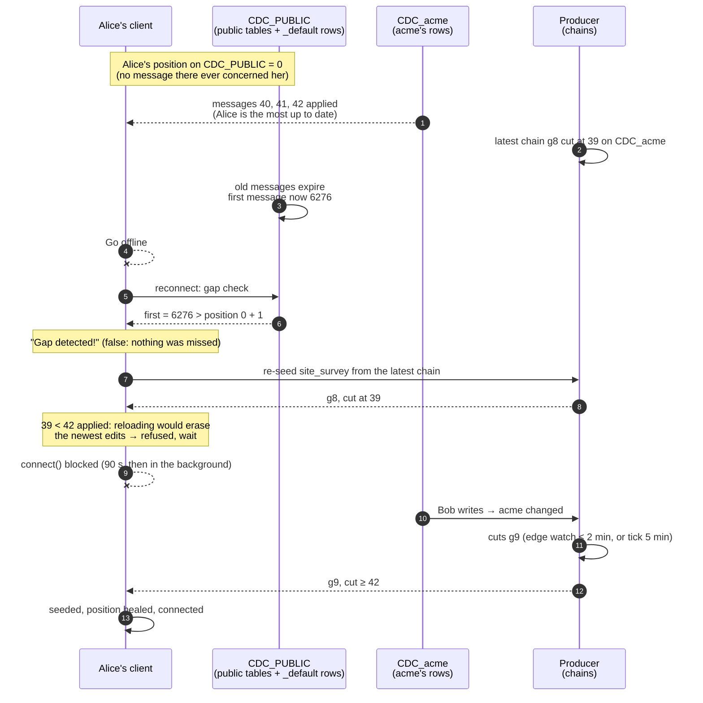
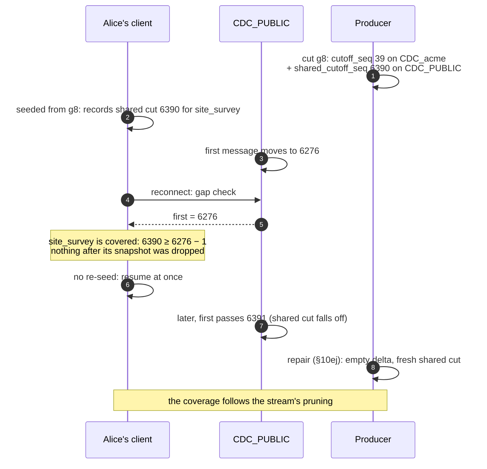

# GENERATION

```mermaid
sequenceDiagram
    autonumber
    participant A as Alice's client
    participant P as CDC_PUBLIC<br/>(public tables + _default rows)
    participant T as CDC_acme<br/>(acme's rows)
    participant G as Producer<br/>(chains)

    Note over A,P: Alice's position on CDC_PUBLIC = 0<br/>(no message there ever concerned her)
    T-->>A: messages 40, 41, 42 applied<br/>(Alice is the most up to date)
    G->>G: latest chain g8 cut at 39 on CDC_acme
    P->>P: old messages expire<br/>first message now 6276
    A--xA: Go offline
    A->>P: reconnect: gap check
    P-->>A: first = 6276 > position 0 + 1
    Note over A: "Gap detected!" (false: nothing was missed)
    A->>G: re-seed site_survey from the latest chain
    G-->>A: g8, cut at 39
    Note over A: 39 < 42 applied: reloading would erase<br/>the newest edits → refused, wait
    A--xA: connect() blocked (90 s, then in the background)
    T->>G: Bob writes → acme changed
    G->>G: cuts g9 (edge watch ≤ 2 min, or tick 5 min)
    G-->>A: g9, cut ≥ 42
    A->>A: seeded, position healed, connected
```

```mermaid
sequenceDiagram
    autonumber
    participant A as Alice's client
    participant P as CDC_PUBLIC
    participant G as Producer

    G->>G: cut g8: cutoff_seq 39 on CDC_acme<br/>+ shared_cutoff_seq 6390 on CDC_PUBLIC
    A->>A: seeded from g8: records shared cut 6390 for site_survey
    P->>P: first message moves to 6276
    A->>P: reconnect: gap check
    P-->>A: first = 6276
    Note over A: site_survey is covered: 6390 ≥ 6276 − 1<br/>nothing after its snapshot was dropped
    A->>A: no re-seed: resume at once
    P->>P: later, first passes 6391 (shared cut falls off)
    G->>G: repair (§10ej): empty delta, fresh shared cut
    Note over A,G: the coverage follows the stream's pruning
```
