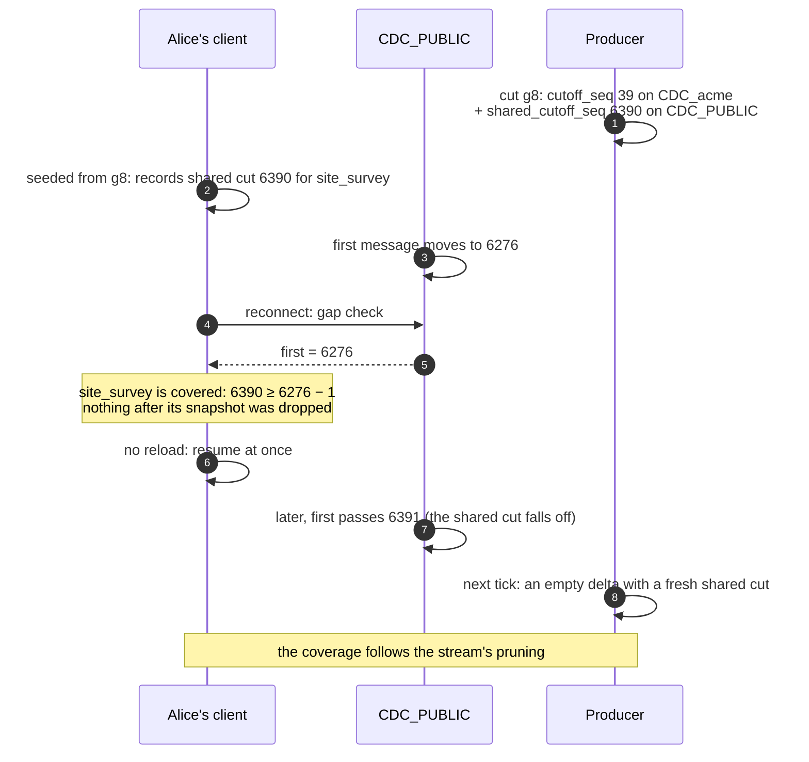

# Shared rows and the gap check

A tenant table can hold rows of the open tenant (`_default`). Those rows travel on the
public stream, `CDC_PUBLIC`, not on the tenant's own stream. So a client of tenant `acme`
reads that table from two streams, and keeps a **position** on each: the last message it
applied.

Each stream drops old messages after a while. When a client comes back, it checks each
position against the stream's first message: if messages it never applied were dropped,
that is a **gap**, and the client must reload the table from a snapshot.

A client that never had a reason to read `CDC_PUBLIC` keeps position 0 there. Once the
stream has dropped its first messages, position 0 looks like a gap, although nothing was
missed. Each snapshot therefore records two **cuts**, the stream sequences it covers:
`cutoff_seq` on the tenant's stream, and `shared_cutoff_seq` on `CDC_PUBLIC`. A client
seeded from that snapshot resumes `CDC_PUBLIC` at the shared cut (`streamResume`, a rule
of libzb's core that zb-client-ts runs as WebAssembly), and reloads only when the shared
cut itself has fallen off the stream.

How the chain and the stream fit together in general: [OPERATIONS, Catching up: the chain
and the stream](OPERATIONS.md#catching-up-the-chain-and-the-stream). The rules a client
follows: [PROTOCOL §6](PROTOCOL.md#6-seeding--generation-chains-). Tested by
`scripts/scenarios/gen_follow.py` (by hand) and `shared_gap.py`.
