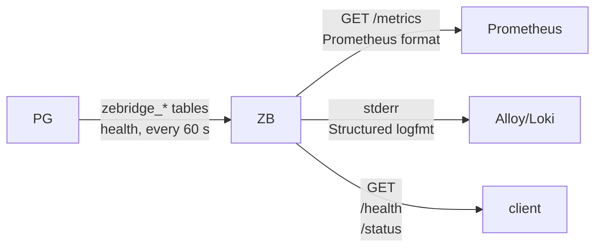

# Observability and telemetry

The bridge provides telemetry through multiple channels:



Scrape `/metrics` (Prometheus exposition) on `BRIDGE_PORT`.
`/status` returns the core counters as JSON; the fleet, slot, PostgreSQL and verdict families are on `/metrics` only.

Both are served by a thread that keeps answering through every outage below — that is deliberate, and `pg_restart.py` asserts it.

| metric | it claims | moved by | proven by |
| --- | --- | --- | --- |
| `bridge_connected` | the WAL stream is attached | any PostgreSQL outage (0 while down, 1 after self-reconnect) | `pg_restart.py` |
| `bridge_pg_reconnects_total` | PostgreSQL sessions re-established | backend kills, cluster restarts | `pg_restart.py`, `chaos.py` |
| `bridge_nats_reconnects_total` | NATS sessions re-established, including the client library's own reconnects. Not a count of broker restarts: bounces close together count once | broker kill + return, even idle bounces | `churn.py` (metric == log ground truth), `nats_outage.py` |
| `bridge_queue_usage_percent` | events held in the ring, right now | broker gone under load: climbs as the ring fills, 0 again after the drain | `cascade.py` |
| `bridge_wal_confirmed_lag_bytes` | WAL PostgreSQL retains that this bridge has not confirmed — THE backlog number | any outage that stops acking; collapses on recovery. Samples on the monitor's 30 s cadence | `cascade.py` |
| `bridge_wal_lag_bytes` | WAL retained from `restart_lsn` — a disk-pressure number that only moves at checkpoints. NOT a backlog gauge; a healthy bridge plateaus at a few MB | slot pressure | (definitional; see the field's comment) |
| `bridge_slot_active` | PostgreSQL shows our slot streaming | bridge down or stepped aside → 0 | `downtime.py` |
| `bridge_cdc_events_published_total` | row events acked by JetStream: the rows delivered | any write reaching CDC | `slot_contest.py` (flow-through), [SPEED_TEST](SPEED_TEST.md) |
| `bridge_schema_events_published_total` | KV/schema traffic, kept OUT of the row counter | DDL, suspensions, drops | `livebirth.py`, `legacybait.py` |
| `bridge_refused_tables` | tables currently suspended or refused — the COUNT | `row_too_large` and structural refusals; falls on the live lift | `suspension_lift.py`, `legacybait.py` |
| `bridge_refused_table{table,reason}` | the NAMED refusal series: 1 while refused, an explicit 0 after a lift in this process; the family vanishes on restart — which also cleared every ban, so absence and truth agree. psql twin: `SELECT tbl, reason, since FROM zebridge_suspensions;` (written by the running bridge, cleared at boot) | every refusal transition | `suspension_lift.py` |
| `bridge_refused_events_dropped_total` | events dropped for refused tables | writes hitting a suspended table | `suspension_lift.py` |
| `bridge_nats_publish_ack_seconds_total` / `bridge_nats_publishes_total` | summed publish→PubAck wall time / count (mean = quotient) | load | [SPEED_TEST](SPEED_TEST.md) |
| `bridge_gc_total_reaped_total` / `bridge_gc_last_sweep_timestamp_seconds` | sweeper activity, read off the watermark row's own change event | sweeper passes; survives a PostgreSQL restart under the daemon | `sweeper_restart.py`, `reaps.py` |
| `bridge_last_ack_lsn` | the position this bridge confirmed, never the server's WAL head | every ack; jumps with the drained fast-ack | `txn_kill.py`, `pg_restart.py` |
| `bridge_uptime_seconds`, `bridge_cpu_seconds_total`, `bridge_max_rss_bytes`, `process_resident_memory_bytes` | process vitals (peak and current memory) | always | (trivially live) |
| `/health` → 200 | the PROCESS is up **and will exit when replication dies** — a FATAL sets the global stop, so a lying 200 cannot outlive the failure | fatal paths | `stream_full.py` |

> **Alert on `bridge_connected == 0` and on `bridge_wal_confirmed_lag_bytes` growth**, not on `/health` alone — health says "process alive", and a process can be alive and parked (that is its correct behaviour during a broker outage).

> `bridge_queue_usage_percent` and `bridge_wal_confirmed_lag_bytes` tick on their own cadences (periodic tick; 30 s WAL monitor). A panel averaging over <1 min windows will alias; 1–2 min windows read true.

> The pair to watch during a broker outage is queue% (the dam filling) THEN confirmed lag (PostgreSQL taking the overflow): the cascade, in two panels.

**Metrics and logs**: Alert on the metric, read the log for the detail.

| | Prometheus (`/metrics`) | Loki (log lines) |
| --- | --- | --- |
| stores | numbers over time | text with labels |
| you get | `bridge_refused_tables 1` | `🔴 SUSPENDING 'orders': a row does not fit in the 4 KB per-event buffer (BASE_BUF=12)` |
| answers | **is** something wrong, since when, how often | **what** is wrong: which table, which LSN, what to change |
| good for | alerting, dashboards, trends | investigating after an alert fires |

_Prometheus physically cannot hold the table name or the fix. Loki can, but is poor at counting and alerting on rates_.

Data emitted by ZeBridge are self-reflection, or read from what ZeBridge owns and depends on:

- its own tables in PostgreSQL — the chain (`zebridge_generations`), the catalogue, the tenant mappings, the invites — and the server's health as it bears on the bridge: connections per bridge role against their limits, the oldest open transaction, the size and dead rows of every published table. One pass every 60 s on the reader connection,
- the consumer fleet signaling itself via NATS heartbeats, and the CDC streams' state, read by the fleet poll — so the dashboard needs no NATS exporter,
- every replication slot on the server (for left-overs: Postgres will keep retaining all the WAL data generated beyond the possibly abandoned slot point). The same inventory from a shell: `bridge --view-slots`; the cure: `ADMIN_DATABASE_URL=… bridge --drop-slot <slot>` (see [The CLI](OPERATIONS.md#the-cli)).

---

## Metrics

### Prometheus /metrics Endpoint

**HTTP GET** `http://localhost:27434/metrics`, Prometheus text format, each metric with its own `# HELP`/`# TYPE` line. Scrape it under the job name `zebridge`, which the dashboard filters on:

```yaml
scrape_configs:
  - job_name: 'zebridge'
    static_configs:
      - targets: ['localhost:27434']
```

<details>
<summary>Example output</summary>

```prometheus
bridge_uptime_seconds 331
bridge_wal_messages_received_total 1797
bridge_cdc_events_published_total 288
bridge_last_ack_lsn 25509096
bridge_connected 1
bridge_pg_reconnects_total 0
bridge_nats_reconnects_total 0
bridge_slot_active 1
bridge_wal_lag_bytes 51344
bridge_wal_confirmed_lag_bytes 2048
bridge_queue_usage_percent 0
bridge_cpu_seconds_total 7.600
bridge_max_rss_bytes 1526153216
bridge_refused_tables 0
bridge_refused_events_dropped_total 0
bridge_schema_events_published_total 21
bridge_nats_publishes_total 213
bridge_nats_publish_ack_seconds_total 0.104422
bridge_gc_total_reaped_total 3371
bridge_gc_last_sweep_timestamp_seconds 1757170050
bridge_ingress_rate_per_principal 20
bridge_ingress_rate_burst 20
bridge_ingress_rate_limited_total 180
bridge_fleet_poll_timestamp_seconds 1757170200
bridge_fleet_clients_live_all 3
bridge_fleet_clients_live{tenant="kilo"} 2
bridge_fleet_clients_live{tenant="acme"} 1
bridge_fleet_client_last_seen_seconds{tenant="kilo",principal="omar"} 12
bridge_fleet_client_lag_events{tenant="kilo",principal="omar",stream="CDC_kilo"} 0
bridge_fleet_client_lag_events{tenant="kilo",principal="omar",stream="CDC_PUBLIC"} 3
bridge_replication_slots 2
bridge_replication_slot_inventory_timestamp_seconds 1757170100
bridge_replication_slot_active{slot="my_slot",type="logical",self="true"} 1
bridge_replication_slot_retained_wal_bytes{slot="my_slot",type="logical",self="true"} 51344
bridge_replication_slot_active{slot="zb_standby",type="physical",self="false"} 0
bridge_replication_slot_retained_wal_bytes{slot="zb_standby",type="physical",self="false"} 734003200
bridge_cdc_window_seconds{stream="CDC_PUBLIC"} 812
bridge_cdc_window_seconds{stream="CDC_kilo"} 263
bridge_cdc_window_short{stream="CDC_PUBLIC"} 0
bridge_cdc_window_short{stream="CDC_kilo"} 1
bridge_cdc_stream_bytes{stream="CDC_kilo"} 806320080
bridge_cdc_stream_messages{stream="CDC_kilo"} 1236512
bridge_mutation_verdicts_total{status="accepted"} 2500
bridge_mutation_verdicts_total{status="stale"} 0
bridge_mutation_verdicts_total{status="rejected"} 0
bridge_mutation_verdicts_total{status="row_deleted"} 0
bridge_mutation_verdicts_total{status="failed"} 0
bridge_mutation_rate_limited_total 0
bridge_pg_health_timestamp_seconds 1790587746
bridge_chain_generation{tenant="globex",table="sensor_events"} 2
bridge_chain_last_cut_timestamp_seconds{tenant="globex",table="sensor_events"} 1790587996
bridge_chain_live_generations{tenant="globex",table="sensor_events"} 2
bridge_chain_rows{tenant="globex",table="sensor_events"} 2500
bridge_catalogue_tables{kind="all"} 31
bridge_catalogue_tables{kind="tenant_scoped"} 21
bridge_principals 8
bridge_tenants 4
bridge_tenant_principals{tenant="globex"} 4
bridge_invites{state="pending"} 0
bridge_pg_role_connections{role="bridge_writer"} 1
bridge_pg_role_connection_limit{role="bridge_writer"} 20
bridge_pg_client_connections 3
bridge_pg_max_connections 100
bridge_pg_oldest_xact_age_seconds 0
bridge_pg_table_bytes{table="sensor_events"} 1622016
bridge_pg_table_dead_rows{table="sensor_events"} 0
bridge_pg_table_live_rows{table="sensor_events"} 2500
```

</details>
<br>

Six families come from the bridge's own polls, or from events it intercepts, not from its core counters:

| family | source | cadence | what to read |
| --- | --- | --- | --- |
| `bridge_fleet_*` | the clients' heartbeats in the `live` KV bucket ([PROTOCOL §11](PROTOCOL.md#11-liveness--kv-bucket-live-)): each client writes `{principal, tenant, ts, streams: {stream: applied seq}, pending}` every `heartbeatMs` | read every `FLEET_POLL_SECONDS` (60); a client silent for `FLEET_TTL_SECONDS` (90) drops out of the bucket by itself | `clients_live` per tenant, `last_seen_seconds` per client, `lag_events` per client and stream: the messages still pending for that client, as JetStream reported with its last delivery (stream head minus what it applied when the client stalls or reports nothing), in **messages** (a published batch counts one, not one per row) |
| `bridge_replication_slot_*` | `pg_replication_slots` on the reader's server — every slot, this bridge's marked `self="true"` | every `SLOT_INVENTORY_SECONDS` (300); the first pass lands one interval after boot | an inactive slot whose retained WAL climbs is an abandoned instance holding the disk; `bridge_replication_slots` is the count |
| `bridge_cdc_window_*`, `bridge_cdc_stream_*` | each CDC stream's state, read by the same fleet poll | every `FLEET_POLL_SECONDS` | the window a stream really holds (now minus its oldest event, `-1` when empty) against the two-cadence floor the chain needs; `short = 1` means the stream is pruning under that floor, so a size or message valve, not the age, is ending the window — see [OPERATIONS, Catching up](OPERATIONS.md#catching-up-the-chain-and-the-stream) |
| `bridge_gc_*` | the sweeper's `zebridge_gc_watermark` writes, seen on the WAL | at every sweep | rows reaped and when, counted since this bridge started (`0` until the first sweep it sees) |
| `bridge_chain_*`, `bridge_catalogue_tables`, `bridge_principals`, `bridge_tenants`, `bridge_invites`, `bridge_pg_*` | the bridge's own tables and the server's catalog views, read as the reader role: `zebridge_generations` (live generations per tenant and table), `zebridge_catalogue`, `zebridge_user_tenants`, `zebridge_invites`, `pg_stat_activity` with `pg_roles`, `zebridge_oldest_open_xact()`, `pg_publication_tables` with `pg_stat_user_tables` | every 60 s, one connection per pass; a query the reader may not run leaves its section out and the rest stand | the chain's age per table (`time() - bridge_chain_last_cut_timestamp_seconds`); the bridge roles' connections against their limits; the oldest open transaction; each published table's size, live and dead rows. `bridge_pg_client_connections` is a close estimate: other roles' session types are hidden from the reader |
| `bridge_mutation_verdicts_total{status}`, `bridge_mutation_rate_limited_total` | every verdict the mutation listener publishes, counted in process | at each verdict | `accepted`, `stale`, `row_deleted`, `rejected`, `failed` since this bridge started; the rate-limit refusals, also counted in `failed`, on their own |

Worth alerting on:

| metric | fires when | what it means |
| --- | --- | --- |
| `bridge_refused_tables` | `> 0` | a table is **suspended** — no primary key, an undecodable column type, or a row larger than the event buffer. The log line names which and why. |
| `bridge_refused_events_dropped_total` | `increase() > 0` | rows are being discarded right now for a suspended table |
| `bridge_fleet_clients_live{tenant}`, `bridge_fleet_clients_live_all` | drops | clients heartbeating inside the live bucket's TTL ([PROTOCOL §11](PROTOCOL.md#11-liveness--kv-bucket-live-)); a fleet going quiet is visible here before anyone complains |
| `bridge_fleet_client_lag_events{tenant,principal,stream}` | `> N` for minutes | that client is falling behind on that stream: the messages still pending for it |
| `bridge_replication_slot_active{slot,type,self}` | `== 0` with retained WAL climbing | a slot nobody reads — an abandoned instance: `bridge --view-slots` to see it from a shell, `ADMIN_DATABASE_URL=… bridge --drop-slot <slot>` once you are sure (it refuses an active slot); PostgreSQL frees the WAL at its next `CHECKPOINT` |
| `bridge_replication_slot_retained_wal_bytes{slot,type,self}` | growing for an inactive slot | WAL PostgreSQL keeps for that slot; every slot on the server, not only this bridge's |
| `bridge_cdc_window_short{stream}` | `== 1` | that stream holds less than two generation cadences and is pruning: a client that falls off it can find a chain that predates it and waits. Raise `CDC_MAX_BYTES` / `CDC_MAX_MSGS` if `bridge_cdc_stream_bytes` or `_messages` sits at a cap, `CDC_MAX_AGE_SECONDS` otherwise |
| `bridge_wal_confirmed_lag_bytes` | rising steadily | **the bridge is behind**: WAL it has not confirmed yet. This is the backlog number. |
| `bridge_ingress_rate_limited_total` | `increase()` for minutes | a principal is living at its write ceiling (`MUTATION_RATE_PER_PRINCIPAL`); its writes are still served, at the rate, and the log line names it. Minutes of it from one principal is the evidence a revocation is made on. `bridge_ingress_rate_per_principal` and `_burst` are the knobs as the bridge runs them, 0 when the limit is off |
| `bridge_wal_lag_bytes` | large and growing across checkpoints | WAL PostgreSQL is _retaining_ on disk for the slot, until `max_slot_wal_keep_size` |
| `bridge_connected` | `== 0` | the replication stream is down |
| `bridge_mutation_verdicts_total{status="rejected"}` or `{status="failed"}` | `rate() > 0` for minutes | edge writes are being refused or failing; the bridge's log names the table and the reason. `stale` is normal under concurrent writers |
| `bridge_pg_role_connections{role}` against `bridge_pg_role_connection_limit{role}` | within 2 of the limit | the writer role must hold `ZB_INGRESS_LANES` + 1 (sweeper) + 4 (enrollments): a role at its limit refuses the next enrollment or lane |
| `bridge_pg_oldest_xact_age_seconds` | `> 600` | a transaction open for minutes elsewhere holds back vacuum and the slot's progress; find it in `pg_stat_activity` |
| `time() - bridge_chain_last_cut_timestamp_seconds{tenant,table}` | growing for a table that is being written | the generation producer is not cutting that table: a returning client will not find a recent chain. A QUIET table's age growing is normal |

💡 **How do you read the lag**? The two lag metrics are not the same.

- `bridge_wal_lag_bytes` measures from the slot's `restart_lsn`, which PostgreSQL only advances at `CHECKPOINT` — so it plateaus at a few MB on a perfectly healthy bridge and cannot tell you whether the bridge is keeping up.

- `bridge_wal_confirmed_lag_bytes` measures from `confirmed_flush_lsn`, which moves the moment the bridge ACKs.

❗️ Alert on the confirmed one for "the bridge is stuck", on the retained one for "the disk will fill".

**How busy is the bridge**?

- `bridge_queue_usage_percent` is the ring buffer's fill level: sustained high values mean NATS is not draining as fast as PostgreSQL produces, and the bridge is about to back-pressure the WAL reader.
- `bridge_cpu_seconds_total` is a counter over all threads, so `rate(bridge_cpu_seconds_total[1m])` gives cores used — `0.31` is a third of a core,
`1.0` is one core saturated, and a single-threaded reader that pins a whole core is telling you it is the bottleneck.
The same figure appears _in the log_ as `cpu=31%` on each `LOOP` line, which beats trying to isolate one process in `htop`.
- `rate(bridge_nats_publish_ack_seconds_total[1m]) / rate(bridge_nats_publishes_total[1m])` is the mean time a JetStream publish waits for its PubAck — the NATS side of "who is slow" when `bridge_queue_usage_percent` climbs.
- `bridge_max_rss_bytes` is peak RSS: expect it to sit near `2^BASE_BUF × RING_BUFFER_COUNT` plus metadata, since the slab is pre-allocated at startup.

### Dashboard

`telemetry/dashboard.json` (Grafana) reads the bridge's `/metrics`, so it works on the native stack without the NATS exporter; only its Services row needs the container metrics of Grafana Alloy's cAdvisor exporter (`telemetry/vps/config.alloy`). Its rows:

- the bridge and the WAL (status, lags, throughput, queue, CPU, memory, suspended tables);
- the CDC streams (bytes and messages per stream, the window each holds);
- the clients (live per tenant, lag per client and stream, last seen);
- the write path (verdicts per second by status, rate-limit refusals);
- the chain (age of the last cut and live generations per table);
- PostgreSQL (connections per bridge role against its limit, the oldest open transaction, server connections against `max_connections`, the ten largest published tables and their dead rows, and a line of counts: tables, principals, tenants, pending invites);
- Services (memory per hub service, from cAdvisor).

See:

- [Postgres-Bridge dashboard](https://github.com/ndrean/zebridge/blob/main/telemetry/Postgres-CDC-to-NATS-1791617561819.png)
- [NATS dashboard](https://github.com/ndrean/zebridge/blob/main/telemetry/NATS-server-1791617602356.png>)

### The NATS dashboard

`telemetry/dashboard-nats.json` ("ZeBridge — NATS server") shows what only the server knows, from [prometheus-nats-exporter](https://github.com/nats-io/prometheus-nats-exporter) scraping nats-server's monitoring port (`-varz -jsz all -leafz`; the `nats-exporter` service in `docker-compose.full.yml`, the `nats` job in `telemetry/prometheus.yml`). The bridge dashboard does not need it; this one is for operating the broker.

| row | panels | read it for |
| --- | --- | --- |
| Server | connections against `max_connections`; **slow consumers** per 5 min, split clients / leaf nodes / routes; memory, CPU, messages and bytes per second; stale connections | a slow consumer is a connection the server cut for reading too slowly, and every cut loses the deliveries in flight — the first sign of a client whose link cannot keep up. The server's log names the connection |
| JetStream | storage against its limit; the ten largest streams; `MUTATIONS` against its byte cap; the CDC streams against theirs; the chain object stores | `MUTATIONS` holds waiting writes and refuses new ones once full; verdicts live apart in `VERDICTS`, which drops its oldest instead. A CDC stream at its cap prunes by size, and clients away longer re-seed from the chain |
| Consumers | pending messages and ack-pending / redelivered, top 10; the bridge's own intake, `bridge_mutations_worker` | redeliveries climbing on a client's consumer are deliveries lost in transit (recovered by the clients' strict-order rule); a steady queue on the bridge's intake means its lanes are at their ceiling — raise `ZB_INGRESS_LANES`, and the writer role's connection limit with it |
| Leaf nodes | leaf connections; slow leaf links | the regional links, once leaf nodes are deployed |

Every metric it queries was checked against a running exporter (`prometheus-nats-exporter`, nats-server 2.15.0).

### JSON /status Endpoint

**HTTP GET** `http://localhost:27434/status` — the core counters as JSON, for a human or a shell script. The fleet, slot, PostgreSQL and verdict families are on `/metrics` only.

<details>
<summary>Example output</summary>

```json
{
  "status": "connected",
  "uptime_seconds": 331,
  "wal_messages_received": 1797,
  "cdc_events_published": 288,
  "last_ack_lsn": "0/1832ce8",
  "is_connected": true,
  "pg_reconnect_count": 0,
  "nats_reconnect_count": 0,
  "slot_active": true,
  "wal_lag_bytes": 51344,
  "wal_lag_mb": 0,
  "wal_confirmed_lag_bytes": 2048,
  "cpu_seconds": 7.600,
  "max_rss_mb": 1455,
  "queue_usage_percent": 0,
  "refused_tables": 0,
  "refused_events_dropped": 0,
  "gc_total_reaped": 3371,
  "gc_last_sweep_time": 1757170050,
  "ingress_rate_per_principal": 20,
  "ingress_rate_burst": 20,
  "ingress_rate_limited_total": 180
}
```

The three `ingress_*` fields describe the rate the bridge applies. Next to the MUTATIONS stream's own backlog cap (`MUTATION_BACKLOG_PER_PRINCIPAL`, read when the bridge creates the MUTATIONS stream), they say how long a full backlog takes to drain.

</details>

---

## Logs

### Writing the log to a file

**Every log line goes to stderr** — including the periodic `METRICS` line and any panic with its stack trace.
Nothing is written to stdout, so `> logs.txt` captures an empty file. Redirect with `2>`:

```bash
bridge --slot my_slot --pub my_pub 2>> bridge.log
```

`LOG_LEVEL` (`debug|info|warn|err`, default `info`) decides what reaches the file.
At `info` the volume is small — the `METRICS` and `LOOP` lines every 15 s are ~11 500 lines/day, the generation producer adds a few per cadence — and everything worth keeping is included.
**Do not point a file sink at `debug`.**

⚠️ The level _names_ differ between input and output: you set `LOG_LEVEL=warn` but the lines read `warning(scope):`.
Both spellings are accepted for the variable; when grepping or writing alert rules, match what the lines actually print:

```bash
grep -E '^(warning|error)\(' bridge.log
```

Rotate it, or it grows forever:

<details>
<summary><code>/etc/logrotate.d/zebridge</code></summary>

```conf
/path/to/bridge.log {
    daily
    rotate 14
    compress
    missingok
    copytruncate      # the bridge holds the fd open; it has no reopen-on-SIGHUP
}
```

</details>
<br>

Under `systemd`, skip the redirect entirely: `journald` captures stderr, and `journalctl -u zebridge -p warning` gives the severity filter for free.

### Structured Log Metrics (for Grafana Alloy/Loki)

The periodic metric line, every 15 seconds:

```log
info(bridge): METRICS uptime=376 wal_messages=67 cdc_events=6 lsn=0/217e280 connected=1 pg_reconnects=0 nats_reconnects=0 lag_bytes=17816 slot_active=1
```

In the logs, the `LOOP` line next to `METRICS` is written every 15 s, which is the reader's profile:

```txt
LOOP iters=1407805 idle=10274 recv_ms=139 proc_ms=1494 cpu=31%
```

 field | reading |
| --- | --- |
| `iters` | WAL loop iterations in the interval |
| `idle` | iterations that found nothing and slept 1 ms — **high `idle` is good**: the bridge is waiting on PostgreSQL, not struggling |
| `recv_ms` | ms inside `receiveMessage` (libpq + framing) |
| `proc_ms` | ms decoding tuples and packing them into the ring buffer |
| `cpu` | process CPU over the interval, all threads |

It is emitted from the WAL loop, starts once replication is running.

When you are ready to ship these to Loki, point Grafana Alloy at the file. Every line is `level(scope): message`, and both halves make useful labels:

<details>
<summary>Grafana Alloy config</summary>

```hcl
loki.source.file "bridge" {
  targets    = [{__path__ = "/var/log/bridge/*.log", job = "zebridge"}]
  forward_to = [loki.process.bridge.receiver]
}

loki.process "bridge" {
  // "error(event_processor): 🔴 SUSPENDING 'orders': …"
  stage.regex {
    expression = "^(?P<level>debug|info|warning|error)\\((?P<scope>[a-z_]+)\\):"
  }
  stage.labels {
    values = { level = "", scope = "" }
  }
  // A panic is one event spread over ~10 lines; keep it as one entry.
  stage.multiline {
    firstline = "^(debug|info|warning|error)\\("
  }
  forward_to = [loki.write.default.receiver]
}
```

</details>
<br>

The queries that matter are `{job="zebridge", level="error"}`, and `{job="zebridge", scope="refused"}` for the tables still refused (repeated every 15 s) and their lifts; the first `SUSPENDING` line of a table is in `scope="event_processor"`.

⚠️ Do **not** use Alloy's `stage.metrics` to re-derive counters from the `METRICS` line. Prometheus already scrapes those numbers from `/metrics`; a second, lossier copy that only updates every 15 seconds is worse in every respect.

---

## Health Check Endpoint

**HTTP GET** `http://localhost:27434/health`
Use for Docker health checks, Kubernetes probes, or load balancers.

Returns:

```json
{"status":"ok"}
```

Status: `200` while the process runs. A fatal replication error stops the process, so a `200` never outlives it. Alert on `bridge_connected`, not on this.

---
