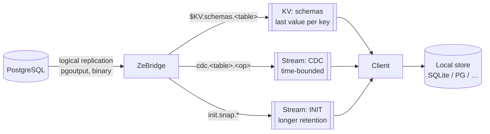
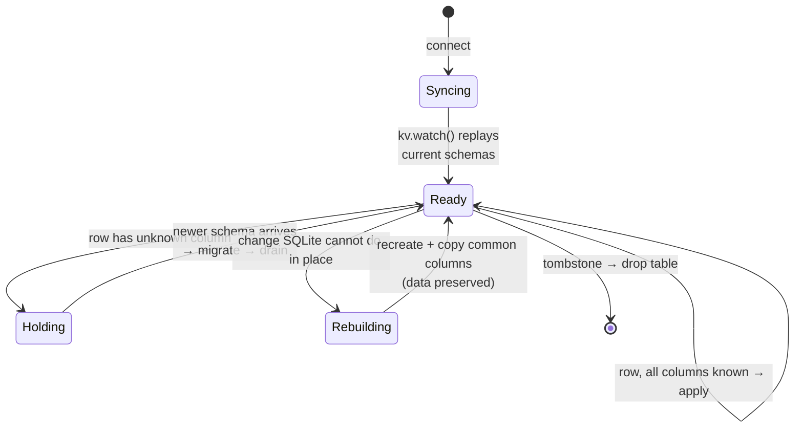
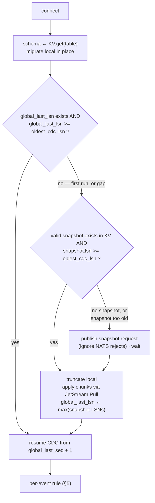

# ZeBridge wire protocol

**This is a protocol, not a framework.** ZeBridge and NATS provide primitives and a
small set of ordering guarantees; the *client* implements the sync state machine.
There is deliberately no SDK — NATS already has clients in ~40 languages, and a
consumer that speaks this document needs nothing else.

Where that boundary sits matters: if you find yourself wanting the bridge to track
per-client state, resolve conflicts, or manage local storage, that is the boundary
working, not a gap. Those belong to the client.

What this document owes you in return is precision. Several rules below are **not
guessable** — the reference web client got one of them wrong and silently dropped a
row. They are marked ⚠️.

> **Status.** Everything marked ✅ is implemented and verified against a running
> stack. Sections marked 🚧 are designed but not built; do not implement against them
> yet. See `NOTES.md` for the open questions behind each.

---

## 1. Vocabulary — `topology.json` is the single source

Every stream, subject and bucket name comes from `topology.json` at the repository
root. It is compiled into the bridge (via `build.zig` → the `topology` module) and
consumed by the NATS init scripts and the reference clients.

```json
{
  "streams":  { "cdc": "CDC", "init": "INIT", "mutations": "MUTATIONS", "requests": "REQUESTS" },
  "subjects": {
    "cdc_prefix": "cdc",
    "init_prefix": "init",
    "mutations_prefix": "mutation",
    "snapshot_request": "snapshot.request",
    "schema_request": "init.schema",
    "snapshot_data_pattern":  "init.snap.{[table]s}.{[snapshot_id]s}.{[chunk]d}",
    "snapshot_start_pattern": "init.snap.start.{[table]s}",
    "snapshot_error_pattern": "init.snap.error.{[table]s}",
    "snapshot_meta_pattern":  "init.snap.meta.{[table]s}",
    "snapshot_schema_pattern": "init.snap.schema.{[table]s}.{[snapshot_id]s}"
  },
  "kv": { "schemas": "schemas", "snapshots": "snapshots" }
}
```

**Renaming anything here requires rebuilding the bridge *and* re-provisioning the
NATS server.** The names are baked in at compile time; a change applied to only one
side produces a bridge publishing into a subject space nobody reads, with no error on
either side.

Every key here is read by something. `streams.schema` and `subjects.schema_prefix`
used to sit in this file unused — no SCHEMA stream was ever created, and schemas travel
through the KV bucket — so they were removed rather than left as an invitation to
implement against them.

| key | read by |
| --- | --- |
| `streams.*` | `nats-init` creates them; the bridge names `MUTATIONS` for its ingress consumer |
| `subjects.cdc_prefix` | bridge (CDC subject), clients (subscription) |
| `subjects.init_prefix` | `nats-init` (INIT stream subjects), clients. Note the snapshot patterns still embed `init.` literally rather than composing from it. |
| `subjects.mutations_prefix` | bridge (consumer filter), `nats-init` (MUTATIONS subjects) |
| `subjects.snapshot_request` | bridge (subscription), clients (request), `nats-init` (REQUESTS subjects) |
| `subjects.schema_request` | bridge (subscription) and the subject prefix its schema replies are published under |
| `kv.schemas` | bridge (`$KV.schemas.<table>`), clients |
| `kv.snapshots` | bridge (`$KV.snapshots.<table>`), `nats-init`, clients |

---

## 2. Channels

Three, with different durability characteristics — chosen deliberately, not
incidentally.



| channel | kind | why |
| --- | --- | --- |
| `schemas` | **KV bucket** | Last-value-per-key. A client connecting at any time gets the current schema without replay. Schema is *state*, not an event. |
| `CDC` | **stream** | Ordered, replayable, time-bounded. Changes are *events*. |
| `INIT` | **stream** | Longer retention than CDC — snapshot chunks must outlive the CDC window a client is catching up across. |

⚠️ **KV and CDC are independent subscriptions.** The bridge publishes schema before
the row that depends on it, but a client receives them over two separate flows and
can observe them in either order. §5 is how you handle that.

---

## 3. Schemas — KV bucket `schemas` ✅

**Subject:** `$KV.schemas.<table>` — key is the bare table name.

JetStream exposes a bucket as the subject space `$KV.<bucket>.<key>`, so the bridge
writes a bucket by publishing there. Clients should use their NATS client's KV API
(`kv.get`, `kv.watch`) rather than subscribing to the raw subject.

### Payload

```json
{
  "table":  "users",
  "pg":     { "columns": [ { "name": "id", "type": "bigint" }, … ] },
  "sqlite": { "columns": [ { "name": "id", "type": "INTEGER" }, … ],
              "pk": "id" },
  "lsn": 25429824
}
```

Root keys are exactly `table`, `pg`, `sqlite`, `lsn`.

- `table` duplicates the KV key. The **key remains authoritative** — if they ever
  disagree, trust the key. The field exists so the value is self-describing like every
  other payload in the protocol (CDC events, snapshot chunks, and this schema's own
  tombstone all carry `table`), which matters once a payload travels without its key:
  logs, caches, forwarding.
- `pg.columns[].type` is `information_schema.data_type` verbatim (`bigint`,
  `character varying`, `timestamp without time zone`, `numeric`, …).
- `sqlite.columns[].type` is the SQLite dialect derived by the bridge.
- ⚠️ `pk` sits **inside `sqlite`**, not at the root. Historical, and the reference
  client depends on it; treat it as part of the contract.
- `lsn` is the WAL position this schema is valid from. For DDL-driven schemas it is
  the exact position of the DDL event; for boot-time schemas it is the WAL position
  read once at bridge startup.

### Type mapping

⚠️ **`numeric` / `decimal` map to `TEXT`, not `REAL`.** PostgreSQL `NUMERIC` is
arbitrary precision; SQLite `REAL` is float64, so money silently loses digits. The
CDC path also delivers numerics as **strings**, so `REAL` would contradict the data.
`float4`/`float8`/`real`/`double precision` do map to `REAL` — those are genuine
IEEE-754. Everything unrecognised falls back to `TEXT`.

### Three states, and a client must distinguish all three

A value in the `schemas` bucket is one of three things. They are distinguished by
root-level flags, and a client that collapses them will either lose data or hang:

| value | meaning | client action |
| --- | --- | --- |
| has `sqlite.columns` | live schema | create or migrate the local table |
| `"dropped": true` | table is **gone** upstream | drop the local table |
| `"suspended": true` | table **exists but is not replicating** | freeze: keep local rows, stop expecting events |

⚠️ **`suspended` is not `dropped`.** Treating a suspension as a tombstone destroys the
client's rows over what is usually a migration mistake that will be fixed in minutes —
and the client cannot re-seed afterwards, since a suspended table serves no snapshot
either. Treating it as a live schema is the opposite failure: the table looks healthy
and silently never updates again.

### Tombstones

```json
{ "table": "orders", "dropped": true, "lsn": 25360144 }
```

⚠️ A dropped table publishes a **tombstone value**, it does not delete the KV key. A
deleted key is indistinguishable from "never seen", so a client that connects after
the DROP would never learn the table is gone. On receiving this, drop the local
table. (A client should *also* handle a genuine KV `DEL`/`PURGE` as a drop, since an
operator may purge a key manually.)

### Suspensions

```json
{ "table": "t_nopk", "suspended": true, "reason": "no_primary_key", "lsn": 25722184 }
```

Published when the bridge refuses a table — today, only for `no_primary_key` (§8).
Like a tombstone it carries **no columns**, because a client must not build a table
from it. Unlike a tombstone the table still exists in PostgreSQL, and the suspension
lifts by itself the moment the shape is fixed.

While a table is suspended:

- its CDC events are **dropped at the bridge** — nothing reaches the `CDC` stream;
- a `snapshot.request.<table>` is answered with `error_type: "table_refused"` (§6);
- the previous live schema is **overwritten** by this value, so a client connecting
  later cannot read a stale shape and build a table that will never receive rows.

`lsn` is the position replication stopped at. A client already holding rows is
internally consistent as of that LSN — its data and its schema agree, and nothing
further will contradict them. That is why freezing is correct and dropping is not.

**Recovery** needs no special signal: when a primary key is added, the DDL event
produces an ordinary live schema on the same key. A client should treat "a schema with
columns arrived for a suspended table" as resume, migrate normally, and re-seed if it
needs to.

---

## 4. CDC — stream `CDC` ✅

**Subjects:** `cdc.<table>.<operation>` where operation is `insert` / `update` /
`delete`, lowercase.

Two suffixes exist:

- `cdc.<table>.<op>.batch` — the message body is an **array** of events.
- `cdc.<table>.update.transition` / `.data` — only when `TRANSITION_RULES` is
  configured for that table, and only for UPDATE.

⚠️ **A message body is either a single event object or an array of them**, on
subjects that differ only by the `.batch` suffix. Decode defensively:

```js
const events = Array.isArray(decoded) ? decoded : [decoded];
```

⚠️ **Every event in a batch shares that batch's subject** — the bridge groups by
subject before publishing, so a `cdc.users.insert.batch` message contains only
`users` INSERTs. This was not always true; a batch used to be published under
whatever its first event happened to be, mixing tables and operations under one
subject (`NOTES.md` §2.1). Do not rely on the payload's `subject` field disagreeing
with the message subject — they now agree, and that is the contract.

### Event payload

```json
{
  "table": "users",
  "operation": "INSERT",
  "subject": "cdc.users.insert",
  "msg_id": "1841bb8-users-insert",
  "relation_id": 16415,
  "lsn": 25257616,
  "data": { "id": 8, "name": "alice", "email": "a@x.com" }
}
```

`operation` is uppercase in the payload and lowercase in the subject.

`msg_id` is `<lsn-hex>-<table>-<operation>` and is set as `Nats-Msg-Id`, so
JetStream deduplicates retries. Batches use
`batch-<first msg_id>-to-<last msg_id>`.

### What `data` contains, by operation

| operation | `data` |
| --- | --- |
| INSERT | all columns, new values |
| UPDATE | all columns, new values — plus `old.<column>` entries **only if** the table is `REPLICA IDENTITY FULL` |
| DELETE | ⚠️ under `REPLICA IDENTITY DEFAULT`: **the primary key populated, every other column `null`** |

⚠️ A DELETE with nulls everywhere but the PK is **not** data loss — it is what
`REPLICA IDENTITY DEFAULT` sends, and it is sufficient to delete by key. Do not treat
it as a malformed event.

⚠️ `old.*` keys are **absent entirely** on a DEFAULT table, and present on every
UPDATE for a FULL table. A client must not assume they exist.

### Value encoding

MessagePack by default, JSON with `--json`. Either way:

- `numeric` arrives as a **string** (`"123.45000000"`) to preserve precision.
- `jsonb` arrives as a nested object in MessagePack mode, a string in JSON mode.
- arrays and `bytea` arrive as strings.
- `timestamptz` arrives as an ISO-8601 string.

---

## 5. The client state machine ⚠️ ✅

The core of the protocol, and the part most easily got wrong.

```mermaid
sequenceDiagram
    participant PG as PostgreSQL
    participant B as ZeBridge
    participant KV as KV schemas
    participant S as CDC stream
    participant C as Client

    Note over PG: ALTER TABLE users ADD COLUMN kyc_status;<br/>INSERT … (same transaction)

    PG->>B: WAL: DDL event, then row
    B->>KV: schema (lsn=X)
    B->>S: cdc.users.insert (lsn>X)

    par independent subscriptions
        KV--)C: schema
    and
        S--)C: row
    end

    Note over C: the row may arrive FIRST

    alt row arrives before schema
        C->>C: unknown column → HOLD
        KV--)C: schema (lsn=X)
        C->>C: ALTER TABLE locally
        C->>C: DRAIN held events
    else schema arrives first
        C->>C: ALTER TABLE locally
        C->>C: apply row normally
    end
```

### The rule



⚠️ **Gate on the column set, not on the LSN.** The LSN tells you *where you are*; the
column set tells you *whether you can proceed*. Blocking whenever
`event.lsn > schema.lsn` would stall permanently during quiet periods, because most
rows legitimately carry an LSN newer than the last DDL. Use `lsn` for ordering and
staleness reasoning; use the column set as the gate.

⚠️ **The race is asymmetric.** Only one direction needs handling:

| local arrival order | consequence |
| --- | --- |
| new-shape row **before** schema | row has a column the local table lacks → **must hold** |
| schema **before** old-shape rows | rows omit the new column → insert fine, column takes NULL |

An INSERT with *fewer* columns applies cleanly to a table that has more.

### Applying schema changes

Prefer **additive** migrations (`ALTER TABLE ADD COLUMN`) so local rows survive.
Rebuilding on every schema push wipes the replica, which both loses data and hides
loss — "the client survived" becomes trivially true.

⚠️ **A removed column does NOT require discarding local data.** SQLite has
`ALTER TABLE DROP COLUMN` (3.35+) and `RENAME COLUMN` (3.25+); PostgreSQL supports
considerably more. Most schema changes apply in place:

| change | action | local rows |
| --- | --- | --- |
| column added | `ADD COLUMN` | preserved |
| column removed (plain) | `DROP COLUMN` | preserved |
| column removed (PK / UNIQUE / indexed) | SQLite refuses → rebuild | preserved, if you copy |
| type change | SQLite cannot → rebuild | preserved, if you copy |

And **"rebuild" must mean recreate-and-copy, not `DROP TABLE`**:

```sql
CREATE TABLE t_new (...);
INSERT INTO t_new (common) SELECT common FROM t;
DROP TABLE t;
ALTER TABLE t_new RENAME TO t;
```

Everything the two schemas share survives. A schema change should therefore
**never** trigger a re-seed — re-seeding is for a CDC gap (§6), not for DDL.

⚠️ A **`RENAME COLUMN`** still appears as one removed + one added, because the
payload carries no rename hint (`NOTES.md` §1.2). The other columns survive; the
renamed column's values do not. That is the one avoidable loss in this table, and it
is a protocol gap rather than a storage limitation.

---

## 6. Snapshots — stream `INIT` ✅

Snapshots seed the client with historical data. The bridge can generate and publish snapshots on request; the client uses them to recover from a stream gap.

### The Storage Architecture

Snapshot data is megabytes-to-gigabytes of ordered chunks. It flows through three channels:

| | where | why |
| --- | --- | --- |
| **Requests** | `REQUESTS` stream | A dedicated stream with `max_msgs_per_subject=1`, `DiscardNew`, and `max_age=SNAP_RET`. This acts as a native NATS lock. It squashes 10 million concurrent client requests into exactly 1 message, shielding the bridge and Postgres from DDoS attacks. |
| **Data (chunks)** | `INIT` stream | JetStream streams reliably hold ordered sequences of chunks for long retention periods. |
| **Metadata** | `kv.snapshots` bucket | A single small descriptor (schema, snapshot ID, LSN, row count). Last-value-per-key makes it trivial for a client to discover the active snapshot without scanning streams. |

**Requesting a snapshot:** 

1. A client checks `kv.snapshots.<table>`. If a valid snapshot exists (i.e., its LSN is within the `CDC` retention window), the client can replay it immediately.
2. If no valid snapshot exists, the client publishes an empty message to `snapshot.request.<table>`.
3. If NATS accepts the publish, the bridge generates the snapshot. If NATS rejects the publish (because a request is already running or cached within `SNAP_RET`), the client simply ignores the error, waits, and watches the KV bucket.

**Responses (from bridge):**

| subject | payload |
| --- | --- |
| `init.snap.start.<table>` | `{snapshot_id, table, lsn, timestamp, status:"starting", format}` |
| `init.snap.<table>.<snapshot_id>.<chunk>` | `{table, operation:"snapshot", snapshot_id, chunk, lsn, data:[…]}` |
| `init.snap.meta.<table>` | `{snapshot_id, table, lsn, timestamp, batch_count, row_count}` |
| `init.snap.error.<table>` | `{table, timestamp, status:"failed", error_type, error_message, available_tables}` |

*Note: Metadata is written to `kv.snapshots.<table>` upon completion, not broadcasted as an event.*

`error_type` is the machine-readable discriminator; branch on it, not on `error_message`:

| `error_type` | meaning | client action |
| --- | --- | --- |
| `table_refused` | table has no primary key — replication suspended (§3, §8) | do not retry; wait for a live schema on the KV key |
| `table_not_monitored` | table is not in the publication this bridge replicates | do not retry; check `available_tables` |
| `generation_failed` | the `COPY` failed (permissions, lock, connection) | retry with backoff |

⚠️ `table_refused` and `table_not_monitored` are **not** retryable — retrying either is a busy-loop against a condition only a migration or a config change will clear.

Chunks default to 10 000 rows.
Requires a **single-column primary key**: chunking uses keyset pagination (`WHERE pk > $last ORDER BY pk LIMIT n`).

### The Connection Flow (Resolving the Gap)

Run on every connect and reconnect. The client must evaluate the **Gap Rule** to decide whether a snapshot is needed.

A naive client might track the last LSN per table. This causes the **"abandoned table paradox"**: if Table A changes rapidly but Table B never changes, Table B's local LSN falls far behind the stream's oldest available LSN. A per-table gap check would incorrectly assume Table B missed events and force a snapshot.

To solve this, the client must track a **Global Sync State**:
- `global_last_lsn`: The highest LSN the client has successfully processed from the CDC stream, across *all* tables.
- `global_last_seq`: The JetStream sequence number corresponding to `global_last_lsn`.

**The Gap Rule:**
Compare `global_last_lsn >= oldest_cdc_lsn`.
- **If true:** The client has no gaps. Every table is safe, even those that haven't changed in months. Resume CDC from `global_last_seq + 1`.
- **If false (or first run):** The client missed history. It must request a snapshot for *all* required tables, as it cannot prove which ones changed during the blackout.



In pseudocode:

```python
if global_last_lsn exists and global_last_lsn >= oldest_cdc_lsn:
    accept CDC from global_last_seq + 1
else:
    for each table:
        check kv.snapshots for a snapshot >= oldest_cdc_lsn
        if none exists:
            publish snapshot.request, wait for kv.snapshots to update
        truncate local table
        replay snapshot chunks from INIT stream using JetStream Pull Consumer
    
    global_last_lsn = max(snapshot LSNs)
    accept CDC from now
```

**Notes that matter for a correct port:**

- ⚠️ **`global_last_lsn` may not exist.** First run has no value; test for its presence explicitly.
- ⚠️ **`>=`, not `>`.** If `global_last_lsn == oldest_cdc_lsn` you have applied the oldest retained event and everything after it is present. Strict `>` forces a needless re-seed.
- ⚠️ **`snapshot_lsn >= oldest_cdc_lsn` must be verified.** A snapshot older than the CDC window seeds you to LSN *s* and then needs CDC from *s* — which has been evicted. You land in a hole immediately.
- ⚠️ **Truncate before applying a snapshot**, do not merge. A snapshot names only rows that *exist*; rows deleted while you were away are never mentioned, so an upsert-only apply leaves them behind forever.
- A schema change **never** triggers this flow. Migrations apply in place (§5); re-seeding is for a CDC gap only.

### Resuming in practice

Keeping the sequence client-side allows **ephemeral** consumers. A durable consumer would have NATS track the position server-side, but that is per-client state on the server — thousands of mobile clients means thousands of consumer objects to create, leak and expire. Client-stored position keeps the server stateless.

---

### Snapshot values come from the same decoder as CDC

Snapshots use `COPY ... FORMAT binary` and decode through `pgoutput.decodeBinColumnData`
— the decoder the CDC path already uses. A value is therefore identical whether it
reached the client by seed or by stream; previously the two could differ and nothing
would have said so.

Two consequences worth knowing:

- `NUMERIC` is padded to its **declared scale**, so `numeric(20,8)` holding `0.1`
  arrives as `0.10000000`, matching what text `COPY` emitted. This matters because
  NUMERIC maps to SQLite **TEXT** (§3), and in TEXT `'0.1000' = '0.10000000'` is false.
- Arrays keep the Postgres literal form (`{x,"y,z"}`), not JSON. ⚠️ The bridge quotes
  elements slightly more eagerly than Postgres does — `{"x","y,z"}` where Postgres
  writes `{x,"y,z"}`. Both parse identically as array literals; they are not byte-equal.

**Unsupported column types are refused, not guessed.** Extension and user-defined types
get per-database OIDs, so they can never be constants in the decoder. `pg_type.typtype`
decides what happens:

| typtype | example | behaviour |
| --- | --- | --- |
| `e` (enum) | `CREATE TYPE mood AS ENUM (...)` | ✅ passes through — Postgres sends enum **labels as text** in binary |
| anything else | `hstore`, composite, range, PostGIS | 🔴 snapshot refused, naming the column and OID |

The refusal exists because the alternative was observed in practice: an `hstore` column
was emitting its binary wire form — `\0\0\0\1\0\0\0\1k\0\0\0\1v` — as a string value
behind nothing but a warning. Plausible-looking, entirely wrong, and undetectable
downstream.

⚠️ **The CDC path does not have this guard yet.** It decodes with OIDs from the
`RELATION` message, which carries no `typtype`, so an `hstore` column in a published
table still corrupts CDC events the same way. Planned fix in `COPY_BINARY_PLAN.md` §E.

---

## 7. Ordering guarantees

What the bridge promises:

1. **WAL order is preserved** into NATS. PostgreSQL serialises DDL against DML via
   ACCESS EXCLUSIVE locks, so an "old-shape row after a schema change" cannot exist —
   verified (`NOTES.md` §3.1).
2. **Schema before dependent row.** When a schema event and CDC events land in the
   same flush, the schema is published first.
3. **Per-subject order.** Events on the same subject reach the stream in WAL order.
4. **At-least-once with dedup.** `Nats-Msg-Id` lets JetStream reject duplicates.

What it does **not** promise:

1. **Cross-subscription order at the client** — KV and CDC are independent (§5).
2. **Cross-table transactional atomicity.** Batching is time- and size-based, not
   transaction-based, so two tables changed in one PostgreSQL transaction may arrive
   in separate messages.
3. **Exactly-once application.** Dedup covers retries; the client must be idempotent
   (upsert on PK, delete by PK).

---

## 8. Table requirements

Checked at bridge startup (`src/preflight.zig`) and again on every DDL event:

| table shape | consequence |
| --- | --- |
| single-column PK + `DEFAULT` | ✅ full support |
| single-column PK + `FULL` | ✅ full support, plus `old.*` and transitions |
| composite PK | ✅ full support — pagination compares the whole key as a row value |
| **no PK, any replica identity** | 🔴 **refused** — suspended, events dropped |
| `TRANSITION_RULES` without `FULL` | ⚠️ transitions can never fire — silently inert |
| column of an unsupported type | ⚠️ CDC flows (unguarded, see §6); snapshots refused |

**A table with no primary key is refused, not warned about.** Without a key a row
cannot be identified, so a DELETE could only be expressed as a full-row match — which
removes *every* duplicate where PostgreSQL removed one — and under at-least-once
delivery a redelivered INSERT has nothing to upsert on, so it duplicates. Neither is
fixable on the client. The bridge therefore publishes a suspension (§3), drops the
table's CDC events, and refuses its snapshots, while every other table keeps
replicating. Fix it with a migration adding a primary key; recovery is automatic and
needs no restart.

`--strict-tables` inverts the default and refuses to *start* if any published table
lacks a key. Useful as a CI or staging gate, wrong as a default: one keyless table
would otherwise stop replication for every table, and a table created while the bridge
runs would turn a schema mistake into an outage.

**A composite primary key is ordinary.** It identifies rows exactly, so CDC is fully
correct, and snapshot chunking pages on the whole key with a row-value comparison —
`("a","b") > (…) ORDER BY "a","b"` — which is the same ordering Postgres compares
against, so no chunk boundary can fall inside a run of equal leading values.

`REPLICA IDENTITY FULL` multiplies WAL volume on wide tables, so `DEFAULT` is a
legitimate trade. The decision is **per table** and belongs in your migrations. Note
that `FULL` does *not* rescue a keyless table: it satisfies PostgreSQL's own
UPDATE/DELETE check, but a replica still cannot identify a row.

---

## 9. Reference implementations

- `web-consumer/` — SolidJS + WASM SQLite (OPFS) over WebSocket with nkey auth.
  Implements §3, §4 and §5 in full. The browser is the *hardest* target; iOS and
  Android both ship SQLite natively, so a mobile port is largely a storage-adapter
  swap.
- `emitter/` — Elixir producer used to generate load and drive chaos tests.

A server-side reference client (Elixir) replicating into SQLite or PostgreSQL is
planned, and is the real test of whether this document is sufficient: it exercises
durable consumers, restart and replay, which a browser never does.
