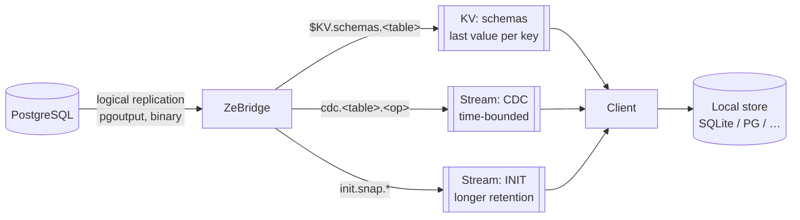
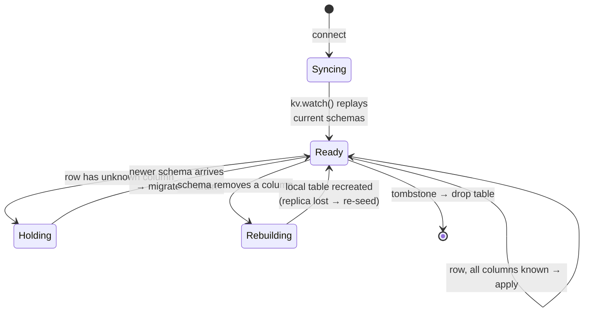

# ZeBridge wire protocol

**This is a protocol, not a framework.** ZeBridge and NATS provide primitives and a
small set of ordering guarantees; the *client* implements the sync state machine.
There is deliberately no SDK — NATS already has clients in ~40 languages, and a
consumer that speaks this document needs nothing else.

Where that boundary sits matters: if you find yourself wanting the bridge to track
per-client state, resolve conflicts, or manage local storage, that is the boundary
working, not a gap. Those belong to the client.

What this document owes you in return is precision. Several rules below are **not
guessable** — the reference web client got one of them wrong and silently dropped a
row. They are marked ⚠️.

> **Status.** Everything marked ✅ is implemented and verified against a running
> stack. Sections marked 🚧 are designed but not built; do not implement against them
> yet. See `NOTES.md` for the open questions behind each.

---

## 1. Vocabulary — `topology.json` is the single source

Every stream, subject and bucket name comes from `topology.json` at the repository
root. It is compiled into the bridge (via `build.zig` → the `topology` module) and
consumed by the NATS init scripts and the reference clients.

```json
{
  "streams":  { "cdc": "CDC", "init": "INIT", "schema": "SCHEMA" },
  "subjects": {
    "cdc_prefix": "cdc",
    "init_prefix": "init",
    "schema_prefix": "schema",
    "snapshot_request": "snapshot.request",
    "snapshot_data_pattern":  "init.snap.{[table]s}.{[snapshot_id]s}.{[chunk]d}",
    "snapshot_start_pattern": "init.snap.start.{[table]s}",
    "snapshot_error_pattern": "init.snap.error.{[table]s}",
    "snapshot_meta_pattern":  "init.snap.meta.{[table]s}"
  },
  "kv": { "schemas": "schemas", "snapshots": "snapshots" }
}
```

**Renaming anything here requires rebuilding the bridge *and* re-provisioning the
NATS server.** The names are baked in at compile time; a change applied to only one
side produces a bridge publishing into a subject space nobody reads, with no error on
either side.

### Keys currently unused

Being explicit so nobody implements against them:

| key | status |
| --- | --- |
| `streams.schema`, `subjects.schema_prefix` | **unused.** Schemas travel through the KV bucket, not a stream. Reserved. |
| `kv.snapshots` | **unused.** Reserved for the snapshot descriptor (§6, 🚧). |
| `subjects.init_prefix` | redundant — the snapshot patterns embed `init.` literally rather than composing from it. |

---

## 2. Channels

Three, with different durability characteristics — chosen deliberately, not
incidentally.



| channel | kind | why |
| --- | --- | --- |
| `schemas` | **KV bucket** | Last-value-per-key. A client connecting at any time gets the current schema without replay. Schema is *state*, not an event. |
| `CDC` | **stream** | Ordered, replayable, time-bounded. Changes are *events*. |
| `INIT` | **stream** | Longer retention than CDC — snapshot chunks must outlive the CDC window a client is catching up across. |

⚠️ **KV and CDC are independent subscriptions.** The bridge publishes schema before
the row that depends on it, but a client receives them over two separate flows and
can observe them in either order. §5 is how you handle that.

---

## 3. Schemas — KV bucket `schemas` ✅

**Subject:** `$KV.schemas.<table>` — key is the bare table name.

JetStream exposes a bucket as the subject space `$KV.<bucket>.<key>`, so the bridge
writes a bucket by publishing there. Clients should use their NATS client's KV API
(`kv.get`, `kv.watch`) rather than subscribing to the raw subject.

### Payload

```json
{
  "pg":     { "columns": [ { "name": "id", "type": "bigint" }, … ] },
  "sqlite": { "columns": [ { "name": "id", "type": "INTEGER" }, … ],
              "pk": "id" },
  "lsn": 25429824
}
```

- `pg.columns[].type` is `information_schema.data_type` verbatim (`bigint`,
  `character varying`, `timestamp without time zone`, `numeric`, …).
- `sqlite.columns[].type` is the SQLite dialect derived by the bridge.
- ⚠️ `pk` sits **inside `sqlite`**, not at the root. Historical, and the reference
  client depends on it; treat it as part of the contract.
- `lsn` is the WAL position this schema is valid from. For DDL-driven schemas it is
  the exact position of the DDL event; for boot-time schemas it is the WAL position
  read once at bridge startup.

### Type mapping

⚠️ **`numeric` / `decimal` map to `TEXT`, not `REAL`.** PostgreSQL `NUMERIC` is
arbitrary precision; SQLite `REAL` is float64, so money silently loses digits. The
CDC path also delivers numerics as **strings**, so `REAL` would contradict the data.
`float4`/`float8`/`real`/`double precision` do map to `REAL` — those are genuine
IEEE-754. Everything unrecognised falls back to `TEXT`.

### Tombstones

```json
{ "table": "orders", "dropped": true, "lsn": 25360144 }
```

⚠️ A dropped table publishes a **tombstone value**, it does not delete the KV key. A
deleted key is indistinguishable from "never seen", so a client that connects after
the DROP would never learn the table is gone. On receiving this, drop the local
table. (A client should *also* handle a genuine KV `DEL`/`PURGE` as a drop, since an
operator may purge a key manually.)

---

## 4. CDC — stream `CDC` ✅

**Subjects:** `cdc.<table>.<operation>` where operation is `insert` / `update` /
`delete`, lowercase.

Two suffixes exist:

- `cdc.<table>.<op>.batch` — the message body is an **array** of events.
- `cdc.<table>.update.transition` / `.data` — only when `TRANSITION_RULES` is
  configured for that table, and only for UPDATE.

⚠️ **A message body is either a single event object or an array of them**, on
subjects that differ only by the `.batch` suffix. Decode defensively:

```js
const events = Array.isArray(decoded) ? decoded : [decoded];
```

⚠️ **Every event in a batch shares that batch's subject** — the bridge groups by
subject before publishing, so a `cdc.users.insert.batch` message contains only
`users` INSERTs. This was not always true; a batch used to be published under
whatever its first event happened to be, mixing tables and operations under one
subject (`NOTES.md` §2.1). Do not rely on the payload's `subject` field disagreeing
with the message subject — they now agree, and that is the contract.

### Event payload

```json
{
  "table": "users",
  "operation": "INSERT",
  "subject": "cdc.users.insert",
  "msg_id": "1841bb8-users-insert",
  "relation_id": 16415,
  "lsn": 25257616,
  "data": { "id": 8, "name": "alice", "email": "a@x.com" }
}
```

`operation` is uppercase in the payload and lowercase in the subject.

`msg_id` is `<lsn-hex>-<table>-<operation>` and is set as `Nats-Msg-Id`, so
JetStream deduplicates retries. Batches use
`batch-<first msg_id>-to-<last msg_id>`.

### What `data` contains, by operation

| operation | `data` |
| --- | --- |
| INSERT | all columns, new values |
| UPDATE | all columns, new values — plus `old.<column>` entries **only if** the table is `REPLICA IDENTITY FULL` |
| DELETE | ⚠️ under `REPLICA IDENTITY DEFAULT`: **the primary key populated, every other column `null`** |

⚠️ A DELETE with nulls everywhere but the PK is **not** data loss — it is what
`REPLICA IDENTITY DEFAULT` sends, and it is sufficient to delete by key. Do not treat
it as a malformed event.

⚠️ `old.*` keys are **absent entirely** on a DEFAULT table, and present on every
UPDATE for a FULL table. A client must not assume they exist.

### Value encoding

MessagePack by default, JSON with `--json`. Either way:

- `numeric` arrives as a **string** (`"123.45000000"`) to preserve precision.
- `jsonb` arrives as a nested object in MessagePack mode, a string in JSON mode.
- arrays and `bytea` arrive as strings.
- `timestamptz` arrives as an ISO-8601 string.

---

## 5. The client state machine ⚠️ ✅

The core of the protocol, and the part most easily got wrong.

```mermaid
sequenceDiagram
    participant PG as PostgreSQL
    participant B as ZeBridge
    participant KV as KV schemas
    participant S as CDC stream
    participant C as Client

    Note over PG: ALTER TABLE users ADD COLUMN kyc_status;<br/>INSERT … (same transaction)

    PG->>B: WAL: DDL event, then row
    B->>KV: schema (lsn=X)
    B->>S: cdc.users.insert (lsn>X)

    par independent subscriptions
        KV--)C: schema
    and
        S--)C: row
    end

    Note over C: the row may arrive FIRST

    alt row arrives before schema
        C->>C: unknown column → HOLD
        KV--)C: schema (lsn=X)
        C->>C: ALTER TABLE locally
        C->>C: DRAIN held events
    else schema arrives first
        C->>C: ALTER TABLE locally
        C->>C: apply row normally
    end
```

### The rule



⚠️ **Gate on the column set, not on the LSN.** The LSN tells you *where you are*; the
column set tells you *whether you can proceed*. Blocking whenever
`event.lsn > schema.lsn` would stall permanently during quiet periods, because most
rows legitimately carry an LSN newer than the last DDL. Use `lsn` for ordering and
staleness reasoning; use the column set as the gate.

⚠️ **The race is asymmetric.** Only one direction needs handling:

| local arrival order | consequence |
| --- | --- |
| new-shape row **before** schema | row has a column the local table lacks → **must hold** |
| schema **before** old-shape rows | rows omit the new column → insert fine, column takes NULL |

An INSERT with *fewer* columns applies cleanly to a table that has more.

### Applying schema changes

Prefer **additive** migrations (`ALTER TABLE ADD COLUMN`) so local rows survive.
Rebuilding on every schema push wipes the replica, which both loses data and hides
loss — "the client survived" becomes trivially true.

A removed column forces a rebuild; the client then has no data and must re-seed
(§6, 🚧). ⚠️ A **`RENAME COLUMN`** appears as one removed + one added and therefore
forces a rebuild, even though PostgreSQL performed it in ~10 ms without touching a
row. There is currently no rename hint in the payload (`NOTES.md` §1.2).

---

## 6. Snapshots — stream `INIT` 🚧

⚠️ **Partly implemented and not yet part of the stable contract.** The bridge can
generate and publish snapshots on request; the *client-facing dance* — retention
windows, discovery, gap detection — is unresolved. Shapes below are what the bridge
emits **today**; expect them to change.

### Snapshot data lives in the INIT stream, never in KV

Stated plainly because it is easy to get backwards, and the choice is forced rather
than stylistic:

| | where | why |
| --- | --- | --- |
| snapshot **rows** (chunks) | **INIT stream** | A snapshot is megabytes-to-gigabytes of ordered chunks. JetStream KV caps a value (1 MB by default) and keeps only the last one per key — it cannot hold this, and would discard all but the final chunk if it tried. |
| snapshot **descriptor** (which snapshot is current, at what LSN) | INIT today, KV *optional* | A single small value that is overwritten each time. Last-value-per-key is exactly right for it — but see below, it is not required. |

KV is a **materialised view of the latest value per key**. That fits *state*
(a schema, a pointer to the current snapshot). It does not fit a *sequence*
(rows, changes). Snapshots are a sequence; they belong in a stream.

**Request:** publish to `snapshot.request.<table>` (empty body).

**Responses:**

| subject | payload |
| --- | --- |
| `init.snap.start.<table>` | `{snapshot_id, table, lsn, timestamp, status:"starting", format}` |
| `init.snap.<table>.<snapshot_id>.<chunk>` | `{table, operation:"snapshot", snapshot_id, chunk, lsn, data:[…]}` |
| `init.snap.meta.<table>` | `{snapshot_id, table, lsn, timestamp, batch_count, row_count}` |
| `init.snap.error.<table>` | `{snapshot_id, table, timestamp, status:"failed", …}` |

Chunks default to 10 000 rows. `meta` arrives **after** all chunks and states how
many to expect.

Requires a **single-column primary key**: chunking uses keyset pagination
(`WHERE pk > $last ORDER BY pk LIMIT n`). Composite or absent PKs cannot be
snapshotted — the bridge warns about this at startup (§8).

### Open before this is contractual

- **Whether a KV descriptor is needed at all.** `init.snap.meta.<table>` already
  carries `{snapshot_id, lsn, batch_count, row_count}` on the INIT stream, so the
  information exists. The only question is *discovery cost*: finding it on a stream
  means a consumer with `deliver_last_per_subject`, whereas mirroring it to
  `kv.snapshots` makes it a single `kv.get`. That is a convenience, **not** a
  requirement — and it is the only thing `kv.snapshots` would ever hold. Decide before
  reserving the bucket for real.
- **The retention invariant fails silently.** Seeding at LSN *L* is only safe while
  the CDC stream still holds *L*. `CDC_RET` must exceed `SNAP_RET` plus the client's
  apply time, and the client must **detect** the gap — compare its seed LSN against
  the stream's oldest available sequence — rather than quietly missing rows.

---

## 7. Ordering guarantees

What the bridge promises:

1. **WAL order is preserved** into NATS. PostgreSQL serialises DDL against DML via
   ACCESS EXCLUSIVE locks, so an "old-shape row after a schema change" cannot exist —
   verified (`NOTES.md` §3.1).
2. **Schema before dependent row.** When a schema event and CDC events land in the
   same flush, the schema is published first.
3. **Per-subject order.** Events on the same subject reach the stream in WAL order.
4. **At-least-once with dedup.** `Nats-Msg-Id` lets JetStream reject duplicates.

What it does **not** promise:

1. **Cross-subscription order at the client** — KV and CDC are independent (§5).
2. **Cross-table transactional atomicity.** Batching is time- and size-based, not
   transaction-based, so two tables changed in one PostgreSQL transaction may arrive
   in separate messages.
3. **Exactly-once application.** Dedup covers retries; the client must be idempotent
   (upsert on PK, delete by PK).

---

## 8. Table requirements

Checked at bridge startup (`src/preflight.zig`), reported not enforced:

| table shape | consequence |
| --- | --- |
| single-column PK + `DEFAULT` | ✅ full support |
| single-column PK + `FULL` | ✅ full support, plus `old.*` and transitions |
| no PK + `DEFAULT`/`NOTHING` | 🔴 **PostgreSQL rejects UPDATE/DELETE outright** — INSERTs still work |
| no PK + `FULL` | ⚠️ CDC works; snapshots impossible |
| composite PK | ⚠️ CDC works; snapshots impossible |
| `TRANSITION_RULES` without `FULL` | ⚠️ transitions can never fire — silently inert |

`REPLICA IDENTITY FULL` multiplies WAL volume on wide tables, so `DEFAULT` is a
legitimate trade. The decision is **per table** and belongs in your migrations.

---

## 9. Reference implementations

- `web-consumer/` — SolidJS + WASM SQLite (OPFS) over WebSocket with nkey auth.
  Implements §3, §4 and §5 in full. The browser is the *hardest* target; iOS and
  Android both ship SQLite natively, so a mobile port is largely a storage-adapter
  swap.
- `emitter/` — Elixir producer used to generate load and drive chaos tests.

A server-side reference client (Elixir) replicating into SQLite or PostgreSQL is
planned, and is the real test of whether this document is sufficient: it exercises
durable consumers, restart and replay, which a browser never does.
