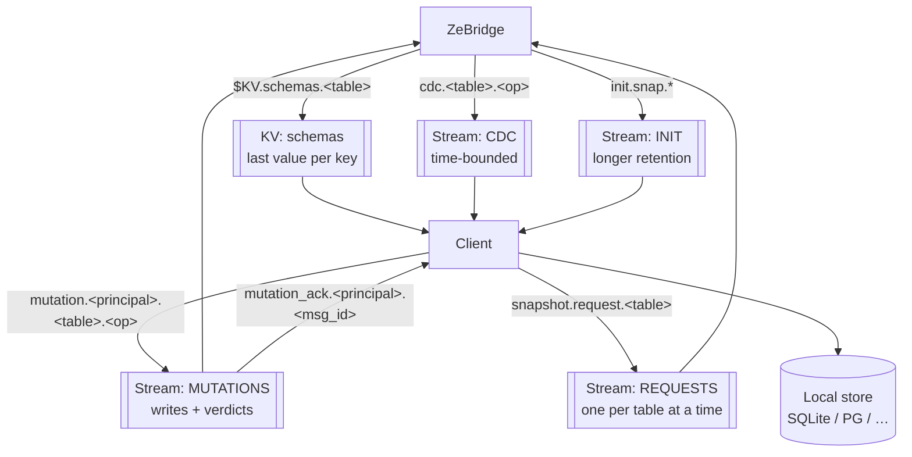
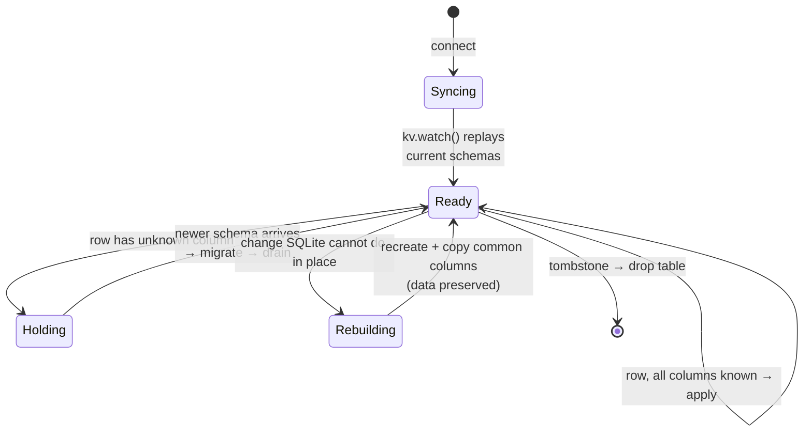
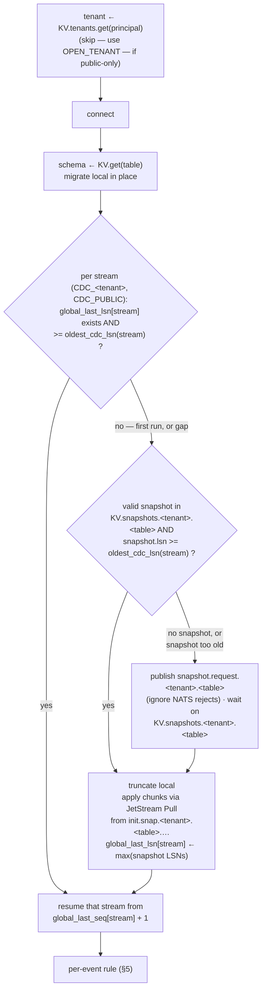

# ZeBridge wire protocol

**This is a protocol, not a framework.** ZeBridge and NATS provide primitives and a
small set of ordering guarantees; the *client* implements the sync state machine.
There is deliberately no SDK — NATS already has clients in ~40 languages, and a
consumer that speaks this document needs nothing else.

Where that boundary sits matters: if you find yourself wanting the bridge to track
per-client state, resolve conflicts, or manage local storage, that is the boundary
working, not a gap. Those belong to the client.

What this document owes you in return is precision. Several rules below are **not
guessable** — the reference web client got one of them wrong and silently dropped a
row. They are marked ⚠️.

> **Status.** Everything marked ✅ is implemented and verified against a running
> stack. Sections marked 🚧 are designed but not built; do not implement against them
> yet. See `NOTES.md` for the open questions behind each.

---

## 0. Two sources of truth, and one direction

**PostgreSQL is the source of truth for anything about the catalogue.
NATS is the source of truth for consumers.
The bridge projects one onto the other, and never reads its own output back.**

Everything else in this document assumes it, and it settles a whole class of design
questions at once rather than one at a time. Three that look reasonable and are not:

* **Decoding WAL tuples against the published schema.** A `RELATION` message is protocol,
not cache: it arrives inline at the LSN where the shape changed and describes the tuples
that immediately follow, which are decoded **positionally**. On replay the correct shape
is the one that was live at that LSN, not the one the catalogue holds now.
* **Building SQL from the published schema.** The write path is about to execute against
the catalogue, in a transaction. If the two disagree the catalogue wins by definition —
the statement either runs or it does not.
* **Invalidating a bridge-side cache by watching the KV.** The `schemas` bucket is
*behind* the catalogue by the ring buffer plus the flush window, and it is produced by
the bridge itself: a failed publish would become a correctness bug, and an empty bucket
could not bootstrap.

So invalidation signals travel the **WAL**, like the data: the DDL event trigger writes a
row to `zebridge_ddl_events`, that row reaches the bridge in stream order, and the bridge
bumps a catalog epoch (`src/catalog_epoch.zig`) that its caches compare against.

⚠️ **`zebridge_ddl_events` must stay in the publication**, or this entire mechanism goes
quiet without failing: the trigger still fires, the row is still written, CDC keeps
flowing for every other table, and the bridge simply never hears about a migration again.
Preflight checks it at boot and says so loudly (`src/preflight.zig`, `checkDdlPipeline`).

⚠️ **A cache that needs a bridge restart to be correct is a bug, not a limitation.** That
is process state the database can silently contradict with no path back. Tested end to end
by `scripts/scenarios/invalidate.py`, which covers all four caches a migration must reach.

---

## 1. Vocabulary — `topology.json` is the single source

Every stream, subject and bucket name comes from `topology.json` at the repository
root. It is compiled into the bridge (via `build.zig` → the `topology` module) and
consumed by the NATS init scripts and the reference clients.

```json
{
  "streams":  { "cdc": "CDC", "init": "INIT", "mutations": "MUTATIONS", "requests": "REQUESTS" },
  "subjects": {
    "cdc_prefix": "cdc",
    "init_prefix": "init",
    "mutations_prefix": "mutation",
    "snapshot_request": "snapshot.request",
    "schema_request": "init.schema",
    "snapshot_data_pattern":  "init.snap.{[table]s}.{[snapshot_id]s}.{[chunk]d}",
    "snapshot_start_pattern": "init.snap.start.{[table]s}",
    "snapshot_error_pattern": "init.snap.error.{[table]s}",
    "snapshot_meta_pattern":  "init.snap.meta.{[table]s}",
    "snapshot_schema_pattern": "init.snap.schema.{[table]s}.{[snapshot_id]s}"
  },
  "kv": { "schemas": "schemas", "snapshots": "snapshots" }
}
```

**Renaming anything here requires rebuilding the bridge *and* re-provisioning the
NATS server.** The names are baked in at compile time; a change applied to only one
side produces a bridge publishing into a subject space nobody reads, with no error on
either side.

Every key here is read by something. `streams.schema` and `subjects.schema_prefix`
used to sit in this file unused — no SCHEMA stream was ever created, and schemas travel
through the KV bucket — so they were removed rather than left as an invitation to
implement against them.

| key | read by |
| --- | --- |
| `streams.*` | `nats-init` creates them; the bridge names `MUTATIONS` for its ingress consumer |
| `subjects.cdc_prefix` | bridge (CDC subject), clients (subscription) |
| `subjects.init_prefix` | `nats-init` (INIT stream subjects), clients. Note the snapshot patterns still embed `init.` literally rather than composing from it. |
| `subjects.mutations_prefix` | bridge (consumer filter), `nats-init` (MUTATIONS subjects) |
| `subjects.snapshot_request` | bridge (subscription), clients (request), `nats-init` (REQUESTS subjects) |
| `subjects.schema_request` | bridge (subscription) and the subject prefix its schema replies are published under |
| `kv.schemas` | bridge (`$KV.schemas.<table>`), clients |
| `kv.snapshots` | bridge (`$KV.snapshots.<table>`), `nats-init`, clients |

---

## 2. Channels

**Five** — one KV bucket and four streams — with different durability characteristics,
chosen deliberately rather than incidentally. Three carry the bridge's output; two carry
the client's input.



| channel | kind | direction | why |
| --- | --- | --- | --- |
| `schemas` | **KV bucket** | bridge → client | Last-value-per-key. A client connecting at any time gets the current schema without replay. Schema is *state*, not an event. |
| `CDC` | **stream** | bridge → client | Ordered, replayable, time-bounded. Changes are *events*. |
| `INIT` | **stream** | bridge → client | Longer retention than CDC — snapshot chunks must outlive the CDC window a client is catching up across. |
| `MUTATIONS` | **stream** | client → bridge → client | Edge writes (§7), and the verdicts answering them. |
| `REQUESTS` | **stream** | client → bridge | Snapshot requests (§6), with a deliberately unusual policy — see below. |

### `MUTATIONS` carries both directions

```
mutation.>          the writes        client → bridge
mutation_ack.>      verdicts (§7.4b)  bridge → client
```

⚠️ **They share a stream so the verdicts are durable.** A verdict is an ordinary retained
message, which is what lets a client that was offline collect the answers it missed —
something a core-NATS reply, a `-NAK` or a JetStream advisory could not do (§7.4b).
Confirmed against a running stack: `mutation_ack.*` subjects are stored in `MUTATIONS`
alongside the writes.

⚠️ **They are separate subject spaces on purpose.** The bridge's ingress consumer filters
on `mutation.>`, so publishing a verdict under that prefix would feed it back in as if it
were a write — a loop ending in a poison pill.

### `REQUESTS` is the odd one, and its policy is the feature

| | `CDC` / `INIT` / `MUTATIONS` | `REQUESTS` |
| --- | --- | --- |
| discard | old | **new, per subject** |
| max age | 7 days | **1 minute** |

⚠️ **`discard: new per subject` with one message per subject is what makes a snapshot
stampede impossible**: while a request for `orders` is outstanding, a second one is
*refused by the broker* rather than queued, and the refusal is the `503` §6 documents. The
bridge does not deduplicate requests — the stream does, before the bridge ever sees them.

⚠️ **The 1-minute age is a timeout, not housekeeping.** A request nobody served expires and
vanishes, so a client that gets no chunks and no error was not ignored — its request aged
out unread (§6, "The fourth case: no answer at all").

### One number that changes what "idempotent" means

Every stream here runs a **duplicate window of 2 minutes** (1 minute for `REQUESTS`).
`Nats-Msg-Id` deduplication only holds *inside* that window.

⚠️ So "a retry is idempotent rather than a second write" (§7.1) is true for a prompt retry
and **false for a resumed outbox**: a client returning after ten minutes and re-sending a
queued write gets a genuinely new stream message, with `duplicate: false` in its PubAck.
The row is still protected — last-write-wins compares the same version and refuses the
repeat (§7.3) — but the *transport* no longer collapses it, so a client must not treat the
absence of `duplicate: true` as proof the write is new.

⚠️ **KV and CDC are independent subscriptions.** The bridge publishes schema before
the row that depends on it, but a client receives them over two separate flows and
can observe them in either order. §5 is how you handle that.

---

## 3. Schemas — KV bucket `schemas` ✅

**Subject:** `$KV.schemas.<table>` — key is the bare table name.

JetStream exposes a bucket as the subject space `$KV.<bucket>.<key>`, so the bridge
writes a bucket by publishing there. Clients should use their NATS client's KV API
(`kv.get`, `kv.watch`) rather than subscribing to the raw subject.

### Payload

```json
{
  "table":  "users",
  "pg":     { "columns": [ { "name": "id", "type": "bigint" }, … ] },
  "sqlite": { "columns": [ { "name": "id", "type": "INTEGER" }, … ],
              "pk": "id" },
  "lsn": 25429824
}
```

Root keys are `table`, `pg`, `sqlite`, `lsn`, plus the **write contract**:
`version_column`, `tombstone_column`, `mutation_timeout_ms` and `replica_identity`.

`version_column` is the column to send back as `version` (§7.3); `tombstone_column` is
`null` when the table deletes physically rather than softly (§7.5).

Each entry in `pg.columns[]` also carries `required` — `true` when the column is `NOT NULL`
with no default, so a mutation omitting it is refused (§7.2).

⚠️ **`max_row_bytes` is the widest row this deployment can carry** — check a write against
it before sending. A mutation above it is refused with `RowTooLargeToReplicate`, because
storing it would produce a row CDC cannot pack, which suspends the table for every client
(§9).

It is published rather than documented as a constant because it is a **deployment**
setting: it differs between installations and an operator may raise it, so a client that
hardcoded the number would be wrong the day that happened — and a consumer author has no
way to read the bridge's environment. Treat it as an upper bound to stay under, not a
budget to fill: the encoded CDC event carries every column plus its name, so it is always
larger than the payload you send.

⚠️ **The schema does not say whether a table accepts edge writes, and a non-null
`version_column` does not mean it does.** Writability is a *grant*, granted separately with
`zebridge_grant_edge_writes` (§7.4), and grants are not in this payload. Measured: `users`
publishes `version_column: "updated_at"` and refuses every write with SQLSTATE `42501`,
because the writer role has no `INSERT` on it — the column exists and would serve, but the
privilege was never given.

So a client that offers editing wherever `version_column` is non-null will offer it on
tables that reject everything. Until a `writable` flag exists here, the only reliable
signals are the operator telling you, or a `rejected` verdict carrying `42501` (§7.4b).

* `table` duplicates the KV key. The **key remains authoritative** — if they ever
  disagree, trust the key. The field exists so the value is self-describing like every
  other payload in the protocol (CDC events, snapshot chunks, and this schema's own
  tombstone all carry `table`), which matters once a payload travels without its key:
  logs, caches, forwarding.
* `pg.columns[].type` is **`format_type(atttypid, atttypmod)`** — the type as PostgreSQL
  spells it, *with* modifiers: `bigint`, `character varying(255)`, `numeric(20,8)`,
  `timestamp with time zone`, `integer[]`.

  ⚠️ **Not `information_schema.data_type`**, which this document claimed for a long time
  and which differs materially: it reports `numeric` for `numeric(20,8)` and — the one that
  breaks clients — a bare **`ARRAY`** for every array type, losing the element type
  entirely. A client written against the old description mis-maps every array column.
* `sqlite.columns[].type` is the SQLite dialect derived by the bridge.
* ⚠️ `pk` sits **inside `sqlite`**, not at the root. Historical, and the reference
  client depends on it; treat it as part of the contract.
* `lsn` is the WAL position this schema is valid from. For DDL-driven schemas it is
  the exact position of the DDL event; for boot-time schemas it is the WAL position
  read once at bridge startup.

### Type mapping

⚠️ **`numeric` / `decimal` map to `TEXT`, not `REAL`.** PostgreSQL `NUMERIC` is
arbitrary precision; SQLite `REAL` is float64, so money silently loses digits. The
CDC path also delivers numerics as **strings**, so `REAL` would contradict the data.
`float4`/`float8`/`real`/`double precision` do map to `REAL` — those are genuine
IEEE-754. Everything unrecognised falls back to `TEXT`.

### Three states, and a client must distinguish all three

A value in the `schemas` bucket is one of three things. They are distinguished by
root-level flags, and a client that collapses them will either lose data or hang:

| value | meaning | client action |
| --- | --- | --- |
| has `sqlite.columns` | live schema | create or migrate the local table |
| `"dropped": true` | table is **gone** upstream | drop the local table |
| `"suspended": true` | table **exists but is not replicating** | freeze: keep local rows, stop expecting events |

⚠️ **`suspended` is not `dropped`.** Treating a suspension as a tombstone destroys the
client's rows over what is usually a migration mistake that will be fixed in minutes —
and the client cannot re-seed afterwards, since a suspended table serves no snapshot
either. Treating it as a live schema is the opposite failure: the table looks healthy
and silently never updates again.

### Tombstones

```json
{ "table": "orders", "dropped": true, "lsn": 25360144 }
```

⚠️ A dropped table publishes a **tombstone value**, it does not delete the KV key. A
deleted key is indistinguishable from "never seen", so a client that connects after
the DROP would never learn the table is gone. On receiving this, drop the local
table. (A client should *also* handle a genuine KV `DEL`/`PURGE` as a drop, since an
operator may purge a key manually.)

### Suspensions

```json
{ "table": "t_nopk", "suspended": true, "reason": "no_primary_key", "lsn": 25722184 }
```

Published when the bridge refuses a table. Two reasons exist:

| `reason` | meaning | fix |
| --- | --- | --- |
| `no_primary_key` | rows cannot be identified, so DELETE is ambiguous (§9) | add a primary key |
| `unsupported_column_type` | a column's type cannot be decoded and is not an enum (§4) | change or drop that column |
| `row_too_large` | a row exceeded the bridge's per-event buffer (`BASE_BUF`) | restart the bridge with a larger buffer, or move the oversized column out of the table |
| `no_tenant_column` | `TENANT_RULES` names a column this table does not have | add the column, or correct the rule |
| `tenant_not_in_replica_identity` | the tenant column is outside the replica identity, so a DELETE could not be routed to a tenant at all | add a unique index covering `(tenant, pk)` and point `REPLICA IDENTITY` at it |

⚠️ **Treat an unrecognised `reason` as "suspended, cause unknown" rather than a parse error** — the set grows, and a client that throws on a new value stops replicating a table it could have simply left alone.

Like a tombstone it carries **no columns**, because a client must not build a table
from it. Unlike a tombstone the table still exists in PostgreSQL, and the suspension
lifts by itself the moment the shape is fixed.

While a table is suspended:

* its CDC events are **dropped at the bridge** — nothing reaches the `CDC` stream;
* a `snapshot.request.<table>` is answered with `error_type: "table_refused"` (§6);
* the previous live schema is **overwritten** by this value, so a client connecting
  later cannot read a stale shape and build a table that will never receive rows.

`lsn` is the position replication stopped at. A client already holding rows is
internally consistent as of that LSN — its data and its schema agree, and nothing
further will contradict them. That is why freezing is correct and dropping is not.

**Recovery** needs no special signal: when a primary key is added, the DDL event
produces an ordinary live schema on the same key. `row_too_large` is the one reason that
lifts on a bridge **restart** rather than on a migration, since it is a sizing verdict —
but the client sees the same thing either way: a schema with columns arrives again. A client should treat "a schema with
columns arrived for a suspended table" as resume, migrate normally, and re-seed if it
needs to.

---

## 4. CDC — stream `CDC` ✅

**Subjects:** `cdc.<table>.<operation>` where operation is `insert` / `update` /
`delete`, lowercase.

Two suffixes exist:

* `cdc.<table>.<op>.batch` — the message body is an **array** of events.
* `cdc.<table>.update.transition` / `.data` — only when `TRANSITION_RULES` is
  configured for that table, and only for UPDATE.

⚠️ **A message body is either a single event object or an array of them**, on
subjects that differ only by the `.batch` suffix. Decode defensively:

```js
const events = Array.isArray(decoded) ? decoded : [decoded];
```

⚠️ **Every event in a batch shares that batch's subject** — the bridge groups by
subject before publishing, so a `cdc.users.insert.batch` message contains only
`users` INSERTs. This was not always true; a batch used to be published under
whatever its first event happened to be, mixing tables and operations under one
subject (`NOTES.md` §2.1). Do not rely on the payload's `subject` field disagreeing
with the message subject — they now agree, and that is the contract.

### Event payload

```json
{
  "table": "users",
  "operation": "INSERT",
  "subject": "cdc.users.insert",
  "msg_id": "1841bb8-users-insert",
  "relation_id": 16415,
  "lsn": 25257616,
  "data": { "id": 8, "name": "alice", "email": "a@x.com" }
}
```

`operation` is uppercase in the payload and lowercase in the subject.

`msg_id` is `<lsn-hex>-<table>-<operation>` and is set as `Nats-Msg-Id`, so
JetStream deduplicates retries. Batches use
`batch-<first msg_id>-to-<last msg_id>`.

### What `data` contains, by operation

| operation | `data` |
| --- | --- |
| INSERT | all columns, new values |
| UPDATE | all columns the UPDATE could observe — see the omission rule below — plus `old.<column>` entries **only if** the table is `REPLICA IDENTITY FULL` |
| DELETE | ⚠️ under `REPLICA IDENTITY DEFAULT`: **the primary key populated, every other column `null`** |

⚠️ **A table with a tombstone column emits no `cdc.<table>.delete` at all.** If its
`SYNC_RULES` entry names a tombstone (§7.5), the bridge **drops every physical DELETE** for
that table — not only the sweeper's reaps. Deletes reach clients as an `update` setting the
tombstone, and the physical removal that follows once the tombstone ages out is
deliberately not forwarded: the client already removed the row when the soft delete
arrived, and re-sending it would cost one message per reaped row per client for a row they
know is gone.

So a `cdc.test_types.delete` handler on such a table is a handler that never fires. Verified
by `scripts/scenarios/reaps.py`, which also asserts the converse — a table **without** a
tombstone still emits real deletes, since suppressing those would strand rows in every
replica with no later event able to remove them.

⚠️ A DELETE with nulls everywhere but the PK is **not** data loss — it is what
`REPLICA IDENTITY DEFAULT` sends, and it is sufficient to delete by key. Do not treat
it as a malformed event.

⚠️ `old.*` keys are present on every UPDATE for a FULL table. On a DEFAULT table they
are **usually** absent — but they **do** appear when the UPDATE changes the primary key,
because the old key is the only way to locate the row. A client must not assume they
exist, and must not assume they don't.

⚠️ **A changed primary key arrives as one UPDATE, not as a DELETE plus an INSERT.** A
client that upserts on the new key alone inserts a second row and keeps the old one
forever — measured: `UPDATE test_types SET id = 888001 WHERE id = 777006` left
PostgreSQL with one row and an unpatched replica with two. Delete `old.<pk>` before
applying the row, and see §7.2 on why an editable primary key is a poor choice in the
first place.

#### An absent key on an UPDATE means "unchanged", never "null"

PostgreSQL does not resend a **TOASTed** value (roughly: any value that did not fit
inline, so large `text`, `jsonb`, `bytea`, arrays) when an UPDATE did not modify it. On
the wire that column carries pgoutput's `'u'` marker and no bytes.

ZeBridge encodes this by **omitting the column from `data`**. So on an UPDATE:

| in `data` | meaning |
| --- | --- |
| key present, value `null` | the column **is** SQL NULL |
| key present, any other value | the column has that value |
| **key absent** | the column was not modified — **keep whatever you have** |

**A client must apply only the keys present.** Building an UPDATE from
`Object.keys(data)` does the right thing automatically; expanding to the full column
list and defaulting the missing ones to null erases data PostgreSQL never touched. The
reference client does the former (`INSERT … ON CONFLICT DO UPDATE SET` over the present
keys only).

Only UPDATE can omit a column: INSERT and snapshot rows always carry every column, and
a DELETE carries the key (plus nulls under DEFAULT identity, as above).

### Value encoding

MessagePack by default, JSON with `--json`. Either way:

* `numeric` arrives as a **string** (`"123.45000000"`) to preserve precision.
* a column PostgreSQL sent in **text format** (it does this per column, even under
  `binary 'true'`, for any type with no binary send function) arrives as that text
  verbatim — no type-specific decoding is applied or needed.
* `jsonb` arrives as a nested object in MessagePack mode, a string in JSON mode.
* arrays and `bytea` arrive as strings.
* **`timestamptz` arrives as ISO-8601 with `Z`; `timestamp` arrives without it.** The
  suffix is not decoration — `timestamptz` is stored as UTC, so `Z` states a recorded
  fact, while `timestamp` is a naive wall-clock reading with no zone. A client must
  **not** localise a value that has no suffix: `new Date("2025-10-26T10:00:00.000000")`
  parses as *local* time in JavaScript, which shifts it. Treat it as the literal clock
  reading the database holds.

  ⚠️ Note most ORMs produce naive columns by default — Ecto's `timestamps()` and Rails'
  `t.timestamps` both create `timestamp without time zone` — so this is the common case,
  not the exotic one. Before 2026-08-16 both types were emitted with `Z`.

---

## 5. The client state machine ⚠️ ✅

The core of the protocol, and the part most easily got wrong.

```mermaid
sequenceDiagram
    participant PG as PostgreSQL
    participant B as ZeBridge
    participant KV as KV schemas
    participant S as CDC stream
    participant C as Client

    Note over PG: ALTER TABLE users ADD COLUMN kyc_status;<br/>INSERT … (same transaction)

    PG->>B: WAL: DDL event, then row
    B->>KV: schema (lsn=X)
    B->>S: cdc.users.insert (lsn>X)

    par independent subscriptions
        KV--)C: schema
    and
        S--)C: row
    end

    Note over C: the row may arrive FIRST

    alt row arrives before schema
        C->>C: unknown column → HOLD
        KV--)C: schema (lsn=X)
        C->>C: ALTER TABLE locally
        C->>C: DRAIN held events
    else schema arrives first
        C->>C: ALTER TABLE locally
        C->>C: apply row normally
    end
```

### The rule



### ⚠️ Run the gap check only after every initial schema is applied

The KV watch replays existing schemas on connect and marks the last one with `delta === 0`.
That marker means *"this is the final entry"*, *not* *"this entry has been applied"* — the
migration for it is still ahead, and it is asynchronous.

A client that treats the marker as "initialisation complete" starts its gap check while the
last table is still being created, reads a table list that does not contain it, and **never
requests a snapshot for it**. Observed in a live run: two tables, `users` snapshotted,
`test_types` silently skipped, and the client still reporting all snapshots replayed. It
had rows only because the CDC stream happened to still hold every insert from `first_seq`;
after any rotation that table would have been quietly empty.

Apply the entry first, *then* signal that initialisation is done.

### Two positions, and they are not interchangeable

A client persists **two** numbers, not one. They live in different coordinate systems and
answer different questions, and using one for the other's job is a silent bug.

| stored | compared against | answers |
| --- | --- | --- |
| **`seq`** — the JetStream stream sequence of the last CDC message applied | the CDC stream's `state.first_seq` | *"has the history I still need fallen off the back of the stream?"* |
| **`lsn`** — the PostgreSQL WAL position of the last row applied | a snapshot descriptor's `lsn`, per event | *"have I already got this row from the snapshot?"* |

**Gap detection uses `seq`, never `lsn`:**

⚠️ **Get this one wrong and nothing complains.** An `lsn` is a WAL byte offset in the
billions; a `seq` is a message count in the thousands. Compare a stored `lsn` against
`state.first_seq` and the test `mySeq < firstSeq` is false **every time** — so the client
concludes it has no gap, skips the re-seed it needed, and carries on applying CDC to a
replica that is missing everything which expired from the stream. No error, no retry, no
symptom until someone reads a row that was never written. This is the one bug in §5 that
produces permanent silent divergence rather than a stall.

```js
const firstSeq = streamInfo.state.first_seq;
if (mySeq === 0 || (firstSeq > 0 && mySeq < firstSeq - 1)) {
    // a snapshot is required
}
```

`first_seq` is JetStream's own numbering — "the oldest message I still hold is #4711". Your
LSN is PostgreSQL's numbering. **There is no conversion between them.** To ask whether your
position has fallen off the back of the stream, you have to ask in the stream's coordinates,
which is what `seq` is for.

Two details that look like off-by-ones and are not:

* `mySeq === 0` is the fresh-client case: no history at all, so seed from a snapshot.
* `< firstSeq - 1`, not `< firstSeq`: if the stream's oldest is 100 and you hold 99, the very
  next message you need is 100 and it is still there — no gap. Only at 98 or below is
  message 99 genuinely lost.

**`lsn` then does the other job, after a snapshot.** Having replayed a snapshot taken at LSN
X, set the table's `lsn = X` and discard every CDC event with **`event.lsn < X`** — those
rows are already in the data you just seeded.

⚠️ **Strictly less-than. `<=` loses exactly one row per snapshot.** The watermark is
`pg_current_wal_lsn()` taken at the snapshot's BEGIN, and the next commit is stamped with
*that same LSN* — measured: watermark `25472600`, first post-snapshot event `25472600`. A
`<=` gate discards it even though the snapshot never contained it, and the loss is silent:
the table simply misses the first row written after seeding.

The boundary is genuinely ambiguous, so break the tie by cost. Re-applying a row that *was*
in the snapshot is free — the apply is an upsert and converges to the same value. Dropping
a row that was *not* in it is permanent.

⚠️ **Gate on the column set, not on the LSN.** The LSN tells you *where you are*; the
column set tells you *whether you can proceed*. Blocking whenever
`event.lsn > schema.lsn` would stall permanently during quiet periods, because most
rows legitimately carry an LSN newer than the last DDL. Use `lsn` for ordering and
staleness reasoning; use the column set as the gate.

⚠️ **The race is asymmetric.** Only one direction needs handling:

| local arrival order | consequence |
| --- | --- |
| new-shape row **before** schema | row has a column the local table lacks → **must hold** |
| schema **before** old-shape rows | rows omit the new column → insert fine, column takes NULL |

An INSERT with *fewer* columns applies cleanly to a table that has more.

### Applying schema changes

Prefer **additive** migrations (`ALTER TABLE ADD COLUMN`) so local rows survive.
Rebuilding on every schema push wipes the replica, which both loses data and hides
loss — "the client survived" becomes trivially true.

⚠️ **A removed column does NOT require discarding local data.** SQLite has
`ALTER TABLE DROP COLUMN` (3.35+) and `RENAME COLUMN` (3.25+); PostgreSQL supports
considerably more. Most schema changes apply in place:

| change | action | local rows |
| --- | --- | --- |
| column added | `ADD COLUMN` | preserved |
| column removed (plain) | `DROP COLUMN` | preserved |
| column removed (PK / UNIQUE / indexed) | SQLite refuses → rebuild | preserved, if you copy |
| type change | SQLite cannot → rebuild | preserved, if you copy |

And **"rebuild" must mean recreate-and-copy, not `DROP TABLE`**:

```sql
CREATE TABLE t_new (...);
INSERT INTO t_new (common) SELECT common FROM t;
DROP TABLE t;
ALTER TABLE t_new RENAME TO t;
```

Everything the two schemas share survives. A schema change should therefore
**never** trigger a re-seed — re-seeding is for a CDC gap (§6), not for DDL.

⚠️ Re-seeding here is wasteful rather than dangerous, and that is worth knowing before you
optimise: it costs a full snapshot of the table and occupies the one-request-per-table
window (§6), so a migration touching ten tables can lock every other client out of
snapshots while it runs. The data would be correct — just paid for twice.

⚠️ A **`RENAME COLUMN`** still appears as one removed + one added, because the
payload carries no rename hint (`NOTES.md` §1.2). The other columns survive; the
renamed column's values do not. That is the one avoidable loss in this table, and it
is a protocol gap rather than a storage limitation.

---

## 6. Snapshots — stream `INIT` ✅

Snapshots seed the client with historical data. The bridge can generate and publish snapshots on request; the client uses them to recover from a stream gap.

### The Storage Architecture

Snapshot data is megabytes-to-gigabytes of ordered chunks. It flows through three channels:

| | where | why |
| --- | --- | --- |
| **Requests** | `REQUESTS` stream | A dedicated stream with `max_msgs_per_subject=1`, `DiscardNew`, and `max_age=SNAP_RET`. This acts as a native NATS lock. It squashes 10 million concurrent client requests into exactly 1 message, shielding the bridge and Postgres from DDoS attacks. |
| **Data (chunks)** | `INIT` stream | JetStream streams reliably hold ordered sequences of chunks for long retention periods. |
| **Metadata** | `kv.snapshots` bucket | A single small descriptor (schema, snapshot ID, LSN, row count). Last-value-per-key makes it trivial for a client to discover the active snapshot without scanning streams. |

**Requesting a snapshot:**

1. A client checks `kv.snapshots.<table>`. If a valid snapshot exists (i.e., its LSN is within the `CDC` retention window), the client can replay it immediately.
2. If no valid snapshot exists, the client publishes an empty message to `snapshot.request.<table>`.
3. If NATS accepts the publish, the bridge generates the snapshot. If NATS rejects the publish (because a request is already running or cached within `SNAP_RET`), the client simply ignores the error, waits, and watches the KV bucket.

**Responses (from bridge):**

| subject | payload |
| --- | --- |
| `init.snap.start.<table>` | `{snapshot_id, table, lsn, timestamp, status:"starting", format}` |
| `init.snap.<table>.<snapshot_id>.<chunk>` | `{table, operation:"snapshot", snapshot_id, chunk, lsn, data:[…]}` |
| `init.snap.meta.<table>` | `{snapshot_id, table, lsn, timestamp, batch_count, row_count}` |
| `init.snap.error.<table>` | `{table, timestamp, status:"failed", error_type, error_message, available_tables}` |

*Note: Metadata is written to `kv.snapshots.<table>` upon completion, not broadcasted as an event.*

`error_type` is the machine-readable discriminator; branch on it, not on `error_message`:

| `error_type` | meaning | client action |
| --- | --- | --- |
| `table_refused` | the table is suspended — `error_message` names **which** of the reasons in §9 applies (it is not always a missing primary key; `row_too_large` is common on wide tables) | do not retry; wait for a live schema on the KV key |
| `table_not_monitored` | table is not in the publication this bridge replicates | do not retry; check `available_tables` |
| `generation_failed` | the `COPY` failed (permissions, lock, connection) | retry with backoff |

⚠️ `table_refused` and `table_not_monitored` are **not** retryable — retrying either is a busy-loop against a condition only a migration or a config change will clear.

#### The fourth case: no answer at all

**A client MUST bound its wait for the descriptor and re-request.** Every row above assumes
a message arrives; the case with no message is the one that hangs.

Snapshots are served one at a time, and a request waits **in the `REQUESTS` stream** until
the worker polls for it. That stream has a `max_age`. If the wait exceeds it — the wait being
the *sum of the work ahead of it*, not one long snapshot — the broker drops the request
unread. No chunks, no error, nothing: the bridge never saw it.

⚠️ **Request with a JetStream publish, never a core publish.** A core `publish` is
fire-and-forget: when the one-per-table window is occupied the broker drops the message and
tells the client nothing, so it cannot distinguish "queued" from "discarded" and has
nothing to retry against. Only a JetStream publish returns the 503 below.

Retrying is safe and self-correcting, because the two outcomes are exactly the two you want:

| state when you retry | broker's answer | meaning |
| --- | --- | --- |
| your request expired | **accepted** | it was lost; this one takes its place |
| your request is still queued | `503 … maximum messages per subject exceeded` | still pending — keep waiting |

So a bounded wait plus backoff cannot cause a stampede (the broker refuses the duplicate)
and cannot hang (an expired request is replaced). An unbounded `await` on the KV watch can
do neither — it simply stops.

⚠️ Sizing `SNAP_RET` larger is a *mitigation*, not the fix. It is a guess at
`worst-case snapshot × tables requesting at once`, both of which grow with the database, and
it is capped from above by `CDC_RET > SNAP_RET + apply time` — so raising it eats the margin
that keeps a seeding client from falling off the CDC stream. The client-side timeout is what
makes the system correct at any setting.

#### Chunking

Chunked by **bytes**, not rows: the bridge asks Postgres for the longest prefix of rows whose
cumulative size fits one NATS message. `chunk_size` is a row *ceiling* (10 000), which a
narrow table reaches and a table of 256 KiB rows does not — it gets three rows a chunk. A row
too large to publish at all suspends the table rather than being split or skipped.

Any primary key works, including a **composite** one: pagination compares the whole key as a
row value (`("a","b") > (…)`), which matches the `ORDER BY` exactly.

### The Connection Flow (Resolving the Gap)

Run on every connect and reconnect. The client must evaluate the **Gap Rule** to decide whether a snapshot is needed — once **per stream** it reads, not once overall. A consumer's tenant-scoped tables live on `CDC_<tenant>`; its public tables (no tenant column) live on `CDC_PUBLIC`. These are two independent streams with unrelated sequence numbers — a consumer reading both tracks two independent gap decisions, not one.

#### Step 0: know your tenant

Everything below needs a tenant token to build subject names. A client holds only its principal ID (issuing that ID is a separate, out-of-scope bootstrap problem — assume the client already has it), and resolves its tenant by asking NATS, not by guessing or embedding a build-time constant:

```
tenant ← KV.tenants.get(<principal>)
```

This reads `$KV.tenants.<principal>` — a single value, populated live by a trigger on `zebridge_user_tenants` (mirroring exactly how `$KV.schemas` is kept current from DDL, §1). **Resolved fresh on every connect, never cached client-side across sessions**: the bucket is what lets a tenant reassignment take effect without restarting anything, and a locally-cached value would defeat that the moment it goes stale. The NATS grant on this key is scoped to the client's own principal (`$KV.tenants.alice`, never a wildcard) — a leaked credential discloses only that principal's own tenant, never the membership roster.

A client with no tenant-scoped tables skips this step: its reach is `CDC_PUBLIC` only, and every `<tenant>` placeholder below is the fixed `OPEN_TENANT` value for that traffic, never a resolved one.

A naive client might track the last LSN per table. This causes the **"abandoned table paradox"**: if Table A changes rapidly but Table B never changes, Table B's local LSN falls far behind the stream's oldest available LSN. A per-table gap check would incorrectly assume Table B missed events and force a snapshot.

To solve this, the client must track a **Global Sync State per stream**:

* `global_last_lsn[stream]`: The highest LSN the client has successfully processed from that stream, across every table the stream carries.
* `global_last_seq[stream]`: The JetStream sequence number corresponding to `global_last_lsn[stream]`.

**The Gap Rule**, evaluated independently for each stream the client reads:
Compare `global_last_lsn[stream] >= oldest_cdc_lsn(stream)`.

* **If true:** The client has no gaps on that stream. Every table it carries is safe, even those that haven't changed in months. Resume that stream from `global_last_seq[stream] + 1`.
* **If false (or first run):** The client missed history on that stream. It must request a snapshot for every table *that stream* carries, as it cannot prove which ones changed during the blackout. (The other stream, if any, is unaffected — a gap on `CDC_<tenant>` says nothing about `CDC_PUBLIC`.)



In pseudocode:

```python
tenant = kv.tenants.get(principal) if reads_tenant_scoped_tables else OPEN_TENANT

for stream in streams_this_client_reads:  # CDC_<tenant>, and/or CDC_PUBLIC
    if global_last_lsn[stream] exists and global_last_lsn[stream] >= oldest_cdc_lsn(stream):
        accept stream from global_last_seq[stream] + 1
        continue

    for each table carried by stream:
        check kv.snapshots[tenant][table] for a snapshot >= oldest_cdc_lsn(stream)
        if none exists:
            publish snapshot.request.<tenant>.<table>, wait for kv.snapshots[tenant][table] to update
        truncate local table
        replay chunks from init.snap.<tenant>.<table>.… using JetStream Pull Consumer

    global_last_lsn[stream] = max(snapshot LSNs for that stream's tables)
    accept stream from now
```

**Notes that matter for a correct port:**

* ⚠️ **Resolve tenant before constructing any subject below.** Every `<tenant>` token in `cdc.<tenant>.>`, `snapshot.request.<tenant>.<table>`, `init.snap.<tenant>.<table>.…` and `$KV.snapshots.<tenant>.<table>` is the value from Step 0 — never a guess, never a build-time config value, and never derived from data already in the local replica (that reasoning is circular: it assumes the thing being verified).
* ⚠️ **`snapshot.request` and `init.snap` are tenant-keyed, not principal-keyed.** A dump is shared by every principal in a tenant; keying it by principal instead would make a fleet restart spawn one serialized snapshot run per principal per table — a connection storm — for no correctness gain once one principal holds exactly one tenant.
* ⚠️ **`global_last_lsn` may not exist**, per stream. First run has no value for that stream; test for its presence explicitly.
* ⚠️ **`>=`, not `>`.** If `global_last_lsn[stream] == oldest_cdc_lsn(stream)` you have applied the oldest retained event on that stream and everything after it is present. Strict `>` forces a needless re-seed.
* ⚠️ **`snapshot_lsn >= oldest_cdc_lsn(stream)` must be verified**, against the LSN horizon of the stream that table belongs to. A snapshot older than that stream's CDC window seeds you to LSN *s* and then needs CDC from *s* — which has been evicted. You land in a hole immediately.
* ⚠️ **Truncate before applying a snapshot**, do not merge. A snapshot names only rows that *exist*; rows deleted while you were away are never mentioned, so an upsert-only apply leaves them behind forever.
* A schema change **never** triggers this flow. Migrations apply in place (§5); re-seeding is for a CDC gap only.

### Resuming in practice

Keeping the sequence client-side allows **ephemeral** consumers. A durable consumer would have NATS track the position server-side, but that is per-client state on the server — thousands of mobile clients means thousands of consumer objects to create, leak and expire. Client-stored position keeps the server stateless.

---

### Snapshot values come from the same decoder as CDC

Snapshots use `COPY ... FORMAT binary` and decode through `pgoutput.decodeBinColumnData`
— the decoder the CDC path already uses. A value is therefore identical whether it
reached the client by seed or by stream; previously the two could differ and nothing
would have said so.

Two consequences worth knowing:

* `NUMERIC` is padded to its **declared scale**, so `numeric(20,8)` holding `0.1`
  arrives as `0.10000000`, matching what text `COPY` emitted. This matters because
  NUMERIC maps to SQLite **TEXT** (§3), and in TEXT `'0.1000' = '0.10000000'` is false.
* Arrays keep the Postgres literal form (`{x,"y,z"}`), not JSON. ⚠️ The bridge quotes
  elements slightly more eagerly than Postgres does — `{"x","y,z"}` where Postgres
  writes `{x,"y,z"}`. Both parse identically as array literals; they are not byte-equal.

**Unsupported column types are refused, not guessed.** Extension and user-defined types
get per-database OIDs, so they can never be constants in the decoder. `pg_type.typtype`
decides what happens:

| typtype | example | behaviour |
| --- | --- | --- |
| `e` (enum) | `CREATE TYPE mood AS ENUM (...)` | ✅ passes through — Postgres sends enum **labels as text** in binary |
| anything else | `hstore`, composite, range, PostGIS | 🔴 refused, naming the column and OID: the snapshot aborts, and CDC **suspends the table** (§3) |

The refusal exists because the alternative was observed in practice: an `hstore` column
was emitting its binary wire form — `\0\0\0\1\0\0\0\1k\0\0\0\1v` — as a string value
behind nothing but a warning. Plausible-looking, entirely wrong, and undetectable
downstream.

Both paths reach the same verdict from different sources. A snapshot reads `typtype`
from the catalog inside its own transaction; CDC cannot query the catalog on the
replication hot path, so the **DDL event carries `oid` and `typtype` for every column**
and the bridge keeps an OID → typtype registry. That registry needs no invalidation: a
type's OID lives as long as the type, so dropping and recreating one yields a *new* OID
on a *new* DDL event. Tables that have had no DDL since startup are covered by the boot
schema pass.

A column Postgres sends in **text format** is never affected: the bytes are already its
text output, so no OID knowledge is needed and none is required.

⚠️ **The CDC path does not have this guard yet.** It decodes with OIDs from the
`RELATION` message, which carries no `typtype`, so an `hstore` column in a published
table still corrupts CDC events the same way. Planned fix in `COPY_BINARY_PLAN.md` §E.

---

## 7. Writing from the edge — stream `MUTATIONS` ✅

> ✅ **Implemented and verified against a running stack.** All three caveats that stood
> here — no authorization, no reply, none of the guarantees below — are gone:
> the principal is a subject token the broker vouches for and RLS resolves
> (`scripts/scenarios/credentials.py`), every write receives a definitive reply (§7.4b,
> `replies.py`), and last-write-wins, version clamping and tombstones are each covered by
> a scenario (`mutate.py`, `clamp.py`, `reaps.py`, `guards.py`, `writable.py`).

### Why reading is nearly free and writing is not

Reading this protocol, the asymmetry is the first thing to explain. §3–§6 ask a client for
perhaps five rules. §7 asks for most of the rest of this document. That looks like the
write path is badly designed. It is not — the two sides are solving different problems.

**Reading, PostgreSQL has already decided.** Every event is a fact that happened, in an
order that is already fixed, delivered by a broker that keeps order and retention. The
client applies it. The only rules that remain are the ones NATS itself imposes: the
history is finite (so detect a gap, §5), and delivery is at-least-once (so be idempotent,
§8).

**Writing, nothing has been decided yet.** A client is *proposing* a change to a database
that is the source of truth, shared with other writers, enforcing its own constraints — and
it is proposing it across an asynchronous broker, with no transaction spanning the two and
no connection to answer on.

⚠️ **So every rule in §7 buys back one thing an ordinary database connection gives you for
free.** That is the whole list, and it is why it is as long as it is:

| what a DB connection gives you | what replaces it here |
| --- | --- |
| a transaction that serialises concurrent writers | a version column and last-write-wins (§7.3) |
| a sequence you can reach to allocate a key | a key the client mints alone (§7.2) |
| exactly-once execution | `Nats-Msg-Id` dedup **plus** an idempotent upsert, because the dedup window is finite (§2) |
| a return value | the verdict channel (§7.4b) |
| seeing a row deleted while you were away | tombstones and the GC watermark (§7.5) |
| a session identity the server already knows | the principal as a subject token the broker vouched for (§7.1) |
| a server that knows your schema | `SYNC_RULES` and the write contract in the schema (§3) |

None of these is a preference. Remove any one and the failure is not an error — it is a
replica that quietly stops matching the database, which is the failure this whole protocol
exists to prevent.

**And the bill is opt-in.** A deployment that never grants edge writes never leaves the
five-rule world: no `SYNC_RULES`, no version column, no tombstones, no principal
mapping — outbound replication only, and §7 does not apply to it. The rules arrive with the
capability, and they are the price of *offline-capable writes onto an ordinary PostgreSQL
schema*. Give up either half of that and most of them disappear:

* a synchronous API in front of PostgreSQL needs none of this — and cannot accept a write
  from a client that is offline;
* CRDTs need no version column — and cannot replicate an ordinary schema, because every
  column has to become a CRDT type.

⚠️ The rigidity elsewhere has the same shape. The event ring is a **fixed** pre-allocated
buffer because a dynamic one would allocate on the hot path; the cost is that a row wider
than `BASE_BUF` cannot be carried at all, and the knob is memory (README, "Sizing
`BASE_BUF` and `RING_BUFFER_COUNT`"). Nothing here adapts to what arrives. That is the
trade taken deliberately, and it is worth knowing which side of it you are on.

### 7.0 The rule everything else follows from

> **A client never writes. It asks, and state arrives through CDC.**

The write path carries a *request*. The replica is a projection of what PostgreSQL
actually did, and the only thing that writes to it is the CDC applier. Nothing else
should ever write to a synced table — not the UI, not a migration, not a repair script.

That single constraint is what makes the edge safe, and it is worth being explicit about
why, because it removes a class of work rather than adding one:

* **A forbidden write cannot produce forbidden state.** Authorization is enforced where
  the data lives. A refused mutation writes nothing, so it emits no CDC event, so the
  replica simply never changes. There is no phantom row to detect and no undo to apply —
  measured: a mutation to a table the writer has no grant on leaves the client with no
  row, no error, and no echo.
* **It holds against a hostile client, not just a buggy one.** A tampered payload, a
  forged `data` map, a client written by someone else — none of them can put a row into a
  replica that PostgreSQL did not emit. So the bridge does not have to defend the client
  from itself, and a client author cannot get this wrong by accident.
* **Two independent layers, each doing what it is good at.** NATS subject permissions
  decide *who may ask* (§7.1); PostgreSQL grants, constraints and the version guard decide
  *what actually happens*. Neither has to model the other, and a gap in one is not a
  breach of the other.

⚠️ **Optimistic apply is the one thing that can break it.** Writing an unconfirmed row
straight into a synced table puts state there that PostgreSQL never emitted — exactly what
the rule forbids — and does it silently, because the row looks like every other row. Keep
optimistic writes in a separate table and union them in a view, so "is this confirmed?"
stays answerable by *where the row is* rather than by remembering how it got there.

⚠️ **This is a guarantee about writes only.** Its mirror image is not free: every client
subscribed to `cdc.>` sees every published table's changes. Read authorization — which
rows a principal may *receive* — is a separate problem this rule does not touch.

### 7.1 Subject grammar — the principal is a token, not a field

```txt
mutation.<principal>.<table>.<operation>      e.g. mutation.a3f9c1.users.insert
```

`<operation>` is `insert` | `update` | `delete` — the same verbs as `cdc.<table>.<op>`.
Server-side `insert` and `update` are the same upsert, but the verb is a **subject
token** so that "may create, may not delete" is expressible as a broker permission.

**The principal is in the subject because NATS authorizes subjects, not payloads.** A
client issued `publish: ["mutation.a3f9c1.>"]` physically cannot write as anyone else,
and the bridge reading the principal off the subject is not trusting the client — it is
reading a claim the broker already checked. An identity in the payload would be worth
nothing, because the payload is whatever the client says it is.

The principal comes first so that a per-user grant is a single wildcard rule rather than
one rule per table.

**The principal is the application's own internal user id** — the primary key of your
users table, uuid or integer. ZeBridge neither issues nor validates it: authenticating a
consumer and deciding what its id is are the application's business. The bridge only
reads the token the broker already vouched for.

⚠️ **It must be a legal NATS token** — no `.`, space, `*` or `>`. An email address is
therefore not usable, and a hash of one is worse: unsalted it is brute-forceable, and it
inherits the email's mutability.

⚠️ **This is a provisioning rule, not a client one.** A client cannot choose its principal
at runtime — the broker's allow-list pins it (`publish: ["mutation.alice.>"]`), so the value
is fixed when the account is created. Which means a bad one is a *deployment* mistake, and
it fails at the far end where nobody is looking. Measured, publishing each as the principal:

| principal | what happens |
| --- | --- |
| `a b` (space) | the **publish is refused** — no PubAck. The only one the broker catches, and the only one the client learns about |
| `a.b` (dot) | publish **succeeds**. The subject now has five tokens, so the bridge reads it as `MalformedSubject`, dead-letters it, and logs *"no verdict is addressable"* — the reply subject is unusable too |
| `a*` / `a>` | publish **succeeds** and the write is attempted under that principal. But the reply subject `mutation_ack.a*.…` contains a wildcard, which is illegal to publish to, so the verdict fails with `InvalidSubject` |

In three of the four cases the write leaves the client, is correctly refused, and **the
client is never told** — the reply channel is broken by the same character that broke the
write. §7.1's outbox says "pop only on a definitive reply", so such a client retries
forever against an account that can never answer it.

⚠️ Note what the last row implies: if that principal *were* mapped in
`zebridge_user_tenants`, the write would **succeed** and the client still get no verdict —
so this is not "invalid identities are rejected", it is "the reply channel silently stops
working". Validate principals when you create the account.

⚠️ **It must be immutable for the life of the account.** The same value ends up in four
places at once — the NATS credential, every subject the client publishes, the row-level
policy's column, and any mutation sitting in a client's outbox. Changing it orphans all
four, silently and at different times.

#### Two credential shapes, and only one needs an account

A consequence of putting the principal in the subject: **your users table becomes the
source of truth for NATS credentials.** Issuing a credential means minting one whose
publish permission is `mutation.<that user's id>.>`, so account creation and credential
issuance become a single flow, and the id must exist before the consumer can connect at
all.

But that is only true for consumers that *write*. The read path needs no identity:

| | subscribe | publish | needs an account |
| --- | --- | --- | --- |
| **read-only consumer** | `cdc.>`, `init.>`, `$KV.schemas.>`, `$KV.snapshots.>` | `snapshot.request.>` | **no** |
| **read-write consumer** | the same | + `mutation.<principal>.>` | yes |

So a deployment can offer local-first *reading* — schemas, snapshots, live CDC into a
local SQLite — with a single shared credential and no user system whatsoever. Identity
is required only at the point where a client starts writing back, which is also the
point where "who is allowed to change this row" first becomes a question worth asking.

Worth designing for deliberately rather than discovering: it means the read path can
ship, and be demonstrated, long before authentication exists.

⚠️ **It is an application identity, not a PostgreSQL role.** The bridge issues
`SET LOCAL zebridge.principal = '<token>'` and row-level policies compare
`current_setting('zebridge.principal')` against an ordinary column. One database role,
any number of principals.

### The policy: last-write-wins on a version column

Concurrent writes are resolved by comparing a **version** — a column the table already
has (`updated_at` and friends), not one ZeBridge adds. The later *intent* wins, not the
later arrival: an edit made offline at 09:00 loses to an edit made at 10:00 even if it
reaches the server six hours later.

Two things follow, and they are the whole reason this section is long:

* **A client that does not implement the rules below does not get a weaker guarantee —
  it gets lost writes.** A mutation published while disconnected is discarded by the
  transport; a mutation whose reply is ignored is indistinguishable from one that was
  rejected. Neither is a conflict outcome. Both are silent data loss.
* **The version is the table's, not the message's.** A table without one is
  **outbound-only**: it replicates to clients and refuses their writes (§9).

### Client conformance

**MUST**

1. **Persist the outbox in the same database as the replica**, and write the optimistic
   local change and the queue entry **in one transaction**. Split them and a crash
   between the two leaves an edit the server will never hear about, or a queued intent
   the user cannot see. This is the client-side twin of the bridge's own rule: never ACK
   an LSN whose data has not reached NATS.

   ```sql
   BEGIN;
     UPDATE users SET name = ? WHERE id = ?;              -- what the user sees
     INSERT INTO _zebridge_outbox (…) VALUES (…);          -- the intent to send
   COMMIT;
   ```

2. **Send in FIFO order, one outstanding at a time.** This is not about conflicts
   between clients — it preserves *your own* causal order. Create-then-rename sent
   concurrently can arrive rename-first.

3. **Stamp every mutation** with a `version` (see below) and a stable `msg_id`, so a
   retry is idempotent rather than a second write — ⚠️ **inside the stream's 2-minute
   duplicate window** (§2). A retry later than that is a new stream message with
   `duplicate: false`; only last-write-wins still protects the row.

4. **Pop the queue only on a definitive reply.** On timeout or transport error, retry —
   never pop on send. ⚠️ Popping on send loses the user's edit outright: if the publish
   did not reach the stream there is nothing left that remembers it, and no verdict will
   ever arrive to say so. The row simply stays as it was, and the client believes it wrote.

   | reply | client |
   | --- | --- |
   | `accepted` | pop |
   | `stale` | pop — do **not** hand-revert; the winning row arrives via CDC |
   | `row_deleted` | pop, and surface it: the row was deleted elsewhere |
   | timeout / error | keep, retry (idempotent via `msg_id` for 2 minutes — §2) |

5. **Treat the reply as a verdict, not as data.** State always arrives through CDC.
   Keeping one path for state and another for verdicts is what stops a client having two
   sources of truth.

6. **Check the GC watermark before flushing after a long offline period** — the one row of
   `zebridge_gc_watermark`, which arrives over CDC like any other table (§7.5). A queued
   mutation older than the watermark cannot be applied safely — the tombstone that would
   have overruled it has been reaped (§7.5).

**SHOULD**

1. Apply optimistically, so the UI does not wait for a round trip through PostgreSQL.
2. Surface `row_deleted` to the user rather than silently discarding their edit — this
   is the one case where LWW cannot decide for them.
3. Bound the outbox, and tell the user when it stops draining.

### 7.2 The mutation envelope

The subject says *who*, *which table* and *what operation*. The payload says *which row*
and *what values*. Nothing is carried twice — a payload that repeats `table` or
`operation` is not merged and does not override; those fields are read from the subject
and the payload copies are ignored.

```json
{
  "key":       { "id": 42 },
  "data":      { "id": 42, "some_text": "hello", "updated_at": "2026-08-17 17:02:09.151330" },
  "version":   "2026-08-17 17:02:09.151330",
  "client_id": "c-8f3a"
}
```

MessagePack, as everywhere else on the wire (§4).

| field | required | what it is |
| --- | --- | --- |
| `key` | always | Every primary key column, by name. A **partial** key is refused rather than guessed: `ON CONFLICT` would otherwise match a different row than the client meant, and a DELETE would remove more rows than it asked for |
| `data` | insert, update | The full row. Column names are checked against the catalog, which is the allowlist — an unknown name is refused and never reaches SQL. Ignored for `delete` |
| `version` | always | The value of *this table's* version column, as text, rendered exactly as CDC renders it (§7.3). Not a timestamp of your choosing, and not a field name you pick |
| `client_id` | should | Tiebreaker for equal versions (§7.3). Must be **stable across restarts** — a value regenerated per page load also changes `Nats-Msg-Id`, so a mutation retried after a crash is deduplicated against nothing and applies twice. ⚠️ **Accepted but not yet compared** — the bridge resolves on `version` alone today, so equal versions are rejected rather than broken by `client_id` |

**`msg_id` is a header, not a field.** Set `Nats-Msg-Id` on the message and JetStream
deduplicates retries for you; a payload field named `msg_id` is ignored.

#### Who allocates the key

The client does — `key` is required, and an INSERT from the edge names the row it is
creating. Which raises the question the rest of this protocol does not answer: **where does
that value come from when the column is a `serial`/`bigserial`?**

⚠️ **Not from the sequence.** An explicit `id` does not advance `nextval`, so every
edge-written key is a landmine the sequence will eventually step on. The failure is
delayed and asymmetric:

* the **application's** next `INSERT` at that value fails with a duplicate key violation,
  possibly months later, for no reason visible in the app's own history;
* the same collision arriving **through the bridge** does not fail at all — the upsert's
  `ON CONFLICT DO UPDATE` silently overwrites whichever row was there first, and LWW
  decides the winner on a version the two rows never meant to share.

⚠️ **The bridge refuses these writes rather than allowing them.** A mutation for a table
whose primary key is sequence-backed is rejected with `DbAllocatedKey` and no row is
written — the client is told, and nothing is corrupted. Silent cross-row data loss is not
a tuning choice.

⚠️ **The refusal is scoped to the write path, not the table.** Such a table replicates
outbound perfectly well and its readers are not at risk, so it keeps its CDC and its
snapshots; only mutations are refused. Preflight also reports it at boot, so a table
granted INSERT and shaped this way is named before any client tries.

⚠️ **A refused client is not a blocked client.** A rejected mutation costs you that one
message and nothing else — you keep receiving CDC for the table you were refused on, and
every other table is untouched. There is no per-client penalty anywhere in the bridge: a
verdict is an answer, not a sanction.

⚠️ **This does not close off integer keys** — it closes off *sequence-backed* ones. Drop
the column `DEFAULT` and assign each client a disjoint range and the check no longer fires,
because the sequence is what makes a client-minted value dangerous. In order of preference:

| key | why |
| --- | --- |
| `uuid` (v4/v7) or ULID | the client mints it alone, with no coordination and no collision. **The default choice for an edge-writable table**; v7/ULID also sort by creation time |
| a per-client range or prefix | works with integers, but every client needs an assigned band and the bands must be tracked forever |
| database-allocated | ✅ fine for read-only tables. ⚠️ For edge-writable ones it requires a temp-key-to-real-key mapping and a reply channel to carry it — the bridge has neither today |

#### The key must also be immutable

Client allocation is necessary but not sufficient. A **natural key** — an email address, a
slug, an ISBN — passes the allocation test easily: the client already has the value, so it
can name the row with no coordination at all. It fails a second test that UUIDs pass for
free.

**A primary key that can be edited is not an identity.** Change it and the row's identity
changes with it, and every mechanism here is keyed on identity:

* The change arrives as **one UPDATE carrying `old.<pk>`**, not as a delete plus an
  insert. A client that upserts on the new key gains a row and never loses the old one.
* There is no atomic rename on the wire. The old-key delete and the new-key insert are one
  event that a client must decompose correctly, and a client that reconnects mid-stream may
  see the result of one and not the other.
* **Tombstones are keyed on the primary key** (§7.5), so a tombstone written for the old
  key does not cover the new one.
* ⚠️ **An offline client holds the old key.** It edits a row whose key changed while it was
  away, and its mutation names a key that no longer exists — so the upsert *inserts*,
  resurrecting a row that was renamed away. The tombstone that would normally overrule an
  offline write is on the wrong key to help.

And the conflict semantics differ in kind. Two clients that mint the same UUID have hit a
bug of vanishing probability. Two clients that create `alice@example.com` offline have made
a **legitimate business conflict** — two independent creations of what the schema says is
one entity — and LWW will silently merge them, keeping one user's row and discarding the
other's, exactly as it did for the auto-increment collision above.

So: **primary keys should be immutable and meaningless.** An email belongs under a `UNIQUE`
constraint, with a surrogate `uuid` as the primary key. That is ordinary schema advice
elsewhere; here it is a requirement, because the protocol assumes identity is stable and
gives no way to express that it wasn't.

If an existing `bigserial` table must accept edge writes before it can be migrated, keep
edge keys in a band the sequence cannot reach and set the sequence explicitly:

```sql
SELECT setval('<table>_id_seq', (SELECT max(id) FROM <table> WHERE id < <band_start>));
```

⚠️ **These are the field names.** `primary_key` instead of `key`, or `hlc` instead of
`version`, is refused as `MissingPrimaryKey` / `MissingVersion` — the names are not
sniffed or aliased.

#### When it is refused

Every error below is **permanent**: the same bytes fail identically every time. The client
is told so by a `rejected` verdict (§7.4b), and the operator gets its own record.

⚠️ **A constraint violation is permanent too**, and is refused rather than retried — a
`NOT NULL`, foreign key, unique or check violation is the client's row being wrong, and
five more attempts will not change that. PostgreSQL's SQLSTATE classes `23` (integrity),
`22` (data exception), `42` (privilege / undefined object), `3F` and `0A` are all treated
this way, and the offending code is returned in the verdict's `sqlstate`.

Genuinely transient failures — a lost connection, a server that is not answering, anything
with no SQLSTATE at all — are retried up to `max_deliver` and then reported as `failed`.

| error | cause |
| --- | --- |
| `MissingVersion` | no `version` field, or it is not stringable |
| `MissingPrimaryKey` | no `key` map, or a key column is absent from it |
| `MissingData` | `insert`/`update` with no `data` map |
| `UnknownColumn` | `data` names a column the table does not have |
| `MalformedSubject` | the subject is not four tokens (§7.1) |
| `ForbiddenTable` | the table is not writable from the edge |
| `NoVersionColumn` | the *table* has no version column configured — outbound-only, not a payload problem |

⚠️ **A verdict can only have come from the bridge.** A client may publish under its own
`mutation.<principal>.>` and nowhere else — it cannot publish a verdict, to itself or to
anyone else. That is what §7.1's outbox rules rest on: without it a client could fabricate
its own `accepted` and pop an entry for a write that never reached PostgreSQL, or publish
on another principal's reply subject and lie to their client.

⚠️ **The refusal is a missing PubAck, not an exception**, which is why §7.1 requires a
JetStream publish: a core `nc.publish` to a subject you may not write is dropped with no
signal at all. Asserted by `scripts/scenarios/credentials.py` §D.

#### Two failures that look like nothing happening

Both are SQL errors the bridge classifies as **permanent** (`42501 insufficient_privilege`
is class `42`), so each is refused at once and answered with a `rejected` verdict carrying
that SQLSTATE — no retry, no waiting.

⚠️ They are listed here because they *used* to be the hardest failures to diagnose: before
the classifier and the reply channel, every SQL error was treated as transient, so the
write was retried to `max_deliver` and the client saw no error, no row and no CDC echo.
That silence is gone, but the two causes are still the most common, and the verdict names
the SQLSTATE rather than the cause — so this is how to read one.

**1. The table has not been opened for ingress.** `bridge_writer` is created with *no
table privileges* on purpose — ingress is closed until a DBA opens a table explicitly, so
a new table is never silently writable from the edge. The bridge reports
`permission denied for table <t>`, but the client just sees silence:

```sql
GRANT SELECT, INSERT, UPDATE ON public.<table> TO bridge_writer;  -- + DELETE if the
                                                                  -- table has no
                                                                  -- tombstone column
```

`SELECT` is required as well as `INSERT`/`UPDATE`: the upsert's `WHERE` reads the stored
version to decide the conflict.

**2. `data` omits a NOT NULL column that has no DEFAULT.** The INSERT fails, forever, on
every retry. ⚠️ A client **cannot discover this from the protocol** — the schema
descriptor in the `schemas` KV carries only column `name` and `type`, never nullability
or defaults. Until it does, the writable column set is out-of-band knowledge, and
`inserted_at`-style columns (NOT NULL, no default, set by the application rather than the
database) are the usual casualty.

### 7.3 The version value

The client sends the value of the table's version column. For a **new** edit it must
generate one that is greater than the value it holds — in practice "now", rendered
exactly as the CDC payload renders that column, so no format is negotiated and no
precision is lost.

For a timestamp column that rendering is **ISO 8601 with `T` and six fractional digits**,
and the zone suffix follows the column type — both verified against a live echo:

| column type | what CDC emits |
| --- | --- |
| `timestamptz` | `2026-08-18T04:57:10.827000Z` — with `Z` |
| `timestamp` | `2026-08-17T18:10:27.818000` — no suffix |

⚠️ **Migrating the column changes the wire format of every value in it.** A client that
hardcoded one shape keeps working against PostgreSQL, which parses both — so nothing
fails, while that client's own string comparisons quietly stop agreeing with the feed.

⚠️ Neither shape is how PostgreSQL *prints* the column: `psql` shows
`2026-08-18 04:57:10.827+00`, space-separated. A client that matches the database's own
output rather than the wire produces a value the bridge never emits.

* ⚠️ **Microsecond precision or better.** Second precision means frequent ties, and a tie
  is *rejected* by `<`, so a legitimate edit is dropped silently.
* ⚠️ **Ties need a tiebreaker.** Equal versions otherwise let two replicas pick different
  winners and stay divergent. The comparison is `(version, client_id)`.
* ⚠️ **Do not send a future timestamp.** A skewed clock does not write a bad *value*, it
  writes a **sticky** one: nothing compares greater, so the row rejects every later write
  from every client, silently, until wall-clock time passes it.

  The bridge caps it at the database's `now()` plus a tolerance (**5 seconds**,
  `config.Sync.version_future_tolerance`), so the freeze is bounded by that window instead
  of by the size of your clock error. Clamping rather than rejecting, because your *data*
  was never the problem — your clock was.

  When it fires you get a verdict on `mutation_ack.<principal>.<msg_id>` with
  `status: "accepted"`, `reason: "version_clamped"`, and `version` carrying the value
  actually stored, in the wire format above. **Adopt it**: the version you hold is one
  PostgreSQL does not have, and every comparison you make with it will be against a value
  that exists nowhere.

  ⚠️ Timestamp version columns only. An integer version has no future, and capping one
  would corrupt a sound scheme. Tested by `scripts/scenarios/clamp.py`.

#### The column's *type* decides whether last-write-wins is sound

There are only a few type facts a client author has to know, and they all live here.
Everything else about types is in §4 "Value encoding"; these are the ones that decide
whether an edit survives.

The bridge reports each of these at startup, and again when a table appears while it is
running — but the log is the operator's, and the consequence is the client's, so:

| the version column is | what happens | what the client must do |
| --- | --- | --- |
| `timestamptz` | ordering is sound — the value is UTC, and `Z` says so | nothing; send it back as received |
| `timestamp` (no zone) | ⚠️ **a naive wall-clock reading.** LWW compares two clients' strings, so the moment one stores local time and another UTC, the *wrong* write wins — and nothing errors | send UTC, always, whatever the local zone. Never `new Date(v)` on a value with no `Z` (§4) |
| `timestamp(0)` / second precision | ⚠️ concurrent edits inside one second **tie**, and a tie is rejected by `<` | nothing to do client-side; the column needs `(6)`. Ask the DBA |
| nullable | ⚠️ a NULL stored version makes `stored < incoming` evaluate to NULL, which rejects the write | nothing client-side; the bridge keeps an `IS NULL OR` guard, but `NOT NULL` removes the question |
| `bigint` / `int` | sound, and immune to clock skew — but **nothing maintains it for you** (see below) | treat it as opaque and monotonic — increment, never derive from a clock |
| `created_at` / `inserted_at` | **refused.** Set once at insert, so as a version it rejects every update forever | pick a column that changes on write |

⚠️ `timestamp without time zone` is the **common** case, not the exotic one: Ecto's
`timestamps()` and Rails' `t.timestamps` both produce it. If your table came from a
standard migration, assume naive until you have checked.

⚠️ **Asking for UTC in Ecto does not get you a UTC column.** `timestamps(type:
:utc_datetime_usec)` maps to plain `timestamp` — measured, not assumed. The `utc_` is a
promise Ecto keeps *in Elixir*, coercing on the way in and out; the database stores digits
with no zone attached. That promise does not extend to this protocol, because the bridge
applies edge writes with raw SQL and never passes through Ecto. A client sending local
time is accepted, compared against other clients' UTC values, and silently wins or loses
on the offset.

`timestamps(type: :timestamptz)` removes the whole question for the same eight bytes and
the same precision, and Ecto still reads it back as a `DateTime`. For a table that accepts
edge writes it is worth the migration.

#### Making the version true for writers that are not the bridge

⚠️ **The bridge stamps the version on every write it applies, and the bridge is not the
only writer.** A cron job, a `psql` session, another service, or an ORM path that forgets
can change a row without touching its version. The stored value then no longer describes
the row, and a client's **older** edit beats a **newer** server write — silently, and
correctly by the rule.

Two triggers close it, installed per table by the DBA. They change no shape and break no
query, which is what makes them usable on a database you do not control:

```sql
SELECT zebridge_install_write_guards('public.users', 'updated_at', 'deleted_at');
--                                                    ^version      ^tombstone (optional)
```

| trigger | what it does |
| --- | --- |
| `BEFORE UPDATE` | stamps the version **only if the statement did not set it** — so the bridge's own value, and a well-behaved ORM's, are left alone |
| `BEFORE DELETE` | writes the tombstone and suppresses the physical delete, so §7.5's resurrection guard applies to *every* writer |

⚠️ **Once the delete guard is on, only the sweeper can physically delete from that table.**
An admin running `DELETE FROM t WHERE …` gets a tombstone. That is the intent, and it is
also a real surprise during a cleanup. The sweeper is recognised by `zb.principal`, the
same setting the RLS policies read — so:

```sql
SELECT set_config('zb.principal', 'zb_sweeper', false);  -- this session only
SELECT zebridge_remove_write_guards('public.users');     -- permanently
```

⚠️ **The column names are a second copy of `SYNC_RULES`, and nothing cross-checks them.**
Name a different column here and the bridge and the database disagree about what "version"
means, with no error anywhere. `zebridge_audit_write_guards()` lists what is actually
attached so the two can be compared. Tested by `scripts/scenarios/guards.py`.

#### Why the sound type is not the default

An integer version is better arithmetic — no clock, no skew, no precision question, no
ties from a coarse timer. It loses on something else entirely: **who keeps it current.**

`updated_at` is maintained by the framework on every write, for free and everywhere —
that is what `timestamps()` and `t.timestamps` *are*. An integer version is maintained by
nobody unless you arrange it, and every write path that forgets leaves the column stale.
A stale version is not a visible error: the row simply stops being updatable from the
edge, or the next edge write wins against a newer database write. LWW keeps comparing;
it just compares the wrong thing.

The frameworks do offer an integer counter, and it is worth knowing why it does not
simply drop in:

* **Ecto** `Ecto.Changeset.optimistic_lock(:lock_version)` and **Rails**
  `lock_version` both increment an integer automatically on update.
* But they are **opt-in per changeset**, not global like `timestamps()` — one update path
  built without it silently stops maintaining the column.
* And their conflict policy is the **opposite** of this protocol's: a version mismatch
  *raises* (`Ecto.StaleEntryError`) rather than letting the later write win. Pointing the
  bridge at that column puts two policies on one value — the application rejecting
  conflicts, the edge resolving them — and the bridge's upsert increments it from SQL
  without the ORM's knowledge.

So: `bigint` is the right choice when you own every writer and can guarantee the
increment. Otherwise a `timestamptz` the framework already maintains is worth more than
the better type, and the ⚠️ rows above are the price of that.

### 7.4 Making a table writable from the edge

Everything a table needs before it can accept writes, in one place. Reading is unaffected —
a table failing any of these still replicates outward normally.

**1. A primary key that the client can mint and will never edit.**

```sql
CREATE TABLE public.notes (
  id          uuid PRIMARY KEY DEFAULT gen_random_uuid(),  -- see note on the default
  body        text NOT NULL,
  deleted_at  timestamptz,                    -- tombstone (item 3)
  inserted_at timestamptz NOT NULL DEFAULT now(),
  updated_at  timestamptz NOT NULL DEFAULT now()   -- version (item 2)
);
GRANT SELECT, INSERT, UPDATE ON public.notes TO bridge_writer;   -- item 4
ALTER PUBLICATION <pub> ADD TABLE public.notes;
-- and SYNC_RULES=notes:updated_at,deleted_at
```

⚠️ `timestamptz` for the version column, not `timestamp` — it sidesteps every caveat in
§7.3. `NOT NULL DEFAULT now()` on both timestamps means a client that omits them still
inserts successfully (item 5).

**Keep the `DEFAULT` on the key**, even though the client always supplies it. It is not a
fallback for a forgetful client — a mutation missing `key` is rejected as
`MissingPrimaryKey` before any SQL runs, so the default cannot fire on the edge path. It is
there so the *application's own* server-side inserts keep working unchanged. Unlike a
sequence, `gen_random_uuid()` holds no state, so nothing falls out of step when the client
allocates instead (§7.2).

* Type `uuid`. **v7 is preferred over v4**: both are collision-safe, but v7 embeds a
  timestamp, so keys sort by creation time and index inserts stay append-only instead of
  scattering across the B-tree. PostgreSQL 18 has `uuidv7()`; before that, mint it client
  side — which the client is doing anyway.
* **The name does not matter.** The bridge reads the key from the catalog
  (`pg_index.indisprimary`), so it can be called anything.
* Never `serial`/`bigserial` (§7.2), never a natural key such as an email (§7.2).
* **Single column.** Composite keys are supported everywhere — local DDL, the upsert's
  conflict target, delete-by-key, and the snapshot's keyset pagination — and are the right
  choice for read-only tables. For *writable* ones, prefer a surrogate; see below.

#### `SYNC_RULES` names your columns; the wire names never change

One recurring confusion, worth stating once: `SYNC_RULES` maps protocol concepts onto
*your* schema. Every column name in it is yours to choose. Every payload field name is
fixed by this protocol.

```
SYNC_RULES=orders:updated_at,deleted_at,last_writer
                  ^^^^^^^^^^ ^^^^^^^^^^ ^^^^^^^^^^^
                  version    tombstone  tiebreak     — your column names
```

| protocol concept | payload field | column | who writes it |
| --- | --- | --- | --- |
| version | `version` | 1st in `SYNC_RULES` (default `updated_at`) | the bridge, from the field |
| tombstone | *(none)* | 2nd, optional | the bridge, on a delete |
| tiebreak | `client_id` | 3rd, optional | the bridge, from the field |
| primary key | `key` | from the catalog | the client, in `data` |

⚠️ The bridge stamps the version and tiebreak columns **from the envelope**, and ignores
them in `data`. A client that sets `last_writer` directly is not honoured — otherwise it
could claim any identity when a tie is broken, which is the same forgery the version column
is protected from.

**2. A version column that changes on every write.** `updated_at` by default; override per
table with `SYNC_RULES`. Its *type* decides whether LWW is sound — see §7.3, and note the
common case (`timestamp without time zone`) is the one with caveats.

**2b. A tiebreak column, if equal versions are possible.** ✅ Third field in `SYNC_RULES`.
Without one, two writes carrying the *same* version are both **refused** — which is not a
resolution: two replicas each holding the other's row refuse each other forever, silently.
With one, the higher `client_id` wins, and the winner's id is stored so the comparison is
`(version, client_id)` as §7.3 describes.

⚠️ Ties are the **normal** case for an integer version column — two clients that read the
same value both send `stored + 1` — and happen with timestamps whenever two writes land in
the same microsecond. A `timestamptz(6)` table with one writer may never need this; a
counter-versioned table needs it immediately.

Verified order-independent: the higher id wins whether it arrives first or second, which is
the property that makes replicas converge rather than race.

**3. A tombstone column, if deletes must survive offline clients.** Without one a delete is
physical, and an offline client's queued edit **resurrects the row** — there is no "row not
found" on this path (see below). With one, the delete is a soft delete that LWW can
overrule. Configured as the second column in that table's `SYNC_RULES` entry (§7.5).

**4. A grant.** `bridge_writer` starts with no table privileges, deliberately:

```sql
GRANT SELECT, INSERT, UPDATE ON public.<table> TO bridge_writer;   -- + DELETE if no
                                                                   -- tombstone column
```

**5. Every `NOT NULL` column either has a `DEFAULT` or is sent in `data`.** The schema
descriptor carries only names and types, so a client cannot discover which is which —
today this is out-of-band knowledge (§7.2).

#### Composite keys: the arity is not the problem

A composite key fails for the same reason a single natural key does, when it fails at all.
`(phone, email)` is unusable because both columns are **editable**, not because there are
two of them — it would fail identically as one column. Meanwhile a link table keyed
`(user_id, role_id)` passes every test above: both columns are foreign keys to UUIDs the
client already holds, both are immutable, and changing one does not edit the relationship,
it names a *different* one.

So the rule is unchanged — immutable and meaningless, per column. But for an edge-writable
table there is a second, subtler reason to prefer a surrogate anyway:

⚠️ **Re-creating a soft-deleted row reuses its tombstone.** The upsert sets only the
columns present in `data`, so a row that was tombstoned and is then re-inserted under the
same key keeps its `deleted_at` — it comes back *still deleted*. That is easy to hit on
exactly the tables composite keys suit: remove a role, re-add the same role, and the
relationship is recreated on top of its own deletion. A client can work around it by
sending `deleted_at: null` explicitly, but it has to know to.

With a surrogate `uuid`, re-adding is a new row with no history to fight, and
`(user_id, role_id)` becomes a `UNIQUE` constraint. Natural uniqueness is a constraint;
identity is a key. The same split as email, one level up.

#### ⚠️ There is no "row not found"

`insert` and `update` are the **same operation**: an upsert on the primary key. The subject
token distinguishes them for authorization and logging, not for behaviour. So an `update`
naming a key that does not exist does not fail — **it creates that row.**

That makes UPDATE and DELETE safe in the sense that matters here (neither invents a key, so
neither can collide), but it means the client's key is load-bearing in both directions: a
wrong key is not rejected, it is a new row. And it is why item 3 exists — without a
tombstone, an offline edit to a row deleted elsewhere silently brings it back.

### 7.4b The reply channel — `mutation_ack.<principal>.<msg_id>` ✅

Every mutation the bridge reaches a conclusion about gets exactly one reply, on a subject
built from the principal that wrote it and the `Nats-Msg-Id` the client chose:

```
mutation_ack.<principal>.<msg_id>
```

⚠️ **The `msg_id` becomes a subject token**, so it must not contain `.`, `*`, `>` or
whitespace — a dot silently adds a token and the reply lands somewhere the client is not
listening. Use a UUID or a hex string.

⚠️ **Deliberately outside `mutation.>`.** The ingress consumer filters on that prefix, so a
reply published under it would be read back by the bridge as if it were a write.

**Payload**

```json
{
  "status":   "accepted" | "stale" | "row_deleted" | "rejected" | "failed",
  "reason":   "",
  "sqlstate": "",
  "detail":   "",
  "seq":      186,
  "version":  "2026-08-19T05:55:40.495972Z"
}
```

| field | meaning |
| --- | --- |
| `status` | what to do with the outbox entry — the table in §7.1 |
| `reason` | machine-readable qualifier; `version_clamped` on an accepted write whose version was capped (§7.3), the error name otherwise |
| `sqlstate` | PostgreSQL's code when it refused; empty on success |
| `detail` | **first line only** of the server's message. Its `DETAIL` can quote rows written by other tenants, so the rest is kept to the operator's log |
| `seq` | the `MUTATIONS` stream sequence — the number the client already got in its `PubAck`, so it can correlate without having stored its own `msg_id` |
| `version` | the version **actually stored**, in the wire format of §7.3. Authoritative: after a clamp it is not what you sent |

**The five statuses**

| status | it means | client |
| --- | --- | --- |
| `accepted` | rows changed | pop |
| `stale` | zero rows; the row is present and undeleted, and a newer version won | pop, do **not** hand-revert — the winning row arrives via CDC |
| `row_deleted` | zero rows; the row is gone or tombstoned | pop, and surface it |
| `rejected` | PostgreSQL refused, and will refuse the same bytes again — constraint, privilege, bad type | pop; retrying cannot help |
| `failed` | the attempt failed for a reason that may not recur, after the delivery limit | keep, or resend under the same `msg_id` |

⚠️ **`accepted`, `stale` and `row_deleted` are all successes at the SQL level**, and two of
them are *zero rows affected*. The bridge tells them apart by reading the row's state in
the same transaction as the write; a client cannot derive them and must not try.

⚠️ **This is one reply per mutation**, so a write-heavy deployment carries roughly twice
the ingress message count. That is the price of §7.1's "pop only on a definitive reply" —
without it a correct client cannot distinguish an applied write from one lost in transit,
and retries forever, idempotently and silently.

Tested by `scripts/scenarios/replies.py` (all three success outcomes) and
`scripts/scenarios/clamp.py` (the `version` field and `version_clamped`).

### 7.5 Deletes, tombstones, and the GC watermark

A delete from the edge is a **soft delete**: the row survives with its tombstone column
set, so that an offline client's later edit can be overruled instead of resurrecting the
row. Tombstones are reaped after `GC_THRESHOLD_MS`, which is therefore **the maximum
offline window with pending writes that this deployment supports**.

> ### 🔴 **DBA — a table is created for this**
>
> **`public.zebridge_gc_watermark`** is created by `init.{core,write}.template.sql`, added to the
> publication there, and written by the tombstone sweeper (`zig-out/bin/bridge_sweeper`).
> It is not an application table and no migration creates it.
>
> | | |
> | --- | --- |
> | **created by** | `init.{core,write}.template.sql`, at bootstrap — before any migration runs |
> | **written by** | `bridge_sweeper`, once per pass, as principal `zb_sweeper` |
> | **read by** | every client, through CDC |
> | **grants** | `SELECT` to the reader, `SELECT/INSERT/UPDATE` to the writer, no `DELETE` |
> | **rows** | exactly one, `id = 1`, CHECKed |
>
> ⚠️ **Do not drop it, and do not remove it from the publication.** The row reaches clients
> through CDC and nothing else, so an unpublished watermark is one nobody can read — and
> §7.1 tells clients to consult it before flushing an outbox. Dropping it does not fail the
> bridge; it silently removes a guarantee.
>
> ⚠️ **If no sweeper runs, nothing is reaped and the watermark never moves.** That is
> correct rather than broken, but it means this table records what the sweeper last did,
> not that it is running. `SELECT * FROM zebridge_audit_sweeper();` lists tenants whose
> tombstones will never be reaped because the sweeper is not mapped to them.

#### Where the watermark is: `zebridge_gc_watermark`

✅ A **replicated table with one row**, arriving through CDC like any other. A client reads
it from its own replica — no extra subscription, no request, and it is already there after
an offline period rather than needing a fetch at the moment it matters most.

```
cdc.zebridge_gc_watermark.update
{"id":1,
 "watermark":    "2026-08-18T19:30:04.706571Z",   ← nothing soft-deleted before this survives
 "threshold_ms": 1800000,                          ← what the sweeper is configured with
 "swept_at":     "2026-08-18T20:00:04.706571Z",   ← when it last ran
 "reaped":       0}                                ← rows removed in that pass
```

Before flushing an outbox that has been sitting, compare the oldest queued `version`
against it:

```txt
oldest queued version < watermark  →  that write cannot be judged safely
```

What to do then is a product decision — discard, ask the user, or send with an explicit
intent to resurrect — but the client must not send it blindly.

⚠️ **Check `swept_at`, not just `watermark`.** A stopped sweeper leaves a watermark that
looks perfectly valid and is frozen: `swept_at` far in the past means the line has not
moved, and tombstones older than it may *also* be gone if the sweeper ran, died, and left
no trace. Treat a stale `swept_at` as "cannot judge" rather than as "nothing was reaped".

⚠️ It is written **after** the deletes, never before — the guarantee is "nothing older than
this survives", so publishing first would advertise a line the sweep had not yet reached
and a client trusting it would discard writes that were still safe.

⚠️ **A deployment with no sweeper running never reaps anything**, so the watermark stays
where it was and every queued write looks safe. That is correct — nothing was deleted — but
it means the table is not evidence the sweeper works, only evidence of what it last did.

---

## 8. Ordering guarantees

What the bridge promises:

1. **WAL order is preserved** into NATS. PostgreSQL serialises DDL against DML via
   ACCESS EXCLUSIVE locks, so an "old-shape row after a schema change" cannot exist —
   verified (`NOTES.md` §3.1).
2. **Schema before dependent row.** When a schema event and CDC events land in the
   same flush, the schema is published first.
3. **Per-subject order.** Events on the same subject reach the stream in WAL order.
4. **At-least-once with dedup.** `Nats-Msg-Id` lets JetStream reject duplicates.

What it does **not** promise:

1. **Cross-subscription order at the client** — KV and CDC are independent (§5).
2. **Cross-table transactional atomicity.** Batching is time- and size-based, not
   transaction-based, so two tables changed in one PostgreSQL transaction may arrive
   in separate messages.
3. **Exactly-once application.** Dedup covers retries; the client must be idempotent
   (upsert on PK, delete by PK). ⚠️ Delivery is **at-least-once**, so a client that
   applies an INSERT as a plain `INSERT` will duplicate rows on any redelivery — a
   reconnect at the wrong moment is enough. Duplicates on the client are not repairable
   from the feed: nothing later says "that row was a copy".

---

## 8b. What the bridge creates in your database

🔴 **DBA reference.** Everything here is created by `init.{core,write}.template.sql` at bootstrap —
before any migration runs — and is owned by the bridge rather than by your application.
The reverse links live in that file: every object carries a `-- <what it is> — see <doc>`
line above it, so the two directions answer each other.

| object | kind | what it is | why it matters |
| --- | --- | --- | --- |
| `zebridge_ddl_events` | table | DDL transport — the **INSERT** is what reaches the bridge over the WAL | drop it and schema changes stop reaching clients |
| `zebridge_gc_watermark` | table | one row; the GC watermark clients read before flushing an outbox (§7.5) | unpublish it and clients cannot tell whether a queued write is safe |
| `zebridge_user_tenants` | table | principal → tenant, the mapping RLS resolves against (§7.4) | the reach of every principal, including the sweeper, is defined here |
| `zebridge_public_tables` | table | tables deliberately readable by everyone | the record of who decided a table is public, and why |
| `zebridge_grant_edge_writes(regclass)` | function | opens one table to edge writes (§7.4) | the only supported way; refuses `zebridge_ddl_events` by name |
| `zebridge_scope_publication_to_one_tenant(...)` | function | publishes a tenant-scoped table, policies first | ordering is load-bearing — it creates RLS *before* publishing |
| `zebridge_publication_guard` | event trigger | refuses a bare `ALTER PUBLICATION ... ADD TABLE` | an unscoped publish sends every row to every subscriber, silently |
| `zebridge_audit_publications()` | function | *is anything published without being scoped?* | the invariant a pass-through bridge cannot check for itself |
| `zebridge_audit_sweeper()` | function | tenants whose tombstones will never be reaped (§7.5) | the sweeper cannot report its own blind spot — RLS hides it from itself |
| `zebridge_ddl_trigger` / `zebridge_drop_trigger` | event triggers | capture DDL and drops | `DROP TABLE` never reaches `ddl_command_end`, hence two |
| `zebridge_prune_ddl_events()` | function | retention for the DDL audit trail | pure housekeeping; the bridge reads the WAL, never this table |
| `zebridge_is_internal_table(text)` | function | keeps the tracker's own rows out of the DDL feed | ⚠️ `zebridge_gc_watermark` is deliberately **not** internal — clients need it |
| `zebridge_install_write_guards(regclass, text, text)` | function | attaches the `BEFORE UPDATE` / `BEFORE DELETE` guards to one table (§7.3) | the version is only true if *every* writer stamps it, not just the bridge |
| `zebridge_remove_write_guards(regclass)` | function | takes them off again | ⚠️ needed more often than it looks — with the delete guard on, only the sweeper can physically delete |
| `zebridge_bump_version()` / `zebridge_soft_delete()` | trigger functions | the guards themselves | attached per table, never globally; the column names must match that table's `SYNC_RULES` |
| `zebridge_audit_write_guards()` | function | *which tables are guarded, on which columns?* | the guard columns duplicate `SYNC_RULES` and nothing cross-checks them — this is how you compare |

⚠️ **None of these are optional**, and none fail loudly if removed. Dropping the guard does
not break the bridge — it removes a refusal. Unpublishing the watermark does not error — it
removes a guarantee. That is why they are listed here rather than left to be discovered in
a SQL file.

---

## 9. Table requirements

Checked at bridge startup (`src/preflight.zig`) and again on every DDL event:

| table shape | consequence |
| --- | --- |
| single-column PK + `DEFAULT` | ✅ full support |
| single-column PK + `FULL` | ✅ full support, plus `old.*` and transitions |
| composite PK | ✅ full support — pagination compares the whole key as a row value |
| **no PK, any replica identity** | 🔴 **refused** (`no_primary_key`) — suspended, events dropped |
| `TRANSITION_RULES` without `FULL` | ⚠️ transitions can never fire — silently inert |
| column of an unsupported type | 🔴 **suspended** (`unsupported_column_type`) — CDC dropped, snapshots refused (§6) |
| a row wider than the per-event buffer | 🔴 **suspended** (`row_too_large`) — the row fits no NATS message, so neither CDC nor a snapshot can carry it. Fix by moving the oversized column out of the replicated table, or by raising `BASE_BUF` within what `max_payload` allows |
| `TENANT_RULES` names a column the table lacks | 🔴 **suspended** (`no_tenant_column`) |
| the tenant column is outside the replica identity | 🔴 **suspended** (`tenant_not_in_replica_identity`) — a DELETE would carry the key and nothing else, so it could not be routed to a tenant at all and rows would stay in every replica that held them |

⚠️ These five strings are the `reason` field of the suspension payload (§3). A client
switching on it should treat an unrecognised value as "suspended, cause unknown" rather
than as a parse error — the set can grow.

#### ⚠️ `BASE_BUF` is a one-way door

Four of the five reasons above describe a **migration**: the table's shape is wrong, no
client caused it, and quarantining the table is the right answer. `row_too_large` is the
exception — it is about a *row*, and rows arrive continuously.

**Raising `BASE_BUF` is free. Lowering it is not.** A row accepted under the old size stays
in the table, and nothing notices until somebody *touches* it — at which point CDC cannot
pack it and the table is suspended for every client. A configuration change today, an
outage weeks later, with nothing connecting the two.

Three layers guard it, because no single one can:

| layer | catches | misses |
| --- | --- | --- |
| **ingress size check** — the mutation payload against the buffer | a client sending an oversized row; the only DoS an ordinary writer could mount | rows the database itself expands |
| **preflight: widest stored row** | data written around the bridge, data predating it, and a `BASE_BUF` lowered below what is stored | a hazard with no rows yet |
| **preflight: oversized column `DEFAULT`** | the table that measures safe and breaks on its *first* insert | triggers and generated columns |

⚠️ The ingress check measures **what NATS delivered**, never a size the sender declares —
the sender is who it guards against. And it is a lower bound: the CDC event carries every
column plus its name, so a payload that already exceeds the buffer certainly will not fit,
and no legitimate write is refused.

⚠️ **A row can still become oversized without any mutation**, and that residue is
deliberately left to the reactive path — a `BEFORE` trigger or a generated column that
expands the row is a schema decision, and a bridge cannot police writes it never saw. What
it can do is name the problem at boot rather than at 3am, which is what the two preflight
checks are for.

**A table with no primary key is refused, not warned about.** Without a key a row
cannot be identified, so a DELETE could only be expressed as a full-row match — which
removes *every* duplicate where PostgreSQL removed one — and under at-least-once
delivery a redelivered INSERT has nothing to upsert on, so it duplicates. Neither is
fixable on the client. The bridge therefore publishes a suspension (§3), drops the
table's CDC events, and refuses its snapshots, while every other table keeps
replicating. Fix it with a migration adding a primary key; recovery is automatic and
needs no restart.

`--strict-tables` inverts the default and refuses to *start* if any published table
lacks a key. Useful as a CI or staging gate, wrong as a default: one keyless table
would otherwise stop replication for every table, and a table created while the bridge
runs would turn a schema mistake into an outage.

**A composite primary key is ordinary.** It identifies rows exactly, so CDC is fully
correct, and snapshot chunking pages on the whole key with a row-value comparison —
`("a","b") > (…) ORDER BY "a","b"` — which is the same ordering Postgres compares
against, so no chunk boundary can fall inside a run of equal leading values.

`REPLICA IDENTITY FULL` multiplies WAL volume on wide tables, so `DEFAULT` is a
legitimate trade. The decision is **per table** and belongs in your migrations. Note
that `FULL` does *not* rescue a keyless table: it satisfies PostgreSQL's own
UPDATE/DELETE check, but a replica still cannot identify a row.

---

## 10. Reference implementations

* `web-consumer/` — SolidJS + WASM SQLite (OPFS) over WebSocket with nkey auth.
  Implements §3, §4 and §5 in full, and §7.1's reply handling over the §7.4b channel: it
  pops on `accepted` / `stale` / `row_deleted` / `rejected`, keeps on `failed`, and
  surfaces `row_deleted` rather than discarding the edit. The browser is the *hardest*
  target; iOS and Android both ship SQLite natively, so a mobile port is largely a
  storage-adapter swap.

  ⚠️ **Its outbox is in memory**, so it does not survive a reload — the replica is rebuilt
  from snapshot + CDC on every load. A durable outbox, written in the same transaction as
  the optimistic row, is what §7.1 actually asks for and is the piece a production client
  must add.
* `web-consumer/zb-mutate.mjs` — the smallest end-to-end write: one envelope, and the
  verdict it produced. Useful as a first check that ingress is alive at all, since a
  verdict distinguishes "refused" from "never arrived", which silence does not.
* `emitter/` — Elixir producer used to generate load and drive chaos tests.

A server-side reference client (Elixir) replicating into SQLite or PostgreSQL is
planned, and is the real test of whether this document is sufficient: it exercises
durable consumers, restart and replay, which a browser never does.
