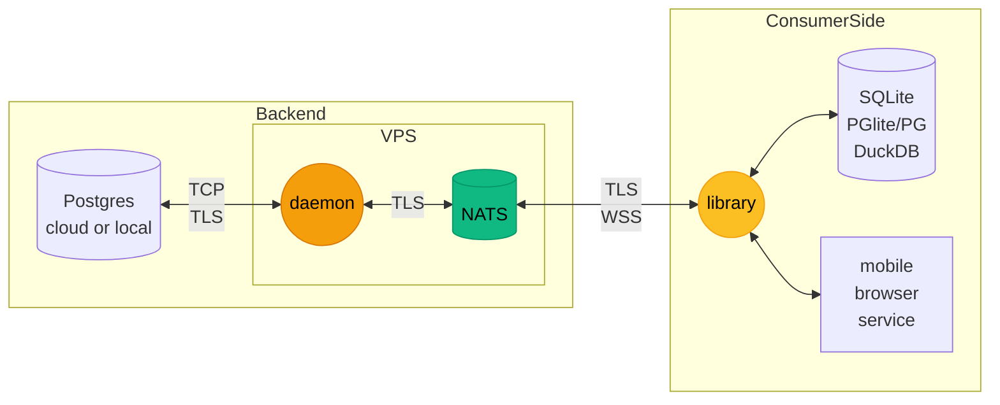
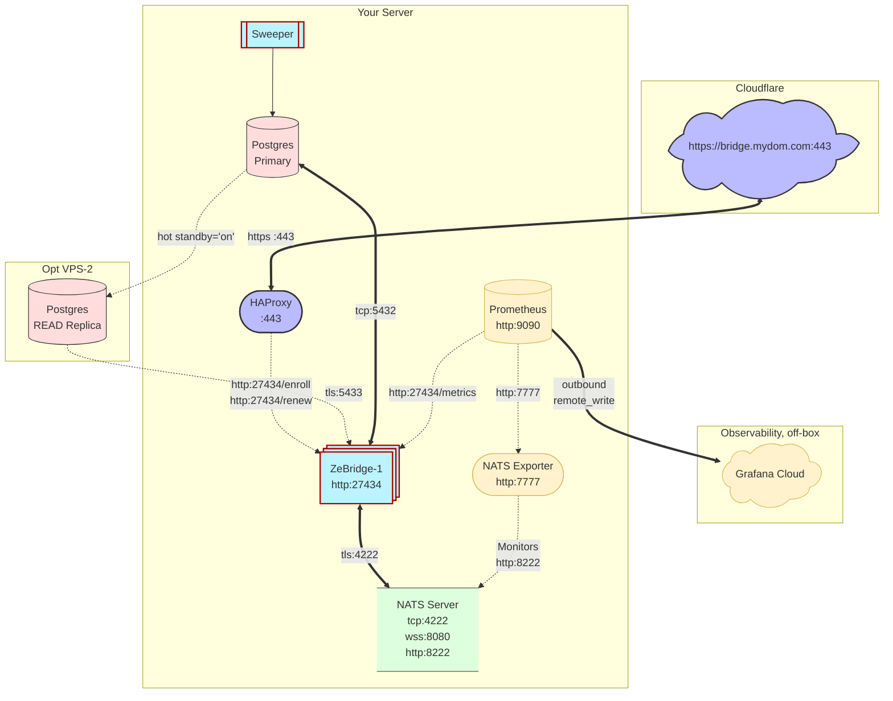
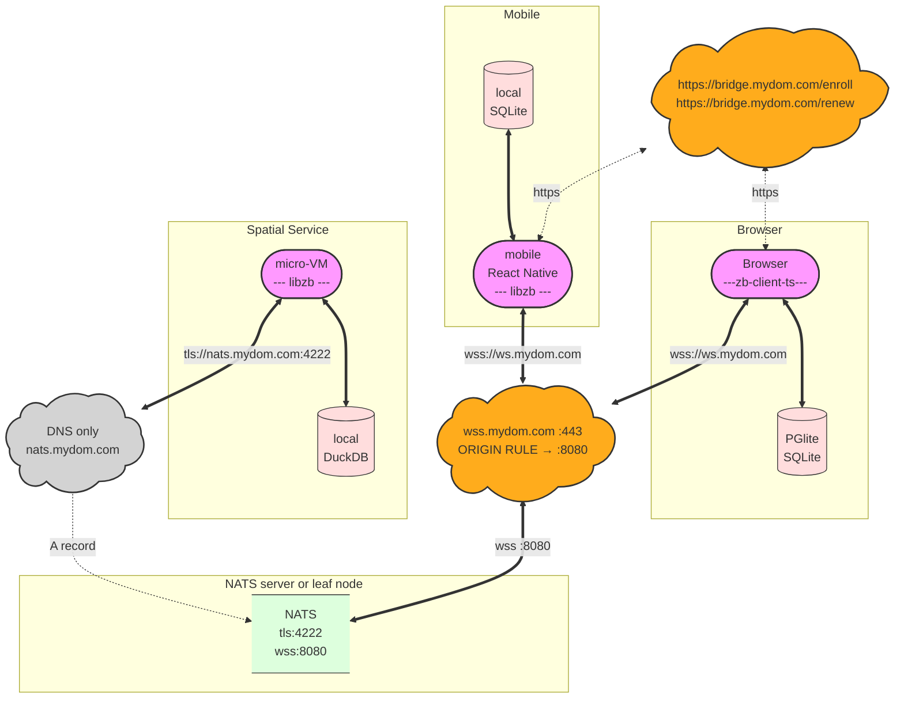
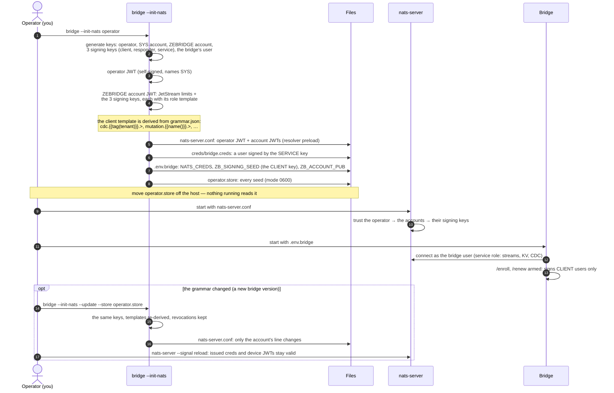
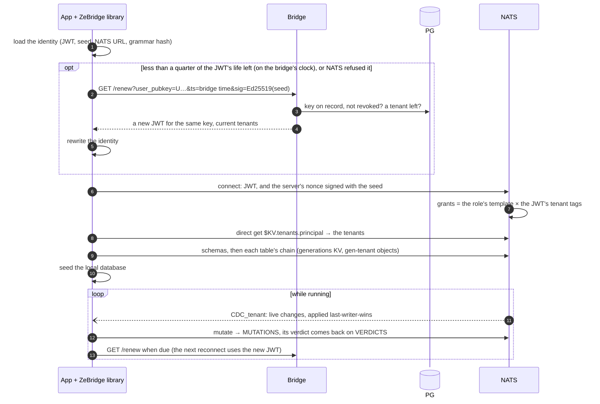

# ZeBridge - Sync PostgreSQL locally

<p align="center">

</p>

  [](https://opensource.org/licenses/Apache-2.0) [](https://github.com/ndrean/zebridge/blob/main/TEST_SCENARIOS.md)

**What is it?**: ZeBridge keeps many local replicas (SQLite, PGlite, PostgreSQL, DuckDB) in sync with one authoritative PostgreSQL database. It uses NATS JetStream to solve the distribution problem for offline-first applications. Clients read locally and optimistically mutate; every write is a request to PostgreSQL, which resolves it last-writer-wins and returns a verdict. Change distribution runs over NATS JetStream, so clients reconnect without a stampede on the database.

ZeBridge has a three-pillar architecture with a projection daemon between your PostgreSQL primary and a NATS server, and a library where consumers build upon their apps, plus a small housekeeping "sweeper" sidecar daemon.


```mermaid
flowchart LR
     subgraph VPN["Backend"]
        PG[("Postgres <br> cloud or local")]
        subgraph VPS ["VPS"]
            Bridge(("daemon"))
            NATS[("NATS")]
        end
        PG <--> |TCP<br>TLS| Bridge
        Bridge <--> |TLS| NATS
    end

    NATS <--> |TLS <br> WSS| Lib


    subgraph Edge["ConsumerSide"]
        Lib(("library"))
        LocalDB[("SQLite<br>PGlite/PG<br>DuckDB")]
        App["mobile<br>browser<br>service"]
        Lib <-->LocalDB
        Lib <-->App

    end

    style Bridge fill:#f59e0b,stroke:#d97706,color:#000
    style Lib fill:#fbbf24,stroke:#f59e0b,color:#000
    style NATS fill:#10b981,stroke:#059669,color:#000
```

<br>

**Tested**: what could go wrong, and the test that shows it does not, in plain words: [What the tests prove](TEST_SCENARIOS.md#what-the-tests-prove-in-plain-words).

**Who is it for?**: Teams shipping an app backed by PostgreSQL that has to work offline, on devices they do not control, where a reconnection storm would hurt the database. Four shapes show up most:

- An offline-first app with a local replica. A phone, a browser, a robot, a laptop. The device holds its tenants' rows, works with no network, and syncs back on reconnection. The library queues every write, PostgreSQL judges it last-writer-wins, and the device converges. zb-client-ts for JavaScript hosts, libzb for native ones. A robot that goes offline, updates its own database, and syncs back is the same shape as a phone on a train.
- An analytical or geospatial responder, without extending PostgreSQL. A warm micro-VM holds its replica in DuckDB and answers "what is around me?" or "what happened in the last hour?" over NATS. No PostGIS, no TimescaleDB, no query load on the primary. See [examples/08-map](examples/08-map) and [examples/09-event](examples/09-event).
- An app whose screens open from local data. After the first sync, reads never reach the server: a screen renders from the replica, online or not, with no round trip. A static shell from a CDN gives the first paint; a phone app needs nothing more, and a browser app only a small service worker for its static files, since the replica and the outbox replace the data half of one (cached responses, queued writes, background sync). Server-side rendering keeps public pages and first visits.
- Several editors on one row. A shared route, a shared form, a shared map. Put the editable fields in one jsonb column as registers, and two editors changing different fields never lose a move — LWW on the row decides who merges, LWW on each register decides the winner. No server change, no CRDT, no causal bookkeeping. See [COOPERATIVE_EDITING](COOPERATIVE_EDITING.md).

**What you need to run it**: A PostgreSQL database you can configure — logical replication, a replication slot — and a NATS server you are willing to operate. The PostgreSQL side is automated: `bridge --init-sql` prints the init SQL — the two roles, the functions, the four event triggers, the publication — and pipes straight into `psql`, on bare metal or a VPS.

On a managed PostgreSQL, where the provider does not give you a superuser shell, the same SQL can run as a migration: `bridge --init-sql > zebridge_init.sql`, applied with your migration tool. Tested on Supabase: see [Using a cloud PostgreSQL](#using-a-cloud-postgresql).

The NATS side is one command too (`bridge --init-nats operator`), but NATS is a server you now run, next to the bridge. The Quick start does all of it in one command; a production deployment does not hide it. ZeBridge adds two daemons to your stack, the bridge and NATS, and it is not the right choice if you cannot run them.

**Not for**: peer-to-peer sync (PostgreSQL is the single authority), multi-master writes (PostgreSQL judges every write), text collaboration (the cooperative editing layer merges per-field registers, not characters), or B2C per-user tenancy (a stream per user is a wall). See [SCOPE](SCOPE.md).

**Why this architecture?**: ZeBridge is standard logical replication + a message broker but with twelve things you would have to build yourself to make that combination usable by an app: binary WAL decoding to a client-friendly wire format, snapshot bootstrapping, catch-up for clients that were away, schema translation to the local engine, schema migration propagation, per-tenant routing, authentication and enrollment via a JWT chain, row-level security on the write path, optimistic writes with a verdict, conflict resolution, backpressure and bounded memory, idempotency and at-least-once delivery. All this makes it possible to distribute Postgres changes and schemas with the projection daemon and the client library via the NATS message broker, without the client needing to know NATS subjects, streams, or JetStream semantics.

**Scope**: replication is by tenant, not by query. A client holds every row of the tenants it belongs to, for every table it follows — filtering with WHERE decides what the app reads from what landed, not what lands. The tenant column is also what makes writes scopeable — RLS reads it, the bridge stamps it, and a write that names another tenant's row is refused by PostgreSQL.
If you put every client in one tenant, every client holds everything that tenant holds; the filter is a convenience, not a boundary. Per-user tenancy means one stream per user; at B2C scale, one stream per phone is a wall. See [SCOPE](SCOPE.md).

**Security**: tenant-based, with NATS grants and a rotating JWT chain. See [SECURITY](SECURITY.md).

**The documentation set**: README (this file), [Security](https://github.com/ndrean/zebridge/blob/main/SECURITY.md), [Scope](https://github.com/ndrean/zebridge/blob/main/SCOPE.md), [Tested scenarios](https://github.com/ndrean/zebridge/blob/main/TEST_SCENARIOS.md), [Clients](https://github.com/ndrean/zebridge/blob/main/CLIENTS.md), [Distribution](https://github.com/ndrean/zebridge/blob/main/DISTRIBUTION.md), [Observability](https://github.com/ndrean/zebridge/blob/main/OBSERVABILITY_TELEMETRY.md), [Migrations](https://github.com/ndrean/zebridge/blob/main/MIGRATIONS.md),  [Cooperative editing](https://github.com/ndrean/zebridge/blob/main/COOPERATIVE_EDITING.md), [Protocol](https://github.com/ndrean/zebridge/blob/main/PROTOCOL.md), [SUPABASE_TEST](https://github.com/ndrean/zebridge/blob/main/SUPABASE_TEST.md)

**Glossary**:

|term|meaning|
|--|--|
|tenant|a value of a column, not a login; the unit of routing and read access|
|principal|a stable, authenticated identity, belonging to ≥1 tenant|
|publication|the PostgreSQL publication a bridge follows|
|slot|the replication slot a bridge owns; one bridge = one slot|
|generation / chain|a per-table, per-tenant snapshot lineage; base + checkpoints + deltas|
|verdict|PostgreSQL's answer to a client write: accepted / stale / rejected / row_deleted / failed|

**Quick start**: With Docker (or OrbStack), from a clone of this repository:

```sh
docker compose -f docker-compose.quickstart.yml up --build
```

The first run builds the bridge from source, which takes a few minutes. It starts PostgreSQL, NATS in operator mode, the bridge, the sweeper and a browser demo. When the `init` service prints its links, open each in its own tab:

| link | who |
| -- | -- |
| <http://localhost:5173/?invite=quickstart-alice-1> | alice, tenant `acme` |
| <http://localhost:5173/?invite=quickstart-alice-2> | alice again, in a second tab |
| <http://localhost:5173/?invite=quickstart-bob-1> | bob, tenant `globex` |

Each link is a one-time invite: the tab makes its own key pair, enrolls at the bridge, and connects to NATS with the JWT it gets back, as a real device does. A tab is ready when its four phase badges are green; the first one can take up to a minute, while the bridge cuts the first snapshots.

Then click a counter. `counter_public` is shared by every tenant, so all three tabs follow it; `counter_tenant` travels only on acme's stream, so the two alice tabs follow it and bob never sees it move. The rest of the page walks through foreign keys, rejected writes and cooperative editing.

To start again from scratch: `docker compose -f docker-compose.quickstart.yml down -v`. The quickstart is for evaluation only (PostgreSQL trusts its local network, NATS has no TLS); a real setup follows [Host setup on VPS or bare-metal](#host-setup-on-vps-or-bare-metal).

## Table of Contents

- [ZeBridge - Sync PostgreSQL locally](#zebridge---sync-postgresql-locally)
  - [Table of Contents](#table-of-contents)
  - [Overview](#overview)
  - [Three pillars](#three-pillars)
    - [Which library, and which artifact](#which-library-and-which-artifact)
    - [Setup steps at a glance](#setup-steps-at-a-glance)
    - [Architecture Example](#architecture-example)
    - [Use case: a fleet of trucks](#use-case-a-fleet-of-trucks)
  - [Performance measurements](#performance-measurements)
    - [Changes: PostgreSQL → clients](#changes-postgresql--clients)
      - [A live phone under load, killed four times](#a-live-phone-under-load-killed-four-times)
    - [Snapshots: seeding a replica](#snapshots-seeding-a-replica)
    - [Writes: clients → PostgreSQL](#writes-clients--postgresql)
    - [Example: Sensors to a DuckDB replica](#example-sensors-to-a-duckdb-replica)
  - [The daemon](#the-daemon)
    - [Good practices](#good-practices)
      - [Schemas and zebridge\_enable](#schemas-and-zebridge_enable)
      - [Private Columns on Tables](#private-columns-on-tables)
      - [Types](#types)
      - [Schemas - guards and suspension](#schemas---guards-and-suspension)
      - [Checks](#checks)
      - [Scoped by tenant, authorized by grants](#scoped-by-tenant-authorized-by-grants)
      - [Conflict resolution](#conflict-resolution)
      - [Cooperative editing: several editors on one row](#cooperative-editing-several-editors-on-one-row)
      - [Cascade rules](#cascade-rules)
    - [Diagnose](#diagnose)
    - [Sweeper](#sweeper)
    - [Slots](#slots)
  - [The CLI](#the-cli)
  - [Migrations](#migrations)
    - [What a migration does](#what-a-migration-does)
    - [Examples](#examples)
      - [Fixing a "bad" read-only table](#fixing-a-bad-read-only-table)
      - [Fixing a "bad" writable table](#fixing-a-bad-writable-table)
      - [Changing a writable table's key from `bigint` to `uuid`](#changing-a-writable-tables-key-from-bigint-to-uuid)
  - [Suspended tables](#suspended-tables)
  - [Restart rules](#restart-rules)
    - [Checking a table / database against the bridge's rules](#checking-a-table--database-against-the-bridges-rules)
  - [Troubleshooting](#troubleshooting)
  - [The consumer side](#the-consumer-side)
    - [Enrolling a device](#enrolling-a-device)
    - [The TypeScript API](#the-typescript-api)
    - [The C ABI library](#the-c-abi-library)
    - [Code examples](#code-examples)
    - [Understanding the LWW rules](#understanding-the-lww-rules)
    - [Local database writes are owned](#local-database-writes-are-owned)
  - [Safety \& Guarantees](#safety--guarantees)
      - [Schemas Postgres -\> SQLite](#schemas-postgres---sqlite)
      - [Internal WAL decoder and refused types](#internal-wal-decoder-and-refused-types)
      - [At-Least-Once Delivery](#at-least-once-delivery)
      - [Zero-Consumer Protection \& Storage Bounds](#zero-consumer-protection--storage-bounds)
      - [Idempotent Delivery](#idempotent-delivery)
      - [Durability](#durability)
      - [Schema Consistency](#schema-consistency)
    - [Graceful Shutdown](#graceful-shutdown)
  - [Authentication](#authentication)
    - [Authenticate ZeBridge with Postgres](#authenticate-zebridge-with-postgres)
    - [Authenticate ZeBridge with NATS](#authenticate-zebridge-with-nats)
    - [Identity and access](#identity-and-access)
      - [1. Set up, once per deployment](#1-set-up-once-per-deployment)
      - [2. Onboard a device](#2-onboard-a-device)
      - [3. Connect and renew](#3-connect-and-renew)
      - [4. Revoke](#4-revoke)
      - [Who holds what](#who-holds-what)
      - [Local development](#local-development)
  - [Architecture \& Internals](#architecture--internals)
    - [The main loop PG/ZB/NATS](#the-main-loop-pgzbnats)
    - [The NATS/Consumer loop](#the-natsconsumer-loop)
    - [Seeding](#seeding)
    - [Memory Management](#memory-management)
    - [Replication Slot Management](#replication-slot-management)
      - [When the slot is lost](#when-the-slot-is-lost)
    - [Reconnection Handling](#reconnection-handling)
    - [Catching up: the chain and the stream](#catching-up-the-chain-and-the-stream)
      - [What the producer builds](#what-the-producer-builds)
      - [The one rule](#the-one-rule)
      - [When the rule breaks](#when-the-rule-breaks)
  - [Setup \& Deployment](#setup--deployment)
    - [Host setup on VPS or bare-metal](#host-setup-on-vps-or-bare-metal)
      - [1. Prerequisites](#1-prerequisites)
      - [2. Generate the configuration](#2-generate-the-configuration)
      - [3. Prepare PostgreSQL](#3-prepare-postgresql)
      - [4. Declare your tables and diagnose](#4-declare-your-tables-and-diagnose)
      - [5. Start NATS, then the bridge](#5-start-nats-then-the-bridge)
      - [6. Secure the credentials](#6-secure-the-credentials)
      - [7. Verify the wiring](#7-verify-the-wiring)
      - [8. Invite the first user](#8-invite-the-first-user)
    - [Adding a leaf node](#adding-a-leaf-node)
    - [Using a cloud PostgreSQL](#using-a-cloud-postgresql)
    - [NATS streams and buckets](#nats-streams-and-buckets)
    - [Running the Bridge](#running-the-bridge)
  - [Configuration](#configuration)
      - [Main Configuration](#main-configuration)
  - [Sizing the ring](#sizing-the-ring)
    - [Two things checked at startup, before a byte is allocated](#two-things-checked-at-startup-before-a-byte-is-allocated)
    - [What happens when a row does not fit](#what-happens-when-a-row-does-not-fit)
  - [Limitations](#limitations)
  - [Alternatives](#alternatives)
  - [Requirements, Dependencies, Licenses \& Sources](#requirements-dependencies-licenses--sources)

---

## Overview

**LocalDB supported flavours**: standard `SQLite`, `PGlite` or `PostgreSQL` and optional `DuckDB` support.

**How does it work?**: three components, a daemon, a sweeper and a client library.

- the daemon `ZeBridge` (ZB): a Zig executable with a bi-directional  connection to PostgreSQL (PG) and to NATS/JetStream (NATS). It publishes the schemas, cuts table snapshots that clients seed from, and streams PG changes onto NATS. It applies the writes coming back from consumers to the primary, within their tenants.
It keeps no state of its own (its position is the replication slot; everything else lives in PostgreSQL and NATS), so it starts at once and stops cleanly at any time.
- the housekeeping sweeper: see [Sweeper](#sweeper)
- the client library: it abstracts all the NATS connection and the storage into the local replica. The consumer is offline-first by default: a write applies locally at once, and when the connection is up the server's verdict comes back, echoed. No retry loop for the common case; the library queues, retries and reports verdicts.
The API is small and comes in two flavours: a TypeScript library, `zb-client-ts`, and a native Zig library with a C ABI, `libzb`, for any language with an FFI.
The TypeScript library pushes changes to the app; with `libzb` the host pulls them, polling on every tick.
Bindings exist for Python, Kotlin (Android), Dart/Flutter and React Native. See [CLIENTS](CLIENTS.md).

**Consumers**: The client library can be integrated across a wide range of runtime environments.

- Mobile Native Apps: Utilizing native file system storage: React Native running the C ABI library through its Expo module, Flutter running the C ABI library, with an SQLite replica.
- Desktop apps: Flutter running the C ABI library, or Electron running the TypeScript library, with an SQLite replica.
- Browsers and Webapps: Leveraging OPFS support for SQLite-WASM or PGlite via the TS library.
- Backend responder services / micro-VMs. For example, a warm micro-VM as a client, with the columnar in-process database DuckDB as its replica. This client does not write; it answers other connected clients through NATS only.
➡ The use case: a phone app asks, through the library, "which points of interest are around me?"; the responder service receives the question, runs the analytical, geospatial or time-based query against its replica, and answers over NATS. No query load on PostgreSQL, and no PostGIS or TimescaleDB extension needed there.
- Edge functions, as an HTTP front for the services. A Cloudflare Worker turns `GET /q/<name>?…` into a question to a responder over NATS, and a Durable Object holds the NATS connection between requests: from Cloudflare's Paris location to the hub in Frankfurt, a question takes 26–32 ms (a stateless Worker paid 65–240 ms more on every request, to connect). A client then needs no library: a web page, a partner's system, a script. It asks with the gateway's one identity, so authenticating users is the Worker's job. See [examples/11-edge-worker](examples/11-edge-worker). An edge container runs libzb natively instead, as a responder near its users: see [examples/12-edge-container-fly](examples/12-edge-container-fly).

**Design**: built to keep many small consumers in sync with a small to medium PostgreSQL database, through NATS.

- **Performance**: data travels three ways, each measured on [Performance measurements](#performance-measurements).
  - **Changes**: the bridge streams over 100k rows/s from PostgreSQL into NATS, and a connected client applies 30k–50k of them a second (about 12k on an iPhone 12).
  - **Snapshots**: a new client seeds a table at 90k–125k rows/s, and still about 6k rows/s on a low-end Android phone (a Motorola E20), which the library feeds in chunks so the seed fits in its memory.
  - **Writes**: client writes reach PostgreSQL at about 8,500/s per ingress lane (`ZB_INGRESS_LANES`).
- **Topology**: The preferred topology is the daemon colocated with the NATS server over TLS (as opposed to terminating TLS at a reverse-proxy). Since clients join NATS over TLS on the same port, the bridge talks to NATS over TLS too. Ideally PostgreSQL, NATS and ZeBridge are colocated; a cloud PostgreSQL works too, tested on Supabase (see [Using a cloud PostgreSQL](#using-a-cloud-postgresql)).
- **Standby Read Replica ready**: you can use a dedicated Postgres standby replica for all the reads as ZeBridge uses separate reader and writer roles. Point `DATABASE_READER_URL` at the standby and `DATABASE_WRITER_URL` at the primary: the slot and every read stay on the standby, and the bridge's few writes go to the primary. The standby needs PostgreSQL 16+, `wal_level=logical` and `hot_standby_feedback=on` (the bridge warns when it is off). Tested by `scripts/scenarios/standby.py`.
- **CLI**: the same binary sets the system up (`--init-nats`, `--init-sql`, `--mint-responder`, `--mint-leaf`), checks it (`--diagnose`), revokes users (`--revoke` or `--revoke --purge` to prune the local replica on reconnection) and manages slots (`--view-slot(s)`, `--drop-slot`). See [The CLI](#the-cli) below.
- **Multiple instances**: possible, not recommended yet. Several instances of ZeBridge can run side by side, each with its own publication, slot and port, to follow large slow-moving tables apart from small tables with heavy changes, each instance with a buffer sized to its own tables. Two bridges on one database and one NATS pass `scripts/scenarios/multi_bridge.py`, but one bridge is the setup we run and recommend.
- **Mobile-First Synchronization**: to optimize mobile bandwidth and reliability, we use a delta-chain process with aggressive compression for seeding and reseeding, and streaming when needed. A client that was away reloads from the snapshots instead of replaying the change feed event by event. PostgreSQL never sees a reconnection stampede: the bridge builds each snapshot once per table and tenant (when generations are on), and clients seed and catch up from NATS, never from PostgreSQL. A thousand phones coming back at once cost the database nothing: the work moves to NATS and the chain producer.
- **Division by tenant, or by place**: a tenant is a column in a table; a consumer brings their identity, and PostgreSQL resolves their tenants from it. Tenants divide the data, and the NATS grants with it. Replication is scoped by tenant. Since a tenant is a NATS stream, the number of tenants must stay small, so this design is not for one-user-per-tenant B2C. See [SCOPE, Replication is by TENANT, not by query](SCOPE.md).
  - **By business**: one tenant per customer company. Each one's rows travel on its own stream, and a user's JWT names the tenants they may read.
  - **By place**: a tenant can be a map cell (a geohash). A device enrolled for a few cells follows them, and moves between them as it travels (`zb_client_join`, `zb_client_leave`). This fits a city: the cells a device may follow are fixed when it enrolls.
  - **By place, at country scale**: the data stays whole, and a responder service per region, on a NATS leaf node close to its users, answers "what is around me?". The phone keeps the answers in a local table, so they stay available offline. The region's phones are served by their own leaf; the hub sees their questions only when that leaf has no responder ([examples/08-map](examples/08-map)).
- **Strict authentication, JWT rotation**: because NATS is exposed to the internet and contains data, users are strictly tenant scoped and access grants are encoded in a JWT, immediately revokable by the DBA. Your app signs users in (OAuth or anything else) and its backend issues a one-time invite; the library enrolls the device with it and renews its JWT before it expires (`ENROLL_JWT_TTL_SECONDS`).
- **Encryption**: in transit, TLS. At rest, the PostgreSQL disk can be encrypted, and so can NATS's store. The replicas are normally not encrypted (plain SQLite does not offer it).

> [!WARNING]
> Encryption protects data between two points, not at the points themselves. Wherever TLS ends, the data is readable by whoever runs that point: a proxy that terminates TLS (in the demo, Cloudflare in front of the bridge and the browsers' WebSocket), a managed PostgreSQL (the database reads every row it judges), a hosted telemetry service. Each of these operators, and the rules they answer to, can see what passes through them. If you need full control over who may read your data, run the database yourself, and choose the services in the chain with care, or leave them out: clients can reach NATS and the bridge directly, without a proxy.

- **Schema translation**: replicas are built from PostgreSQL's schemas: as is for PGlite, translated for SQLite, with `STRICT` tables.
- **PostGIS and pgvector ready**: support of `PostGIS` (binary EWKB as BLOB) and `pgvector` types out of the box.
- **Anti-client flood**: writes per client are limited in backlog, on by default (`MUTATION_BACKLOG_PER_PRINCIPAL`, 5,000 queued writes: past it, that client's new writes are refused, and nothing already queued is evicted), and optionally in rate (`MUTATION_RATE_PER_PRINCIPAL`, off by default: over the rate, writes are delayed, not dropped).
- **Observability**: Prometheus metrics on `/metrics` and log lines with a level and a scope that Loki can label, with ready-made Grafana dashboards. The bridge serves the PostgreSQL metrics too (slots, connections, table sizes), so no PostgreSQL exporter is needed.
See [OBSERVABILITY_TELEMETRY](OBSERVABILITY_TELEMETRY.md).
  
**Opinionated**: Because our goal is to sync Postgres databases locally with strict predictability by preventing unexpected concurrent writes, we have a few rules that we stamped 💡 _good practices_: strict memory boundaries, safety enforced by tenant, enrollment by tenant and JWT, enforced schemas, foreign key cascade mitigation, conflict resolution by last-writer-wins (LWW) with cooperative editing on top of it, table suspension, and local writes that go through the library only. See [Conflict resolution](#conflict-resolution) below.

They may look strict, but they are mostly standard and well known, and applying them to a schema is almost mechanical. See [The daemon](#the-daemon) below for more details and [SCOPE ## Consistency model](SCOPE.md).

## Three pillars

The daemon `bridge` projects Postgres into NATS and back. It defines a protocol—a set of rules and workflows—for a consumer to connect to NATS and to the local replica.

There is a tiny daemon "sweeper". See [Sweeper](#sweeper).

The client C-ABI `libzb` library - for FFI users - and the `zb-client-ts` library - for any JavaScript-based consumers, with libzb's core as a 66 KB WASM module - implement this protocol.

The client library abstracts away the complex choreography required to manage NATS streams, KV buckets, data decompression and deserialization, retries, holding queries with foreign keys...and sets up the local tables needed to hold the state of a client.

A developer will build an app using the client library. We have bindings for specific idioms. See [CLIENTS](https://github.com/ndrean/zebridge/blob/main/CLIENTS.md)

| artifact | what it is | who uses it |
| -- | -- | -- |
| bridge | POSIX based background executable <br>- Linux, FreeBSD, OSX | daemon running  next to PostgreSQL and  NATS |
| bridge_sweeper | background executable | daemon running next to Postgres and to the bridge |
| libzb | native client library, C ABI | FFI Consumers: mobile apps, desktop apps, microservices |
| zb-client-ts | client npm package <br>(self-contained TS) | JS Consumers: browsers, Node, Electron, Deno, Bun |

The client library shrinks this orchestration down to a few primitives: `connect()`, `close()`, `newVersion()`, `query()`, `mutate()` and `onChange()`.

### Which library, and which artifact

The client library uses four libraries: `libpq`, `sqlite`, `zstd` and `duckdb`.  
Two independent questions. **Which library** depends on whether the host can link C.
**Which artifact** depends on how that host expects to receive it.

| host | library | artifact | needs installed |
| -- | -- | -- | -- |
| Flutter desktop | libzb, vendored | `.dylib` / `.so` | nothing |
| a service in Python, Go, Java, Elixir… | libzb, vendored | `.dylib` / `.so` | only its own engine, if it uses one |
| React Native (iOS **and** Android) | libzb, in the zb-react-native Expo module | static on iOS, `.so` on Android | nothing |
| browser, Node, Electron, Bun | zb-client-ts | — | nothing |
| native Swift on iOS | libzb, vendored | **static** `.a` | nothing |
| native Kotlin on Android | libzb, vendored | **static** `.a`, linked into your JNI `.so` | nothing |

The dividing line is not phone versus server — it is **whether you control what is
installed**. On your own server, linking the system sqlite and zstd is fine and keeps the
binary smaller. On a phone nothing is installed, so everything travels inside the app:

```sh
    zig build -Doptimize=ReleaseFast -Dvendor=true
    # sqlite + zstd compiled IN
```

`-Dvendor` compiles both from sources pinned by hash in `build.zig.zon`, so a build does not depend on what a package manager happens to have installed, and cross-compiles for whatever target is asked for. It costs about 1.8 MB.

Both phones take the **static** archive, for different reasons: iOS links archives or
frameworks into the app, and on Android your own JNI shim is the `.so` with libzb linked into it.
See `examples/08-map/native/README.md` for the exact commands.

⚠️ Do not compare an archive against a shared library — 22 MB of `.a` is 4 MB once linked, for identical code. Object files keep every symbol, nothing is dead-stripped, and the linker pulls only what an app references.

Browser and Node hosts need no native build at all: zb-client-ts is plain TypeScript. React
Native runs libzb instead, through `zb-react-native` (its build scripts make both phones'
libraries).

### Setup steps at a glance

- **NATS and the bridge's configuration**: `bridge --init-nats operator` writes the NATS server config, the bridge's credentials and `.env.nats`, which holds NATS settings only. The DBA's own `.env.bridge` names the database (the READER and WRITER URLs), the slot and the publication. The two files share no setting, so the order they are loaded in does not matter.
- **PostgreSQL**:
  - `bridge --init-sql | psql` creates the two roles, READER and WRITER, the functions and triggers ZeBridge needs, and the publication,
  - the DBA migrates the database and fixes what does not follow the 💡 _good practice rules_,
  - the DBA enables each table with `zebridge_enable`, where its sync rules are declared: this writes the catalogue row, installs the guards, scopes RLS and attaches the table to the publication, in one transaction.

   ```sql
   SELECT * FROM zebridge_enable('public.orders', 
    tenant_col => 'tenant_id',
    writable => true,
    version_col => 'updated_at',
    tombstone_col => 'deleted_at',
    publication => 'my_pub',
    dry_run => false
  );
   ```

- **Run**: `bridge --diagnose` checks everything first; then start NATS, the bridge (`bridge --pub my_pub --slot my_slot`) and the `bridge_sweeper` daemon.
- **Users**: since NATS is exposed to the internet, every user is authenticated. The bridge is OAuth agnostic: your backend writes a one-time invite naming the user (the principal) and their tenant in `zebridge_invites`. See [Identity and access](#identity-and-access).
- **Frontend**: the developer builds on the library, `libzb` or `zb-client-ts`, and works only with the local database, never with NATS. They create a `ZeBridge` client with the bridge's URL, the invite, and the storage flavour (SQLite, PGlite, DuckDB).

The full procedure is [Host setup on VPS or bare-metal](#host-setup-on-vps-or-bare-metal). On a Debian server behind Cloudflare, [deploy/ansible](deploy/ansible/README.md) does it for you: `site.yml` for the hub (HAProxy with Cloudflare's origin certificate, NATS with Let's Encrypt), `leaf.yml` for the [leaf nodes](#adding-a-leaf-node).

See also [SUPABASE_TEST](https://github.com/ndrean/zebridge/blob/main/SUPABASE_TEST.md) for a cloud Postgres setup.

### Architecture Example

**Server-side connections**:


```mermaid

graph TD
    classDef external fill:#f9f,stroke:#333,stroke-width:2px;
    classDef proxy fill:#bbf,stroke:#333,stroke-width:2px;
    classDef internal fill:#dfd,stroke:#333,stroke-width:1px;
    classDef secure fill:#fdd,stroke:#333,stroke-width:1px;
    classDef telemetry fill:#fff2cc,stroke:#d6b656,stroke-width:1px;
    classDef bridge fill:#bdf3ff,stroke:#ac0100,stroke-width:2px;
    classDef maybe_external fill:#dfd,stroke:#333,stroke-width:2px,stroke-dasharray: 5 5;

    subgraph Edge [Cloudflare]
      CF([https://bridge.mydom.com:443]):::proxy
      CF@{ shape: cloud}
    end

    subgraph Obs [Observability, off-box]
      Grafana([Grafana Cloud]):::telemetry
      Grafana@{ shape: cloud}
    end

    subgraph VPS-2 [Opt VPS-2]
      PGREP[(Postgres<br>READ Replica)]:::secure
    end


    %% VPS Boundary
    subgraph VPS [Your Server]
        direction TB
        
        HA([HAProxy<br>:443]):::proxy
        %% Internal Apps
        Prom[(Prometheus<br>http:9090)]:::telemetry
        NatsExp([NATS Exporter<br>http:7777]):::telemetry
        Bridge[[ZeBridge-1<br> http:27434]]:::bridge
        Bridge@{shape: st-rect}
        PG[(Postgres<br>Primary)]:::secure
        NATS[NATS Server<br> tcp:4222 <br> wss:8080<br> http:8222]:::internal
        NATS@{shape: data-store}
        
        %% TLS termination for the bridge's HTTP surface
        HA -.->|http:27434/enroll<br>http:27434/renew| Bridge
        
        Sweeper[[Sweeper]]:::bridge
    end

    PG -.->|hot standby='on'| PGREP
    CF <==> |https :443| HA
    Prom ==> |outbound<br>remote_write| Grafana
    PGREP -.->|tls:5433| Bridge
    PG <==> |tcp:5432| Bridge
    Bridge <==>|tls:4222| NATS
    Sweeper -->PG
    Prom -.->|http:7777| NatsExp
    Prom -.->|http:27434/metrics| Bridge
    NatsExp -.->|Monitors<br> http:8222| NATS
```

<br>

**Client side connection**:
<br>


```mermaid
graph TD
    classDef external fill:#f9f,stroke:#333,stroke-width:2px;
    classDef orange-proxy fill:#FFAC1C,stroke:#333,stroke-width:2px;
    classDef grey-proxy fill:#D3D3D3,stroke:#333,stroke-width:2px;
    classDef internal fill:#dfd,stroke:#333,stroke-width:1px;
    classDef secure fill:#fdd,stroke:#333,stroke-width:1px;
    classDef telemetry fill:#fff2cc,stroke:#d6b656,stroke-width:1px;
    classDef daemon fill:#bdf3ff,stroke:#ac0100,stroke-width:2px;

    subgraph Mobile
      UserMobile([mobile<br>React Native<br>--- libzb ---]):::external
      LocalSQLite[(local<br>SQLite)]:::secure
      LocalSQLite <==>  UserMobile
    end

    subgraph Browser
      B([Browser<br>---zb-client-ts---]):::external
      LocalLite[(PGlite<br>SQLite)]:::secure
      B<==> LocalLite
    end

    subgraph Spatial Service
      VM([micro-VM<br>--- libzb ---]):::external
      LocalDuckDB[(local<br>DuckDB)]:::secure
      VM <==> LocalDuckDB
    end

    CF(["https://bridge.mydom.com/enroll<br>https://bridge.mydom.com/renew"]):::orange-proxy
    CF@{ shape: cloud }
    CFWS(["wss.mydom.com :443<br>ORIGIN RULE → :8080"]):::orange-proxy
    CFWS@{ shape: cloud }
    CFNATS(["DNS only<br>nats.mydom.com"]):::grey-proxy
    CFNATS@{ shape: cloud }

    

    subgraph VPS ["NATS server or leaf node"]
        NATS[NATS<br>tls:4222<br>wss:8080]:::internal
        NATS@{ shape: data-store }
    end

    CF <-.-> |https| B
    CF <-.->|https| UserMobile
    B <==> |wss://ws.mydom.com| CFWS
    UserMobile <==>|wss://ws.mydom.com| CFWS
    CFWS <==>|wss :8080| NATS
    VM <==> |tls://nats.mydom.com:4222| CFNATS
    CFNATS -.->|A record| NATS
```

**Routing**: given a domain 'mydom.com', we use the subdomains 'nats', 'ws' and 'bridge' with the following routes:

- Cloudflare **orange** proxies <https://bridge.mydom.com> on :443 (long-term CF certs) to HAProxy, which terminates TLS and forwards to the bridge on 127.0.0.1:27434.
- Cloudflare **orange** proxies <wss://ws.mydom.com> on :443, and an Origin Rule rewrites the destination port to :8080. This port 8080 is on Cloudflare's plain-HTTP port list, so a secure websocket cannot open on it directly — it has to arrive on an HTTPS port (443, 2053, 2083, 2087, 2096, 8443) and be redirected at the edge.
- Cloudflare **grey** (DNS only) resolves nats.mydom.com; the connection is joined directly, and NATS presents its own publicly-trusted certificate on tls:4222. A Cloudflare origin certificate will not do here, because phones connect without Cloudflare in between.

**Why the two websocket-facing ports go through Cloudflare.** It is not for caching or inspection — Cloudflare caches no websocket frame, and the WAF only sees the opening HTTP 101 upgrade. It is for the firewall rule that becomes possible once it does: **443 and 8080 accept only Cloudflare's published ranges**, so neither port answers a scan or a flood, even though the grey nats.mydom.com record makes the origin address public. Only 4222 is open to the world, because `libzb` clients join it directly. The proxy also supplies the certificate on 8080, where a Cloudflare origin certificate is enough.

The cost is that Cloudflare closes a proxied websocket after about 100 seconds with no traffic in either direction. The config file `nats-server.conf.template` answers that server-side with `ping_interval: 45s` on the websocket block, so the server keeps the socket warm and no client needs configuring.

|     client  |   address  |  route    |
|    --  |   --  |  --    |
| native (libzb)  | <tls://nats.mydom.com:4222>       | Cloudflare **DNS only**, straight to nats-server  |
| TS client        | <wss://ws.mydom.com>, port 443 at Cloudflare | Cloudflare, then an **Origin Rule** to nats-server's websocket on 8080 |
| any         | <https://bridge.mydom.com>, port 443 at Cloudflare        | Cloudflare, then HAProxy on 443, then http to the bridge on 127.0.0.1:27434   |
| Prometheus on the VPS | remote_write, outbound              | straight to Grafana Cloud, no inbound rule     |

You can test on bare metal or a VPS with for example 6-vCPU, 24 GB RAM and 200GB NVMe SSD, and run comfortably the following stack:

- a master `PostgreSQL` (colocated in this example to communicate over plain TCP, but a remote on an EC2 instance over TLS is possible),
- a `NATS` server and its companion `NATS-exporter` for telemetry,
- a daemon `ZeBridge` on one publication, one slot, and the sweeper companion,
- a TSDB `Prometheus` (scraping telemetry from ZeBridge and NATS-exporter, and pushing to a cloud `Grafana`),
- the reverse-proxy `HAProxy` for TLS termination of the bridge's endpoints _/enroll_ and _/renew_,

This can serve the following clients:

- browsers with a local `PGlite` (or `SQLite`) replica that connects over WSS to NATS,
- mobiles with their native in-process `SQLite` replica that connects to NATS over TLS (React Native and Flutter through libzb),
- a warm micro-VM with an in-process `DuckDB` replica for fast analytics, geo-computations... that connects to NATS over TLS.

[⬆️](#table-of-contents)

### Use case: a fleet of trucks

A depot plans its trucks' trips; the people dispatching them work on browsers and phones, offline at times; trucks report where they are. Each kind of data takes the path that suits it:

- **Decisions go through PostgreSQL**: the trucks, their plans, the places they serve. A dispatcher's screen holds a replica and edits it locally; the write goes to PostgreSQL through the bridge, and every other screen receives it. Two dispatchers sending the same truck at once: the later stamp wins on every screen.
- **Questions go to services over NATS**: a route, which truck is closest by road. `zb-respond` forwards each question to Valhalla and returns its answer; more pairs of them in one queue group share the load.
- **What moves stays on NATS**: positions are published on `pos.<tenant>.<truck>` and shown by the screens that follow them. They never reach PostgreSQL, so their rate is NATS's, not the database's.
- **History goes to Parquet**: on each leaf, a collector embedding DuckDB packs the positions into Parquet files in one central bucket. On the hub, a DuckDB responder answers questions on that archive (mileage, occupancy), taking the tenant from the subject, which the asker's JWT bounds.

10 services: a local replica (SQLite) per client, a NATS leaf node per region and its collector service (into Parquet compressor), the NATS server, the PostgreSQL server, the bridge daemon, a responder service, a Valhalla service, a DuckDB service (analytics on archives), and a bucket for the archives & vector tiles


```mermaid
flowchart TD
    classDef external fill:#f9f,stroke:#333,stroke-width:2px;
    classDef internal fill:#dfd,stroke:#333,stroke-width:1px;
    classDef secure fill:#fdd,stroke:#333,stroke-width:1px;
    classDef daemon fill:#bdf3ff,stroke:#ac0100,stroke-width:2px;

    subgraph Clients ["Screens: browser, phone"]
      S([dispatcher<br>--- zb-client-ts / libzb ---]):::external
      R[(local<br>replica)]:::secure
      S <==> R
    end
    
    T([trucks<br>positions 0.1Hz]):::external

    subgraph Leaf ["Leaf node, per region"]
      LN[NATS leaf]:::internal
      COL[collector<br>DuckDB → Parquet]:::daemon
    end

    subgraph Hub
      direction LR
      PG[(PostgreSQL<br>trucks, plans, places)]:::secure
      ZB[ZeBridge]:::daemon
      HN[NATS hub]:::internal
      RESP[zb-respond]:::daemon
      VAL[Valhalla]:::internal
      DQ[DuckDB<br>responder]:::daemon
      
      %% Moving these internal Hub connections here forces the LR layout
      PG -->|WAL| ZB
      ZB -->|writes| PG
      ZB <==>|CDC, mutations| HN
      HN -->|query.t.route / matrix| RESP
      RESP -->|HTTP| VAL
      HN -->|query.t.mileage| DQ
    end

    B[(bucket<br>Parquet)]:::secure

    %% Global connections
    S <==>|replica, writes,<br>questions, positions| LN
    T -->|pos.tenant.truck| LN
    LN <==> HN
    LN --> COL
    COL -->|COPY … TO s3| B
    DQ -->|reads| B
```


[examples/14-depot](examples/14-depot) runs the first two, with Supabase as the PostgreSQL and Valhalla on the hub: a plan, its places and its stops edited together on several screens, routes and the closest truck asked over NATS, positions computed by each screen from the plan. The live positions and their archive are the design for real trucks; they are not built yet.

**Sizing, an estimate** for 20,000 trucks each reporting every 10 s: a dispatcher's map needs no more):

| | |
| --- | --- |
| one position (id, time, lat, lng, speed, heading, one sensor value) | ~50 B in MessagePack, ~120 B in JSON; ~115–185 B stored with its subject and JetStream's overhead |
| messages into NATS | 2,000/s, 0.25–0.4 MB/s |
| the leaf stream, kept 7 min | 100–150 MB: memory storage is enough. Longer than the collector's 5 min, so a slow write or a restart loses nothing |
| Parquet, at 10–15 B per row (zstd, 32-bit coordinates) | a file every 5 min: 600,000 rows and 6–9 MB for the whole fleet, shared among the leaves, 288 a day · compacted once a night into one file per tenant and day: 170 million rows, 1.7–2.6 GB |
| the archive | 50–80 GB a month |

A screen subscribes to its tenant or its region, not to the whole fleet: 2,000 messages a second is light for NATS and heavy for a phone.

[⬆️](#table-of-contents)

## Performance measurements

Measured figures, not estimates. PostgreSQL, nats-server and the bridge run on one Mac; the phones reach it over home Wi-Fi. Every run ends with the replica checked against PostgreSQL (row count and a column sum, or batch by batch), and every run below was exact. The harnesses are in `scripts/scenarios/`.

The sustained and fault-under-load figures come from stamp.py and churn.py; the phone figures are manual runs (speed.py, burst.py). See TEST_SCENARIOS.md.

Data travels three ways, and each has its own rate:

| path | what moves | the bridge's side | the client's side |
| --- | --- | --- | --- |
| [changes](#changes-postgresql--clients) | each committed row, as it happens, on the CDC stream | 101k–143k rows/s published | 33k–50k changes/s applied live on a Mac, ~12k/s on an iPhone 12 |
| [snapshots](#snapshots-seeding-a-replica) | a whole table, for a new client or one that was away | built once per table and tenant, ~2.5 µs per row | 90k–125k rows/s seeded on a Mac or an iPhone 12, ~6k/s on a low-end Android phone |
| [writes](#writes-clients--postgresql) | a client's write, back to PostgreSQL | ~8,500 writes/s per ingress lane, ~20,000 on four | — |

### Changes: PostgreSQL → clients

The bridge reads the WAL and publishes each change on its tenant's CDC stream; a connected client applies it to its replica.

| what | measured |
| --- | --- |
| PostgreSQL burst, 1,000-row transactions | 101k–143k rows/s published; the bridge's ring never filled |
| TLS between the bridge and NATS | the same event rate as plain TCP (`scripts/scenarios/burst_tls.py`) |
| a live client on the same Mac, libzb | ~50k changes/s; back live 7–13 s after a 5 s burst at 120k rows/s |
| a live client on the same Mac, zb-client-ts (Node) | ~33k changes/s |
| a live iPhone 12, libzb | ~12k changes/s; stays live up to 10k changes/s |

A client slower than the stream does not chase it: it falls behind, seeds again from a snapshot, and converges within 60–90 s of the load's end.

#### A live phone under load, killed four times

A seeded replica, then a 5 s burst at PostgreSQL's rate, then 90 s of sustained load; the app is force-killed and relaunched four times during it.

| device | client | load | batches | disconnects | converged after the load |
| --- | --- | --- | --- | --- | --- |
| iPhone 12 | libzb, React Native | 40k events/s | 153 of 153 exact | 0 | 170 s |
| iPhone 12 | libzb, Flutter | 40k events/s | 183 of 183 exact | 0 | 172 s |
| iPhone 12 | zb-client-ts, React Native | 2k events/s, after a 588k-row burst | exact (878,000 rows) | 0 | 300 s |
| moto e20 | libzb, Flutter | 5k events/s | exact (4,552,000 rows) | 0 | 774 s |

### Snapshots: seeding a replica

A new client, or one that was away longer than the stream keeps, loads each table from a snapshot instead of the stream. The bridge builds it once per table and tenant, at about 2.5 µs per row, and the snapshots kept up with up to ~90k changes/s without a hole. Clients read it from NATS, never from PostgreSQL.

A 3.1M-row table, about 1 GB in PostgreSQL, seeded on a Mac, an iPhone 12 (64-bit ARM NAND storage) and a low-end Android phone:

| client | device | time | rate |
| --- | --- | --- | -- |
| libzb, from Flutter Desktop | Mac | 25 s | 125k row/s |
| zb-client-ts, from Node service | Mac | 26 s | 120 k row/s |
| libzb, from React Native or Flutter | iPhone 12 | 35 s | 90k row/s |
| zb-client-ts, from React Native | iPhone 12 | 518 s | 6k row/s |
| libzb, from Flutter (3.2M rows) | moto e20 (*) | 534 s, at ~250 MB of RAM | 6k row/s |

(*) moto e20: Android Go, 32-bit ARM eMMC storage with 1.8 GB of RAM. It builds a 1.5 GB replica while the app stays at ~250 MB of RAM, because libzb streams the seed a window at a time.

|client|device|time|rate|
|--|--|--|--|
|zb-client-ts, from React Native (200k rows)|moto e20 (*)|10 s|20k row/s<br>in one window|

The gap between libzb and zb-client-ts on a phone is per-row JavaScript, not the phone: the host framework (React Native or Flutter) costs nothing.

### Writes: clients → PostgreSQL

A client's write goes through NATS to the bridge, which applies writes in batches of up to 64 per transaction, on 1 to 8 parallel lanes (`ZB_INGRESS_LANES`). One lane applied about 8,500 writes/s, two about 14,000, four about 20,000; past that the Mac's CPU was the limit, not the bridge. The full ramp is in the example below.

### Example: Sensors to a DuckDB replica

Simulated sensors connected to NATS write a reading every 20 ms through the bridge, saved into Postgres, replicated in a DuckDB service.

```txt
sensors → NATS MQTT → bridge → PG → bridge → NATS ←→ [Python/DuckDB replica using libzb ]
```

A Client connected to NATS asks questions through a stream, and the DuckDB service responds.

```txt
[client using libzb] ←→ NATS ←→ [Python/DuckDB replica service]
```

A Python service keeps a DuckDB replica (using libzb library) and answers time-series questions (freshness, moving average, per-minute aggregates) over NATS ([examples/09-event](examples/09-event/README.md)).

"Newest age" is how old the newest reading was when the service answered: the whole path from sensor to NATS, bridge, PostgreSQL, CDC and replica.

**First test**: Connect 20 sensors sending a message every 20ms during 60s, then 100 sensors sending every 20ms during 60s.

| sensors | readings/s | writes accepted | write verdict p50 / p99 | newest age p50 | question round trip p50 |
| --- | --- | --- | --- | --- | --- |
| 20 | 1,000 | 60,000 of 60,000 | 1.8 / 3.0 ms | 9 ms | 4.4 ms |
| 100 | 5,000 | 299,996 of 299,996 | 3.5 / 14.1 ms | 11 ms | 6.7 ms |

After both runs the replica and PostgreSQL held the same 359,996 rows and the same sum of values.

**Ramp up of the write path test**: The bridge applies edge writes in batches of up to 64 per transaction, on 1 to 8 parallel lanes (`ZB_INGRESS_LANES`). Each step ran 30 s, all on the same Mac, the simulated sensors included:

| lanes | readings/s sent | accepted/s | refused | write verdict p50 / p99 | newest age p50 |
| --- | --- | --- | --- | --- | --- |
| 1 | 5,000 | 5,000 | 0% ✅ | 3.5 / 14.1 ms | 11 ms |
| 1 | 10,000 | 8,535 | 15% | 592 / 620 ms | 595 ms |
| 2 | 10,000 | 10,000 | 0% ✅ | 4.9 / 14.8 ms | 10 ms |
| 2 | 20,000 | 14,149 | 29% | 355 / 410 ms | 356 ms |
| 4 | 20,000 | 20,000 | 0% ✅ | 11.4 / 59.1 ms | 17 ms |
| 4 | 30,000 | 19,527 | 35% | 250 / 393 ms | 262 ms |
| 8 | 30,000 | 22,681 | 24% | 216 / 331 ms | 212 ms |

With 4 lanes, the whole architecture colocated on a single Mac absorbed 20,000 writes/s: this is 20,000 sensors sending one reading a second - on average, a message every 50µs -, and each followed into DuckDB about 17 ms after it was sent.

Past a lane count's ceiling the writes queue, and at 5,000 waiting writes per principal the stream refuses more, so the delay jumps to hundreds of milliseconds. At 8 lanes the CPU was saturated: the limit was the machine, not the bridge. The DuckDB replica kept up throughout, and after the ramp it matched PostgreSQL exactly: 3,515,172 rows, the same sum.

> this architecture is just illustrative. The "right" architecture is sensors connected to NATS MQTT, itself connected to a DuckDB service run by a daemon that saves the data as Parquet into a remote bucket.

[⬆️](#table-of-contents)

---

## The daemon

Once the DBA has installed the ZeBridge functions into PostgreSQL (`--init-sql`), checked the database's **compliance**, and generated the NATS configuration (`--init-nats`), ZeBridge, the first pillar of the architecture, is ready to run. It creates the streams and buckets it needs at its first start.

**Compliance** means following the good practices of a sync engine, because ZeBridge makes choices other tools leave to you. They all aim one way: many small consumers that read freely, write safely, and never cross the tenant line.

These good practices act as constraints—though mostly mechanical—and that is the point: each one buys a specific guarantee.

Literature-1: <https://hatchet.run/blog/postgres-survival-guide>

Literature-2: <https://www.digitalocean.com/community/tutorials/database-normalization>

Here they are, so you can judge the fit before adopting it.

- **Strict Memory Boundaries**: Because ZB uses a **fixed pre-allocated buffer**, its memory footprint is fixed at startup.
🚦 A row too wide for that buffer is refused by PostgreSQL itself, whether it comes from a client or from `psql`: a width guard on the table raises, and the transaction rolls back. A row that gets past the guard anyway (after `BASE_BUF` was lowered, say) suspends the table. See [Suspended tables](#suspended-tables).
- **💡 Enforcement of Good practices on Schemas**:  Because we are syncing databases, the schema rules are enforced, not suggested: a primary key, `uuid` keys and `timestamptz` columns on writable tables, and a deliberate choice about deletes across a foreign key.
`zebridge_enable(..., dry_run => true)` reports every rule for a table before touching anything, and `bridge --diagnose` checks a whole database, the cascade rule included. See [Checks](#checks) and [Diagnose](#diagnose).

- **Suspension**: 🚦 When a table stops meeting a rule while the bridge runs, the bridge **suspends** it and keeps everything else flowing. Fix the table and most suspensions lift by themselves; two cases need a restart, [Suspended tables](#suspended-tables) and [Restart rules](#restart-rules).
- **Soft deletes, reaped by the sweeper**: a delete is sent to PostgreSQL as a soft delete (the `tombstone` column), and the companion `bridge_sweeper` daemon reaps old tombstones so the database does not bloat. See [Sweeper](#sweeper).

- **A cascade storm, when PostgreSQL does cascade**: on tables without tombstones, one `DELETE` with `ON DELETE CASCADE` can remove a whole family in one transaction, and the bridge takes it as one: its events land in the ring buffer, `RING_BUFFER_COUNT` slots (32,768 by default), and are published in order as batches. A transaction larger than the ring is published as several batches, in order; clients apply each as one unit and hold a child that crosses a batch boundary until its parent arrives. Proven with a 1,500-row family against a 1,024-slot ring.
- **Ring buffer**: the ring exists to buffer possible large transactions and naturally for the broker's ordinary jitter. It is not for a NATS outage: a publish that fails is retried five times with a backoff from 100 ms doubling to 5 s, and if the broker is still gone the bridge stops rather than acknowledge WAL it never delivered, and resumes from the slot when the broker returns.
- **Tables join through `zebridge_enable()`**: the DBA attaches each table to the publication with it during a migration, and marks a table writable there (`writable => true`); no table is writable by default. See [Good practices](#good-practices).
- **Writes resolved by last-writer-wins (LWW)**: ZeBridge makes a decision other sync engines leave to you: PostgreSQL judges every client write by its version, per row, and refuses a stale one. See [Conflict resolution](#conflict-resolution).

- **Controlled Local Writes**: clients read their local database freely, but every write **must** go through the client library's `mutate()` to be tracked. How that is enforced depends on the engine: see [Local database writes are owned](#local-database-writes-are-owned).
- **Safety enforced by tenant isolation and NATS grants**: every principal (a consumer) works inside its tenants. In PostgreSQL that boundary is row-level security; in NATS it is the grants of a signed JWT, tied to the principal's tenants. The bridge's own commands set it up and take it away (`--init-nats`, `--mint-responder`, `--revoke`).
How to divide the data into tenants (by business, by map cell, or by region with NATS leaf nodes) is described under _Division by tenant, or by place_ in the introduction. A leaf topology gives the hub's JetStream a **domain**; the bridge, the grants and both client libraries carry it as one setting (`NATS_JS_DOMAIN`, `--init-nats --js-domain`, `jsDomain`), and a client learns it from `/enroll`. See PROTOCOL §1.
- **Delta-chain seeding**: a client that missed part of the stream does not ask PostgreSQL for a dump. The bridge cuts a snapshot per table and tenant on a cadence, once for everyone, and the client reloads from it. How the two windows fit together is the subject of [Catching up: the chain and the stream](#catching-up-the-chain-and-the-stream).

### Good practices

#### Schemas and zebridge_enable

> [!WARNING]
> Every table must be attached to a publication with `zebridge_enable()`.

The schema rules below are the ones needed in terms of column types and mandatory columns.

Tables are either public or private/tenant-scoped:

| Action | column | type | note |
| -- | -- | -- | -- |
| public table | no column, but a public reason is declared | text | ✚ `zebridge_enable(public_reason => 'this table is public')` for example |
| private table | `tenant_id` | text | ✚ `zebridge_enable(tenant_col => 'tenant_id')` |

**Columns that never travel.** `zebridge_enable()` gives the table a publication column list when it has columns no replica can use: `tsvector`, `tsquery`, `xml`, ranges. They stay in PostgreSQL; the descriptor, the chain and the change feed carry the rest. Leave out more with `columns => ARRAY['id', 'title', …]`. A column list does not grow on its own: after `ALTER TABLE … ADD COLUMN`, run `zebridge_enable()` again to refresh it. Keep the key and the tenant column in the list: PostgreSQL requires a column list to cover the replica identity, or it refuses every UPDATE on the table.

Tables are either read-only or writable with a LWW conflict resolution policy.

Two choices decide how a table travels: whether clients write to it, and whether its deletes leave a tombstone.

| | no tombstone column | tombstone column |
| --- | --- | --- |
| **read-only** (clients only read) | any standard SQL from the server side (`INSERT`, `UPDATE`, `DELETE`, `ON DELETE CASCADE`, `TRUNCATE`) | deletes must be soft: a physical `DELETE` on a tombstone table never reaches the replicas |
| **writable** (clients write too) | refused, unless `allow_physical_deletes => true`, accepted with a warning | the normal writable table |

- **Read-only without tombstones**: connected clients receive every change, deletes included. A client that was away learns of a delete from a full snapshot, which the bridge cuts when it sees the table's row count drop; when deletes and inserts cancel out within one cut, a deleted row can reappear on a re-seeding client until the next full snapshot.
- **Why writable tables want tombstones**: a client that was offline may still hold a deleted row and edit it. With a tombstone, PostgreSQL knows the row is deleted and refuses the edit (`row_deleted`); without one, the edit can bring the row back.
- Whatever the choice, the guards apply to every published table: `timestamptz` timestamps, rows that fit the change feed's buffer, a primary key. How deletes meet foreign keys: [Cascade rules](#cascade-rules).

| Action | column | type | note |
| --  |  --    | --   | --   |
|  Read  | id    | **bigint** or **uuid** | composite pk possible (2)|
|  Write  | id    | **uuid** (1)| composite pk possible (2)|
|||||
| Write  | updated_at | **timestamptz**  (3)| ✚ `zebridge_enable(version_col => 'updated_at')`, or your own column name |
| Write  | deleted_at | **timestamptz** | soft-deleted ✚ `zebridge_enable(tombstone_col => 'deleted_at')`, or your own column name |
| Write | last_writer | text | `zebridge_enable(tiebreak_col => 'last_writer')`, or your own column name |
| Write | doc | **jsonb** of registers `{v, t, w}` | optional ✚ `zebridge_enable(register_cols => ARRAY['doc'])`: PostgreSQL merges each accepted write field by field ([COOPERATIVE_EDITING](COOPERATIVE_EDITING.md)) |

(1) _in a writable table, a client mints its own keys offline, so a writable table's key must be **client-generable** — a `uuid-v7` (time-ordered), NOT a `bigserial` that the database hands out (an edge write to a sequence key would collide with the server's next insert, so the bridge refuses it)_.

(2) _without a PK, the replica doesn't know which row to apply a mutation from the backend and we use `REPLICA IDENTITY DEFAULT` for performance_.

For example:

  ```txt
  postgres=# \d counter_tenant;
                            Table "public.counter_tenant"

    Column   |     Type   | Collation | Nullable |      Default
  -----------+------------+-----------+----------+------------------
   uid       | uuid       |           | not null | gen_random_uuid()
  ```

For example, two public tables and a tenant scoped one:

  ```txt
  postgres=# select * from zebridge_catalogue;

            tbl          | tenant_col |                         public_reason         | version_col | tombstone_col | tiebreak_col |
  -----------------------+------------+-----------------------------------------------+-------------+---------------+--------------+
   users                 |            | no tenant column, readable by every consumer  | updated_at  |               |
   counter_public        |            | demo — identical content for every tenant     | updated_at  |               |
   counter_tenant        | tenant_id  |                                               | updated_at  |               |
  ```

(3) See [Conflict resolution](#conflict-resolution)

#### Private Columns on Tables

Publish only some columns with `zebridge_enable(..., columns => ARRAY['id', 'title', …])`: see _Columns that never travel_ above. The column list applies to **every tenant**.

#### Types

Two extensions work out of the box: `PostGIS` and `pgvector`.

🔔 xml, ranges, tsvector and tsquery are left out of the publication by `zebridge_enable()`.

Postgres' schemas are directly used by PGlite whilst SQLite schemas have the following casting:

|     PostgreSQL      |    on the wire           |  SQLite   |        good practice        |
|      --             |                  --      |  --       |                     --      |
| int2/4/8, serials   | integer                  | INTEGER    | as is                       |
| boolean             | true/false               | INTEGER 0/1   | as is, SQLite's own convention       |
| float4/8            | float64                  | REAL       | as is                       |
| numeric/decimal     | string, stored scale     | TEXT       | TEXT, see below             |
| uuid                | 36-char string           | TEXT       | as is                       |
| timestamptz         | ISO text, Z or none      | TEXT       | as is, SQLite's date functions read it       |
| jsonb               | JSON text                | TEXT       | TEXT, see below             |
| arrays              | JSON text `["a","b"]`    | TEXT       | as is: `json_each`, `json_extract` read it; a PostgreSQL-engine replica gets the native array |
| bytea               | msgpack `bin` (bytes)    | BLOB       | as is                       |
| PostGIS geometry/geography | msgpack `bin` (EWKB) | BLOB   | as is; the client decodes EWKB |
| pgvector vector / halfvec | msgpack `bin`, little-endian float32 / float16, no header | BLOB | as is: sqlite-vec's `vec_f32`, a `Float32Array` read it |
| pgvector sparsevec  | msgpack `bin`: u32 dim, u32 nnz, indices, float32s | BLOB | as is |
| bit(n)              | msgpack `bin`, packed bits | BLOB     | as is: sqlite-vec's `vec_bit` reads it |
| bit varying         | text `'0101'`            | TEXT       | as is                       |
| tsvector, tsquery, xml, ranges | never travel      | —          | left out of the publication by `zebridge_enable` |

Every type lands in one of SQLite's four storage classes, so a replica's tables are created `STRICT`: SQLite refuses a value of another type at the bind instead of storing it, and a client bug shows up as an error, not as a text `'t'` in a boolean column.

**Numeric**: SQLite has no decimal type, and its own documentation says: store exact decimals as TEXT, or as INTEGER in minor units when the scale is fixed. REAL is the one wrong answer, since money loses digits silently, and it would contradict the data the wire already carries as digits. 💡 So TEXT is the good practice.
The cost is that TEXT compares lexicographically, so ORDER BY price puts '9.5' after '10.25', and arithmetic needs a cast. The exact alternative, INTEGER scaled by ten to the column's scale, needs the scale, and the descriptor strips modifiers today, so it reports numeric for numeric(20,8).

**jsonb**: TEXT is exactly what SQLite's `json_*()` family wants as input, so a replica can run `json_extract(metadata, '$.src')`. SQLite's newer internal JSONB format is a storage optimisation you opt into with `jsonb()`, and it changes what a plain SELECT returns.
=> leave that to the application

**Extensions**: `PostGIS` and `pgvector` are the two supported extensions. Their type OIDs are per database, so the bridge reads them from `pg_type` at boot, and again when a new table names one it does not know: a table created with such a column after `CREATE EXTENSION` on a running bridge needs no restart. A column of such a type added to a table that is already published does, see [Restart rules](#restart-rules). PostGIS `geometry` and `geography` travel as the EWKB bytes PostgreSQL sends, a BLOB the client decodes itself. pgvector's types are normalised on the bridge: pgvector sends a dimension header and big-endian floats, which nothing on a device reads as is, so the bridge drops the header and turns the numbers little-endian. The BLOB a replica holds is then exactly what [sqlite-vec](https://github.com/asg017/sqlite-vec) reads (`vec_distance_L2(emb, '[1,2,3]')` on the column as it is), and what a `Float32Array` or `struct.unpack` reads. A client writes such a column with the same BLOB; the bridge renders pgvector's text form for PostgreSQL. A column of any other extension type suspends the table (`unsupported_column_type`).

#### Schemas - guards and suspension

| a table needs | why | if not |
| --- | --- | --- |
| a primary key | rows are addressed by it on every replica | ❗️ suspended: `no_primary_key` |
| `zebridge_enable(...)` | the catalogue row is the only thing that makes the bridge route it | ❗️ suspended: `no_cdc_subject` |
| a tenant column (private) or `public_reason` (public) | rows route to `cdc.<tenant>.*` or to the public stream | 🚦 refused by `zebridge_enable` |
| the tenant column inside the replica identity | a DELETE carries only the replica identity, and must still route | ❗️ suspended: `tenant_not_in_replica_identity` |
| a `timestamptz` version column (writable tables) | last-writer-wins needs one clock per row | 🚦 refused by `zebridge_enable` |
| a `timestamptz` tombstone column, or `allow_physical_deletes` | a hard delete cannot be replayed to a client that was offline | 🚦 refused by `zebridge_enable` |
| no `ON DELETE CASCADE` into a table that keeps tombstones | a cascade removes rows physically, and a physical delete on a tombstone table is never forwarded | 🚦 refused by `zebridge_enable` and by the DDL guard |
| children deleted before their parent (tombstone tables) | **a tombstone is a HARD DELETE on every Replica**, and a replica cannot delete a parent whose children are still there | the parent's tombstone is `rejected` while a live child references it |
| a `uuid` primary key (writable tables) | a client mints keys without asking the server | 🚦 refused by `zebridge_enable` |
| column types the decoder knows | an unknown binary type would be passed through as garbage | ❗️ suspended: `unsupported_column_type` |
| rows under `2^BASE_BUF` bytes, columns under `MAX_COLUMNS` | one event holds one row; both sizes are fixed at boot | ❗️ suspended: `row_too_large` / `too_many_columns` |

🔔 See [Suspended tables](#suspended-tables) to lift a suspension.

#### Checks

Can I check if my schemas will be accepted?

✅  use `zebridge_enable(..., dry_run => true)`; this reports every rule before touching anything.

✅ On a live database, the `bridge --diagnose` tool.

🔔 `SELECT * FROM zebridge_catalogue` lists every enabled table with its rules (an example is in [Schemas and zebridge_enable](#schemas-and-zebridge_enable)).

#### Scoped by tenant, authorized by grants

**Every consumer is an identity in a tenant.** A consumer connects as a _principal_ — a stable, unique name — that belongs to one or more tenants (`zebridge_user_tenants`, a set; a second invite for a known principal is a join).

Reads are scoped to that tenant by Postgres' RLS. Postgres RLS and the tenant guard decide which rows it may read and write.

NATS grants - a scoped JWT signing key - decide which subjects a principal may touch. Writes are confined to that principal by NATS subject grants.

The two systems that already hold the data hold the rules, and the principal is a subject token the broker vouches for, never a claim in a payload.

There is _no anonymous consumer_ and no cross-tenant read, so:

> [!NOTE]
> Enrollment is a new row in `zebridge_user_tenants` ✚ a JWT minted under a scoped signing key.

```sql
postgres=# \d zebridge_user_tenants
       Table "public.zebridge_user_tenants"
  Column   | Type | Collation | Nullable | Default
-----------+------+-----------+----------+---------
 principal | text |           | not null |
 tenant_id | text |           | not null |

postgres=# 
INSERT INTO zebridge_user_tenants (principal, tenant_id) VALUES ('alice', 'acme');
```

#### Conflict resolution

Writes are resolved, not merely accepted: the policy is last-writer-wins (LWW), per row.

- A writable table has a **version column** (`updated_at`) of type `timestamptz` — ⚠️ never a naive `timestamp`. 🚦 The timestamp guard refuses one at `CREATE`/`ALTER`: "newer" must be an absolute instant.
- It normally has a **tombstone column** (`deleted_at`) for soft deletes, so an offline client cannot bring a removed row back. Without one (`allow_physical_deletes => true`), a delete is a hard delete in PostgreSQL.
- An optional **tiebreak column** (`last_writer`) settles equal versions instead of refusing both.

**How a write is judged.** It carries the version the client holds, and PostgreSQL applies it only if it is newer than the row's; an older one is refused as `stale`. The three verbs, `INSERT`, `UPDATE` and `DELETE`, follow the same rule.

**A refused edit is not always lost.** The client looks at which columns the winner changed. If its own edit touched none of them, it resends it with a fresh stamp and it lands; if both touched the same column, the edit is dropped and the loss is reported (`edit LOST`). An edit is lost only on a column that was really contested.

**Clock skew** is handled the same way. The client stamps its writes with a hybrid logical clock (HLC): an edit from a slow clock is judged stale, then rebased and stamped above what the client has seen.

This is deliberate: ZeBridge arbitrates at ingest, so a slow or offline client cannot silently overwrite a newer edit, and a stale queued write cannot undo a delete. The cost is that LWW decides per **row**; for several editors on one row, see the next section. Worked cases: [Understanding the LWW rules](#understanding-the-lww-rules).

#### Cooperative editing: several editors on one row

When several people edit the same row at the same time (a shared route, a form, a map), use one `jsonb` column as a map of small registers, one per field that can be edited independently. Each register carries its value, when it was written and who wrote it:

⚠️ **The names inside a register are fixed; the library reads them:**

| key | required | what it must be |
| --- | --- | --- |
| `t` | **yes** | when the value was written: RFC 3339, UTC, ending in `Z`, with **exactly six fractional digits** (`2026-09-20T06:20:26.474000Z`). The library compares it **as text**, which matches time order only at this fixed width: `…26.474Z` sorts after `…26.474000Z`. A register with no `t` counts as the oldest and loses every race. |
| `w` | **yes** | who wrote it: stable and unique per editor (`phone-omar`, `browser-alice`). It breaks a tie on equal `t`, so two editors sharing a `w` can disagree about the winner. The principal alone is not enough when one person has two editors open. |
| `v` | by convention | your value, any JSON. The library never looks inside it; it copies the winning register whole. |

The document itself must be a **flat map**: its keys are the fields your app edits independently (`start`, `end`), and each value is one register. The column name (`doc` here) is yours to choose.

**Example**:

```json
{ "start": { "v": { "lat": 47.21, "lng": -1.55 }, "t": "2026-09-20T06:20:26.474000Z", "w": "phone-omar" },
  "end":   { "v": { "lat": 47.20, "lng": -1.54 }, "t": "2026-09-20T06:20:29.781000Z", "w": "browser-alice" } }
```

The same rule applies twice: LWW on the **row** decides who must merge, and LWW on each **register** decides which value survives. The merge is `mergeRegisters`, built into both client libraries. Your app runs a short loop: read the row, merge in its own registers, write, and repeat until nothing changes. Two editors moving different fields never lose a move. Two editors moving the same field end with one winner, by design.

Nothing changes on the server: the table is an ordinary writable table, and PostgreSQL still holds the truth, as a column anyone can query.

See [COOPERATIVE_EDITING.md](COOPERATIVE_EDITING.md) for the table, the register format, the loop, and what this does not promise (no causal tracking, no ordered lists or text).

#### Cascade rules

A foreign key's `ON DELETE` action reacts to a real `DELETE` of the parent row. In PostgreSQL:

- `CASCADE` deletes the children with their parent (on a big family, a storm of deletes);
- `RESTRICT` / `NO ACTION` refuse to delete a parent that still has children (patient records);
- `SET NULL` / `SET DEFAULT` keep the children and clear their reference (employees after their company, a blog post after its author).

In ZeBridge, what happens depends on how the parent is deleted:

| the parent is… | `ON DELETE CASCADE` | `ON DELETE RESTRICT` / `NO ACTION` | `ON DELETE SET NULL` / `SET DEFAULT` |
| --- | --- | --- | --- |
| **hard-deleted** (no tombstone column) | works as in PostgreSQL; each deleted child reaches the replicas as a CDC event. **Refused** if the child table keeps tombstones | works as in PostgreSQL | works as in PostgreSQL; each cleared reference reaches the replicas as an `UPDATE` |
| **soft-deleted** (tombstone column) | never fires | never fires | never fires |

**Why the second row.** A soft delete is an `UPDATE` that sets the tombstone column, so PostgreSQL never sees a `DELETE` and no `ON DELETE` action runs. ZeBridge puts one rule in their place: a parent's tombstone is **refused while a live child still references it**, whatever action the key declares. It behaves like `RESTRICT`, so a replica never holds a child whose parent is gone. On a soft-delete table, the app does the rest with ordinary writes, each of which reaches every replica:

- to keep the children (patient records): nothing to do, the rule does it;
- to clear their reference (company → employees, blog → author): `mutate()` the children to drop the reference, then delete the parent;
- to delete the whole family: delete the children first, then the parent.

**The one refusal.** `ON DELETE CASCADE` into a child table that keeps tombstones is refused, by `zebridge_enable` and by the DDL guard at the migration that would introduce it: the cascade would delete the children physically, and a physical delete on a tombstone table never reaches a replica.

**`ON UPDATE`**: every action is allowed and works as in PostgreSQL. It fires only when the parent's key value changes, which is a real `UPDATE`: the parent's new key reaches the replicas as a key change (the client deletes the old row and writes the new one), and the children's changed references as ordinary `UPDATE`s. Only the server side changes a key (a migration, `psql`): a client cannot, the library refuses it before it leaves the device, and a rename is a delete plus a create.

💡 Cascades stay small by design: what a client may delete is a row without children.

### Diagnose

One command, whether the bridge is running or not: `bridge --diagnose`. It reads PostgreSQL, NATS and the bridge's own HTTP port, and changes nothing. Load the same files as the bridge it checks; the publication and the slot have no default:

```sh
set -a; . zb-nats/.env.nats; . ./.env.bridge; set +a
bridge --diagnose            # or: bridge --diagnose --pub my_pub --slot my_slot
```

What it checks, in order:

- **The configuration**, as the boot would decide it: the init SQL applied, the publication, each table's verdict (primary key, writable or not, tenant scoping), whether the stored rows fit `BASE_BUF` and the smallest value that would, whether the buffer would shrink since the last boot, cascades against tombstones, the CDC window against the chain's cadence.
- **The catalogue**: `zebridge_check_all()`, every catalogued table against its own catalogue row; tenant-scoped tables whose writes nothing bounds; tenants the sweeper cannot reach; bridge instances with an empty publication, or disagreeing on the row budget.
- **The slots**: an invalidated slot, an inactive one holding WAL, and this bridge's own.
- **The bridge**: if it answers on its port, whether it is connected to NATS, its suspended tables, its reconnects. If not, the checks that need a running bridge are skipped, and said to be.
- **NATS**: reachable with these credentials; every stream and bucket (with the bridge stopped, a missing one is a note: the bridge creates them at boot); the MUTATIONS backlog cap and the VERDICTS policy.
- **What a fresh client finds**, with the bridge running: a schema for every table, a tenant entry for every principal, and for every tenant and table a chain whose full object exists.

It ends with `🩺 DIAGNOSE: all clear` (exit 0) or the number of findings (exit 1).

More in [Verify the wiring](#7-verify-the-wiring).

### Sweeper

The `bridge_sweeper` companion is run as a daemon that scans periodically PostgreSQL to prune rows marked for deletion.

It uses the `WRITER` role and reaps tombstones older than `GC_THRESHOLD_MS` (7 days by default; the setting sits with the chain's in [Configuration](#configuration), because the two clocks are coupled).

```sh
DATABASE_WRITER_URL=xxx bridge_sweeper [--once]
```

💡 `--once` runs a single pass and exits.

It reaps tombstone _families_ in order, children first, in batches of `GC_BATCH_ROWS` (1000), so a million expired tombstones is a thousand small deletes, never one transaction.

**Why this**? This garbage collector is standard practice and needed to keep Postgres in sync with replicas, because LOCAL deletes are HARD deletes, but they are **propagated back as soft-deletes** via an `UPDATE SET tombstone ...` by the daemon.
This update is echoed back to every connected client as a CDC event. On an **UPDATE with a tombstone**, the client hard-deletes the row in its replica.

The Sweeper captures this lifecycle to emit lightweight telemetry about the garbage-collected records.

### Slots

See [Replication slot management](#replication-slot-management) for details about the CLI slot management tools `--view-slot(s)` and `--drop-slot`.

[⬆️](#table-of-contents)

---

## The CLI

```txt
  --slot <NAME>     Replication slot (created if absent). No default —
                    required here or as BRIDGE_CDC_SLOT.
  --pub <NAME>      Postgres PUBLICATION to stream. No default —
                    required here or as BRIDGE_CDC_PUBLICATION.
  --port <PORT>     HTTP telemetry port (default: 27434)

  --gen-nkey      Mint the bridge<->NATS nkey pair (seed to stdout, once)
  --diagnose      Doctor, bridge stopped or running: report what it meets, write nothing

  --init-nats [dev|operator]  Generate the whole NATS stack, no nsc (--force overwrites)
      [--dir DIR]             …where the files live on their host (default ./zb-nats)
      [--port N]              …the client port (default 4222), also in NATS_URL
      [--http-port N]         …the monitoring port (default 8222)
      [--ws-port N]           …the WebSocket port (default 8080)
      [--js-domain NAME]      …for a JetStream reached across a leaf link (conf, grants, env)
  --init-nats --update        Re-sign the account after a grammar change, same keys
      [--dir DIR]             …the directory holding nats-server.conf (default ./zb-nats)
      [--store PATH]          …the offline seeds (default DIR/operator.store; - reads standard input)
      [--js-domain NAME]      …add a domain to a running stack that has none (a first leaf); enrolled devices keep working
  
  --init-sql      The init SQL for this database, on stdout (pipe it to psql). Reads
                  DATABASE_READER_URL, DATABASE_WRITER_URL, BRIDGE_CDC_PUBLICATION
  --mint-responder --name NAME [--tenant T]... [--store PATH] [--ttl-days D]
                  Creds for a responder service, on stdout, signed from operator.store
  --mint-leaf --name NAME [--store PATH] [--ttl-days D]
                  Creds for a leaf node's remote, on stdout: what its clients may carry
                  --store - reads the store from standard input (a password manager's pipe):
                  the seeds never touch this host's disk
  --revoke <principal>  Revoke: mapping + unused invites, three-clock narration.
                  Needs ADMIN_DATABASE_URL for the invocation (never stored in env)
      [--conf PATH]           …and close the token now: with OPERATOR_SEED and
                              ZB_ACCOUNT_PUB, re-sign the account's revocations
                              into this nats-server.conf (then reload the server)
      [--purge]               …and ask its devices to delete their local replica
                              and identity: at once if connected, when they renew
                              otherwise. Best-effort: offline for good keeps its data

  --revoke --key U… --conf PATH  Revoke one user key, no database: a minted identity
                  (the `user key` a mint printed) or leaked creds. OPERATOR_SEED and
                  ZB_ACCOUNT_PUB; the account's revocations only grow
  --view-slots    Every replication slot on the server: active, pid, LSNs, retained WAL
  --view-slot <slot>  The same for one slot
  --drop-slot <slot>  Drop an INACTIVE slot (frees its retained WAL). Needs
                  ADMIN_DATABASE_URL for the invocation, never stored in env

  --help, -h        Show this help message
```

For the first setup (`--init-nats`, `--init-sql`), see [Host setup on VPS or bare-metal](#host-setup-on-vps-or-bare-metal), steps [2](#2-generate-the-configuration) and [3](#3-prepare-postgresql).

For the check before a start (`--diagnose`), see [Diagnose](#diagnose).

For slot management, see [Replication slot management](#replication-slot-management)

For identity management, see [Identity and access](#identity-and-access) and [4. Revoke](#4-revoke).

[⬆️](#table-of-contents)

---

## Migrations

The rules a table must meet, what each migration does to the replicas, and the one lever for what a migration cannot carry. The full per-shape table is [MIGRATIONS.md](MIGRATIONS.md).

### What a migration does

Every schema change reaches every replica live, through the descriptor the DDL trigger publishes. No client restart, no bridge restart.

🔔 One exception: a table that grows past `MAX_COLUMNS` columns is suspended, until columns are dropped or the bridge restarts and re-detects the limit (see [Restart rules](#restart-rules)).

| you run | the replicas | rows |
| --- | --- | --- |
| `ADD COLUMN`, with or without a constant default | add the column, old rows take the default | kept |
| `ADD COLUMN ... DEFAULT now()` or any expression | add the column, old rows hold NULL | kept, diverged: run `zebridge_reseed('t')` |
| `RENAME COLUMN` | rename | kept |
| `DROP COLUMN` | drop | kept |
| `CREATE INDEX`, `DROP INDEX`, add or drop a foreign key | apply the same | kept |
| change a column's type | alter in place or rebuild the table | kept, then re-seeded automatically |
| change the primary key's type or columns | rebuild the table empty | replaced by a fresh full, automatically, tables referencing it included |
| `DROP TABLE` | drop the local table | gone |

Two things only PostgreSQL knows, so the replica must be re-seeded: values an expression default wrote into old rows, and rows whose identity moved. The lever is one call:

```sql
SELECT * FROM zebridge_reseed('orders');
-- bumps orders and every table referencing it
```

The DDL trigger pulls it by itself on a key change or a type change. After a key change, re-run `zebridge_enable` for the table: the old key took the replica identity with it. Every replica of the table downloads one full generation, so plan a re-key like a downtime, not like an `ALTER`.

### Examples

Three main rules:

- ❗️ Every table needs a **primary key**. Clients build their local tables from PostgreSQL's schemas, and a change to a row reaches them keyed by that row's primary key: without one, a client cannot tell which row changed.
- ❗️ Timestamps have the type `timestamptz`. The DDL guard refuses any `CREATE TABLE` or `ALTER TABLE` that leaves a `timestamp` (without time zone) column, read-only tables included.
- ⚠️ A table enters a publication only through `zebridge_enable()`.

**Client read-only tables** are either public (everyone reads every row) or private (each tenant reads its own rows).

A public table **must** say why it is public, in `public_reason`: being public is then a recorded decision, and the table has no tenant column.

```sql
SELECT * FROM zebridge_enable(
  'public.users'::regclass,
  public_reason => 'no tenant column, readable by every consumer', -- ❗️ needed
  publication => 'my_pub',
  dry_run => false
);
```

A private table has a tenant column, declared `NOT NULL`. The DBA assigns each user a tenant when registering them, and the client library follows that tenant by itself. You name the column in `tenant_col`:

```sql
SELECT * FROM zebridge_enable(
  'public.counter_tenant'::regclass,
  tenant_col => 'tenant_id',
  publication => 'my_pub',
  dry_run => false
);
```

**Client writable tables** need a **primary key** that the client creates, so a `uuid`: clients mint keys offline, and a key from a database sequence would collide with the rows PostgreSQL creates itself. A writable table also needs:

- a tenant column, `tenant_id`, for scoping (or a `public_reason` for a table every client shares),
- a version column (`updated_at`, `modified_at`, `last_modified`…) of type `timestamptz`,
- a tombstone column (`deleted_at`, `removed_at`…) of type `timestamptz`, for soft deletes (or `allow_physical_deletes => true`),
- optionally, a tiebreak column, `last_writer`, of type `text`: without it, two writes carrying the same version are both refused.

```sql
CREATE TABLE IF NOT EXISTS test_types (
    uid uuid PRIMARY KEY DEFAULT gen_random_uuid(), -- ✅ a key the client can mint
    tenant_id text NOT NULL,                        -- ✅ the tenant scope
    -- … your columns …
    created_at timestamptz NOT NULL,
    modified_at timestamptz NOT NULL,               -- ✅ the version
    deleted_at timestamptz,                         -- ✅ the tombstone
    last_writer text                                -- ✅ the tiebreak, optional
);
```

and you declare its _sync rules_ in `zebridge_enable()`:

```sql
SELECT * FROM zebridge_enable(
    'public.test_types'::regclass,
    writable => true,
    tenant_col => 'tenant_id',
    version_col => 'modified_at',
    tombstone_col => 'deleted_at',
    tiebreak_col => 'last_writer',
    publication => 'my_pub',
    dry_run => false
);
```

#### Fixing a "bad" read-only table

This table has no primary key and a `timestamp` column. The DDL guard refuses to create it today, so think of it as a table that existed before ZeBridge was installed:

```sql
CREATE TABLE IF NOT EXISTS users (
    -- ❗️ no primary key
    name varchar NOT NULL,
    email varchar,
    inserted_at timestamp NOT NULL -- ❗️ no time zone
);
```

The migration adds the key and converts the column **in one statement**. The guard checks after each statement, so adding the key alone would be refused while `inserted_at` is still `timestamp`. `AT TIME ZONE 'UTC'` says which zone the old values were written in:

```diff
+ ALTER TABLE users
+   ALTER COLUMN inserted_at TYPE timestamptz USING inserted_at AT TIME ZONE 'UTC',
+   ADD COLUMN id bigint GENERATED BY DEFAULT AS IDENTITY PRIMARY KEY;
```

Existing rows get an `id` automatically. Since the table is read-only, a `bigint` identity is fine; a writable table needs a `uuid`.

Then the table enters the publication:

```sql
SELECT * FROM zebridge_enable(
    'public.users'::regclass,
    public_reason => 'no tenant column, readable by every consumer', -- ❗️ needed
    publication => 'my_pub',
    dry_run => false
);
```

#### Fixing a "bad" writable table

Again an existing table, with three defects:

```sql
CREATE TABLE IF NOT EXISTS test_types (
    uid uuid PRIMARY KEY DEFAULT gen_random_uuid(), -- ✅ a key the client can mint
    -- ❗️ no tenant column
    temperature double precision,
    inserted_at timestamptz NOT NULL,
    modified_at timestamp NOT NULL                  -- ❗️ the version, without time zone
    -- ❗️ no tombstone
);
```

- the version column `modified_at` is `timestamp`, not `timestamptz`,
- there is no tenant column,
- there is no tombstone column.

The migration, in one statement. A new `NOT NULL` column on a table that has rows needs a value for those rows: the default gives them one, and is dropped right after, so every new row must name its tenant:

```diff
+ ALTER TABLE test_types
+   ADD COLUMN tenant_id text NOT NULL DEFAULT 'acme',
+   ALTER COLUMN modified_at TYPE timestamptz USING modified_at AT TIME ZONE 'UTC',
+   ADD COLUMN deleted_at timestamptz,
+   ADD COLUMN last_writer text; -- optional tiebreak
+ ALTER TABLE test_types ALTER COLUMN tenant_id DROP DEFAULT;
```

The table is now:

```sql
CREATE TABLE IF NOT EXISTS test_types (
    uid uuid PRIMARY KEY DEFAULT gen_random_uuid(),
    temperature double precision,
    inserted_at timestamptz NOT NULL,
    modified_at timestamptz NOT NULL, -- ✅ the version
    tenant_id text NOT NULL,          -- ✅ the tenant scope
    deleted_at timestamptz,           -- ✅ the tombstone
    last_writer text                  -- ✅ the tiebreak, optional
);
```

and `zebridge_enable()` maps each column to its role, marks the table writable and attaches it to the publication:

```sql
SELECT * FROM zebridge_enable(
    'public.test_types'::regclass,
    writable => true,
    tenant_col => 'tenant_id',
    version_col => 'modified_at',
    tombstone_col => 'deleted_at',
    tiebreak_col => 'last_writer',
    publication => 'my_pub',
    dry_run => false
);
```

The type change re-seeds the table on every replica once, automatically.

#### Changing a writable table's key from `bigint` to `uuid`

```sql
CREATE TABLE IF NOT EXISTS test_types (
    id bigint GENERATED BY DEFAULT AS IDENTITY PRIMARY KEY -- ❗️ a key the database allocates
    -- , … the other columns …
);
```

If the table is **empty**, one statement swaps the key, and `zebridge_enable` runs again with the same arguments, because the old key took the replica identity with it:

```diff
+ ALTER TABLE test_types
+   DROP CONSTRAINT test_types_pkey,
+   DROP COLUMN id,
+   ADD COLUMN uid uuid PRIMARY KEY DEFAULT gen_random_uuid();
```

If the table **has rows**, the other tables that reference the key must move with it, in one transaction, and `zebridge_enable` runs again at the end. Follow [the re-key recipe in MIGRATIONS.md](MIGRATIONS.md#the-re-key-recipe).

[⬆️](#table-of-contents)

---

## Suspended tables

A table that breaks a rule is **suspended**, not the bridge: its events are dropped and counted, its clients receive a suspension notice instead of a schema, and everything else keeps flowing.

`bridge_refused_tables` on `/metrics` says how many, the log says which and why, and `SELECT * FROM zebridge_suspensions` lists them.

| reason | what happened | how it lifts |
| --- | --- | --- |
| `no_primary_key` | the table has no primary key | add one; the DDL trigger lifts it live |
| `no_cdc_subject` | the table is published but has no catalogue row | `zebridge_enable(...)`; lifts live |
| `no_tenant_column` | the catalogue names a tenant column the table lacks | add the column or fix the catalogue row |
| `tenant_not_in_replica_identity` | a DELETE could not be routed to its tenant | a unique index on `(tenant, pk)` and `REPLICA IDENTITY USING INDEX` on it; `zebridge_enable` does this |
| `unsupported_column_type` | a column's type cannot be decoded | change or drop the column; the migration lifts it live. A PostGIS or pgvector column added to an already published table, on a bridge that started before the extension existed: restart the bridge |
| `row_too_large` | a row exceeded the event buffer | lifts at the first write that fits after a 30 s cooldown; a restart re-measures the widest row and keeps the suspension while it still exceeds `BASE_BUF` |
| `too_many_columns` | a migration grew the table past `MAX_COLUMNS` | drop columns (lifts live), or restart: the boot re-detects |
| `schema_too_large` | the table's schema descriptor is wider than the event buffer, so clients cannot be told its shape | restart with the `BASE_BUF` the bridge names (the boot lists every such table and the setting that fits them all), or a DDL that narrows the table lifts it live |

Rows written while a table was suspended never reached any replica. A lift after such drops, live or across a restart, bumps the table's seed epoch, so every replica re-seeds from a fresh full. Nothing to do by hand.

[⬆️](#table-of-contents)

---

## Restart rules

One rule covers almost everything:

> **The catalogue governs it → a migration. Data governs it → live. Neither restarts the bridge:** `zebridge_catalogue` rides the publication, so its rows reach the bridge through the WAL like DDL and it reloads its routing on the spot.

| change | what's needed |
| --- | --- |
| ✚ new table <br> (public or tenant-scoped) | ❗️ `zebridge_enable(...)` migration, <br> **no restart** — the bridge sees the catalogue row in the WAL, reloads its rules, reconciles CDC_PUBLIC's subjects, lifts the table's refusal and publishes its schema; the sweeper reaps its tombstones from its next pass. No env edit, no stream edit by hand. |
| changed _rule_ on an existing table (version / tombstone / tiebreak / tenant column) | ❗️re-run `zebridge_enable`, <br> **no restart** — same path (the write path re-reads the catalogue on the same signal; the sweeper reads it at the start of every pass) |
| ✚ new tenant | **nothing** — a tenant is born with its first mapping (an invite redeemed, or an INSERT into `zebridge_user_tenants`): the bridge creates `CDC_<tenant>` on the spot, the producer its `gen-<tenant>` store on the first row, and the JWT's `tenant` tag carries the grants (the role's template, no server change) |
| ✚ new user on an existing tenant | **nothing** — an invite (or an INSERT into `zebridge_user_tenants`); the JWT carries the tenant tag |
| generations on/off, tenant growth, invites, enrollment | **nothing** — the producer and the mint read the database per tick/request |
| `DROP TABLE` | nothing for the bridge — the DDL trigger tombstones the schema and reaps the guard |
| `ADD` / `RENAME` / `DROP COLUMN`, an index, a foreign key | **nothing** — the DDL trigger publishes the new descriptor, every replica applies it live, rows kept ([MIGRATIONS.md](MIGRATIONS.md)) |
| a column filled by an expression default (`DEFAULT now()`) | `SELECT zebridge_reseed('t')`, **no restart** — the catalogue's `seed_epoch` rides the WAL; the producer builds a full, every replica re-seeds |
| primary key re-typed or re-shaped, a column's type changed | **nothing** — the DDL trigger bumps the seed epoch itself (foreign-key closure included); then re-run `zebridge_enable` for the table, since the old key took the replica identity with it |
| `CREATE EXTENSION postgis` (or `vector`) while the bridge runs | **nothing** for a table created afterwards with such a column: the bridge reads the extension's types again when it meets an unknown one. A column of that type **added to a table already published**: the table is suspended (`unsupported_column_type`) until a **bridge restart**, which reads the types; the rows written meanwhile reach every replica through the re-seed |
| a migration grows a table past `MAX_COLUMNS` | the table is **suspended** (`too_many_columns`), the bridge stays up; **restart** to re-detect (or set `MAX_COLUMNS`) — the boot sees the suspension it inherited and re-seeds the table, so the rows written meanwhile reach every replica |
| | |
| change `BASE_BUF` / `RING_BUFFER_COUNT` <br> / other bridge env | **bridge restart needed** (the bridge re-registers its row-width budget and re-bakes the guards at boot). A table's descriptor rides the event buffer too, about 150 bytes per column: `2^BASE_BUF` bounds how wide a table can be described |
| change `MAX_COLUMNS` | **bridge restart needed** |

What makes this safe is that `zebridge_enable()` is the gate: its own preflight (the tombstone gate, the tenant column's existence, the width guard, the publication check) returns `preflight ERROR` rows and writes **no catalogue row** for a table that fails.
The running bridge never sees a rule it should refuse. What it does see it treats the way boot does — a table it cannot route (or that lost its row) is refused on the spot and its clients get a suspension, never a bare subject that blocks the publisher.
`zebridge_enable()` prints the bridge side as its `T3 bridge` step and the NATS side as `T4 nats`: both say there is nothing to do, since a new table needs no grant.

### Checking a table / database against the bridge's rules

After a migration, before (or without) a bridge, ask the database itself — the same
questions the bridge's preflight asks, from the same source of truth:

```sql
SELECT * FROM zebridge_check('orders', 'writable');
SELECT * FROM zebridge_check('orders', 'writable', 'updated_at', 'deleted_at', 'last_writer', 'tenant_id');
SELECT * FROM zebridge_check_all() WHERE status = 'ERROR';   -- an empty result is a clean bill
```

`intent` is what you _mean_ the table to be; the check compares it with the grants (who holds INSERT+UPDATE) and with the catalogue row.
Naming the columns makes it a pre-migration check: a declared name that disagrees with the catalogue is a finding, and a table with no row yet is checked against the names you gave.

`zebridge_check_all()` checks every catalogued table against its own catalogue row: the intent you already wrote with `zebridge_enable(...)` in your migration, including an accepted `allow_physical_deletes` (a WARNING, not an ERROR). A catalogue row whose table is gone is an ERROR.

`bridge --diagnose` runs it too, along with the slots, NATS and, with the bridge running, what a fresh client finds.

[⬆️](#table-of-contents)

---

## Troubleshooting

Start from what you see. Each row names the check and the rule behind it.

| you see | check | usually |
| --- | --- | --- |
| a table is missing on every client | `SELECT * FROM zebridge_suspensions`; the log line naming the table | suspended: see [Suspended tables](#suspended-tables). Or never enabled: `zebridge_enable` |
| rows are missing on every client | `bridge_refused_events_dropped_total` on `/metrics`; the table's `seed_epoch` in `zebridge_catalogue` | the table was suspended for a while; the lift re-seeds. If the epoch did not move, `zebridge_reseed('t')` |
| rows are missing on one client | `bridge_fleet_client_lag_events` for that client; its own log for `held`, `predates`, `waiting for the producer's full` | it is behind, or waiting for the next full after a re-seed; both resolve by themselves |
| a client back from a pause says `chain predates the stream` | `bridge_cdc_window_seconds` for its stream against 2 × cadence; `bridge_cdc_window_short` | the stream's window is shorter than the chain's reach: raise `CDC_MAX_AGE_SECONDS`, or a byte/message valve is ending the window first; the producer cuts a fresh generation at its next tick and the client seeds from it by itself |
| a connected client logs `pruned under the live consumer` | the same two metrics; the client's poll or read cadence | it stopped reading for longer than the stream's window (a backgrounded app, a throttled tab): it re-seeds on its own; if it happens to clients that read continuously, the window is too short |
| the bridge logs `fell off … during the build`, then `three builds in a row` | `bridge_cdc_window_seconds`; the build time on the generation's log line | the stream prunes faster than this table builds: a size valve under a burst, or an age under a build; raise the valve or the age, or lower the table's row width |
| `bridge_cdc_window_short` is 1 while `CDC_MAX_AGE_SECONDS` looks fine | `bridge_cdc_stream_bytes` and `bridge_cdc_stream_messages` against the two caps | a cap, not the age, is ending the window |
| old rows hold NULL in a new column, PostgreSQL does not | the column's default in PostgreSQL | an expression default; `zebridge_reseed('t')` |
| a client still shows the old shape after a migration | `nats kv get schemas <table>`; the client's log for `SCHEMA` | the descriptor did not publish (a suspension), or the client failed the ALTER and logged why |
| a write is rejected with `stale` | the client's log: `rebased` or `edit LOST` | last-writer-wins on the version; the client resends an edit whose columns the winner did not touch, and drops one on a contested column, by design |
| a write is rejected with `row_deleted` | the tombstone on the row | the row was deleted; the client's optimistic copy is reverted |
| writes never get a verdict | the client's outbox count; `nats consumer info MUTATIONS <principal>` | the client is offline, or the principal's grant does not cover `mutation.<principal>.>` |
| the client waits 90 s at connect | the client's log for `no generation chain yet` | a followed table with no chain: enable it, or remove a stale key from the `schemas` bucket |
| the bridge refuses to start | its first error line | a held slot, a missing `DATABASE_READER_URL`, a publication that does not exist; see [Restart rules](#restart-rules) |
| `bridge_wal_confirmed_lag_bytes` keeps rising | `bridge_queue_usage_percent`, `bridge_connected` | NATS is not draining, or the bridge lost PostgreSQL; see [OBSERVABILITY_TELEMETRY.md](OBSERVABILITY_TELEMETRY.md) |
| retained WAL grows for a slot nobody reads | `bridge_replication_slot_active` | an abandoned instance: `SELECT pg_drop_replication_slot('<slot>')` |

[⬆️](#table-of-contents)

---

## The consumer side

> [!IMPORTANT]
> **Two rules**:
>
> - you do not talk to NATS: the library does all of it.
> - you talk to the replica via the library primitives.

The client library comes in two flavours: TypeScript (for any JavaScript engine) and a native Zig library with a C ABI, `libzb` (Flutter, React Native, Swift, Kotlin, Python services, and any language with an FFI).

- **`zb-client-ts`** — a self-contained TypeScript package that runs **as-is** in browsers, Node, Electron, Deno and Bun. No native library needed: the rules it shares with libzb come as a WebAssembly build of libzb's core (about 70 KB), shipped in the package and loaded by `connect()`.
- **`libzb`** — a native library with a C ABI for mobile apps, desktop apps and microservices (FFI-compatible).

> [!CAUTION]
> One big difference: the TypeScript client drives itself, the C ABI library is driven by its host.

**Start with [the first ten lines](CLIENTS.md#the-first-ten-lines)** — the same few calls in TypeScript, Python, Kotlin, Dart, and C for any other language. Every binding follows [one rule](CLIENTS.md#bindings-the-rule): it holds no behavior of its own.

### Enrolling a device

Your app signs the user in however it likes (OAuth, passwords…), and your backend hands the device a one-time invite. Pass it with the bridge's URL; the library does the rest, in both libraries:

```ts
const zb = new ZeBridge({ bridgeUrl: 'https://bridge.mydom.com', invite: code, tables: ['orders'] });
await zb.connect();   // libzb: {"bridgeUrl": …, "invite": …, "tables": […]} to zb_client_connect
```

The first connect generates the device's key pair (the seed never leaves it), redeems the invite at `GET /enroll`, and stores the identity (`identityPath`: a 0600 file, or the browser's localStorage — the same JSON in both libraries). Every later connect needs neither the invite nor `natsUrl`: the identity names the principal, the NATS URL the bridge handed out, the grammar hash and the JetStream domain. The JWT **renews itself** before it expires (`GET /renew`, signed with the device's key — no invite, no backend call), so a device enrolls once and stays enrolled until it is revoked.

A host that manages identities itself passes `natsUrl`, `principal` and `creds` (the `.creds` text) instead, and has the low-level steps: `createUser()`/`zb_create_user()`, `enrollAt`, `credsFileText`/`zb_creds_file_text`.

### The TypeScript API

The app gets one connection to NATS (WebSocket in the browser, TCP on Node) and one local database (SQLite by default, or PGlite). It builds a `ZeBridge` object, calls `connect()`, reads with `query(sql)`, writes with `mutate(table, op, key, values)`, gets reactivity from `onChange(table, cb)`, and learns what became of each write from `onVerdict(cb)`.

Once you call `connect()`, it subscribes, receives, applies and fires your callbacks on its own: you do nothing.

Storage, zstd and the NATS dial come from the platform: better-sqlite3 and TCP on Node, sqlite-wasm on OPFS and WebSocket in the browser. The replica lives at `dbPath`, by default `zebridge_<principal>.sqlite3`, kept across reloads — which is what an outbox needs: a write queued while the socket was down must still be there after the page comes back. A fresh name per load (`dbPath: \`zebridge_${Date.now()}.sqlite3\``) is a clean room for a dev loop. `engine` defaults to SQLite; `'pglite'` (browser and Node) loads PostgreSQL-in-process on demand, and a SQLite consumer never downloads it. libzb takes the same options (CLIENTS.md).

**Query**: `query(sql, ...params)` — read your local database directly. Any single read: joins, aggregates, offline. The replica _is_ the API. It returns the rows as objects.

```js
const rows = await zb.query(
  "SELECT id, status, updated_at FROM orders WHERE status = ? ORDER BY updated_at DESC LIMIT 3",
  'Pending',
);
```

**Mutation**: `mutate(table, op, key, values)` — one write, three verbs (insert, update, delete), resolved last-writer-wins. This is the only way to change data. It returns the version it stamped on the write.

<details><summary>An example of a mutation query</summary>

The UPDATE query:

```sql
UPDATE orders
SET status = 'Expired'
WHERE id IN (
    SELECT id
    FROM orders 
    WHERE order_date < '2023-01-01' AND status = 'Pending'
);
```

is written as:

```js
// the SELECT half runs against the local replica, works offline
const orders = await zb.query(
  `SELECT id FROM orders WHERE order_date < '2023-01-01' AND status = 'Pending'`
);

for (const row of orders) {
  await zb.mutate(
    'orders',               // table
    'UPDATE',               // op: 'INSERT' | 'UPDATE' | 'DELETE'
    { id: row.id },         // key: the PRIMARY KEY column(s) 
                            // — composite is fine: { org_id, id }
    { status: 'Expired' },  // values: ONLY the changed columns
  );
}
```

</details>
<br>

**Reactivity**: the `onChange(table, cb)` doorbell. When a change feed touches a table, it rings for granular reactivity.

- For one row: `ev` carries the row in `ev.data`, so the app can patch its UI state at once, without querying the database.
- With no event (`ev` undefined): many rows may have changed at once, after a seed or after a write's verdict came back. Re-read the table.

An event looks like:

```js
{
  operation: 'INSERT' | 'UPDATE' | 'DELETE',
  data: Record<string, any>,  // the row's columns as sent
  optimistic: true,           // only on your own write's local apply
  seq, stream, lsn,           // where it came from, for logs
}
```

💡 Two things to know when writing a handler. The same row rings twice for your own writes: once for the optimistic apply (`optimistic: true`), once for the CDC echo, so an **INSERT handler must upsert**, never append blindly. And on a table that keeps tombstones, a delete arrives as an UPDATE whose tombstone column is set: treat that as the delete it is.

Write one callback per table: patch your state from `ev.data`, or re-read the table when there is no event. The example in _App.tsx_ uses `SolidJS`:

```js
const [counters, setCounters] = createSignal();

zb.onChange("counter_public", (ev) => {
  // no event: many rows may have changed (a seed, a verdict) — re-read
  if (!ev) {
    void refresh(['counter_public']); return;
  }

  if (ev.data.uid !== counterUid('counter_public')) return;
  setCounters((prev) => ({
    ...prev,
    counter_public: {
      value: ev.data.value !== undefined ? ev.data.value : prev.counter_public?.value ?? 0,
      version: ev.data.updated_at !== undefined ? String(ev.data.updated_at) : prev.counter_public?.version ?? '',
      writer: ev.data.last_writer !== undefined ? String(ev.data.last_writer) : prev.counter_public?.writer ?? ''
    }
  }));
});
```

That is the whole contract for an app author: one callback per table, and one for the verdicts.

**What became of a write**: `onVerdict(cb)` reports each of this client's writes once, when its fate is final, matched to `mutate()` by the version it returned: `applied`; `rebased` (a newer row won on other columns, so the library re-sent it, as `rebasedAs`); `lost` (a newer row won on the same columns, `lostColumns`); `deleted`; `rejected` (with the reason). The library has already acted on it: dropped it from the outbox, re-sent it, or put the local row back. `pending()` counts the writes still waiting in the outbox: the "2 queued writes" of an offline indicator.

```js
zb.onVerdict(({ version, outcome, columns, lostColumns }) => {
  if (outcome === 'lost') toast(`someone else changed ${lostColumns.join(', ')} first`);
});
```

Two more for cooperative editing ([COOPERATIVE_EDITING](COOPERATIVE_EDITING.md)): `stamp()`, a register's time on the bridge's clock, and `mergeRegisters(a, b)`, imported. The whole set, used on one page: [example 15's survival kit](examples/15-shared-record/README.md#the-ts-client-survival-kit).

### The C ABI library

`libzb` does nothing on its own. It moves only when the host calls it. Which build a host needs (an xcframework, an AAR, a shared library) and how the optional DuckDB and PostgreSQL engines load: [DISTRIBUTION](DISTRIBUTION.md). On iOS and Android it carries its own TLS root certificates, so an app passes none ([CLIENTS](CLIENTS.md#tls-on-ios-and-android)). Eight functions make the card:

| verb | what it does | returns |
| --- | --- | --- |
| `zb_client_connect(opts_json)` | opens the replica and the socket | a handle, `0` on failure |
| `zb_client_sync(h)` | the first step after open: resolves the tenant, applies the schemas, seeds the tables, drains the streams | `{"principal", "tenant", "tenants", "first": bool, "unseeded": [{"table", "reason"}]}` — an empty `unseeded` is what "usable" means |
| `zb_client_poll(h, wait_ms)` | waits up to `wait_ms` for CDC, applies what arrived, retries what was held, collects verdicts | `{"applied", "settled", "changed_tables", "seeded", "outcomes": […], "pending"}`, plus `"unseeded"` while any table is, `"requests"` when it serves, `"unreadable"` for a tenant's stream it cannot read |
| `zb_last_error()` | the words behind the last `0` or `NULL` this thread got (`errno`-style) | a C string, `NULL` after a success |
| `zb_client_flush_outbox(h, wait_ms)` | sends the outbox and waits up to `wait_ms` for verdicts | `{"sent", "settled", "verdicts": {…}}` |
| `zb_client_query(h, sql, params_json)` | a read against the replica | `{"columns": […], "rows": [[…], …]}` |
| `zb_client_mutate(h, table, op, key_json, values_json)` | one write: optimistic locally, sent at once | `{"msgId": …}` |
| `zb_client_close(h)` | closes the socket and the replica | `0` |

**One vocabulary, two libraries.** The names are zb-client-ts's, so an app author — or a
model reading the code — learns one API and can write either. Where they differ, the
reason is the C ABI, not a choice:

| concept | zb-client-ts | libzb (C ABI) |
| --- | --- | --- |
| make the enrolment keypair | `createUser()` | `zb_create_user()` |
| assemble the `.creds` | `credsFileText(jwt, seed)` | `zb_creds_file_text(jwt, seed)` |
| start | `new ZeBridge(cfg)` then `connect()` | `zb_client_connect(opts_json)` — C has no constructor, so one call does both |
| read, write, ask, answer, absorb | `query` `mutate` `request` `serve` `ingest` | `zb_client_query` `zb_client_mutate` `zb_client_request` `zb_client_serve` + `zb_client_reply` `zb_client_ingest` — the questions come in `zb_client_poll`'s report, and the host answers each with `zb_client_reply` |
| send the outbox | `flushOutbox()` | `zb_client_flush_outbox(h, wait_ms)` |
| receive changes | `onChange(table, cb)` | `zb_client_poll(h, wait_ms)` — a C ABI cannot take a closure, so the host drives the loop |
| what became of a write | `onVerdict(cb)`, matched by the `version` `mutate` returned | the poll report's `outcomes`, matched by the `msgId` `zb_client_mutate` returned |
| writes still queued | `pending()` | the poll report's `pending` |
| was I banned | `revoked` (a field) | `zb_client_revoked(h)` — `1` revoked, `0` live, `-1` unknown handle |
| why did it fail | the `Error` thrown, the `SYS` log line | `zb_last_error()` after a `0`/`NULL`; `unseeded` in the sync and poll reports |
| delete the local replica | `wipe()` | `zb_client_wipe(h)` |
| stop | `close()` | `zb_client_close(h)` |

C-only by necessity: `zb_free` (no GC), `zb_abi_version`, and `zb_client_live` (open
handles in this process — a leak check for tests, and not to be confused with
`zb_client_revoked`).
Beside them: `zb_call(fn, args_json)` (a pure rule of the library's core, no handle: `mergeRegisters` for [cooperative editing](COOPERATIVE_EDITING.md), the one every binding uses), `zb_client_mutate_at` (a write with the caller's own version stamp; `mutate(…, { version })` in TypeScript), `zb_client_stamp` (a register stamp on the bridge's clock, for [cooperative editing](COOPERATIVE_EDITING.md); `stamp()` in TypeScript), `zb_client_wake` (see below), `zb_client_join` and `zb_client_leave` (follow one more tenant, or stop; libzb only), `zb_grammar_hash` and `zb_grammar_json` (what this build of the library speaks).

**How data crosses.** Everything is a C string of JSON, in and out, so a binding is three declarations in any language with an FFI. One value is not JSON-shaped: a BLOB column (`bytea`, a PostGIS geometry) comes back from `zb_client_query` as `{"$bin": "<base64>"}` and is written the same way in a mutation's values. Two ownership rules make it safe:

- Strings you pass in are read during the call and never kept: free your own copies as soon as the call returns.
- Every string the card returns is allocated by the library and is yours until you hand it back with `zb_free(p)`. Read it, decode it, free it — in that order, every time. A binding that forgets `zb_free` leaks one JSON document per call; the Dart, Swift and C++ bindings in `examples/05-tables` free in the same line they decode.

A failure comes back as `{"error": "<name>"}` on the same channel, and `zb_client_connect` returns `0`: check both before anything else. A query the replica refuses adds `"detail"` with SQLite's own words (`no such table: test_types`: a table this client does not follow).

**Who holds the handle.** The client is single-threaded by contract: the host owns the thread, and only one thread ever calls into a handle. `zb_client_poll` BLOCKS that thread for up to `wait_ms` when nothing arrives, so the loop cannot live on a UI thread. The honest shape is one worker that owns the handle and everything that touches it — poll, flush, query, mutate, close — while the UI talks to it over messages. In Flutter that is an isolate; on iOS a background queue; in React Native a native thread behind a promise.

A command sent to that worker should not wait for the poll's `wait_ms` to run out: `zb_client_wake(h)` ends the wait at once. It is the one call allowed from any thread, and the bindings make it with every command they send.

The Flutter examples do exactly this, through the shared Dart package `zb-dart` (`zb-dart/lib/src/worker.dart`):

```dart
// UI side: the worker owns the handle; every call is a message with an answer.
final zb = await ZeBridgeWorker.spawn({
  "bridgeUrl": "https://bridge.mydom.com",  // the first run enrolls with the invite; the identity is kept beside dbPath
  "invite": code,                           // later runs need neither: the identity names the principal and the NATS URL
  // "natsUrl" + "creds" or "credsPath": a host that manages identities itself (plain NATS over TCP: libzb has no websocket)
  "dbPath": "/a/writable/place/zb.sqlite3",
  "tables": ["counter_public", "counter_tenant", "app_users", "app_orders"],
  "clientId": "flutter-client",
  "seedChunkRows": 50000,               // rows per transaction when a chain seeds a table (0 = one); bounds memory and the lock
  "seedStreaming": false,               // true on a phone: the chain object is never held inflated (3 M rows: 329 MB peak instead of 1.1 GB, 23 s instead of 11)
  "seedStreamingAboveBytes": 8388608,   // with seedStreaming: a step whose compressed object is smaller takes the faster whole-object path (deltas always do)
  // "dbUrl": "postgres://user@host/db", // instead of dbPath: the replica on a PostgreSQL server (a libpq URL) — the micro-VM case
  // "engine": "duckdb",                 // dbPath is a .duckdb file: the analytical replica (needs DuckDB installed; DuckDB opens the file once the client closes it)
});
print(zb.tenant);                       // resolved by the worker's first sync

// One report per poll that changed something: re-read the tables it names.
zb.reports.listen((report) {
  if (report.error != null) return showError(report.error);
  refresh([...report.changedTables, ...report.seeded]);
});

final rows = await zb.query("SELECT item, count FROM app_orders WHERE deleted_at IS NULL");
await zb.mutate('app_orders', 'UPDATE', {'user_id': uid, 'item': 'laptop'}, {'count': 2});

// App lifecycle: nothing polls while the app is in the background. `inactive` is not
// a pause: on a desktop another window has focus, and the app must keep syncing.
@override
void didChangeAppLifecycleState(AppLifecycleState state) {
  switch (state) {
    case AppLifecycleState.resumed: zb.resume();
    case AppLifecycleState.inactive: break;
    default: zb.pause();
  }
}
```

and the worker isolate is a loop over the card using `zb.sync`, `zb.poll`, `zb.flush`, `zb.close`; each report names its `changedTables`.

```dart
// Worker isolate: the only place the handle is ever used.
ZeBridge.init();                          // the FFI lookups are per isolate
final zb = ZeBridge(options);
final info = zb.sync();                   // tenant, schemas, seed, drain
toUi.send({'type': 'ready', 'tenant': info['tenant']});

while (!closing) {
  if (paused) { await Future.delayed(const Duration(milliseconds: 200)); continue; }
  final report = zb.poll(100);            // blocks up to 100 ms on the broker
  if (report.changedTables.isNotEmpty || report.seeded.isNotEmpty || report.outcomes.isNotEmpty) toUi.send(report);
  zb.flush(0);                            // the outbox, every turn
  await Future.delayed(Duration.zero);    // the command port runs here: query, mutate…
}
zb.close();
```

The bound on a click is one poll's `wait_ms`: commands are served between two polls. When the app resumes, the next `poll` catches up on everything it missed and the next `flush` sends what was written meanwhile — the outbox is what makes the pause harmless. A Python service is the same loop without the isolate (`scripts/scenarios/clients.py`), and a Swift app puts it on a background queue (`examples/05-tables/ios`).

💡 **Testing a write that loses**: the outbox sends a write the moment `mutate()` returns, so delaying the flush does not make it late. To see how your UI handles a refused write (a slow clock, or an edit that arrives after a newer one), stamp it yourself with an older version: `zb_client_mutate_at`, or `mutate(…, { version })` in TypeScript.

### Code examples

- [App.tsx](/examples/05-tables/web-consumer/src/App.tsx) (browser, live),
- [Flutter](/examples/05-tables/flutter) example,
- [DuckDB over a synced replica](/examples/07-duckdb/analyze.py): PostgreSQL → SQLite → DuckDB, an analytical job that never touches PostgreSQL,
- a Node service on zb-client-ts (`examples/04-node-consumer`), and a Python service on libzb answering questions from a DuckDB replica (`examples/09-event`).

A device gets its identity from an invite, once; the library does the rest. See [Identity and access](#identity-and-access).

### Understanding the LWW rules

We have two users in the same tenant. Mary went offline, and Bob is online and works on the **same row**.

|                 what happened             |                         result                          |
|-----------------------------------------------|---------------------------------------------------------|
| Mary is off, Bob edits online, then Mary deletes, then reconnects | delete wins: her stamp is newer than the row's |
| Mary is off, Bob deletes online, then Mary edits, then reconnects | delete wins: the tombstone is terminal, her newer stamp does not revive it   |
| Mary is off, deletes, then Bob edits online, she reconnects  | edit wins: her delete reaches the server with a stamp older |

So the delete is terminal once it has landed, and it wins against anything older than itself.

The one case it loses is when it arrives late with an older stamp than an edit that already landed, which is last-writer-wins treating a delete like any other write. This is the only one where a deleted row comes back, with the loser told why.

|                 what happened                 |                         result                          |
|-----------------------------------------------|---------------------------------------------------------|
| two edits on different columns, any older | both land, the later-arriving one rebased if it was stamped earlier |
| two edits on the same column         | the later stamp wins, the loser is told (`lost`)                  |
| two edits of different registers of one `jsonb` column with `register_cols` | both kept: PostgreSQL merges the document register by register, whichever write was last ([COOPERATIVE_EDITING](COOPERATIVE_EDITING.md)) |
| an edit changing a key column        | refused before it leaves the client, KeyChange; rename is delete + create |

### Local database writes are owned

`query()` is read-only on both clients: libzb answers it on a second SQLite connection opened read-only, the TypeScript client does the same on Node and refuses by statement shape where it has one handle. The application cannot reach the outbox, the stream positions or the shape record through the API; writes go through `mutate()`.

**The library owns the write path — reads are open, writes go through `mutate()`**:  every write gets the outbox, the version stamp and the LWW echo. A write that skips the library is a _bug_ you should not be able to make by accident.

**How** that is enforced depends on the local engine, and here is how we approach it:

- **Browser SQLite (one OPFS connection)**: Enforced. The library owns the single connection, and `query()` refuses any statement that is not a single read (by its shape) — the app has no other way to reach the database.
- **Mobile and service SQLite (libzb)**: Enforced. `query()` runs on a second connection opened read-only, so a direct write fails.
- **PGlite:** a supported engine (`?engine=pglite` in examples/05-tables/web-consumer; `engine: 'pglite'`, dialect seam in `zb-client-ts/src/dialect.ts`). The library owns PGlite's single connection (in memory, or persisted in IndexedDB) exactly as it owns the OPFS one, so the same statement-shape guard applies.
- **PostgreSQL replica (libzb `dbUrl`)**: Enforced. `query()` runs on a second connection with `default_transaction_read_only` on.
- **DuckDB (libzb)**: `query()` accepts a single read statement only, the same check the TypeScript client makes.

The rule is the same everywhere; the _mechanism_ that guarantees it is engine-specific. It is why the library — not a set of naming conventions — is the API.

[⬆️](#table-of-contents)

---

## Safety & Guarantees

#### Schemas Postgres -> SQLite

Every PostgreSQL type maps to one SQLite storage class, listed in [Types](#types), and replica tables are created `STRICT`.

#### Internal WAL decoder and refused types

The decoder reads every type in the [Types](#types) table, and enums as their text label.

**Refused types**: a column of any other base type (hstore, macaddr, geometric types such as box or circle, money…) **suspends** the table: see [Suspended tables](#suspended-tables).

**Why?**: When PostgreSQL streams data in binary mode (pgoutput), an unknown base type arrives as raw, unformatted bytes. If ZeBridge just guessed and passed it as a UTF-8 string to your SQLite edge database,it would corrupt your data. Instead, it fails closed and refuses to replicate the table 🔔 until the column is either dropped or cast to a supported type.

#### At-Least-Once Delivery

The full mechanism — bridge ACKs Postgres only after JetStream confirms, what happens if the bridge crashes, what happens if NATS crashes — is covered in [The main loop PG/ZB/NATS](#the-main-loop-pgzbnats). The guarantee: no data loss between Postgres and NATS, because the ACK to Postgres only happens after JetStream has durably persisted the message, and JetStream's Msg-ID deduplication absorbs any retry.

#### Zero-Consumer Protection & Storage Bounds

**What happens if PostgreSQL emits CDC events when no NATS clients are connected?** Nothing accumulates unbounded on either side. The bridge keeps ACKing PostgreSQL as normal — that only depends on JetStream, not on a consumer being present — so PostgreSQL's WAL stays bounded regardless. On the NATS side, the `CDC` stream's own retention policy (`CDC_MAX_AGE_SECONDS`, `CDC_MAX_BYTES` — see [NATS streams and buckets](#nats-streams-and-buckets)) purges old events even with zero subscribers. A client that reconnects after being offline re-seeds from the latest **generation chain** and resumes from its CDC stream.

#### Idempotent Delivery

Each event's id is `{lsn}-{table}-{operation}` (e.g. `25cb3c8-users-insert`), and a published batch carries `batch-<first id>-to-<last id>` as its `Nats-Msg-Id`.

**NATS JetStream deduplication:**

- A message with an id already seen is dropped
- A retry inside the duplicate window is stored once

#### Durability

**PostgreSQL side:**

- Logical replication slot preserves WAL
- `max_slot_wal_keep_size` (e.g. `10GB`, set by the DBA) bounds it

**NATS JetStream side:**

- File storage (`.storage=file`) survives restarts
- Durable consumers track position across restarts

**Consumer side:**

- The client stores the last stream sequence it applied in its replica, and resumes from it after a restart

#### Schema Consistency

Each chain manifest carries its cutoff — `cutoff_lsn`, and `cutoff_seq`, the CDC stream sequence captured before the build — so a consumer knows exactly which events its seed already contains and discards them (the library handles this — [the consumer side](#the-consumer-side)).

Event ordering follows from [one WAL-reading thread per bridge](#the-main-loop-pgzbnats): PostgreSQL hands the bridge a strict total order — transactions in **commit** order, and each transaction's changes in execution order — and the bridge reads it sequentially.

⚠️ **Order is preserved WITHIN a table, not ACROSS tables.** A flush is grouped by subject before publishing, which collapses interleaving: when a run begins mid-pair, a child's batch can be published before the batch carrying its parents. Most consumers never notice — rows are applied by primary key, last-write-wins, idempotent — but a consumer holding a constraint that spans tables (a foreign key) must be order-tolerant, which is why the client library `libzb` holds a row whose parent has not arrived and retries it after the next batch.

⚠️ **Do not sort by `lsn` to "restore" order.** LSNs are not monotonic in delivery order: a transaction that begins earlier but commits later arrives later carrying a _lower_ LSN (measured: `lsn=8700486880` delivered before `lsn=8700486488`). Delivery order is the truth; `lsn` is a legacy watermark, nothing more — the commit-ordered `cutoff_seq` is the gate.

### Graceful Shutdown

**Shutdown sequence:**

1. Signal handler (SIGINT/SIGTERM) sets stop flag
2. Main thread finishes processing current WAL message
3. Batch publisher drains internal queue
4. Bridge sends final ACK to PostgreSQL (last confirmed LSN)
5. All threads join cleanly

```sh
CTRL-C

systemctl stop zebridge | pkill -x bridge | docker stop zebridge
```

**Guarantees:**

- No in-flight events lost
- No in-flight mutations lost
- PostgreSQL knows exact resume point
- Clean restart from last ACK'd LSN

[⬆️](#table-of-contents)

---

## Authentication

Four separate keys, four separate boundaries.

| boundary | credential | who holds it |
| --- | --- | --- |
| create the roles (once) | PostgreSQL **superuser** | the DBA / the init step — never the bridge at runtime |
| bridge → PG | two role URLs, `DATABASE_READER_URL` (`bridge_reader`) and `DATABASE_WRITER_URL` (`bridge_writer`) | the bridge, in `.env.bridge` |
| bridge → NATS | operator mode: `creds/bridge.creds`, a service-role user from `bridge --init-nats operator`; otherwise an **nkey** | the bridge |
| consumer → NATS | a **JWT** (scoped signing key) + nkey seed | every consumer, from enrollment |

### Authenticate ZeBridge with Postgres

The bridge connects with two PostgreSQL roles, one URL each in `.env.bridge`:

| variable | role | can |
| --- | --- | --- |
| `DATABASE_READER_URL` | `bridge_reader` | read the published tables and the WAL (`SELECT` + `REPLICATION`); cannot write |
| `DATABASE_WRITER_URL` | `bridge_writer` | apply client writes, only on tables enabled with `writable => true`. Unset: no writes from clients |

These two URLs are the only place the role names and passwords are written. The DBA creates the roles with the init SQL, which takes them from the URLs, and uses the superuser from `.env.admin` (`ADMIN_DATABASE_URL`) only for this step and for admin commands such as `--revoke`; the bridge never runs as it.

```sh
set -a; . ./.env.admin; . ./.env.bridge; set +a
bridge --init-sql | psql "$ADMIN_DATABASE_URL" -v ON_ERROR_STOP=1
psql "$ADMIN_DATABASE_URL" -c "SELECT * FROM zebridge_create_publication('my_pub')"
```

> Nb: A password with `@` or `:` must be percent-encoded in the URL, as libpq requires.

### Authenticate ZeBridge with NATS

Under operator mode there is nothing to do here: `bridge --init-nats operator` writes the bridge's creds and sets `NATS_CREDS` (see [Identity and access](#identity-and-access)). The nkey below is for a server without operator mode.

**DBA mints the nkey pair for ZeBridge ↔ NATS**: mint the nkey pair a DBA installs between NATS and the bridge by using the bridge as a CLI:

```sh
bridge --gen-nkey >> .env.bridge
```

appends to .env.bridge:

```diff
+ NATS_BRIDGE_NKEY_PUB=UDZXDNW7BZUWYV3Y3WVV2NRG5ERSXZOPNQDVMVNSSMUC4OBGXRO3UTJ4
+ NATS_BRIDGE_NKEY_SEED=SUAPVJBFH7MWPQA4SJQTSP3QGXSZMWAWDOPKUIUAUALFS66X2DBIXQGVME
```

Set the public key `NATS_BRIDGE_NKEY_PUB=UD...` in the NATS config to start the NATS server.

```json
authorization {
  users: [
    { nkey: $NATS_BRIDGE_NKEY_PUB }
  ]
}
```

After substitution, the DBA can start the server:

```sh
export NATS_BRIDGE_NKEY_PUB=UD...
envsubst < nats-server.conf.template > nats-server.conf

nats-server -js -m 8222 -c nats-server.conf
```

### Identity and access

ZeBridge keeps your app's login apart from data access. Your backend signs users in however it likes (OAuth, passwords, biometrics). ZeBridge only turns one decision, _this principal, in this tenant, with this role_, into a NATS JWT for one device.

Authorization lives where the data does:

- NATS grants decide which subjects a principal may touch;
- PostgreSQL RLS and the tenant guard decide which rows it may read and write.

There is no sync-rules language to write and no separate authorization service to run. The principal is a subject token the broker vouches for, never a claim in a payload.

NATS [operator mode](https://docs.nats.io/learn/security/decentralized-auth#revoking-a-user) is a chain of signatures: the **operator** signs the **account**, the account lists **scoped signing keys**, and each signing key signs **users**. A signing key carries a _role template_: the permissions of every user it signs, with `{{name()}}` (the principal) and `{{tag(tenant)}}` (each tenant) filled in at connect. The JWT itself holds no permissions, only the principal and one tenant tag per membership.

#### 1. Set up, once per deployment

`bridge --init-nats operator` generates the whole chain, with no `nsc`. The templates come from the grammar, so there is no policy to write. The commands, in order, are in [Host setup](#host-setup-on-vps-or-bare-metal).

<details>
<summary>Details of what <code>--init-nats operator</code> builds</summary>


```mermaid
sequenceDiagram
    autonumber
    actor Op as Operator (you)
    participant CLI as bridge --init-nats
    participant F as Files
    participant N as nats-server
    participant B as Bridge

    Op->>CLI: bridge --init-nats operator
    CLI->>CLI: generate keys: operator, SYS account, ZEBRIDGE account,<br/>3 signing keys (client, responder, service), the bridge's user
    CLI->>CLI: operator JWT (self-signed, names SYS)
    CLI->>CLI: ZEBRIDGE account JWT: JetStream limits +<br/>the 3 signing keys, each with its role template
    Note over CLI: the client template is derived from grammar.json:<br/>cdc.{{tag(tenant)}}.>, mutation.{{name()}}.>, …
    CLI->>F: nats-server.conf: operator JWT + account JWTs (resolver preload)
    CLI->>F: creds/bridge.creds: a user signed by the SERVICE key
    CLI->>F: .env.bridge: NATS_CREDS, ZB_SIGNING_SEED (the CLIENT key), ZB_ACCOUNT_PUB
    CLI->>F: operator.store: every seed (mode 0600)
    Note over Op,F: move operator.store off the host — nothing running reads it

    Op->>N: start with nats-server.conf
    N->>N: trust the operator → the accounts → their signing keys
    Op->>B: start with .env.bridge
    B->>N: connect as the bridge user (service role: streams, KV, CDC)
    B->>B: /enroll, /renew armed: signs CLIENT users only

    opt the grammar changed (a new bridge version)
        Op->>CLI: bridge --init-nats --update --store operator.store
        CLI->>CLI: the same keys, templates re-derived, revocations kept
        CLI->>F: nats-server.conf: only the account's line changes
        Op->>N: nats-server --signal reload: issued creds and device JWTs stay valid
    end
```

</details>
<br>

**What the bridge needs for enrollment.** `GET /enroll` and `GET /renew` are on only when `ZB_SIGNING_SEED`, `ZB_ACCOUNT_PUB` and `DATABASE_WRITER_URL` are all set; `--init-nats operator` writes the first two into `.env.nats`.

| variable | default | what it sets |
| --- | --- | --- |
| `ZB_SIGNING_SEED` | — | the account's scoped **client** signing seed; the bridge mints client users with it, nothing else |
| `ZB_ACCOUNT_PUB` | — | the account's public key, named in every JWT the bridge mints |
| `ENROLL_JWT_TTL_SECONDS` | 86400 (24 h) | how long a minted JWT lives; clients renew by themselves with a quarter of it left |
| `ENROLL_NATS_URL` | — | the NATS URL handed to clients over TCP (native, Node) in their identity, e.g. `tls://nats.example.com:4222` |
| `ENROLL_NATS_WS_URL` | — | the same for browsers, e.g. `wss://nats.example.com` |

**Where the credentials live, and how to keep them safe.**

| file | holds | keep it |
| --- | --- | --- |
| `operator.store` | every seed: the operator, the accounts, the three signing keys | **off the server**: a password manager or an encrypted offline disk. Needed only for `--init-nats --update` and `--revoke --conf` |
| `.env.bridge` | the database passwords and `ZB_SIGNING_SEED`, which can mint a client for any principal | on the bridge host only, readable by the bridge's user only |
| `creds/bridge.creds` | the bridge's own NATS identity: publish and subscribe on every subject of the account | on the bridge host only, readable by the bridge's user only |
| `nats-server.conf` | public JWTs, no secret | on the NATS host |

- `--init-nats` writes the three secret files with mode `0600`. Keep it that way, and run the bridge under its own system user.
- Never commit `zb-nats/`. This repository's `.gitignore` excludes it.
- If `operator.store` leaks, anyone can sign an account: generate a new stack, and every device enrolls again. If `ZB_SIGNING_SEED` leaks, anyone can mint a client: the same today.

**Services that answer queries (responders).** A responder is a service that keeps its own replica and answers the questions clients ask on `query.<tenant>.<name>` (for example, "points of interest near here"). **It reads like a client and never writes**. Give it its own creds, minted on the machine that holds `operator.store`, not on the bridge host. The command connects to nothing: a copy of the `bridge` binary runs it anywhere libpq and zstd are installed.

```sh
bridge --mint-responder --store operator.store --name pois --tenant globex > pois.creds
```

🔔 The creds are valid ten years by default (`--ttl-days`): a service is replaced with a redeploy, not renewed.

A new tenant needs none of this again: its grants are the template, filled with the tenant tag the JWT carries. A new _role_ (other permissions) is a new signing key in the account.

**After a grammar change** (a new bridge version that adds a table or a subject), the templates must follow. Bring `operator.store` back and run:

```sh
bridge --init-nats --update --dir /etc/zebridge --store /path/to/operator.store
nats-server --signal reload
```

It re-signs the account with the same keys, with the templates re-derived and the revocations kept, and rewrites only the account's line in `nats-server.conf`. Every issued JWT stays valid, so no device needs a new invite. Use a reload, not a restart: a reload keeps every connection open, while a restart also applies the change but drops every client, and they all reconnect at once.

#### 2. Onboard a device

Your backend decides _who_ (the principal), _where_ (the tenant) and _how_ (the role), and writes it as a one-time invite; today a DBA writes it by hand. The app hands the invite to the library, and the library does the rest.

<details>


```mermaid
sequenceDiagram
    autonumber
    actor U as User
    participant A as App + ZeBridge library
    participant BE as Your backend
    participant B as Bridge
    participant PG@{ "type" : "database" }
    participant N as NATS

    U->>BE: log in (OAuth, password…)
    BE->>BE: decide principal, tenant, role
    BE->>PG: INSERT INTO zebridge_invites (principal, tenant_id, role) RETURNING code
    Note over BE,PG: today: a DBA does this by hand
    BE-->>A: the one-time code (in the login response)

    A->>A: new ZeBridge({ bridgeUrl, invite, tables })
    A->>A: generate the device key pair (seed stays here)
    A->>B: GET /enroll?code=…&user_pubkey=U…
    B->>PG: one transaction: mark the invite used,<br/>add the mapping principal ∈ tenant,<br/>record the device key
    B->>B: mint a JWT for this key (tagged with the tenant)
    B-->>A: JWT + principal + NATS URLs + grammar hash
    A->>A: store the identity (0600 file, localStorage, app storage)

    PG--)B: WAL: the new mapping
    B->>N: $KV.tenants.principal = [tenant]
    Note over B,N: a new tenant also gets its CDC stream here
```

</details>
<br>

The device's seed never leaves it. The client never sends its principal or its tenant: `/enroll` reads them from the invite row. An invite for a principal that already exists adds a device, or joins another tenant.

#### 3. Connect and renew

Every start is the same, with nothing to configure but the bridge URL.

<details>


```mermaid
sequenceDiagram
    autonumber
    participant A as App + ZeBridge library
    participant B as Bridge
    participant PG@{ "type" : "database" }
    participant N as NATS

    A->>A: load the identity (JWT, seed, NATS URL, grammar hash)
    opt less than a quarter of the JWT's life left (on the bridge's clock), or NATS refused it
        A->>B: GET /renew?user_pubkey=U…&ts=bridge time&sig=Ed25519(seed)
        B->>PG: key on record, not revoked? a tenant left?
        B-->>A: a new JWT for the same key, current tenants
        A->>A: rewrite the identity
    end
    A->>N: connect: JWT, and the server's nonce signed with the seed
    N->>N: grants = the role's template × the JWT's tenant tags
    A->>N: direct get $KV.tenants.principal → the tenants
    A->>N: schemas, then each table's chain (generations KV, gen-tenant objects)
    A->>A: seed the local database
    loop while running
        N--)A: CDC_tenant: live changes, applied last-writer-wins
        A->>N: mutate → MUTATIONS, its verdict comes back on VERDICTS
        A->>B: GET /renew when due (the next reconnect uses the new JWT)
    end
```

</details>
<br>

No secret crosses the wire: NATS sends a nonce, the device signs it with its seed, and NATS checks the signature and the JWT's chain up to the operator. JWTs live `ENROLL_JWT_TTL_SECONDS` (24 h by default). The library renews with a quarter of that left, by proving it holds the device's key, so there is no invite and no backend call. The quarter is counted on the bridge's clock, not the device's: the identity keeps the difference, taken from each JWT's issue time, so a phone with a wrong clock still renews on time. libzb then counts on a clock the phone's settings cannot move, so changing the time while the app runs changes nothing. If its clock moved since, the bridge refuses the stamp and answers with its time, and the library tries once more with it; a JWT that NATS refuses is renewed at once. Only a revoked key, or a principal with no tenant left, needs a new invite.

The same flow runs for every consumer (web app, phone, microservice) and in every language ([the first ten lines](CLIENTS.md#the-first-ten-lines)). Only the transport (WebSocket in the browser, TLS-TCP elsewhere) and the identity's storage differ.

#### 4. Revoke

Three ways to take a user's access away, the strongest first:

| you run | the user's devices | can the same name come back? |
| --- | --- | --- |
| `bridge --revoke <principal>` | writes refused at once; apps on the ZeBridge libraries disconnect at once; other code can read until the JWT expires (24 h) | no, invite a new principal |
| `bridge --revoke <principal> --conf …` <br> then reload nats-server | cut off at once: NATS refuses the token | no, invite a new principal |
| add `--purge` to either | the same, and the devices delete their local replica and stored identity: a connected one at once, a returning one when it reconnects or renews its JWT | no, invite a new principal |
| | | |
| `DELETE FROM zebridge_user_tenants WHERE principal = '…'` | the same as `--revoke` | yes: `INSERT` the mapping back and access returns at once |

Nb: You must use env vars to run the previous commands as below.

```sh
ADMIN_DATABASE_URL=postgres://… \
  bridge --revoke omar
```

```sh
# also close the token at NATS 
#(OPERATOR_SEED is in operator.store, ZB_ACCOUNT_PUB in .env.bridge)
OPERATOR_SEED=SO… \
ZB_ACCOUNT_PUB=A… \
ADMIN_DATABASE_URL=postgres://… \
  bridge --revoke omar --conf zb-nats/nats-server.conf

# if you have a hub, isolate the server PID
nats-server --signal reload[=/var/run/nats-server.pid]
```

Without `--purge`, the rows already on a device stay there until the app calls `wipe()` (`zb_client_wipe` in libzb). With `--purge`, the libraries delete them themselves. The promise holds only for a device that reconnects: one that never comes back keeps its data, and a modified client can ignore the instruction. It protects against lost or handed-on devices running the real app, not against someone who already copied the database file.

#### Who holds what

| | holds | can |
| --- | --- | --- |
| you, offline | `operator.store`: every seed | re-sign the account: `bridge --init-nats --update` |
| nats-server | the operator JWT and the account JWTs | check every user's chain of signatures, apply its role's template |
| the bridge | its own service creds + the **client** signing seed (`ZB_SIGNING_SEED`) | run the pipeline; mint client users only, never an admin |
| a device | its own seed + its JWT | be itself, in its tenants |

⚠️ **`/enroll` and `/renew` are off unless all three are set**: `ZB_SIGNING_SEED` (the client signing seed), `ZB_ACCOUNT_PUB` (the account, named in every JWT) and `DATABASE_WRITER_URL` (redeeming an invite is a write). Without them the bridge runs normally and answers `{"error":"enrollment not configured"}`; the boot log shows `🎟️ enrollment endpoint armed` when they are.

#### Local development

`bridge --init-nats dev` writes an open server (no auth, enrollment off) for a first try. `bridge --init-nats operator` runs the real chain locally.

This repository's own test stack instead pre-mints fixed principals with `scripts/native/jwt-bootstrap.sh`:

```sh
scripts/native/creds/{alice,bob,mary,nina,omar,bridge,zbdoctor}.creds
```

Anything that reads `NATS_CREDS` points at one:

```sh
NATS_CREDS=scripts/native/creds/zbdoctor.creds bridge --diagnose
NATS_CREDS=scripts/native/creds/omar.creds     python3 scripts/scenarios/mutate.py
```

[⬆️](#table-of-contents)

---

## Architecture & Internals

Once the publication is created, a bridge runs one replication slot and processes the WAL in order.

> [!IMPORTANT]
> One instance of a bridge = one slot, one port

```sh
set -a; source .env.bridge; set +a &&\
bridge --pub my_pub --slot my_slot
```

With Postgres replication set to 'logical', we use a log-based Change Data Capture (CDC) with the native  `pgoutput` (v1) logical decoding plugin to stream WAL changes in _binary_ format.

We use `REPLICA IDENTITY DEFAULT` to limit the volume, thus increase the speed of the emitted data by `pgoutput`.

🔔 The price is, on every table, a _primary key_.

**The message format**:

- CDC events and chain rows travel as MessagePack — compact, type-safe, fast (it keeps the int/float/binary distinctions JSON loses).
- Schemas travel as JSON in two shapes (PostgreSQL and SQLite), so a client builds its local tables in either. Every write carries a message id, for idempotent at-least-once delivery.
- Snapshots (deltas) travel as Zstd compressed chunks to the consumer.

### The main loop PG/ZB/NATS

1. **Read the WAL.** One thread follows PostgreSQL's logical replication stream (`pgoutput`), in order.
2. **Decode into a fixed buffer.** Each change is decoded into a pre-allocated slot — memory is bounded at startup, not grown per event.
3. **Batch to NATS.** Decoded events are published to JetStream in batches, closed by a count, an age or a size (see [Configuration](#configuration)).
4. **Acknowledge.** Only after JetStream confirms does the bridge ACK that position to Postgres (no data loss).
5. **Reclaim**: Postgres can then reclaim WAL. If the bridge crashes, Postgres keeps the unpublished WAL — nothing is lost.

```txt
PostgreSQL WAL → Bridge → NATS JetStream
              ↑            ↓
              └─── ACK after JetStream confirms
```

Egress (Postgres → NATS) is a **push**: the bridge publishes as changes happen.

**Backpressure**: NATS slow/full → Bridge can't get JetStream ACK → Bridge stops ACK'ing PostgreSQL → WAL accumulates.

### The NATS/Consumer loop

Bootstrap and ingress (consumer ↔ NATS) are **pull**: the consumer pulls CDC and chain objects at its own pace and publishes its writes on its own subject.

The client keeps its own position: the last stream sequence it applied, stored in its replica. After a restart it reads on from there. The CDC streams use limits retention, so an event ages out after `CDC_MAX_AGE_SECONDS` whether anyone read it or not; a client that fell behind that window re-seeds from the chain.

**Backpressure**: a slow client only falls behind; neither the stream nor the bridge waits for it.

### Seeding

A client that missed part of the stream reloads from the generation chain, a snapshot per table and tenant the bridge cuts on a cadence; see [Catching up: the chain and the stream](#catching-up-the-chain-and-the-stream).

### Memory Management

The ring buffer is pre-allocated once at startup, in three parts: a fixed-size event slab, a data slab for row bytes, and a columns slab for column descriptors. Decoding a WAL message writes column values directly into that pre-allocated space — there is no per-column heap allocation on the hot path, and nothing to free afterward. The SPSC queue between the two threads carries only slot indices, not owned data; a slot is returned to the free pool once its batch is published, and the next event reuses the same memory.

**Arena allocator** (a separate, smaller one, for the encode/publish step):

- Reused once per flush, reset (not freed) between flushes.
- Backs the MessagePack value trees built for one batch.
- Avoids one malloc per column per event.

### Replication Slot Management

In short:

**On startup:**

1. Bridge creates replication slot (if not exists)
2. On a new slot, starts from the current LSN (no history); on an existing slot, from its confirmed position

**During operation:**

- Bridge sends status updates every 100ms or 1MB of data, whichever comes first
- PostgreSQL prunes WAL up to last ACK'd LSN

**On shutdown:**

- Bridge sends final ACK with last confirmed LSN
- Postgres' replication slot preserves position for restart

There is **no automatic slot cleanup** because an instance can be stopped and restarted on the fly, as a normal process.

> [!WARNING]
> If you retire an instance (say `--slot my_slot`), drop its slot: otherwise PostgreSQL keeps all WAL from the slot's last position, and it grows without limit.

In details: A bridge creates its replication slot at its first start and leaves it in place when it stops: the slot is the bridge's bookmark in the WAL, and a restart resumes from it without a client noticing. That bookmark is also a promise PostgreSQL keeps on the bridge's behalf. Every WAL segment written after the slot's `restart_lsn` is retained on disk until the slot confirms it, so a slot that nobody reads, an instance stopped for good or renamed, keeps the WAL growing at the database's full write rate while every dashboard of the bridge that matters stays green. Three settings decide how far that goes:

| setting | role | what it means for a slot |
| --- | --- | --- |
| `max_wal_size` | a checkpoint trigger, not a limit | PostgreSQL starts a checkpoint when WAL grows past it; a checkpoint recycles segments only if nothing still needs them. A slot needs them, so WAL grows past this value without a word |
| `wal_keep_size` | a floor | segments kept for standbys that stream **without** a slot; `0` by default and irrelevant to the bridge, which has one |
| `max_slot_wal_keep_size` | the hard limit | once a slot's retained WAL passes it, the next checkpoint discards those segments and marks the slot `lost`. The bridge refuses to start on a lost slot: drop it, start once with `ZB_FEED_RESTART=1`, and every client re-seeds from a fresh full |

`-1`, PostgreSQL's default for the hard limit, means "retain for ever", which is a full disk instead of a lost slot; a value like `10GB` turns the worst case from an outage of the database into a re-seed of the clients. PostgreSQL also states the runway itself: `pg_replication_slots.safe_wal_size` is how many more bytes can be written before the slot is invalidated, and `wal_status` moves from `reserved` through `extended` and `unreserved` to `lost` on the way. The bridge's inventory publishes the retained bytes per slot on `/metrics`, warns at boot when its own slot reads `unreserved`, and gives an operator the whole picture from a shell:

**The CLI commands**:

```sh
bridge --view-slots                                   # every slot: active, pid, LSNs, retained WAL
bridge --view-slot my_slot                            # one slot
ADMIN_DATABASE_URL=xxx bridge --drop-slot my_slot     # an INACTIVE slot only; frees its retained WAL
```

The views read with the bridge's own `DATABASE_READER_URL`. The drop needs an admin URL passed for the invocation, refuses an active slot (stop that bridge first), and says how much WAL it freed. An inactive slot whose retained figure grows is an abandoned instance.

💡 how is my slot going?

```sql
#psql>
SELECT slot_name, active,
         pg_size_pretty(pg_wal_lsn_diff(pg_current_wal_lsn(), restart_lsn)) as lag
  FROM pg_replication_slots
  WHERE slot_name = 'my_slot';


slot_name | active |   lag
-----------+--------+----------
 my_slot   | t      | 56 bytes


SELECT slot_name, active,
         pg_size_pretty(pg_wal_lsn_diff(pg_current_wal_lsn(), restart_lsn)) as lag
  FROM pg_replication_slots;

 slot_name | active |   lag
-----------+--------+----------
 zb_probe  | f      | 1289 MB
 my_slot   | t      | 56 bytes
```

💡 Drop one if unused:

```sql
#psql>
SELECT pg_drop_replication_slot('my_slot');
```

💡 Clean the WAL with:

```sql
#psql>
CHECKPOINT;
```

#### When the slot is lost

A slot is lost when PostgreSQL discarded WAL the bridge had not read yet: the bridge was stopped too long, or fell too far behind, past `max_slot_wal_keep_size`; a failover to a standby that did not carry the slot; or a drop. The changes in that window are gone from the feed, and nothing in the CDC streams' numbering shows the hole, so the bridge refuses to resume on a lost slot. Recover once:

```sh
ADMIN_DATABASE_URL=xxx bridge --drop-slot my_slot   # if the lost slot is still listed
ZB_FEED_RESTART=1 bridge                              # the first start only, then remove it
```

`ZB_FEED_RESTART=1` makes the bridge's start on its new slot a new feed: the CDC streams are recreated empty, the next tick builds a full for every table, and every client re-seeds from it, so the lost window is filled from the database. It is opt-in because a new slot can also be a second bridge next to a running one, whose streams it must not delete. `bridge --diagnose` says which case you are in.

### Reconnection Handling

**PostgreSQL reconnection:**

- Connection lost → Bridge waits 5 seconds
- Reconnects and resumes from the slot's confirmed LSN
- Metrics track reconnection count

**NATS reconnection:**

- Automatic (handled by `nats.zig`), retrying for ever; the timings are in [Configuration](#configuration)

### Catching up: the chain and the stream

A table reaches a client by two paths. The **stream** carries every change as it happens, and a client that keeps reading never needs anything else. The **chain** is for what a client missed when away: a snapshot the bridge cuts on a cadence, once per table and tenant, that any number of clients reload from without touching PostgreSQL.

#### What the producer builds

Every `GENERATION_CADENCE_SECONDS` the bridge walks the published tables and, for each tenant of each table that moved, cuts a **delta**: the rows whose version moved since the last cut, tombstoned rows included, because a tombstone is how a delete travels.

Every `GENERATION_CHECKPOINT_SECONDS` a background lane cuts a **checkpoint**: every row that moved since the previous checkpoint, tombstones included. It is the middle level — one object that covers a whole window of deltas, so a client that was away for hours walks a handful of checkpoints instead of hundreds of deltas, and never reloads the table for being away.

A **base** — the live rows only, since a client applies it as a wipe and a reload — is cut when only a base can carry what happened (a hard delete on a table without the soft-delete guard, a truncate, a changed column shape, a re-seed asked with `zebridge_reseed`), when a delta would carry more than half the table (a burst re-stamping the same rows would otherwise put them in every delta), and, routinely, when the checkpoints above it weigh more than it does (`GENERATION_BASE_REBUILD_PERCENT`): past that bar a returning client pays more to walk them than to reload. `GENERATION_CHAIN_DEPTH` rotates a base in only when the lane has stalled and no checkpoint stands above the base. The objects are MessagePack compressed with zstd, streamed straight into the tenant's object store — the producer never holds a table in memory — and a manifest in the `generations` bucket names the chain.

A client that was away applies the deltas cut after its watermark when the oldest of them begins at or before it, so the chain continues from where the replica stands; when no kept delta reaches that far back, it applies the checkpoints that cover the absence and then those deltas; and it reloads the base only when nothing covers the absence, or when its watermark is older than the sweeper's `gc_watermark` — past that, a delete it missed may have had its tombstone reaped, and only a base states absence. Either way it then resumes the stream at the sequence recorded in the manifest.

#### The one rule

That resume works only if the stream still holds the manifest's cut. The newest cut is at most one cadence old, so the stream must keep at least **two cadences** of events, plus the time a build takes and the time a client needs to apply it. `CDC_MAX_AGE_SECONDS` defaults to three cadences, and `bridge --diagnose` refuses less than two. The producer builds one table for one tenant at a time and walks every such pair in turn, so a tick costs the sum. Measured on a laptop over local TCP, one pair:

| step | time |
| --- | --- |
| the pair holds 75,000 rows (19 MB raw, 2.7 MB compressed): the full built, compressed, uploaded, manifest written | 0.21 s |
| the same table on a tenant with no rows to speak of: the fixed cost of any build (connection, snapshot, queries, upload, manifest) | 56 ms |
| a fresh libzb replica applies the 75,000-row full | 1.6 s |
| a fresh browser or Node replica applies it | 1.6 s |

So a build costs about 60 ms plus 2.3 µs per row, and 60 ms + 75,000 × 2.3 µs is the 0.21 s above; a delta of the same rows costs the same again. Every generation's log line carries its build time and its breakdown (query, encode, zstd, upload), so a deployment reads its own numbers and sums them per tick.

Two other limits end the stream's window before the age does: `CDC_MAX_BYTES` and `CDC_MAX_MSGS`. They are disk valves, and a burst of large rows can make them cut the window to seconds while the age still reads as three comfortable cadences. The fleet monitor measures the window each stream really holds (`bridge_cdc_window_seconds`) and flags one that is pruning under two cadences (`bridge_cdc_window_short`).

The producer does not wait for the cadence when a stream moves fast. The publisher marks a stream hot the second a burst starts, and the producer then re-cuts any table whose cut is about to fall off that stream, an empty delta if nothing moved, so a returning client always finds a cut it can splice on. The reaction time is a second; what it cannot beat is a burst that fills a whole cap inside that second, and a cap should therefore hold at least a few seconds of the worst burst you expect.

#### When the rule breaks

Nothing resumes past a hole. A client whose manifest's cut is older than the stream's oldest message says `chain predates the stream` and waits; the producer sees the same thing at its next tick and cuts a delta with a fresh cut, empty if the table did not move, so the wait is at most one cadence. A client that stayed connected but stopped reading for longer than the window, a phone in the background, a throttled tab, sees the jump in sequence numbers on its next message and reloads from the chain at once. If the stream prunes faster than a build, the producer retries the build three times and then says so; the next step, pausing publication for one build while the WAL absorbs the burst, is not built yet.

The sweeper's clock is coupled to the same chain: what the chain promises must stay under `GC_THRESHOLD_MS`, or a tombstone can be reaped inside the window a client still catches up through. With checkpoints on, the promise is `2 × GENERATION_CHECKPOINT_SECONDS`; with them off, `GENERATION_CHAIN_DEPTH × GENERATION_CADENCE_SECONDS`. `bridge --diagnose` refuses a configuration that breaks it and the boot warns. The knobs are together in [Configuration](#configuration) below.

[⬆️](#table-of-contents)

---

## Setup & Deployment

ZeBridge runs in three contexts:

- **the test suite** runs Postgres and NATS natively on the host — fast to iterate, and driven by the test scenarios. For development only.
- **the docker compose evaluation** — trying ZeBridge out — is best as a `docker compose` stack: all the infrastructure in one code file, Postgres, NATS, NATS-exporter, Prometheus, Grafana, bridge_sweeper, ZeBridge and the reverse proxy HAProxy.
- **Production** is your own topology, and here compose is not a recommendation to avoid any overhead. Postgres may be a managed or remote instance and the system will inevitably suffer from latency. NATS may be remote too, although for performance the bridge should sit next to `nats-server`; they talk over TLS, which measured no throughput cost.

For example, with all three on one host during a write burst, PostgreSQL takes around 70% of the CPU, ZeBridge ~20-25% and NATS ~5-10%.

 So what actually matters is **colocation**: the bridge should sit next to `nats-server`, so their hop does not cross a network.

The strong setup puts **Postgres + bridge + nats-server + Prometheus + nats-exporter + bridge_sweeper + HAProxy** together behind one boundary, one domain. Consumers connect directly to NATS (TLS or WSS); the reverse proxy fronts the bridge's HTTP surface over TLS for the consumer **JWT enrollment** (`/enroll`, `/renew`), and the metrics and logs go to Grafana: a local Prometheus, or Grafana Alloy pushing to Grafana Cloud (`telemetry/vps/`, see [Observability](OBSERVABILITY_TELEMETRY.md)).

The bridge holds no certificates of its own, and HAProxy should terminate the SSL (or slightly less secure, Cloudflare's own certificate).

### Host setup on VPS or bare-metal

The production procedure, in order. For the development stack of this repository (`up.sh`, the test principals), see [scripts/native/README.md](scripts/native/README.md).

The whole procedure is also automated, for a Debian server behind Cloudflare: [deploy/ansible](deploy/ansible/README.md). Its `site.yml` sets up the hub. HAProxy serves `bridge.<domain>` (`/enroll`, `/renew`, `/status`) with Cloudflare's origin certificate, which lasts years, and accepts Cloudflare's addresses only; NATS takes phones and services on `nats.<domain>:4222` with a Let's Encrypt certificate, and browsers on its websocket through Cloudflare. It installs the bridge and the sweeper as systemd services, the telemetry to Grafana Cloud, and optionally the example responders, then ends with `bridge --diagnose`. Its `leaf.yml` sets up [leaf nodes](#adding-a-leaf-node). Run again, either playbook changes only what differs.

#### 1. Prerequisites

- PostgreSQL with logical replication on. In `postgresql.conf`, then restart PostgreSQL:

  ```sh
  wal_level = logical
  max_replication_slots = 10   # also the most bridge instances you can run
  max_wal_senders = 10
  max_slot_wal_keep_size = 10GB
  wal_sender_timeout = 300s
  ```

- `nats-server`, and the `bridge` binary (`zig build -Doptimize=ReleaseFast`, then `zig-out/bin/bridge`), with `libpq` and `zstd` installed on the host. The DBA needs only this binary and `psql`: the init SQL is inside it. From a Mac, `deploy/build-linux.sh` builds the Linux `bridge`, `bridge_sweeper` and `libzbcore.so` in a Debian container (x86_64 by default, `aarch64` for an ARM server); they run on Debian 12+ and Ubuntu 22.04+.

#### 2. Generate the configuration

On the server that will run NATS and the bridge, once:

```sh
bridge --init-nats operator --dir /etc/zebridge
```

It writes four files, `nats-server.conf`, `.env.nats`, `creds/bridge.creds` and `operator.store` into `/etc/zebridge` (what each file is: [Set up, once per deployment](#1-set-up-once-per-deployment)). The paths written inside them point into `--dir`; if NATS runs on another host, copy `nats-server.conf` there and change its `store_dir`. `--port`, `--http-port` and `--ws-port` choose the server's ports. `.env.nats` holds the NATS settings only: the URL, the bridge's credentials, the enrollment keys.

Then create `/etc/zebridge/.env.bridge` (mode 0600), the bridge's database side:

- `DATABASE_READER_URL` and `DATABASE_WRITER_URL`: choose the two roles' passwords here. The next step creates the roles from these URLs.
- `BRIDGE_CDC_PUBLICATION` and `BRIDGE_CDC_SLOT`: the publication you will create, and a slot name for this bridge.
- `GENERATIONS_ENABLED=1`: the snapshots new clients seed from.
- `ENROLL_NATS_URL` and `ENROLL_NATS_WS_URL`: the NATS addresses clients are given.

Clients on the internet need TLS: add a `tls` block to `nats-server.conf` (see the NATS documentation), and give clients `tls://` and `wss://` addresses.

#### 3. Prepare PostgreSQL

As the DBA, once per database:

```sh
set -a; . /etc/zebridge/.env.bridge; set +a

bridge --init-sql | psql "postgres://postgres:…@db-host:5432/app" -v ON_ERROR_STOP=1
```

`bridge --init-sql` prints the init SQL, filled in from `.env.bridge`: the two roles with their names and passwords from the two URLs, and the publication named by `BRIDGE_CDC_PUBLICATION`.

🔔 Without `DATABASE_WRITER_URL` it prints the read-only setup (no writes from clients). The superuser URL is used for this pipe only; the bridge never runs with it.

⚠️ Always create the publication this way (or with `zebridge_create_publication`), never with `CREATE PUBLICATION`: four tables every bridge needs (`zebridge_ddl_events`, `zebridge_gc_watermark`, `zebridge_user_tenants`, `zebridge_catalogue`) are added only by that function.

#### 4. Declare your tables and diagnose

After your own migrations, once per table. Preview with `dry_run => true`, then apply:

```sql
SELECT * FROM zebridge_enable('public.notes',
  tenant_col  => 'tenant_id',       -- or public_reason => '…' for a table every client reads
  writable    => true,              -- leave out for a read-only table
  version_col => 'updated_at',
  publication => 'my_pub',
  dry_run     => false);            -- first run 'true', then set 'false'
```

One call writes the table's catalogue row, installs its guards, scopes RLS and adds it to the publication, atomically.

Then check everything the bridge will meet at its start. It changes nothing:

```sh
set -a; . /etc/zebridge/.env.nats; . /etc/zebridge/.env.bridge; set +a
bridge --diagnose
```

It ends with `🩺 DIAGNOSE: all clear` (exit 0), or lists what to fix (exit 1).

#### 5. Start NATS, then the bridge

Run them under your service manager. With systemd, three units:

```ini
# /etc/systemd/system/nats.service
[Unit]
After=network-online.target

[Service]
User=nats
ExecStart=/usr/local/bin/nats-server -c /etc/zebridge/nats-server.conf
ExecReload=/bin/kill -s HUP $MAINPID
Restart=on-failure

[Install]
WantedBy=multi-user.target
```

```ini
# /etc/systemd/system/zebridge.service
[Unit]
After=nats.service
Wants=nats.service

[Service]
User=zebridge
EnvironmentFile=/etc/zebridge/.env.nats
EnvironmentFile=/etc/zebridge/.env.bridge
ExecStart=/usr/local/bin/bridge
Restart=on-failure

[Install]
WantedBy=multi-user.target
```

```ini
# /etc/systemd/system/zebridge-sweeper.service — reaps old tombstones (see Sweeper)
[Unit]
After=zebridge.service

[Service]
User=zebridge
EnvironmentFile=/etc/zebridge/.env.nats
EnvironmentFile=/etc/zebridge/.env.bridge
ExecStart=/usr/local/bin/bridge_sweeper
Restart=on-failure

[Install]
WantedBy=multi-user.target
```

```sh
install -d -o nats /etc/zebridge/nats-data                               # JetStream's store_dir
chown zebridge /etc/zebridge/.env.nats /etc/zebridge/.env.bridge /etc/zebridge/creds/bridge.creds  # the bridge's secrets, 0600
systemctl enable --now nats zebridge zebridge-sweeper
```

At its first start the bridge creates the streams and buckets it needs in NATS: nothing to provision by hand.

`systemctl reload nats` is the same as `nats-server --signal reload`. The bridge stops cleanly on `SIGTERM` (`systemctl stop zebridge`) and resumes from its slot.

#### 6. Secure the credentials

Move `operator.store` off the server, and keep the other files readable by their service's user only. The full list: [where the credentials live](#1-set-up-once-per-deployment).

```sh
mv /etc/zebridge/operator.store /your/offline/place/
```

#### 7. Verify the wiring

The bridge is up and running: run the same doctor again. It now also checks the running bridge and what a fresh client finds:

```sh
set -a; . /etc/zebridge/.env.nats; . /etc/zebridge/.env.bridge; set +a
bridge --diagnose
```

#### 8. Invite the first user

A new user's app sends their `principal` (their ID) to the backend (today, the DBA). The backend (DBA here) assigns a `tenant_id` with a default role of "client".

```sql
INSERT INTO zebridge_invites (principal, tenant_id)
VALUES ('alice', 'acme')
RETURNING code;
```

The app passes that code to the library once, with the bridge's URL: [Onboard a device](#2-onboard-a-device).

### Adding a leaf node

A leaf node is a second `nats-server` close to a group of devices. It has no JetStream of its own: the devices' stream calls cross to the hub's JetStream through a **domain**, and their writes and questions cross like any other message. The hub keeps the only copy of the streams; the leaf shortens the devices' path to it.

1. **Give the hub a domain.** A new stack: `bridge --init-nats operator --js-domain hub`. A running one: `bridge --init-nats --update --dir /etc/zebridge --js-domain hub`, then restart NATS and the bridge. The grants then allow both `$JS.API.` and `$JS.hub.API.`, and `/enroll` hands `js_domain` to every device. Devices enrolled before keep working on the hub.

2. **Open the hub to leaves.** In the hub's `nats-server.conf`, then restart NATS:

   ```
   leafnodes {
     port: 7422
     no_advertise: true
     tls { cert_file: "/etc/zebridge/tls/nats.crt", key_file: "/etc/zebridge/tls/nats.key" }
   }
   ```

   Open 7422 in the firewall to the leaf's addresses: one rule per address family, IPv4 and IPv6.

3. **Mint the leaf's credentials**, where `operator.store` lives:

   ```sh
   bridge --mint-leaf --name leaf1 --store operator.store > leaf1.creds
   ```

   They allow what the devices may do, and nothing more (see [SECURITY](SECURITY.md)). Mint them again after a grammar change.

4. **Configure the leaf.** Copy the trust lines of the hub's `nats-server.conf` into the leaf's `trust.conf`: `operator`, `system_account`, `resolver: MEMORY` and the `resolver_preload` block. The leaf's own `nats-server.conf`, with no `jetstream` block:

   ```
   include ./trust.conf
   port: 4222
   http: "127.0.0.1:8222"
   tls { cert_file: "/etc/zebridge/tls/leaf.crt", key_file: "/etc/zebridge/tls/leaf.key" }

   websocket {                                   # for browsers
     port: 8443
     tls { cert_file: "/etc/zebridge/tls/leaf.crt", key_file: "/etc/zebridge/tls/leaf.key" }
     allowed_origins: ["https://app.example.com"]
   }

   leafnodes {
     remotes: [{
       url: "tls://nats.example.com:7422"
       credentials: "/etc/zebridge/creds/leaf1.creds"
       account: "<ZB_ACCOUNT_PUB from the hub's .env.nats>"
     }]
   }
   ```

   The creds file must be readable by the user `nats-server` runs as. Both servers log `Leafnode connection created`.

5. **Point the devices at the leaf.** A device still enrolls at the hub's bridge; only its NATS address changes: `natsUrl` is `tls://leaf.example.com:4222`, or `wss://leaf.example.com:8443` in a browser. The `js_domain` from its enrollment carries its stream calls across the leaf.

6. **After every `--update` on the hub**, copy the new ZEBRIDGE account JWT into the leaf's `trust.conf` and reload the leaf: the leaf checks the devices' JWTs against its own copy.

### Using a cloud PostgreSQL

Tested on **Supabase** (PostgreSQL 17, free tier): the init SQL applies unchanged, and the bridge, a client, writes and live schema changes all work. Other providers (RDS, Cloud SQL, Neon…) are untested; the same conditions apply.

- **What the provider must allow.** No managed service gives a true superuser, and the init SQL needs two things vanilla PostgreSQL reserves for one: **event triggers** (four of them: they carry schema changes to the bridge and install two guards) and the **replication** right for the reader role (`ALTER USER … WITH REPLICATION`). Supabase's `postgres` role can do both. On RDS, event triggers are allowed to `rds_superuser`, and replication is granted with `GRANT rds_replication TO <reader role>`. Neon allows both, but a connected replication client keeps its compute running around the clock, billed by the hour, and Neon drops a slot left inactive for about 40 hours.
- **Logical replication** is a provider setting, not a `postgresql.conf` line. Supabase has it on (`wal_level = logical`); RDS: `rds.logical_replication = 1` in the parameter group; Cloud SQL: the `cloudsql.logical_decoding` flag.
- **The direct connection, never the pooler.** Replication does not pass through a connection pooler (Supabase's Supavisor, PgBouncer): both URLs use the provider's direct connection. Supabase's is IPv6 only unless you buy its IPv4 add-on, so check that the bridge's host has IPv6: `curl -6 https://ifconfig.co`.
- **The URLs** name the provider's host with TLS: `?sslmode=require`, or `verify-full` with the provider's CA.
- **Install**: `bridge --init-sql | psql "<admin URL>"`, the admin URL being the provider's admin role (`postgres` on Supabase) over the direct connection. If a provider refuses `ALTER USER … WITH REPLICATION`, grant replication its own way.
- **Running it.**
  - A stopped bridge makes the provider keep WAL for its slot, up to `max_slot_wal_keep_size` (512 MB on Supabase's free tier, already set). Past it the slot is dropped, and the bridge refuses to start and says how to recover.
  - A failover to a standby usually loses logical slots; the bridge then needs one start with `ZB_FEED_RESTART=1`.
  - Run the bridge in the database's region. Measured with the bridge on a laptop in France and Supabase in London (its recommended region), a new `psql` connection costing about 200 ms: a write's verdict in about 40 ms, a change made in Supabase reaching a client in 20 ms, an `ALTER TABLE … ADD COLUMN` reaching the client's table in about a second.

### NATS streams and buckets

ZeBridge uses two stream families and several KV buckets (schemas, tenants, generations) plus per-tenant object stores for the bidirectional flow ZeBridge ↔ NATS ↔ consumer.
The naming is **shared** and declared in [grammar.json](src/grammar.json).

A ZeBridge instance is started with one config. The DBA starts the NATS server with its own config. `grammar.json` is the static wire grammar shared between the two: stream names, subject prefixes, and KV bucket names, declared once (`streams`, `subjects`, `kv`, `cdc_streams`, `open_tenant`, `generations`). Which tables replicate, and how, lives in the database: one `zebridge_catalogue` row per table, written by `zebridge_enable(...)`. The bridge creates what is missing at boot: the MUTATIONS and VERDICTS streams, the `schemas`, `tenants`, `generations` and `live` buckets, and the CDC stream family, which it also reconciles to the catalogue. An existing MUTATIONS or VERDICTS stream keeps the limits it has.

**Three data flows**:

1. **Bootstrap** (READ): the consumer takes each table's _schema_ (from the `schemas` KV) and seeds it from the **generation chain** (objects + a manifest in the `generations` KV): PG → ZeBridge → NATS/JS.
2. **Real-time CDC** (CDC stream, READ): the consumer receives INSERT/UPDATE/DELETE events as they happen: PG → ZeBridge → NATS/JS.
3. **Real-time ingress** (MUTATIONS stream, WRITE): the consumer updates its local storage and sends the intended change to NATS/JS → ZeBridge → PostgreSQL.

| Stream | Purpose | Retention (default) | Consumer Pattern | Role |
| -------- | ------------------- | ------------- | ----------------------- | -- |
| **CDC** | Real-time egress changes | `CDC_MAX_AGE_SECONDS`, 3 × the generation cadence; `CDC_MAX_BYTES` 1 GiB and `CDC_MAX_MSGS` 10 M as disk valves | Continuous subscription | READ |
| **MUTATIONS** | Real-time ingress changes | 2 h, 1 GB, discard new, `MUTATION_BACKLOG_PER_PRINCIPAL` queued writes per principal: past it, that principal's writes are refused | Continuous subscription | WRITE |
| **VERDICTS** | Write verdicts and the revocation ban | 2 h, 1 GB, discard old: the window a missed verdict can be recovered in | Direct get by key | WRITE |

Besides the streams, the bridge maintains the seeding buckets: the **`generations` KV** holds one chain manifest per `<tenant>.<table>`, and a per-tenant **`gen-<tenant>` object store** holds the full and delta objects the manifest points to. The producer provisions the object stores at runtime, the same way the bridge provisions per-tenant CDC streams.

The CDC stream family is owned by the bridge: at boot it creates any missing `CDC_<TENANT>` stream with file storage, limits retention and s2 compression, and reconciles every existing one to the configured age, byte and message limits, naming each move in its log. The byte cap is deliberately modest, because JetStream `max_bytes` is a reservation against the server's storage budget. It also sets `CDC_PUBLIC`'s subjects authoritatively to `cdc.<tbl>.>` for every catalogue-public table plus `cdc.<open_tenant>.>`. MUTATIONS and VERDICTS are created once and never edited: their limits are the deployment's.

⚠️ **Retention is a correctness parameter.** A client offline past the stream's window re-seeds from the chain, and the chain's cut must still be in the stream: see [Catching up: the chain and the stream](#catching-up-the-chain-and-the-stream).

Consumers use these streams to interact with NATS; the exact names are declared in `grammar.json`.

### Running the Bridge

A bridge instance is one slot, one port, and reads its slot in order:

```txt
one bridge instance = one replication slot = sequential processing
```

You declare which slot and which publication to use; the bridge refuses to start without both. One bridge serves every tenant of its publication.

The memory each instance takes is fixed at startup: see [Sizing the ring](#sizing-the-ring).

The slot is created by the bridge if it does not exist; the publication is not — ❗️ the publication must already exist, and the bridge stops at boot if it does not (it is created by `bridge --init-sql`, or `zebridge_create_publication`).

⚠️ If you retire an instance, drop its slot! [Replication Slot Management](#replication-slot-management).

The bridge accepts runtime env var configuration:

- a memory budget: `BASE_BUF` (default 2^12 = 4 KB) and `RING_BUFFER_COUNT` (default 32_768), sized to the tables this instance handles — see [Sizing the ring](#sizing-the-ring). `MAX_COLUMNS` is usually left unset and auto-detected.
- a unique `--slot` — the WAL pointer PostgreSQL keeps for this instance. Each running instance needs its own.
- a unique `--port` for its telemetry webserver. Each running instance needs its own.
- the NATS credential: `NATS_CREDS`, the creds file `--init-nats operator` wrote (or `NATS_BRIDGE_NKEY_SEED` on a server without operator mode).
- `DATABASE_READER_URL`, `DATABASE_WRITER_URL`, `NATS_URL` — the connection strings.
- `NATS_JS_DOMAIN` — optional: the JetStream domain, when JetStream is reached across a leaf link. The bridge then addresses `$JS.<domain>.API.`, and `/enroll` hands the name to every client as `js_domain` (they pass it as `jsDomain`). Generate the matching server conf and grants with `--init-nats operator --js-domain <name>`.

For example, a second instance next to the one in `.env.bridge`, on its own publication, slot and port, with a smaller buffer:

```sh
set -a; . /etc/zebridge/.env.nats; . /etc/zebridge/.env.bridge; set +a
BASE_BUF=10 RING_BUFFER_COUNT=4096 bridge --pub my_pub_2 --slot my_slot_2 --port 27435
```

⚠️ Never point two bridges at the same publication: each publishes what its publication carries and builds those tables' chains, so both would publish every change and race on the same chain manifests. Create the second publication with `zebridge_create_publication('my_pub_2')`, and enable each table into one publication only (`zebridge_enable(..., publication => 'my_pub_2')`).

Possible, not recommended yet: one bridge is the setup we run and recommend. Two bridges side by side, on one database and one NATS, pass `scripts/scenarios/multi_bridge.py`: each publishes and snapshots only its own tables, neither touches the other's snapshots, a client enrolled at one follows and writes the tables of both, and a schema change is published once. Three things to know:

- each bridge serves the fleet series (`bridge_fleet_*`) on its `/metrics`, so a dashboard that sums them counts every client twice;
- `ZB_FEED_RESTART=1` on one bridge's new slot deletes the CDC streams the other bridge still feeds;
- the bridges of one database use one JetStream: one server, or one cluster, with leaf nodes around it if you like. A few internal tables are in every publication, and their snapshot records in PostgreSQL are shared: two bridges on two independent JetStreams would each rebuild those snapshots on every tick.

The flags win over the environment, so `.env.bridge` can carry the usual pair and a one-off run can still point at another publication.

[⬆️](#table-of-contents)

---

## Configuration

All configuration constants are centralized in `src/config.zig` and `grammar.json`. Per-table replication rules (tenant column, LWW columns, tombstone) live in `zebridge_catalogue`.

#### Main Configuration

ZeBridge operates with a **fixed-size buffer** for the changes egress (PG-WAL →  bridge → NATS), and can parallelize mutations ingestion (client → NATS → bridge → PG).

**1. Change Data Capture**: because the engine uses a pre-allocated ring buffer with zero allocation on the hot path, the primary runtime configuration for the CDC propagation from Postgres into NATS is by setting `BASE_BUF` (an integer between 10 and 20) and `RING_BUFFER_COUNT` (an integer between 1024 and 1M+). `MAX_COLUMNS` is detected at boot from the widest published table.
The defaults, `BASE_BUF=12` (4 KB per row) and `RING_BUFFER_COUNT=32768`, use about 150 MB.

Depending on the change volume, the schema sizes of your published tables, and if you have lengthy cascading transactions, the total buffer allocation can be configured anywhere from 16 MB to 6+ GB.

❗️ Read [Sizing the ring](#sizing-the-ring) below.

Changing `BASE_BUF`, `RING_BUFFER_COUNT` or `MAX_COLUMNS` needs a restart: see [Restart rules](#restart-rules) below.

**2. Mutations**: On the other side, for inserting client mutations into Postgres via NATS, you may need to raise `ZB_INGRESS_LANES` (1 to 8, default 1) with the write rate: one lane applies about 8,500 writes/s, and each lane adds a writer connection.
At boot the bridge checks the writer role's connection limit, and PostgreSQL's `max_connections`, against it.

**3. Chain, sweeper and stream retention**:

| variable | default | what it sets |
| --- | --- | --- |
| `GENERATIONS_ENABLED` | off (`1` in the generated env file of `--init-nats`) | turns the snapshot producer on. Without it no chain is built, and a new client cannot seed |
| `GENERATION_CADENCE_SECONDS` | 600 | how often the producer cuts a generation |
| `GENERATION_CHAIN_DEPTH` | 6 | generations kept per table and tenant when there are no checkpoints; with them, only how far a stalled lane may drift before a base is rotated in |
| `GENERATION_CHECKPOINT_SECONDS` | 1800 (0 turns the level off) | how often the lane cuts a checkpoint — the middle level a returning client walks instead of every delta. Only for tables of at least 100,000 rows |
| `GENERATION_BASE_REBUILD_PERCENT` | 100 | rebuild the base once the checkpoints above it weigh this percentage of it |
| `GENERATION_RETIRE_GRACE_SECONDS` | 600 | a pruned generation leaves the manifest at once; its objects survive this long, for clients mid-walk |
| `GENERATION_RETIRE_WINDOWS` | 4 | how many retirements the grace may hold at once — the bound that keeps a slow store from filling the disk |
| `GENERATION_ASYNC_FULLS` | true | the routine full (every depth) is built in the background while deltas keep being cut, then attached behind them; fulls a correctness rule asks for stay with their delta |
| `GENERATION_DEFER_FULLS` | true | while a stream has less time left than three builds of a table's full, that full waits and deltas continue; at 4 × depth generations it is built anyway |
| `GENERATION_WORKERS` | 1 | builders for the early cuts of bursting streams; more re-cut those pairs in parallel, each on its own connections, so a round lasts as long as its longest build. The cadence tick builds in turn whatever this says. Memory: workers × the biggest full's MessagePack size |
| `MUTATION_BACKLOG_PER_PRINCIPAL` | 5000 | the MUTATIONS stream's `max_msgs_per_subject`, with `discard new per subject` and workqueue retention, used when the bridge creates the stream. The subject carries the principal, so this is how many writes one principal may have queued before its publishes are refused at the door; nobody else notices. On an existing stream it changes nothing: the bridge never edits MUTATIONS (edit it with `nats stream edit`); `zbdoctor` checks the stream against the rate the bridge declares on `/status` |
| `MUTATION_RATE_PER_PRINCIPAL` | 0 (off) | writes per second one principal, and one tenant, may send. Beyond it a write is NAK'd with the delay of its place in the queue and redelivered by JetStream when its turn comes: a flood is served at the rate, other tenants' writes are answered as if it were not there, nothing is dropped. `MUTATION_RATE_BURST` (default: one second's worth) is what a quiet client may send at once |
| `ZB_INGRESS_LANES` | 1 (max 8) | parallel mutation listeners on the one ingress stream. Each lane pulls up to 64 writes and applies them in one transaction, on its own PostgreSQL writer connection and NATS connection; JetStream spreads the writes across lanes. Measured on one Mac: one lane ~8,500 writes/s, two ~14,000, four ~19,500 ([examples/09-event](examples/09-event/README.md#the-ramp-how-far-one-mac-goes)). Set at start, no rebuild |
| `GC_THRESHOLD_MS` | 604800000 (7 days) | the sweeper's age: a tombstone older than this is reaped (floor 60000). It is the longest a client may stay offline and still catch up through the chain, with its pending edits |
| `CDC_MAX_AGE_SECONDS` | 3 × cadence | how long a CDC stream keeps an event |
| `CDC_MAX_BYTES` | 1 GiB | a CDC stream's size cap, a disk valve |
| `CDC_MAX_MSGS` | 10,000,000 | a CDC stream's message cap, a disk valve |

Two inequalities hold them together, both checked by `bridge --diagnose` and at boot:

- `2 × GENERATION_CHECKPOINT_SECONDS < GC_THRESHOLD_MS / 1000` (with checkpoints off: `GENERATION_CHAIN_DEPTH × GENERATION_CADENCE_SECONDS`), or a tombstone is reaped inside the window the chain still ships;
- `CDC_MAX_AGE_SECONDS ≥ 2 × GENERATION_CADENCE_SECONDS`, plus a build and a seed of the largest table, or a returning client finds a chain the stream no longer overlaps. Changing the cadence moves the age with it unless you set the age yourself.

One more rule, for the write path: the writer role's `CONNECTION LIMIT` must hold one connection per ingress lane, one for the sweeper and four for enrollments, `ZB_INGRESS_LANES + 5`. The init template sets 20, enough for 8 lanes. At every boot the bridge reads the live limit, prints what it needs on its 🔌 line, and warns with the `ALTER ROLE` to run when the limit is short.

The manifests live in the `generations` KV bucket, keyed `{tenant}.{table}`; the objects in per-tenant `gen-{tenant}` object stores. Why the rules are what they are: [Catching up: the chain and the stream](#catching-up-the-chain-and-the-stream).

**4. Enrollment**: The enrollment variables are with the setup they belong to: [Set up, once per deployment](#1-set-up-once-per-deployment). The main config is the JWT TTL: `ENROLL_JWT_TTL_SECONDS=86_400` (1 day).

**5. CDC configuration:**

- Batch size: `5000` events or `500ms` or `256KB` (whichever first)
- Subject: `cdc.<tenant>.<table>.<operation>` for a tenant's row, `cdc.<table>.<operation>` for a public table
- Message ID: `{lsn}-{table}-{operation}` per event, `batch-<first>-to-<last>` per published batch

**6. NATS configuration:**

- Max reconnect attempts: `-1` (infinite)
- Reconnect wait: `2000ms`
- Flush timeout: `10_000ms` (10 seconds)
- Status update to PostgreSQL: every `100 ms` or `1 MB` of data

**7. WAL monitoring:**

- Check interval: `30` seconds
- Warning threshold: `512MB`
- Critical threshold: `1GB`

**8. Fixed-size internal buffers:**

- Subject buffer: `128` bytes
- Message ID buffer: `64` bytes

The event ring itself (`BASE_BUF`, `RING_BUFFER_COUNT`, `MAX_COLUMNS`) is covered on its own below, since sizing it correctly matters far more than these two — see [Sizing the ring](#sizing-the-ring) below.

**9. Fleet observability**:  `FLEET_POLL_SECONDS`, `FLEET_TTL_SECONDS`, and `SLOT_INVENTORY_SECONDS` and a  per-client `heartbeatMs` option.

See `src/config.zig` for all tunables.

[⬆️](#table-of-contents)

---

## Sizing the ring

These values are not independent, and getting them wrong has a visible consequence.

⚠️ In particular, **`BASE_BUF` is a one-way door**: lowering it after rows have already been processed, meaning **already stored** (ie can be used freely by consumers), means the next write that touches such a row can 🚦 suspend the table, impacting every client.

❗️ The bridge checks this at boot and refuses to start (PROTOCOL.md §9).

The bridge pre-allocates the ring at startup, in **three parts**:

```txt
ring = ( 2^BASE_BUF  +  sizeof(CDCEvent)  +  MAX_COLUMNS × sizeof(ColumnView) )  ×  RING_BUFFER_COUNT
         ^ data:          ^ metadata:          ^ columns:                          ^ number of events
           max bytes        fixed, 328 B         8 B × MAX_COLUMNS — resolved        buffered ahead
           for ONE row      per event            at boot, not a compile constant     of NATS
```

`sizeof(CDCEvent)` is small and fixed regardless of table shape — `columns` is a _slice_ into a separate slab, not an inline array, so this term no longer grows with the widest table you might ever replicate.

Each knob answers a different question:

- **`BASE_BUF`** (log2 bytes, range 10–20) is _how large a single row may be_. Size it to your widest row: a `jsonb` document, a long `text` column, a big array.
- **`RING_BUFFER_COUNT`** (range 1024–1048576, **clamped** to the nearest bound if you go outside it) is _how many events can queue while NATS is unreachable_. 65536 slots ≈ 1 second at 60K events/s. It is also useful for long transactions, like an `ON DELETE CASCADE`. Below that, a NATS blip starts back-pressuring the WAL reader sooner.
- **`MAX_COLUMNS`** is _how many columns one event may carry_ — normally left to auto-detection; override it only to widen the ceiling ahead of a migration or to pin the value across instances. It is resolved **per instance, at boot**:

  - Unset (the default): **auto-detected** from the widest table actually in the publication, rounded up to the next multiple of 8 for migration headroom (a table with 6 columns → `MAX_COLUMNS=8`; see the "MAX_COLUMNS=…" line at boot).
  - `MAX_COLUMNS=<N>`: an explicit override, clamped to 8–1600, that skips auto-detection — set it if you replicate a genuinely wide table, or want to fix the value across instances rather than let each one detect its own.

🚦 A table past the resolved `MAX_COLUMNS` is refused with `TooManyColumns` — loudly, with its events dropped and its clients told why — rather than truncated.

🔔 Changing these values needs a **restart**. See [Restart Rules](#restart-rules)

**Examples**:

- default settings: payload 4 kB, 32 k evt/s, small tables (< 8 cols)

```txt
defaults
12 / 32_768, MAX_COLUMNS=8   =  134 MB data +  10 MB meta +  2 MB cols 
=  148 MB  ← 4 KB/row 
```

- You can increase the slot size if you expect large payloads (64 kB) across larger tables (< 32 cols) and more events (64 k evt/s):

```txt
16 / 65_536, MAX_COLUMNS=32   = 4.3 GB data +  21 MB meta +  17 MB cols 
= 4.3 GB  ← 64 KB/row
```

- if you expect many small events (< 2 kB), and possibly long cascade transactions, or lots of events:

```txt
11 / 131_072, MAX_COLUMNS=8  =  268 MB data +  43 MB meta + 8 MB cols 
=  320 MB  ← 2 kB/row, ~1s at 130K evt/s
```

- if you expect possibly large payload (1 MB) with low event count

```txt
20 /  256, MAX_COLUMNS=128 = 268 MB data + 84 kB meta +  < 1 MB cols
= 269 MB  ← 1 MB rows, wide table, minimum ring length
```

Because `MAX_COLUMNS` is resolved per instance, a static `BASE_BUF × RING_BUFFER_COUNT` table cannot show the true total in one number — the columns term depends on what _your_ publication's widest table looks like.
The bridge computes and logs the exact figure at startup instead, both knobs included:

```txt
info(bridge): MAX_COLUMNS=8 (auto-detected: widest monitored table has 6 columns, rounded up to a multiple of 8)
info(bridge): Event ring: 1048 MB of a 16384 MB limit (6%) — 1024 MB data + 20 MB metadata + 4 MB columns
```

That is the authoritative number for your deployment; the formula above is for back-of-envelope estimates before you have a running instance to read it from.
As a rule of thumb: with `MAX_COLUMNS` at its auto-detected default for a normal table (well under 64), the data slab (`2^BASE_BUF × RING_BUFFER_COUNT`) still dominates.

### Two things checked at startup, before a byte is allocated

Both failures are silent and late if left to runtime, so the bridge refuses to start:

| check | refuses when | why not a warning |
| --- | --- | --- |
| **ring vs memory** | `(2^BASE_BUF + sizeof(CDCEvent) + MAX_COLUMNS × sizeof(ColumnView)) × RING_BUFFER_COUNT` exceeds half the process's memory limit | the slab is pre-allocated, so the alternative is an OOM kill under load. In a container the **cgroup limit** is read, not the host's RAM — otherwise a 1 GB slab looks fine on a 64 GB host until the 512 MB cgroup kills it |
| **`BASE_BUF` vs `max_payload`** | `2^BASE_BUF + envelope` exceeds what the NATS server advertises | a row that size packs successfully and is then **rejected at publish time**, with nothing in the data path saying why. That is not a tuning choice, it is a configuration that cannot work |

```txt
🔴 The ring would be 15176 MB — 2048 MB of data (BASE_BUF=11 → 2 KB × RING_BUFFER_COUNT=
   1048576) plus 328 MB of per-event metadata (328 B each) plus 12800 MB of column
   descriptors (MAX_COLUMNS=1600 × 8 B × RING_BUFFER_COUNT) — against a 16384 MB memory
   limit. … Halve RING_BUFFER_COUNT for each step you raise BASE_BUF.

🔴 BASE_BUF=20 allows a 1024 KB row, but this NATS server accepts at most 1024 KB per
   message and the envelope needs roughly 16 KB more. … Lower BASE_BUF to 19 or raise
   max_payload in nats-server.conf.
```

✅ On a healthy start you get the same arithmetic as a fact:

```txt
info(bridge): MAX_COLUMNS=8 (auto-detected: widest monitored table has 6 columns, rounded up to a multiple of 8)
info(bridge): NATS max_payload: 1024 KB (server-advertised) → CDC per-event buffer: 16 KB (BASE_BUF=14, ceiling 20)
info(bridge): Event ring: 1048 MB of a 16384 MB limit (6%) — 1024 MB data + 20 MB metadata + 4 MB columns
```

### What happens when a row does not fit

🚦 The table is **suspended**, and you will see this in the log:

```txt
🔴 SUSPENDING 'orders': a row does not fit in the 4 KB per-event buffer (BASE_BUF=12).
    Fix: restart with a larger BASE_BUF (each +1 doubles it, max 20 = 1 MB) …
```

What this does **not** do is stop the bridge. Every other table keeps replicating. The metric `bridge_refused_tables` rises, and clients of that one table receive a suspension on `$KV.schemas.<table>` (`"reason": "row_too_large"`) telling them their copy is frozen at a known LSN.

➡️ Restart with a `BASE_BUF` that fits and the table resumes; its clients re-seed from the next generation chain.

⚠️ **This is why the metrics endpoint matters.** The event that overflows may arrive years after deployment — someone pastes a large JSON document into a text column — so this is not something you can verify once at install time.

🔔 Alert on `bridge_refused_tables > 0` (Prometheus) or on `SUSPENDING` in the logs (Loki).

**The ceiling is NATS, not the bridge**: `BASE_BUF=20` is 1 MB, which is also **nats-server's default** `max_payload`. A message also carries a subject, headers and MessagePack framing, so a row sized right up to the limit is still rejected at publish time. The bridge reads the server's advertised `max_payload` from its INFO line at connect and tells you where you stand:

```txt
info(bridge): NATS max_payload: 1024 KB (server-advertised) → CDC per-event buffer: 16 KB (BASE_BUF=14, ceiling 20)
```

and warns if the two cannot coexist.

Raising `max_payload` in `nats-server.conf` (up to 8 MB is safe) is possible but affects every client and every subject on that server. The cap also stops a client from writing a row wider than it. JetStream's memory use scales with it — so for genuinely large values, prefer **keeping the blob out of the replicated table** and replicating a reference to it (URL object storage).

[⬆️](#table-of-contents)

---

## Limitations

**1. Types left out**: 🔔 xml, ranges, tsvector and tsquery never travel: zebridge_enable() leaves them out of the publication.

🚦 A CDC event with an unsupported column suspends the table. See Suspended tables.

**2. Size limitation**: ZeBridge is not designed for massive databases or tables storing large objects (BLOB) or an extra large number of columns. First, because NATS restricts payloads (< $2^{20}$=1 MB by default, safe up to 8 MB). This default limit of 1 MB is already very large for text - 200,000 words, 400 pages, or a huge JSON.
Second, ZeBridge's fixed-size buffer must be sized for such rows.

🚦Because of our memory model, tables can get suspended at runtime for row_too_large. See [Suspended tables](#suspended-tables).

> [!Important]
> 💡 Good practice: large payloads belong to object storage: database tables should exclusively contain metadata or an external reference (e.g., an S3 bucket URL) to the blob data; unless small, not PDF nor base64 encoded images for instance.

**3. Cross-tenant ordering limitation**: If rows are referenced across tenants without a foreign key, the result can look wrong for a moment. For example, an order scoped to the tenant accounting referencing a document that arrives as public data can, for a moment, arrive first and look wrong before the document lands. It is not related to LWW.

**💡 The fix**: the solution to this ordering limitation is a choice made when designing tables. Only a foreign key guarantees that order, because the client then holds a child until its parent lands. Without a foreign key, it cannot know.

**4. Restricted columns on tables**: ZeBridge supports restricting the columns in a publication. Currently, this will affect every tenant.

**5. No cascading soft delete**: on a table that keeps tombstones, no ON DELETE action ever fires (a soft delete is an UPDATE), and a parent's delete is refused while a live child references it. The app deletes the children first, or clears their reference with mutate(). PostgreSQL's own cascades work on tables without tombstones only. See [Cascade rules](#cascade-rules).

## Alternatives

Checked against each project's documentation in October 2026:

| | ZeBridge | [ElectricSQL](https://electric.ax/) | [PowerSync](https://www.powersync.com/) | [Zero](https://zero.rocicorp.dev/) | [Replicache](https://replicache.dev/) | [Triplit](https://github.com/aspen-cloud/triplit) | [Debezium Server](https://debezium.io/documentation/reference/stable/operations/debezium-server.html) | [pgnats](https://github.com/luxms/pgnats) |
| -- | -- | -- | -- | -- | -- | -- | -- | -- |
| **source of truth** | PostgreSQL | PostgreSQL | your database (PostgreSQL, MongoDB, MySQL, SQL Server…) | PostgreSQL | any backend, through your push and pull endpoints | the Triplit server's own store | PostgreSQL (and other databases) | PostgreSQL |
| **writes and conflicts** | PostgreSQL judges each write: last-writer-wins per row, a refused edit is rebased when the winner changed other columns, and a verdict comes back | not provided: writes go through your own API | your backend applies the uploaded changes and decides | server mutators, run in a PostgreSQL transaction | server mutators you write; the client rebases | a CRDT: last-writer-wins per attribute | not provided: changes go out only | none of its own: a SQL function subscribed to a subject can write what it receives, with no conflict handling |
| **transport** | NATS JetStream: TLS, or WebSocket in the browser | HTTP (long-poll or SSE), cacheable by a CDN | WebSocket, or HTTP streaming | WebSocket | HTTP push and pull, plus a notify channel you provide | WebSocket | NATS JetStream (or Kafka, and other sinks): the change events in Debezium's JSON envelope | NATS core, JetStream, the KV and object stores, called from SQL |
| **local database** | SQLite, PGlite, PostgreSQL, DuckDB | none required (TanStack DB or PGlite) | SQLite | IndexedDB in the browser, SQLite on React Native | IndexedDB | memory or IndexedDB | none: no client side | none: no client side |
| **seeding and catch-up** | a new client seeds from a snapshot chain (a full and deltas, compressed objects applied in bulk) built once per table and tenant, read from NATS, never from PostgreSQL; a returning client resumes from its position in the stream, or, if the stream moved past it, from the chain's deltas after the version it holds. The deletions the sweeper settled ride in the chain, so a long-absent client still learns them | the shape's log: built once from a PostgreSQL query as insert operations, paged over HTTP and cacheable by a CDN; a returning client resumes from its offset; a full re-sync when the server says so (`must-refetch`) | each bucket's ordered operations, one per row (`PUT`, `REMOVE`), from the PowerSync service: the same stream seeds, catches up from the client's last checkpoint, and stays live; compaction folds old history into a `CLEAR` | query results from zero-cache, the server's own SQLite replica of PostgreSQL; a returning client sends its version and gets the changes since | your pull endpoint returns a patch from the client's cookie | the server syncs each query's results to the client | an initial snapshot of the tables into the stream, then the change feed; nothing kept on a client | none |
| **offline writes** | yes: a persisted outbox, each write judged by PostgreSQL when it arrives | not provided | yes: an ordered upload queue | no: writes are refused after about a minute offline | yes: pending mutations, confirmed then rebased | yes: an outbox sent on reconnect | not provided | not provided |
| **who sees what** | per tenant: a stream per tenant, NATS JWT grants and PostgreSQL row-level security | shapes (table, filter, columns), authorized by your proxy | sync streams | synced queries, filtered on the server per user | your pull endpoint decides | queries plus role permissions | per table: subjects, and your own NATS permissions | what your SQL publishes, and your own NATS permissions |
| **license, hosting** | Apache-2.0, self-hosted (the bridge and NATS) | Apache-2.0; self-hosted or cloud | service FSL (Apache-2.0 after two years), SDKs Apache-2.0; self-hosted or cloud | Apache-2.0; self-hosted or cloud | Apache-2.0, self-hosted | AGPL-3.0, self-hosted | Apache-2.0, self-hosted (a Java service) | MIT, an extension installed in the database (Rust, pgrx) |

Worth knowing: ElectricSQL joined Databricks in August 2026 and syncs reads only; Replicache is in maintenance mode, and its authors point to Zero; Triplit's founder joined Supabase in 2025 and its site is gone, so treat it as unmaintained.

**The last two columns are not sync engines**: they connect PostgreSQL and NATS, with no client side, and fill the bridge's place only.

- [Debezium Server](https://debezium.io/documentation/reference/stable/operations/debezium-server.html) has a NATS JetStream sink (`debezium.sink.type=nats-jetstream`): it reads PostgreSQL's logical replication like the bridge, and publishes each change, in Debezium's JSON envelope, to JetStream subjects; it can create a basic stream, and authenticates with a JWT or a password. It carries the change feed one way. Splitting it by tenant, the snapshots a new client seeds from, the write path back with its verdicts, and a client that applies it all locally are left to you. A Java service, Apache-2.0.
- [pgnats](https://github.com/luxms/pgnats) is a PostgreSQL extension (Rust, pgrx, MIT): SQL functions that publish to NATS and JetStream, send requests, read and write the KV and object stores, and subscribe a SQL function to a subject. It has no change capture of its own: you call it, from a trigger for example. Its README does not say whether a publish waits for the transaction to commit.

ZeBridge does both directions: changes out, by logical replication and per tenant, and writes in, each judged by PostgreSQL, with the client library on the device.

## Requirements, Dependencies, Licenses & Sources

**External dependencies**, via `build.zig.zon`:

- [zig-msgpack](https://github.com/zigcc/zig-msgpack) - MessagePack encoding. License MIT
- [nats.zig](https://github.com/lalinsky/nats.zig) by Lalinsky, License Apache 2. **Currently vendored and patched** (in `nats.zig`)

**System dependencies**:

- `libpq`: install: `sudo apt install libpq-dev`, `brew install libpq` at build time (≧ 14 with pipeline mode), or `sudo apt install libpq5` at runtime. PostgreSQL License
- `libzstd`: install `sudo apt install libzstd-dev`, `brew install zstd` at build time, or `sudo apt install libzstd1` at runtime. License BSD 3-Clause
- `duckdb`, optional, for a DuckDB replica ([install](https://duckdb.org/install/?platform=macos&environment=cli)). License MIT
- `Zig` ([install](https://ziglang.org/learn/getting-started/)) to compile `bridge`, `libzb` and `bridge_sweeper`. License MIT

**Version Requirements**:

- `PostgreSQL` 14+/16+ (for standby read replica). Uses `pgoutput` v1 binary mode.
- `Nats/JetStream` 2.10+
- `SQLite` 3.41+ (for STRICT, `unhex`)
- `Zig v0.16`
- `Python3` (installed by default with Debian and OSX).

**Sources**:

- Zig: <https://ziglang.org/learn/getting-started/>
- PGLITE: <https://github.com/electric-sql/pglite>
- OPFS: <https://webkit.org/blog/12257/the-file-system-access-api-with-origin-private-file-system/>
- SQLite-WASM: <https://sqlite.org/wasm/doc/trunk/index.md>
- SQLite-WASM/persistence: <https://sqlite.org/wasm/doc/trunk/persistence.md>
- DuckDB: <https://duckdb.org/docs/current/>
- pgoutput: <https://www.postgresql.org/docs/current/protocol-logical-replication.html>
- libpq: <https://www.postgresql.org/docs/current/libpq.html>
- libzstd: <https://facebook.github.io/zstd/zstd_manual.html>

[⬆️](#table-of-contents)
