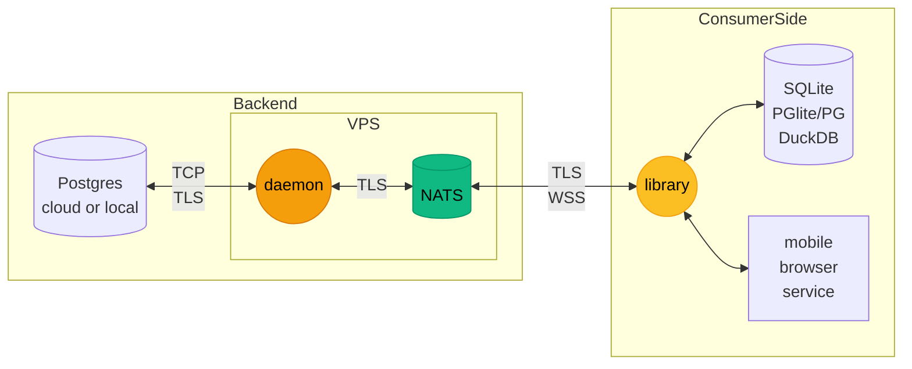
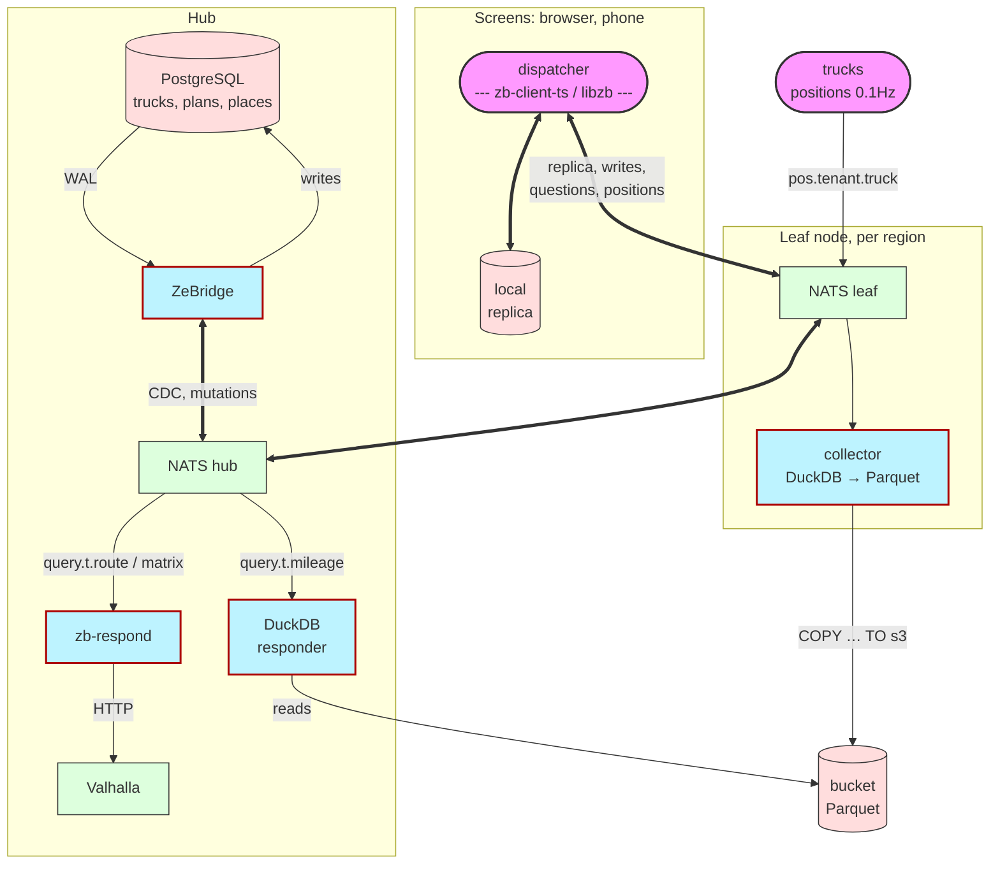
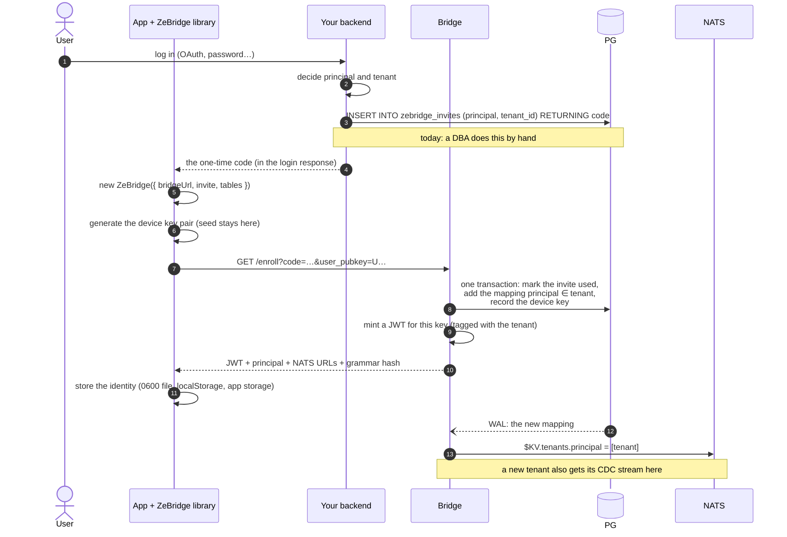
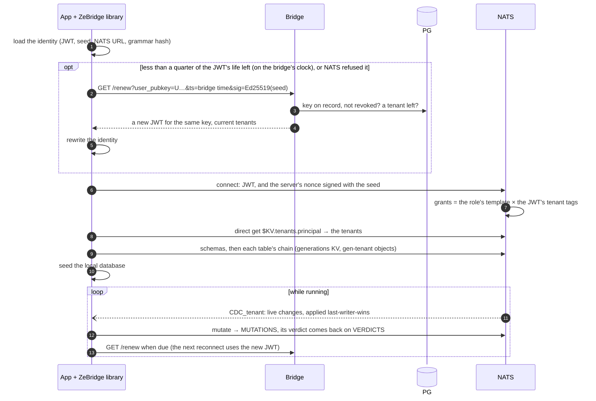

# ZeBridge - an offline-first PostgreSQL replica for the edge, over NATS

<p align="center">

</p>

  [](https://opensource.org/licenses/Apache-2.0) [](https://github.com/ndrean/zebridge/blob/main/TEST_SCENARIOS.md)

**What is it?**: ZeBridge keeps many local replicas (SQLite, PGlite, PostgreSQL, DuckDB) in sync with one authoritative PostgreSQL database. It uses NATS JetStream to solve the distribution problem for offline-first applications. Clients read locally and optimistically mutate; every write is a request to PostgreSQL, which resolves it last-writer-wins and returns a verdict. Change distribution runs over NATS JetStream, so clients reconnect without a stampede on the database.

ZeBridge has a three-pillar architecture with a projection daemon between your PostgreSQL primary and a NATS server, and a library where consumers build upon their apps, plus a small housekeeping "sweeper" sidecar daemon.


```mermaid
flowchart LR
     subgraph VPN["Backend"]
        PG[("Postgres <br> cloud or local")]
        subgraph VPS ["VPS"]
            Bridge(("daemon"))
            NATS[("NATS")]
        end
        PG <--> |TCP<br>TLS| Bridge
        Bridge <--> |TLS| NATS
    end

    NATS <--> |TLS <br> WSS| Lib

    subgraph Edge["ConsumerSide"]
        Lib(("library"))
        LocalDB[("SQLite<br>PGlite/PG<br>DuckDB")]
        App["mobile<br>browser<br>service"]
        Lib <-->LocalDB
        Lib <-->App

    end

    style Bridge fill:#f59e0b,stroke:#d97706,color:#000
    style Lib fill:#fbbf24,stroke:#f59e0b,color:#000
    style NATS fill:#10b981,stroke:#059669,color:#000
```

<br>

**Tested**: what could go wrong, and the test that shows it does not, in plain words: [What the tests prove](TEST_SCENARIOS.md#what-the-tests-prove-in-plain-words).

**Who is it for?**: Teams shipping an app backed by PostgreSQL that has to work offline, on devices they do not control, where a reconnection storm would hurt the database. Four shapes show up most:

- An offline-first app with a local replica. A phone, a browser, a robot, a laptop. The device holds its tenants' rows, works with no network, and syncs back on reconnection. The library queues every write, PostgreSQL judges it last-writer-wins, and the device converges. zb-client-ts for JavaScript hosts, libzb for native ones. A robot that goes offline, updates its own database, and syncs back is the same shape as a phone on a train.
- An analytical or geospatial responder, without extending PostgreSQL. A warm micro-VM holds its replica in DuckDB and answers "what is around me?" or "what happened in the last hour?" over NATS. No PostGIS, no TimescaleDB, no query load on the primary. See [examples/08-map](examples/08-map) and [examples/09-event](examples/09-event).
- An app whose screens open from local data. After the first sync, reads never reach the server: a screen renders from the replica, online or not, with no round trip. A static shell from a CDN gives the first paint; a phone app needs nothing more, and a browser app only a small service worker for its static files, since the replica and the outbox replace the data half of one (cached responses, queued writes, background sync). Server-side rendering keeps public pages and first visits.
- Several editors on one row. A shared route, a shared form, a shared map. Put the editable fields in one jsonb column as registers, declare it with `register_cols`, and two editors changing different fields never lose a move: the row's last-writer-wins decides whether a write is accepted, and PostgreSQL merges what it accepts register by register. It is a simple CRDT (a map of last-writer-wins registers), with no causal bookkeeping and no text merging. See [COOPERATIVE_EDITING](COOPERATIVE_EDITING.md).

**What you need to run it**: A PostgreSQL database you can configure — logical replication, a replication slot — and a NATS server you are willing to operate. The PostgreSQL side is automated: `bridge --init-sql` prints the init SQL — the two roles, the functions, the four event triggers, the publication — and pipes straight into `psql`, on bare metal or a VPS.

On a managed PostgreSQL, where the provider does not give you a superuser shell, the same SQL can run as a migration: `bridge --init-sql > zebridge_init.sql`, applied with your migration tool. Tested on Supabase: see [Using a cloud PostgreSQL](DEPLOYMENT.md#using-a-cloud-postgresql).

The NATS side is one command too (`bridge --init-nats operator`), but NATS is a server you now run, next to the bridge. The Quick start does all of it in one command; a production deployment does not hide it. ZeBridge adds two daemons to your stack, the bridge and NATS, and it is not the right choice if you cannot run them.

**Not for**: peer-to-peer sync (PostgreSQL is the single authority), multi-master writes (PostgreSQL judges every write), text collaboration (the cooperative editing layer merges per-field registers, not characters), or B2C per-user tenancy (a stream per user is a wall). See [SCOPE](SCOPE.md).

**Why this architecture?**: ZeBridge is standard logical replication + a message broker but with twelve things you would have to build yourself to make that combination usable by an app: binary WAL decoding to a client-friendly wire format, snapshot bootstrapping, catch-up for clients that were away, schema translation to the local engine, schema migration propagation, per-tenant routing, authentication and enrollment via a JWT chain, row-level security on the write path, optimistic writes with a verdict, conflict resolution, backpressure and bounded memory, idempotency and at-least-once delivery. All this makes it possible to distribute Postgres changes and schemas with the projection daemon and the client library via the NATS message broker, without the client needing to know NATS subjects, streams, or JetStream semantics.

**Scope**: replication is by tenant, not by query. A client holds every row of the tenants it belongs to, for every table it follows — filtering with WHERE decides what the app reads from what landed, not what lands. The tenant column is also what makes writes scopeable — RLS reads it, the bridge stamps it, and a write that names another tenant's row is refused by PostgreSQL.
If you put every client in one tenant, every client holds everything that tenant holds; the filter is a convenience, not a boundary. Per-user tenancy means one stream per user; at B2C scale, one stream per phone is a wall. See [SCOPE](SCOPE.md).

**Security**: tenant-based, with NATS grants and a rotating JWT chain. See [SECURITY](SECURITY.md).

**The documentation set**: README (this file), [Deployment](DEPLOYMENT.md), [Operations](OPERATIONS.md), [Security](https://github.com/ndrean/zebridge/blob/main/SECURITY.md), [Scope](https://github.com/ndrean/zebridge/blob/main/SCOPE.md), [Tested scenarios](https://github.com/ndrean/zebridge/blob/main/TEST_SCENARIOS.md), [Clients](https://github.com/ndrean/zebridge/blob/main/CLIENTS.md), [Distribution](https://github.com/ndrean/zebridge/blob/main/DISTRIBUTION.md), [Observability](https://github.com/ndrean/zebridge/blob/main/OBSERVABILITY_TELEMETRY.md), [Migrations](https://github.com/ndrean/zebridge/blob/main/MIGRATIONS.md),  [Cooperative editing](https://github.com/ndrean/zebridge/blob/main/COOPERATIVE_EDITING.md), [Protocol](https://github.com/ndrean/zebridge/blob/main/PROTOCOL.md), [SUPABASE_TEST](https://github.com/ndrean/zebridge/blob/main/SUPABASE_TEST.md)

**Glossary**:

|term|meaning|
|--|--|
|tenant|a value of a column, not a login; the unit of routing and read access|
|principal|a stable, authenticated identity, belonging to ≥1 tenant|
|publication|the PostgreSQL publication a bridge follows|
|slot|the replication slot a bridge owns; one bridge = one slot|
|generation / chain|a per-table, per-tenant snapshot lineage; base + checkpoints + deltas|
|verdict|PostgreSQL's answer to a client write: accepted / stale / rejected / row_deleted / failed. A rejected one carries a `reason` (`PredatesGcWatermark`, `KeyChange`, `UnknownColumn`…, or PostgreSQL's own error with its `sqlstate`). The libraries report it to the app as an outcome: applied / rebased / lost / deleted / rejected|

**Quick start**: With Docker (or OrbStack), from a clone of this repository:

```sh
docker compose -f docker-compose.quickstart.yml up --build
```

The first run builds the bridge from source, which takes a few minutes. It starts PostgreSQL, NATS in operator mode, the bridge, the sweeper and a browser demo. When the `init` service prints its links, open each in its own tab:

| link | who |
| -- | -- |
| <http://localhost:5173/?invite=quickstart-alice-1> | alice, tenant `acme` |
| <http://localhost:5173/?invite=quickstart-alice-2> | alice again, in a second tab |
| <http://localhost:5173/?invite=quickstart-bob-1> | bob, tenant `globex` |

Each link is a one-time invite: the tab makes its own key pair, enrolls at the bridge, and connects to NATS with the JWT it gets back, as a real device does. A tab is ready when its four phase badges are green; the first one can take up to a minute, while the bridge cuts the first snapshots.

Then click a counter. `counter_public` is shared by every tenant, so all three tabs follow it; `counter_tenant` travels only on acme's stream, so the two alice tabs follow it and bob never sees it move. The rest of the page walks through foreign keys, rejected writes and cooperative editing.

To start again from scratch: `docker compose -f docker-compose.quickstart.yml down -v`. The quickstart is for evaluation only (PostgreSQL trusts its local network, NATS has no TLS); a real setup follows [Host setup on VPS or bare-metal](DEPLOYMENT.md#host-setup-on-vps-or-bare-metal).

**Where to go next**:

- **Build an app** on ZeBridge: [The consumer side](#the-consumer-side), then [CLIENTS](CLIENTS.md) for your language.
- **Prepare your database**: the [good practices](#good-practices) a table follows, [Migrations](#migrations), and [Authentication](#authentication): who may read and write what.
- **Run it in production**: [DEPLOYMENT](DEPLOYMENT.md) to install and secure it, [OPERATIONS](OPERATIONS.md) to diagnose, configure and troubleshoot it.

## Table of Contents

- [Overview](#overview)
- [Three pillars](#three-pillars)
  - [Which library, and which artifact](#which-library-and-which-artifact)
  - [Setup steps at a glance](#setup-steps-at-a-glance)
  - [Use case: a fleet of trucks](#use-case-a-fleet-of-trucks)
- [The consumer side](#the-consumer-side)
  - [Enrolling a device](#enrolling-a-device)
  - [The TypeScript API](#the-typescript-api)
  - [The C ABI library](#the-c-abi-library)
  - [Code examples](#code-examples)
  - [Understanding the LWW rules](#understanding-the-lww-rules)
  - [Local database writes are owned](#local-database-writes-are-owned)
- [The daemon](#the-daemon)
  - [Good practices](#good-practices)
    - [Schemas and zebridge\_enable](#schemas-and-zebridge_enable)
    - [Private Columns on Tables](#private-columns-on-tables)
    - [Types](#types)
    - [Schemas - guards and suspension](#schemas---guards-and-suspension)
    - [Checks](#checks)
    - [Scoped by tenant, authorized by grants](#scoped-by-tenant-authorized-by-grants)
    - [Conflict resolution](#conflict-resolution)
    - [Cooperative editing: several editors on one row](#cooperative-editing-several-editors-on-one-row)
      - [A live illustration: a shared record](#a-live-illustration-a-shared-record)
    - [Cascade rules](#cascade-rules)
- [Migrations](#migrations)
  - [What a migration does](#what-a-migration-does)
  - [Examples](#examples)
    - [Fixing a "bad" read-only table](#fixing-a-bad-read-only-table)
    - [Fixing a "bad" writable table](#fixing-a-bad-writable-table)
    - [Changing a writable table's key from `bigint` to `uuid`](#changing-a-writable-tables-key-from-bigint-to-uuid)
- [Authentication](#authentication)
  - [The bridge and PostgreSQL](#the-bridge-and-postgresql)
  - [Production: use `operator mode`](#production-use-operator-mode)
    - [1. Set up, once per deployment](#1-set-up-once-per-deployment)
    - [2. Onboard a device](#2-onboard-a-device)
    - [3. Connect and renew](#3-connect-and-renew)
    - [4. Revoke](#4-revoke)
    - [Who holds what](#who-holds-what)
  - [Development](#development)
    - [`dev` mode](#dev-mode)
    - [Your own NATS server, without operator mode](#your-own-nats-server-without-operator-mode)
    - [This repository's test stack](#this-repositorys-test-stack)
- [Safety \& Guarantees](#safety--guarantees)
    - [Schemas Postgres -> SQLite](#schemas-postgres---sqlite)
    - [Internal WAL decoder and refused types](#internal-wal-decoder-and-refused-types)
    - [At-Least-Once Delivery](#at-least-once-delivery)
    - [Zero-Consumer Protection \& Storage Bounds](#zero-consumer-protection--storage-bounds)
    - [Idempotent Delivery](#idempotent-delivery)
    - [Durability](#durability)
    - [Schema Consistency](#schema-consistency)
  - [Graceful Shutdown](#graceful-shutdown)
- [Performance measurements](#performance-measurements)
  - [Changes: PostgreSQL → clients](#changes-postgresql--clients)
    - [A live phone under load, killed four times](#a-live-phone-under-load-killed-four-times)
  - [Snapshots: seeding a replica](#snapshots-seeding-a-replica)
  - [Writes: clients → PostgreSQL](#writes-clients--postgresql)
  - [Example: Sensors to a DuckDB replica](#example-sensors-to-a-duckdb-replica)
- [Limitations](#limitations)
- [Alternatives](#alternatives)
- [Requirements, Dependencies, Licenses \& Sources](#requirements-dependencies-licenses--sources)

## Overview

**Naming**: the product is ZeBridge; its binary is `bridge` (and `bridge_sweeper`); its SQL objects are `zebridge_*`; its client libraries are `zb-client-ts` (TypeScript) and `libzb` (C ABI), with bindings named `zb-*`.

**How does it work?**: three components, a daemon, a sweeper and a client library.

- the daemon `ZeBridge` (ZB): a Zig executable with a bi-directional  connection to PostgreSQL (PG) and to NATS/JetStream (NATS). It publishes the schemas, cuts table snapshots that clients seed from, and streams PG changes onto NATS. It applies the writes coming back from consumers to the primary, within their tenants.
It keeps no state of its own (its position is the replication slot; everything else lives in PostgreSQL and NATS), so it starts at once and stops cleanly at any time.
- the housekeeping sweeper: see [Sweeper](OPERATIONS.md#sweeper)
- the client library: it abstracts all the NATS connection and the storage into the local replica. The consumer is offline-first by default: a write applies locally at once, and when the connection is up the server's verdict comes back, echoed. No retry loop for the common case; the library queues, retries and reports verdicts.
The API is small and comes in two flavours: a TypeScript library, `zb-client-ts`, and a native Zig library with a C ABI, `libzb`, for any language with an FFI.
The TypeScript library pushes changes to the app; with `libzb` the host pulls them, polling on every tick.
Bindings exist for Python, Kotlin (Android), Dart/Flutter and React Native. See [CLIENTS](CLIENTS.md).

**Consumers**: The client library can be integrated across a wide range of runtime environments.

- Mobile Native Apps: Utilizing native file system storage: React Native running the C ABI library through its Expo module, Flutter running the C ABI library, with an SQLite replica.
- Desktop apps: Flutter running the C ABI library, or Electron running the TypeScript library, with an SQLite replica.
- Browsers and Webapps: Leveraging OPFS support for SQLite-WASM or PGlite via the TS library.
- Backend responder services / micro-VMs. For example, a warm micro-VM as a client, with the columnar in-process database DuckDB as its replica. This client does not write; it answers other connected clients through NATS only.
➡ The use case: a phone app asks, through the library, "which points of interest are around me?"; the responder service receives the question, runs the analytical, geospatial or time-based query against its replica, and answers over NATS. No query load on PostgreSQL, and no PostGIS or TimescaleDB extension needed there.
- Edge functions, as an HTTP front for the services. A Cloudflare Worker turns `GET /q/<name>?…` into a question to a responder over NATS, and a Durable Object holds the NATS connection between requests: from Cloudflare's Paris location to the hub in Frankfurt, a question takes 26–32 ms (a stateless Worker paid 65–240 ms more on every request, to connect). A client then needs no library: a web page, a partner's system, a script. It asks with the gateway's one identity, so authenticating users is the Worker's job. See [examples/11-edge-worker](examples/11-edge-worker). An edge container runs libzb natively instead, as a responder near its users: see [examples/12-edge-container-fly](examples/12-edge-container-fly).

**LocalDB supported flavours**: standard `SQLite`, `PGlite` or `PostgreSQL` and optional `DuckDB` support.

|engine |zb-client-ts |libzb|
| -- | -- | -- |
|SQLite |✅ (OPFS, better-sqlite3)| ✅
|PGlite |✅ (browser, Node)| —|
|PostgreSQL| — |✅ (dbUrl)|
|DuckDB |— |✅|

**Design**: built to keep many small consumers in sync with a small to medium PostgreSQL database, through NATS.

- **Performance**: data travels three ways, each measured on [Performance measurements](#performance-measurements).
  - **Changes**: the bridge streams over 100k rows/s from PostgreSQL into NATS, and a connected client applies 30k–50k of them a second (about 12k on an iPhone 12).
  - **Snapshots**: a new client seeds a table at 90k–125k rows/s, and still about 6k rows/s on a low-end Android phone (a Motorola E20), which the library feeds in chunks so the seed fits in its memory.
  - **Writes**: client writes reach PostgreSQL at about 8,500/s per ingress lane (`ZB_INGRESS_LANES`).
- **Topology**: The preferred topology is the daemon colocated with the NATS server over TLS (as opposed to terminating TLS at a reverse-proxy). Since clients join NATS over TLS on the same port, the bridge talks to NATS over TLS too. Ideally PostgreSQL, NATS and ZeBridge are colocated; a cloud PostgreSQL works too, tested on Supabase (see [Using a cloud PostgreSQL](DEPLOYMENT.md#using-a-cloud-postgresql)).
- **Standby Read Replica ready**: you can use a dedicated Postgres standby replica for all the reads as ZeBridge uses separate reader and writer roles. Point `DATABASE_READER_URL` at the standby and `DATABASE_WRITER_URL` at the primary: the slot and every read stay on the standby, and the bridge's few writes go to the primary. The standby needs PostgreSQL 16+, `wal_level=logical` and `hot_standby_feedback=on` (the bridge warns when it is off). Tested by `scripts/scenarios/standby.py`.
- **CLI**: the same binary sets the system up (`--init-nats`, `--init-sql`, `--mint-responder`, `--mint-leaf`), checks it (`--diagnose`), revokes users (`--revoke` or `--revoke --purge` to prune the local replica on reconnection) and manages slots (`--view-slot(s)`, `--drop-slot`). See [The CLI](OPERATIONS.md#the-cli).
- **Multiple instances**: possible, not recommended yet. Several instances of ZeBridge can run side by side, each with its own publication, slot and port, to follow large slow-moving tables apart from small tables with heavy changes, each instance with a buffer sized to its own tables. Two bridges on one database and one NATS pass `scripts/scenarios/multi_bridge.py`, but one bridge is the setup we run and recommend.
- **Mobile-First Synchronization**: to optimize mobile bandwidth and reliability, we use a delta-chain process with aggressive compression for seeding and reseeding, and streaming when needed. A client that was away reloads from the snapshots instead of replaying the change feed event by event. PostgreSQL never sees a reconnection stampede: the bridge builds each snapshot once per table and tenant (when generations are on), and clients seed and catch up from NATS, never from PostgreSQL. A thousand phones coming back at once cost the database nothing: the work moves to NATS and the chain producer.
- **Division by tenant, or by place**: a tenant is a column in a table; a consumer brings their identity, and PostgreSQL resolves their tenants from it. Tenants divide the data, and the NATS grants with it. Replication is scoped by tenant. Since a tenant is a NATS stream, the number of tenants must stay small, so this design is not for one-user-per-tenant B2C. See [SCOPE, Replication is by TENANT, not by query](SCOPE.md).
  - **By business**: one tenant per customer company. Each one's rows travel on its own stream, and a user's JWT names the tenants they may read.
  - **By place**: a tenant can be a map cell (a geohash). A device enrolled for a few cells follows them, and moves between them as it travels (`zb_client_join`, `zb_client_leave`). This fits a city: the cells a device may follow are fixed when it enrolls.
  - **By place, at country scale**: the data stays whole, and a responder service per region, on a NATS leaf node close to its users, answers "what is around me?". The phone keeps the answers in a local table, so they stay available offline. The region's phones are served by their own leaf; the hub sees their questions only when that leaf has no responder ([examples/08-map](examples/08-map)).
- **Strict authentication, JWT rotation**: because NATS is exposed to the internet and contains data, users are strictly tenant scoped and access grants are encoded in a JWT, immediately revokable by the DBA. Your app signs users in (OAuth or anything else) and its backend issues a one-time invite; the library enrolls the device with it and renews its JWT before it expires (`ENROLL_JWT_TTL_SECONDS`).
- **Encryption**: in transit, TLS. At rest, the PostgreSQL disk can be encrypted, and so can NATS's store. The replicas are normally not encrypted (plain SQLite does not offer it).

> [!WARNING]
> Encryption protects data between two points, not at the points themselves. Wherever TLS ends, the data is readable by whoever runs that point: a proxy that terminates TLS (in the demo, Cloudflare in front of the bridge and the browsers' WebSocket), a managed PostgreSQL (the database reads every row it judges), a hosted telemetry service. Each of these operators, and the rules they answer to, can see what passes through them. If you need full control over who may read your data, run the database yourself, and choose the services in the chain with care, or leave them out: clients can reach NATS and the bridge directly, without a proxy.

- **Schema translation**: replicas are built from PostgreSQL's schemas: as is for PGlite, translated for SQLite, with `STRICT` tables.
- **PostGIS and pgvector ready**: support of `PostGIS` (binary EWKB as BLOB) and `pgvector` types out of the box.
- **Anti-client flood**: writes per client are limited in backlog, on by default (`MUTATION_BACKLOG_PER_PRINCIPAL`, 5,000 queued writes: past it, that client's new writes are refused, and nothing already queued is evicted), and optionally in rate (`MUTATION_RATE_PER_PRINCIPAL`, off by default: over the rate, writes are delayed, not dropped). A delayed write changes nothing for `mutate()`, which returns at once: the client has already sent it, it waits in JetStream, and `pending()` counts it until its verdict comes back. The backlog limit refuses at the NATS publish, before the bridge: there is no verdict, the write stays in the device's outbox, and the library sends it again until the backlog has room. The backlog limit is set when the bridge first creates the MUTATIONS stream: change it on a fresh deployment, or edit the stream with `nats stream edit`.
- **Observability**: Prometheus metrics on `/metrics` and log lines with a level and a scope that Loki can label, with ready-made Grafana dashboards. The bridge serves the PostgreSQL metrics too (slots, connections, table sizes), so no PostgreSQL exporter is needed.
See [OBSERVABILITY_TELEMETRY](OBSERVABILITY_TELEMETRY.md).
  
**Opinionated**: Because our goal is to sync Postgres databases locally with strict predictability by preventing unexpected concurrent writes, we have a few rules that we stamped 💡 _good practices_: strict memory boundaries, safety enforced by tenant, enrollment by tenant and JWT, enforced schemas, foreign key cascade mitigation, conflict resolution by last-writer-wins (LWW) with cooperative editing on top of it, table suspension, and local writes that go through the library only. See [Conflict resolution](#conflict-resolution) below.

They may look strict, but they are mostly standard and well known, and applying them to a schema is almost mechanical. See [The daemon](#the-daemon) below for more details and [SCOPE ## Consistency model](SCOPE.md).

## Three pillars

The daemon `bridge` projects Postgres into NATS and back. It defines a protocol—a set of rules and workflows—for a consumer to connect to NATS and to the local replica.

There is a tiny daemon "sweeper". See [Sweeper](OPERATIONS.md#sweeper).

The client C-ABI `libzb` library - for FFI users - and the `zb-client-ts` library - for any JavaScript-based consumers, with libzb's core as a WASM module of about 70 KB - implement this protocol.

The client library abstracts away the complex choreography required to manage NATS streams, KV buckets, data decompression and deserialization, retries, holding queries with foreign keys...and sets up the local tables needed to hold the state of a client.

A developer will build an app using the client library. We have bindings for specific idioms. See [CLIENTS](https://github.com/ndrean/zebridge/blob/main/CLIENTS.md)

| artifact | what it is | who uses it |
| -- | -- | -- |
| bridge | POSIX based background executable <br>- Linux, FreeBSD, OSX | daemon running  next to PostgreSQL and  NATS |
| bridge_sweeper | background executable | daemon running next to Postgres and to the bridge |
| libzb | native client library, C ABI | FFI Consumers: mobile apps, desktop apps, microservices |
| zb-client-ts | client npm package <br>(self-contained TS) | JS Consumers: browsers, Node, Electron, Deno, Bun |

The client library shrinks this orchestration down to a few primitives: `connect()`, `close()`, `query()`, `mutate()`, `onChange()` and `onVerdict()`.

### Which library, and which artifact

The client library uses four libraries: `libpq`, `sqlite`, `zstd` and `duckdb`.  
Two independent questions. **Which library** depends on whether the host can link C.
**Which artifact** depends on how that host expects to receive it.

| host | library | artifact | needs installed |
| -- | -- | -- | -- |
| Flutter desktop | libzb, vendored | `.dylib` / `.so` | nothing |
| a service in Python, Go, Java, Elixir… | libzb, vendored | `.dylib` / `.so` | only its own engine, if it uses one |
| React Native (iOS **and** Android) | libzb, in the zb-react-native Expo module | static on iOS, `.so` on Android | nothing |
| browser, Node, Electron, Bun | zb-client-ts | — | the browser nothing; Node `better-sqlite3` and `@nats-io/transport-node` (peer dependencies) |
| native Swift on iOS | libzb, vendored | **static** `.a` | nothing |
| native Kotlin on Android | libzb, vendored | **static** `.a`, linked into your JNI `.so` | nothing |

The dividing line is not phone versus server — it is **whether you control what is
installed**. On your own server, linking the system sqlite and zstd is fine and keeps the
binary smaller. On a phone nothing is installed, so everything travels inside the app:

```sh
    zig build -Doptimize=ReleaseFast -Dvendor=true
    # sqlite + zstd compiled IN
```

`-Dvendor` compiles both from sources pinned by hash in `build.zig.zon`, so a build does not depend on what a package manager happens to have installed, and cross-compiles for whatever target is asked for. It costs about 1.8 MB.

Both phones take the **static** archive, for different reasons: iOS links archives or
frameworks into the app, and on Android your own JNI shim is the `.so` with libzb linked into it.
See `examples/08-map/native/README.md` for the exact commands.

⚠️ Do not compare an archive against a shared library — 22 MB of `.a` is 4 MB once linked, for identical code. Object files keep every symbol, nothing is dead-stripped, and the linker pulls only what an app references.

Browser and Node hosts need no native build at all: zb-client-ts bundles libzb's core as a WebAssembly module of about 70 KB, loaded at connect time, and keeps the database engine (SQLite, PGlite) and the socket on the TypeScript side. React
Native runs libzb instead, through `zb-react-native` (its build scripts make both phones'
libraries).

### Setup steps at a glance

- **NATS and the bridge's configuration**: `bridge --init-nats operator` writes the NATS server config, the bridge's credentials and `.env.nats`, which holds NATS settings only. The DBA's own `.env.bridge` names the database (the READER and WRITER URLs), the slot and the publication. The two files share no setting, so the order they are loaded in does not matter.
- **PostgreSQL**:
  - `bridge --init-sql | psql` creates the two roles, READER and WRITER, the functions and triggers ZeBridge needs, and the publication,
  - the DBA migrates the database and fixes what does not follow the 💡 _good practice rules_,
  - the DBA enables each table with `zebridge_enable`, where its sync rules are declared: this writes the catalogue row, installs the guards, scopes RLS and attaches the table to the publication, in one transaction.

   ```sql
   SELECT * FROM zebridge_enable('public.orders', 
    tenant_col => 'tenant_id',
    writable => true,
    version_col => 'updated_at',
    tombstone_col => 'deleted_at',
    publication => 'my_pub',
    dry_run => false
  );
   ```

- **Run**: `bridge --diagnose` checks everything first; then start NATS, the bridge (`bridge --pub my_pub --slot my_slot`) and the `bridge_sweeper` daemon.
- **Users**: since NATS is exposed to the internet, every user is authenticated. The bridge is OAuth agnostic: your backend writes a one-time invite naming the user (the principal) and their tenant in `zebridge_invites`. See [Production: operator mode](#production-use-operator-mode).
- **Frontend**: the developer builds on the library, `libzb` or `zb-client-ts`, and works only with the local database, never with NATS. They create a `ZeBridge` client with the bridge's URL, the invite, and the storage flavour (SQLite, PGlite, DuckDB).

The full procedure is [Host setup on VPS or bare-metal](DEPLOYMENT.md#host-setup-on-vps-or-bare-metal). On a Debian server behind Cloudflare, [deploy/ansible](deploy/ansible/README.md) does it for you: `site.yml` for the hub (HAProxy with Cloudflare's origin certificate, NATS with Let's Encrypt), `leaf.yml` for the [leaf nodes](DEPLOYMENT.md#adding-a-leaf-node).

See also [SUPABASE_TEST](https://github.com/ndrean/zebridge/blob/main/SUPABASE_TEST.md) for a cloud Postgres setup.

### Use case: a fleet of trucks

A depot plans its trucks' trips; the people dispatching them work on browsers and phones, offline at times; trucks report where they are. Each kind of data takes the path that suits it:

- **Decisions go through PostgreSQL**: the trucks, their plans, the places they serve. A dispatcher's screen holds a replica and edits it locally; the write goes to PostgreSQL through the bridge, and every other screen receives it. Two dispatchers sending the same truck at once: the later stamp wins on every screen.
- **Questions go to services over NATS**: a route, which truck is closest by road. `zb-respond` forwards each question to Valhalla and returns its answer; more pairs of them in one queue group share the load.
- **What moves stays on NATS**: positions are published on `pos.<tenant>.<truck>` and shown by the screens that follow them. They never reach PostgreSQL, so their rate is NATS's, not the database's.
- **History goes to Parquet**: on each leaf, a collector embedding DuckDB packs the positions into Parquet files in one central bucket. On the hub, a DuckDB responder answers questions on that archive (mileage, occupancy), taking the tenant from the subject, which the asker's JWT bounds.

10 services: a local replica (SQLite) per client, a NATS leaf node per region and its collector service (into Parquet compressor), the NATS server, the PostgreSQL server, the bridge daemon, a responder service, a Valhalla service, a DuckDB service (analytics on archives), and a bucket for the archives & vector tiles


```mermaid
flowchart TD
    classDef external fill:#f9f,stroke:#333,stroke-width:2px;
    classDef internal fill:#dfd,stroke:#333,stroke-width:1px;
    classDef secure fill:#fdd,stroke:#333,stroke-width:1px;
    classDef daemon fill:#bdf3ff,stroke:#ac0100,stroke-width:2px;

    subgraph Clients ["Screens: browser, phone"]
      S([dispatcher<br>--- zb-client-ts / libzb ---]):::external
      R[(local<br>replica)]:::secure
      S <==> R
    end
    
    T([trucks<br>positions 0.1Hz]):::external

    subgraph Leaf ["Leaf node, per region"]
      LN[NATS leaf]:::internal
      COL[collector<br>DuckDB → Parquet]:::daemon
    end

    subgraph Hub
      direction LR
      PG[(PostgreSQL<br>trucks, plans, places)]:::secure
      ZB[ZeBridge]:::daemon
      HN[NATS hub]:::internal
      RESP[zb-respond]:::daemon
      VAL[Valhalla]:::internal
      DQ[DuckDB<br>responder]:::daemon
      
      %% Moving these internal Hub connections here forces the LR layout
      PG -->|WAL| ZB
      ZB -->|writes| PG
      ZB <==>|CDC, mutations| HN
      HN -->|query.t.route / matrix| RESP
      RESP -->|HTTP| VAL
      HN -->|query.t.mileage| DQ
    end

    B[(bucket<br>Parquet)]:::secure

    %% Global connections
    S <==>|replica, writes,<br>questions, positions| LN
    T -->|pos.tenant.truck| LN
    LN <==> HN
    LN --> COL
    COL -->|COPY … TO s3| B
    DQ -->|reads| B
```


[examples/14-depot](examples/14-depot) runs the first two, with Supabase as the PostgreSQL and Valhalla on the hub: a plan, its places and its stops edited together on several screens, routes and the closest truck asked over NATS, positions computed by each screen from the plan. The live positions and their archive are the design for real trucks; they are not built yet.

**Sizing, an estimate** for 20,000 trucks each reporting every 10 s: a dispatcher's map needs no more):

| | |
| --- | --- |
| one position (id, time, lat, lng, speed, heading, one sensor value) | ~50 B in MessagePack, ~120 B in JSON; ~115–185 B stored with its subject and JetStream's overhead |
| messages into NATS | 2,000/s, 0.25–0.4 MB/s |
| the leaf stream, kept 7 min | 100–150 MB: memory storage is enough. Longer than the collector's 5 min, so a slow write or a restart loses nothing |
| Parquet, at 10–15 B per row (zstd, 32-bit coordinates) | a file every 5 min: 600,000 rows and 6–9 MB for the whole fleet, shared among the leaves, 288 a day · compacted once a night into one file per tenant and day: 170 million rows, 1.7–2.6 GB |
| the archive | 50–80 GB a month |

A screen subscribes to its tenant or its region, not to the whole fleet: 2,000 messages a second is light for NATS and heavy for a phone.

[⬆️](#table-of-contents)

---

## The consumer side

> [!IMPORTANT]
> **Two rules**:
>
> - you do not talk to NATS: the library does all of it.
> - you talk to the replica via the library primitives.

The client library comes in two flavours: TypeScript (for any JavaScript engine) and a native Zig library with a C ABI, `libzb` (Flutter, React Native, Swift, Kotlin, Python services, and any language with an FFI).

- **`zb-client-ts`** — a self-contained TypeScript package that runs **as-is** in browsers, Node, Electron, Deno and Bun. No native library needed: the rules it shares with libzb come as a WebAssembly build of libzb's core (about 70 KB), shipped in the package and loaded by `connect()`.
- **`libzb`** — a native library with a C ABI for mobile apps, desktop apps and microservices (FFI-compatible).

> [!CAUTION]
> One big difference: the TypeScript client drives itself, the C ABI library is driven by its host.

**Start with [the first ten lines](CLIENTS.md#the-first-ten-lines)** — the same few calls in TypeScript, Python, Kotlin, Dart, and C for any other language. Every binding follows [one rule](CLIENTS.md#bindings-the-rule): it holds no behavior of its own.

### Enrolling a device

Your app signs the user in however it likes (OAuth, passwords…), and your backend hands the device a one-time invite. Pass it with the bridge's URL; the library does the rest, in both libraries:

```ts
const zb = new ZeBridge({ 
  bridgeUrl: 'https://bridge.mydom.com', 
  invite: code, 
  tables: ['orders'] 
});
await zb.connect();   // libzb: {"bridgeUrl": …, "invite": …, "tables": […]} to zb_client_connect
```

The first connect generates the device's key pair (the seed never leaves it), redeems the invite at `GET /enroll`, and stores the identity (`identityPath`: a 0600 file, or the browser's localStorage — the same JSON in both libraries). Every later connect needs neither the invite nor `natsUrl`: the identity names the principal, the NATS URL the bridge handed out, the grammar hash and the JetStream domain. The JWT **renews itself** before it expires (`GET /renew`, signed with the device's key — no invite, no backend call), so a device enrolls once and stays enrolled until it is revoked.

A host that manages identities itself passes `natsUrl` and `creds` (the `.creds` text; `credsPath` on Node) instead; the principal is read from the JWT inside them. The low-level steps are there for it: `createUser()`/`zb_create_user()`, `enrollAt`, `credsFileText`/`zb_creds_file_text`.

### The TypeScript API

The app gets one connection to NATS (WebSocket in the browser, TCP on Node) and one local database (SQLite by default, or PGlite). It builds a `ZeBridge` object, calls `connect()`, reads with `query(sql)`, writes with `mutate(table, op, key, values)`, gets reactivity from `onChange(table, cb)`, and learns what became of each write from `onVerdict(cb)`.

Once you call `connect()`, it subscribes, receives, applies and fires your callbacks on its own: you do nothing.

```ts
import { ZeBridge, NotEnrolled, RevokedPurge } from 'zb-client-ts';   // the bundler picks the browser or the Node entry
```

- `connect()` throws `NotEnrolled` when this device has no stored identity and was given no invite (show the "open your invite link" screen), and `RevokedPurge` when the principal was revoked with `--purge` (its local data is gone). A plain revoke has no class of its own: a connected client sets `zb.revoked` and hangs up, and a later `connect()` throws an `Error` ("renew: refused…"). It is a field, not a class, because the replica stays readable until the app calls `wipe()`; `RevokedPurge` is an error because the local data is already gone.
- `zb.uuid()` mints a key for a new row (a UUIDv7, time-ordered), offline.
- Without an invite, in `dev` mode, the client names itself: `new ZeBridge({ natsUrl, principal, tables })` ([Development](#development)).
- `onStatus(cb)` reports `connected`, `connecting` or `disconnected`; with `pending()`, that is an offline indicator. Every `on…` returns a function that unsubscribes.
- `zb.principal` is who this client is; `zb.tenant` the tenant it follows and writes to. A principal can belong to several tenants: zb-client-ts follows the first and logs the others, while libzb follows them all (`tenants` in `zb_client_sync`'s report, `zb_client_join` / `zb_client_leave`).
- The WebAssembly core is loaded with `new URL('../wasm/zb_core.wasm', import.meta.url)`, so Vite and the other bundlers ship it as an asset with no configuration.

Storage, zstd and the NATS dial come from the platform: better-sqlite3 and TCP on Node, sqlite-wasm on OPFS and WebSocket in the browser. The replica lives at `dbPath`, by default `zebridge_<principal>.sqlite3`, kept across reloads — which is what an outbox needs: a write queued while the socket was down must still be there after the page comes back. A fresh name per load (`` dbPath: `zebridge_${Date.now()}.sqlite3` ``) is a clean room for a dev loop. `engine` defaults to SQLite; `'pglite'` (browser and Node) loads PostgreSQL-in-process on demand, and a SQLite consumer never downloads it. libzb takes the same options, except `engine`: `'sqlite'` or `'duckdb'` there (CLIENTS.md).

**Query**: `query(sql, ...params)` — read your local database directly. Any single read: joins, aggregates, offline. The replica _is_ the API. It returns the rows as objects.

```js
const rows = await zb.query(
  "SELECT id, status, updated_at FROM orders WHERE status = ? ORDER BY updated_at DESC LIMIT 3",
  'Pending',
);
```

**Mutation**: `mutate(table, op, key, values)` — one write, three verbs (insert, update, delete), resolved last-writer-wins. This is the only way to change data. It returns `{ version }` at once: the write's stamp, which `onVerdict` reports back with the outcome.

<details><summary>An example of a mutation query</summary>

The UPDATE query:

```sql
UPDATE orders
SET status = 'Expired'
WHERE id IN (
    SELECT id
    FROM orders 
    WHERE order_date < '2023-01-01' AND status = 'Pending'
);
```

is written as:

```js
// the SELECT half runs against the local replica, works offline
const orders = await zb.query(
  `SELECT id FROM orders WHERE order_date < '2023-01-01' AND status = 'Pending'`
);

for (const row of orders) {
  await zb.mutate(
    'orders',               // table
    'UPDATE',               // op: 'INSERT' | 'UPDATE' | 'DELETE'
    { id: row.id },         // key: the PRIMARY KEY column(s) 
                            // — composite is fine: { org_id, id }
    { status: 'Expired' },  // values: ONLY the changed columns
  );
}
```

</details>
<br>

**Reactivity**: the `onChange(table, cb)` doorbell. When a change feed touches a table, it rings for granular reactivity.

- For one row: `ev` carries the row in `ev.data`, so the app can patch its UI state at once, without querying the database.
- With no event (`ev` undefined): many rows may have changed at once, after a seed or after a write's verdict came back. Re-read the table.

An event looks like:

```js
{
  operation: 'INSERT' | 'UPDATE' | 'DELETE',
  data: Record<string, any>,  // the row's columns as sent
  optimistic: true,           // only on your own write's local apply
  seq, stream, lsn,           // where it came from, for logs
}
```

💡 Two things to know when writing a handler. The same row rings twice for your own writes: once for the optimistic apply (`optimistic: true`), once for the CDC echo, so an **INSERT handler must upsert**, never append blindly. With `register_cols` there is no third event: the echo already carries the document PostgreSQL merged. And on a table that keeps tombstones, a delete arrives as an UPDATE whose tombstone column is set: treat that as the delete it is.

Write one callback per table: patch your state from `ev.data`, or re-read the table when there is no event. The example in _App.tsx_ uses `SolidJS`:

```js
const [counters, setCounters] = createSignal();

zb.onChange("counter_public", (ev) => {
  // no event: many rows may have changed (a seed, a verdict) — re-read
  if (!ev) {
    void refresh(['counter_public']); return;
  }

  if (ev.data.uid !== counterUid('counter_public')) return;
  setCounters((prev) => ({
    ...prev,
    counter_public: {
      value: ev.data.value !== undefined ? ev.data.value : prev.counter_public?.value ?? 0,
      version: ev.data.updated_at !== undefined ? String(ev.data.updated_at) : prev.counter_public?.version ?? '',
      writer: ev.data.last_writer !== undefined ? String(ev.data.last_writer) : prev.counter_public?.writer ?? ''
    }
  }));
});
```

That is the whole contract for an app author: one callback per table, and one for the verdicts.

**What became of a write**: `onVerdict(cb)` reports each of this client's writes once, when its fate is final, matched to `mutate()` by the version it returned: `applied`; `rebased` (a newer row won on other columns, so the library re-sent it, as `rebasedAs`); `lost` (a newer row won on the same columns, `lostColumns`); `deleted`; `rejected` (with its `reason`). The library has already acted on it: dropped it from the outbox, re-sent it, or put the local row back. `pending()` counts the writes still waiting in the outbox: the "2 queued writes" of an offline indicator.

```js
zb.onVerdict(({ version, outcome, columns, lostColumns, rebasedAs }) => {
  if (outcome === 'lost') toast(`someone else changed ${lostColumns.join(', ')} first`);
});
```

`columns` are the columns this write changed. `rebasedAs`, on a `rebased` outcome, is the version the library re-sent it under. `lostColumns`, on a `lost` outcome, are the ones among them that a newer row had already changed. `reason`, on a `rejected` outcome, names the bridge's error (`PredatesGcWatermark`, `KeyChange`…). The full list of `reason`s is in [PROTOCOL](PROTOCOL.md#when-it-is-refused). When PostgreSQL itself refused the write, `sqlstate` and `detail` carry its code and message: `22023` is a malformed register document, `42501` a row-level-security refusal, `23514` a row wider than the width guard allows, `23505` a unique constraint. Branch on `sqlstate`, not on `reason`, which reads the same for both (both libraries: `onVerdict` in TypeScript, the poll report's `outcomes` in libzb).

Two more for cooperative editing ([COOPERATIVE_EDITING](COOPERATIVE_EDITING.md)): `stamp()`, a register's time on the bridge's clock, and `mergeRegisters(a, b)`, imported. The whole set, used on one page: [example 15's survival kit](examples/15-shared-record/README.md#the-ts-client-survival-kit).

### The C ABI library

`libzb` does nothing on its own. It moves only when the host calls it. Which build a host needs (an xcframework, an AAR, a shared library) and how the optional DuckDB and PostgreSQL engines load: [DISTRIBUTION](DISTRIBUTION.md). On iOS and Android it carries its own TLS root certificates, so an app passes none ([CLIENTS](CLIENTS.md#tls-on-ios-and-android)). Eight functions make the card:

| verb | what it does | returns |
| --- | --- | --- |
| `zb_client_connect(opts_json)` | opens the replica and the socket | a handle, `0` on failure |
| `zb_client_sync(h)` | the first step after open: resolves the tenant, applies the schemas, seeds the tables, drains the streams | `{"principal", "tenant", "tenants", "first": bool, "unseeded": [{"table", "reason"}]}` — an empty `unseeded` is what "usable" means |
| `zb_client_poll(h, wait_ms)` | waits up to `wait_ms` for CDC, applies what arrived, retries what was held, collects verdicts | `{"applied", "settled", "changed_tables", "seeded", "outcomes": […], "pending"}`, plus `"unseeded"` while any table is, `"requests"` when it serves, `"unreadable"` for a tenant's stream it cannot read |
| `zb_last_error()` | why `zb_client_connect` returned `0`, for this thread (`errno`-style) | a C string; `NULL` once a connect succeeds |
| `zb_client_flush_outbox(h, wait_ms)` | sends the outbox and waits up to `wait_ms` for verdicts | `{"sent", "settled", "verdicts": {…}}` |
| `zb_client_query(h, sql, params_json)` | a read against the replica | `{"columns": […], "rows": [[…], …]}` |
| `zb_client_mutate(h, table, op, key_json, values_json)` | one write: optimistic locally, sent at once | `{"msgId": …}` |
| `zb_client_close(h)` | closes the socket and the replica | `0`, `1` for an unknown handle |

| returns | functions | failure |
| --- | --- | --- |
| a handle (`u64`) | `zb_client_connect` | `0`; the words in `zb_last_error()` |
| a JSON string | every other call | `{"error": "<Name>"}`, plus `"detail"` |
| an `int` | `zb_client_close`, `zb_client_wipe`, `zb_client_wake` | `0` done, `1` not done (an unknown handle, most often) |
| an `int` | `zb_client_revoked`, `zb_client_live` | a value: `1` revoked, `0` live, `-1` unknown handle; the count of open handles |

**One vocabulary, two libraries.** The names are zb-client-ts's, so an app author — or a
model reading the code — learns one API and can write either. Where they differ, the
reason is the C ABI, not a choice:

| concept | zb-client-ts | libzb (C ABI) |
| --- | --- | --- |
| make the enrolment keypair | `createUser()` | `zb_create_user()` |
| assemble the `.creds` | `credsFileText(jwt, seed)` | `zb_creds_file_text(jwt, seed)` |
| start | `new ZeBridge(cfg)` then `connect()` | `zb_client_connect(opts_json)` — C has no constructor, so one call does both |
| read, write, ask, answer, absorb | `query` `mutate` `request` `serve` `ingest` | `zb_client_query` `zb_client_mutate` `zb_client_request` `zb_client_serve` + `zb_client_reply` `zb_client_ingest` — the questions come in `zb_client_poll`'s report, and the host answers each with `zb_client_reply` |
| send the outbox | `flushOutbox()` | `zb_client_flush_outbox(h, wait_ms)` |
| receive changes | `onChange(table, cb)` | `zb_client_poll(h, wait_ms)` — a C ABI cannot take a closure, so the host drives the loop |
| what became of a write | `onVerdict(cb)`, matched by the `version` `mutate` returned | the poll report's `outcomes`, matched by the `msgId` `zb_client_mutate` returned |
| writes still queued | `pending()` | the poll report's `pending` |
| was I banned | `revoked` (a field) | `zb_client_revoked(h)` — `1` revoked, `0` live, `-1` unknown handle |
| why did it fail | the `Error` thrown, the `SYS` log line | `zb_last_error()` after connect's `0`; `{"error": …}` from every other call; `unseeded` in the sync and poll reports |
| delete the local replica | `wipe()` | `zb_client_wipe(h)` |
| stop | `close()` | `zb_client_close(h)` |

`version` and `msgId` are two keys for the same write. The version is the stamp PostgreSQL compares (last-writer-wins). The `msgId` identifies the message: built from this client's id, the table, the key and that version, it is what NATS deduplicates on. Each library returns the one it matches outcomes on.

C-only by necessity: `zb_free` (no GC), `zb_abi_version`, and `zb_client_live` (open
handles in this process — a leak check for tests, and not to be confused with
`zb_client_revoked`).
Beside them: `zb_call(fn, args_json)` (a pure rule of the library's core, no handle: `mergeRegisters` for [cooperative editing](COOPERATIVE_EDITING.md), the one every binding uses), `zb_client_mutate_at` (a write with the caller's own version stamp; `mutate(…, { version })` in TypeScript), `zb_client_stamp` (a register stamp on the bridge's clock, for [cooperative editing](COOPERATIVE_EDITING.md); `stamp()` in TypeScript), `zb_client_wake` (see below), `zb_client_join` and `zb_client_leave` (follow one more tenant, or stop; libzb only), `zb_grammar_hash` and `zb_grammar_json` (what this build of the library speaks). A minimal binding needs the eight functions of the first table and `zb_free`; the rest are optional.

**Responder mode**: a service that answers questions over NATS calls `zb_client_serve` once; the questions then arrive in the poll report's `requests`, and the host answers each with `zb_client_reply`. `zb_client_request` asks such a service, and `zb_client_ingest` absorbs rows the host already has. Details: [CLIENTS](CLIENTS.md).

**How data crosses.** Everything is a C string of JSON, in and out, so a binding is three declarations in any language with an FFI. One value is not JSON-shaped: a BLOB column (`bytea`, a PostGIS geometry) comes back from `zb_client_query` as `{"$bin": "<base64>"}` and is written the same way in a mutation's values. Two ownership rules make it safe:

- Strings you pass in are read during the call and never kept: free your own copies as soon as the call returns.
- Every string the card returns is allocated by the library and is yours until you hand it back with `zb_free(p)`. Read it, decode it, free it — in that order, every time. A binding that forgets `zb_free` leaks one JSON document per call; the Dart, Swift and C++ bindings in `examples/05-tables` free in the same line they decode.

**Errors.** `zb_client_connect` returns a number, so its failure is `0` and the reason is in `zb_last_error()`. Every other call returns JSON, and its failure is in the JSON: `{"error": "<Name>"}` (`UnknownHandle`, `Revoked`, `BadJson`…), plus `"detail"` with SQLite's own words for a query the replica refuses (`no such table: test_types`: a table this client does not follow). A write that PostgreSQL refuses is not an error: `zb_client_mutate` succeeded, and the refusal arrives later as a verdict (the poll report's `outcomes`). `NULL` only means the binding passed a `NULL` argument, or memory ran out.

**Who holds the handle.** The client is single-threaded by contract: the host owns the thread, and only one thread ever calls into a handle. `zb_client_poll` BLOCKS that thread for up to `wait_ms` when nothing arrives, so the loop cannot live on a UI thread. The honest shape is one worker that owns the handle and everything that touches it — poll, flush, query, mutate, close — while the UI talks to it over messages. In Flutter that is an isolate; on iOS a background queue; in React Native a native thread behind a promise.

A command sent to that worker should not wait for the poll's `wait_ms` to run out: `zb_client_wake(h)` ends the wait at once. It is the one call allowed from any thread, and the bindings make it with every command they send.

The Flutter examples do exactly this, through the shared Dart package `zb-dart` (`zb-dart/lib/src/worker.dart`):

```dart
// UI side: the worker owns the handle; every call is a message with an answer.
final zb = await ZeBridgeWorker.spawn({
  "bridgeUrl": "https://bridge.mydom.com",  // the first run enrolls with the invite; the identity is kept beside dbPath
  "invite": code,                           // later runs need neither: the identity names the principal and the NATS URL
  // "natsUrl" + "creds" or "credsPath": a host that manages identities itself (plain NATS over TCP: libzb has no websocket)
  "dbPath": "/a/writable/place/zb.sqlite3",
  "tables": ["counter_public", "counter_tenant", "app_users", "app_orders"],
  "clientId": "flutter-client",
  "seedChunkRows": 50000,               // rows per transaction when a chain seeds a table (0 = one); bounds memory and the lock
  "seedStreaming": false,               // true on a phone: the chain object is never held inflated (3 M rows: 329 MB peak instead of 1.1 GB, 23 s instead of 11)
  "seedStreamingAboveBytes": 8388608,   // with seedStreaming: a step whose compressed object is smaller takes the faster whole-object path (deltas always do)
  // "dbUrl": "postgres://user@host/db", // instead of dbPath: the replica on a PostgreSQL server (a libpq URL) — the micro-VM case
  // "engine": "duckdb",                 // dbPath is a .duckdb file: the analytical replica (needs DuckDB installed; DuckDB opens the file once the client closes it)
});
print(zb.tenant);                       // resolved by the worker's first sync

// One report per poll that changed something: re-read the tables it names.
zb.reports.listen((report) {
  if (report.error != null) return showError(report.error);
  refresh([...report.changedTables, ...report.seeded]);
});

final rows = await zb.query("SELECT item, count FROM app_orders WHERE deleted_at IS NULL");
await zb.mutate('app_orders', 'UPDATE', {'user_id': uid, 'item': 'laptop'}, {'count': 2});

// App lifecycle: nothing polls while the app is in the background. `inactive` is not
// a pause: on a desktop another window has focus, and the app must keep syncing.
@override
void didChangeAppLifecycleState(AppLifecycleState state) {
  switch (state) {
    case AppLifecycleState.resumed: zb.resume();
    case AppLifecycleState.inactive: break;
    default: zb.pause();
  }
}
```

and the worker isolate is a loop over the card using `zb.sync`, `zb.poll`, `zb.flush`, `zb.close`; each report names its `changedTables`.

```dart
// Worker isolate: the only place the handle is ever used.
ZeBridge.init();                          // the FFI lookups are per isolate
final zb = ZeBridge(options);
final info = zb.sync();                   // tenant, schemas, seed, drain
toUi.send({'type': 'ready', 'tenant': info['tenant']});

while (!closing) {
  if (paused) { await Future.delayed(const Duration(milliseconds: 200)); continue; }
  final report = zb.poll(100);            // blocks up to 100 ms on the broker
  if (report.changedTables.isNotEmpty || report.seeded.isNotEmpty || report.outcomes.isNotEmpty) toUi.send(report);
  zb.flush(0);                            // the outbox, every turn
  await Future.delayed(Duration.zero);    // the command port runs here: query, mutate…
}
zb.close();
```

The bound on a click is one poll's `wait_ms`: commands are served between two polls. When the app resumes, the next `poll` catches up on everything it missed and the next `flush` sends what was written meanwhile — the outbox is what makes the pause harmless. A Python service is the same loop without the isolate (`scripts/scenarios/clients.py`), and a Swift app puts it on a background queue (`examples/05-tables/ios`).

💡 **Testing a write that loses**: the outbox sends a write the moment `mutate()` returns, so delaying the flush does not make it late. To see how your UI handles a refused write (a slow clock, or an edit that arrives after a newer one), stamp it yourself with an older version: `zb_client_mutate_at`, or `mutate(…, { version })` in TypeScript.

### Code examples

- [App.tsx](/examples/05-tables/web-consumer/src/App.tsx) (browser, live),
- [Flutter](/examples/05-tables/flutter) example,
- [DuckDB over a synced replica](/examples/07-duckdb/analyze.py): PostgreSQL → SQLite → DuckDB, an analytical job that never touches PostgreSQL,
- a Node service on zb-client-ts (`examples/04-node-consumer`), and a Python service on libzb answering questions from a DuckDB replica (`examples/09-event`).

A device gets its identity from an invite, once; the library does the rest. See [Production: operator mode](#production-use-operator-mode).

### Understanding the LWW rules

We have two users in the same tenant. Mary went offline, and Bob is online and works on the **same row**.

|                 what happened             |                         result                          |
|-----------------------------------------------|---------------------------------------------------------|
| Mary is off, Bob edits online, then Mary deletes, then reconnects | delete wins: her stamp is newer than the row's |
| Mary is off, Bob deletes online, then Mary edits, then reconnects | delete wins: the tombstone is terminal, her newer stamp does not revive it   |
| Mary is off, deletes, then Bob edits online, she reconnects  | edit wins: her delete reaches the server with a stamp older |

So the delete is terminal once it has landed, and it wins against anything older than itself.

The one case it loses is when it arrives late with an older stamp than an edit that already landed, which is last-writer-wins treating a delete like any other write. This is the only one where a deleted row comes back, with the loser told why.

|                 what happened                 |                         result                          |
|-----------------------------------------------|---------------------------------------------------------|
| two edits on different columns, any older | both land, the later-arriving one rebased if it was stamped earlier |
| two edits on the same column         | the later stamp wins, the loser is told (`lost`)                  |
| two edits of different registers of one `jsonb` column with `register_cols` | both kept: PostgreSQL merges the document register by register, whichever write was last ([COOPERATIVE_EDITING](COOPERATIVE_EDITING.md)) |
| an edit changing a key column        | refused before it leaves the client, KeyChange; rename is delete + create |

### Local database writes are owned

`query()` is read-only on both clients: libzb answers it on a second SQLite connection opened read-only, the TypeScript client does the same on Node and refuses by statement shape where it has one handle. The application cannot reach the outbox, the stream positions or the shape record through the API; writes go through `mutate()`.

**The library owns the write path — reads are open, writes go through `mutate()`**:  every write gets the outbox, the version stamp and the LWW echo. A write that skips the library is a _bug_ you should not be able to make by accident.

**How** that is enforced depends on the local engine, and here is how we approach it:

- **Browser SQLite (one OPFS connection)**: Enforced. The library owns the single connection, and `query()` refuses any statement that is not a single read (by its shape) — the app has no other way to reach the database.
- **Mobile and service SQLite (libzb)**: Enforced. `query()` runs on a second connection opened read-only, so a direct write fails.
- **PGlite:** a supported engine (`?engine=pglite` in examples/05-tables/web-consumer; `engine: 'pglite'`, dialect seam in `zb-client-ts/src/dialect.ts`). The library owns PGlite's single connection (persisted: IndexedDB in the browser, a directory at `dbPath` on Node) exactly as it owns the OPFS one, so the same statement-shape guard applies.
- **PostgreSQL replica (libzb `dbUrl`)**: Enforced. `query()` runs on a second connection with `default_transaction_read_only` on.
- **DuckDB (libzb)**: `query()` accepts a single read statement only, the same check the TypeScript client makes.

The rule is the same everywhere; the _mechanism_ that guarantees it is engine-specific. It is why the library — not a set of naming conventions — is the API.

[⬆️](#table-of-contents)

---

## The daemon

Once the DBA has installed the ZeBridge functions into PostgreSQL (`--init-sql`), checked the database's **compliance**, and generated the NATS configuration (`--init-nats`), ZeBridge, the first pillar of the architecture, is ready to run. It creates the streams and buckets it needs at its first start.

**Compliance** means following the good practices of a sync engine, because ZeBridge makes choices other tools leave to you. They all aim one way: many small consumers that read freely, write safely, and never cross the tenant line.

These good practices act as constraints—though mostly mechanical—and that is the point: each one buys a specific guarantee.

Literature-1: <https://hatchet.run/blog/postgres-survival-guide>

Literature-2: <https://www.digitalocean.com/community/tutorials/database-normalization>

Here they are, so you can judge the fit before adopting it.

- **Strict Memory Boundaries**: Because ZB uses a **fixed pre-allocated buffer**, its memory footprint is fixed at startup.
🚦 A row too wide for that buffer is refused by PostgreSQL itself, whether it comes from a client or from `psql`: a width guard on the table raises, and the transaction rolls back. A row that gets past the guard anyway (after `BASE_BUF` was lowered, say) suspends the table. See [Suspended tables](OPERATIONS.md#suspended-tables).
- **💡 Enforcement of Good practices on Schemas**:  Because we are syncing databases, the schema rules are enforced, not suggested: a primary key, `uuid` keys and `timestamptz` columns on writable tables, and a deliberate choice about deletes across a foreign key.
`zebridge_enable(..., dry_run => true)` reports every rule for a table before touching anything, and `bridge --diagnose` checks a whole database, the cascade rule included. See [Checks](#checks) and [Diagnose](OPERATIONS.md#diagnose).

- **Suspension**: 🚦 When a table stops meeting a rule while the bridge runs, the bridge **suspends** it and keeps everything else flowing. Fix the table and most suspensions lift by themselves; two cases need a restart, [Suspended tables](OPERATIONS.md#suspended-tables) and [Restart rules](OPERATIONS.md#restart-rules).
- **Soft deletes, reaped by the sweeper**: a delete is sent to PostgreSQL as a soft delete (the `tombstone` column), and the companion `bridge_sweeper` daemon reaps old tombstones so the database does not bloat. See [Sweeper](OPERATIONS.md#sweeper).

- **A cascade storm, when PostgreSQL does cascade**: on tables without tombstones, one `DELETE` with `ON DELETE CASCADE` can remove a whole family in one transaction, and the bridge takes it as one: its events land in the ring buffer, `RING_BUFFER_COUNT` slots (32,768 by default), and are published in order as batches. A transaction larger than the ring is published as several batches, in order; clients apply each as one unit and hold a child that crosses a batch boundary until its parent arrives. Proven with a 1,500-row family against a 1,024-slot ring.
- **Ring buffer**: the ring exists to buffer possible large transactions and naturally for the broker's ordinary jitter. It is not for a NATS outage: a publish that fails is retried five times with a backoff from 100 ms doubling to 5 s, and if the broker is still gone the bridge stops rather than acknowledge WAL it never delivered, and resumes from the slot when the broker returns.
- **Tables join through `zebridge_enable()`**: the DBA attaches each table to the publication with it during a migration, and marks a table writable there (`writable => true`); no table is writable by default. See [Good practices](#good-practices).
- **Writes resolved by last-writer-wins (LWW)**: ZeBridge makes a decision other sync engines leave to you: PostgreSQL judges every client write by its version, per row, and refuses a stale one. See [Conflict resolution](#conflict-resolution).

- **Controlled Local Writes**: clients read their local database freely, but every write **must** go through the client library's `mutate()` to be tracked. How that is enforced depends on the engine: see [Local database writes are owned](#local-database-writes-are-owned).
- **Safety enforced by tenant isolation and NATS grants**: every principal (a consumer) works inside its tenants. In PostgreSQL that boundary is row-level security; in NATS it is the grants of a signed JWT, tied to the principal's tenants. The bridge's own commands set it up and take it away (`--init-nats`, `--mint-responder`, `--revoke`).
How to divide the data into tenants (by business, by map cell, or by region with NATS leaf nodes) is described under _Division by tenant, or by place_ in the introduction. A leaf topology gives the hub's JetStream a **domain**; the bridge, the grants and both client libraries carry it as one setting (`NATS_JS_DOMAIN`, `--init-nats --js-domain`, `jsDomain`), and a client learns it from `/enroll`. See PROTOCOL §1.
- **Delta-chain seeding**: a client that missed part of the stream does not ask PostgreSQL for a dump. The bridge cuts a snapshot per table and tenant on a cadence, once for everyone, and the client reloads from it. How the two windows fit together is the subject of [Catching up: the chain and the stream](OPERATIONS.md#catching-up-the-chain-and-the-stream).

### Good practices

#### Schemas and zebridge_enable

> [!WARNING]
> Every table must be attached to a publication with `zebridge_enable()`.

The schema rules below are the ones needed in terms of column types and mandatory columns.

Tables are either public or private/tenant-scoped:

| Action | column | type | note |
| -- | -- | -- | -- |
| public table | no column, but a public reason is declared | text | ✚ `zebridge_enable(public_reason => 'this table is public')` for example |
| private table | `tenant_id` | text | ✚ `zebridge_enable(tenant_col => 'tenant_id')` |

**Columns that never travel.** `zebridge_enable()` gives the table a publication column list when it has columns no replica can use: `tsvector`, `tsquery`, `xml`, ranges. They stay in PostgreSQL; the descriptor, the chain and the change feed carry the rest. Leave out more with `columns => ARRAY['id', 'title', …]`. A column list does not grow on its own: after `ALTER TABLE … ADD COLUMN`, run `zebridge_enable()` again to refresh it. Keep the key and the tenant column in the list: PostgreSQL requires a column list to cover the replica identity, or it refuses every UPDATE on the table.

Tables are either read-only or writable with a LWW conflict resolution policy.

Two choices decide how a table travels: whether clients write to it, and whether its deletes leave a tombstone.

| | no tombstone column | tombstone column |
| --- | --- | --- |
| **read-only** (clients only read) | any standard SQL from the server side (`INSERT`, `UPDATE`, `DELETE`, `ON DELETE CASCADE`, `TRUNCATE`) | deletes must be soft: a physical `DELETE` on a tombstone table never reaches the replicas |
| **writable** (clients write too) | refused, unless `allow_physical_deletes => true`, accepted with a warning | the normal writable table |

- **Read-only without tombstones**: connected clients receive every change, deletes included. A client that was away learns of a delete from a full snapshot, which the bridge cuts when it sees the table's row count drop; when deletes and inserts cancel out within one cut, a deleted row can reappear on a re-seeding client until the next full snapshot.
- **Why writable tables want tombstones**: a client that was offline may still hold a deleted row and edit it. With a tombstone, PostgreSQL knows the row is deleted and refuses the edit (`row_deleted`); without one, the edit can bring the row back.
- Whatever the choice, the guards apply to every published table: `timestamptz` timestamps, rows that fit the change feed's buffer, a primary key. How deletes meet foreign keys: [Cascade rules](#cascade-rules).

| Action | column | type | note |
| -- | -- | -- | -- |
| Read | id | **bigint** or **uuid** | composite pk possible (2) |
| Write | id | **uuid** (1) | composite pk possible (2) |
| | | | |
| Write | updated_at | **timestamptz**  (3) | ✚ `zebridge_enable(version_col => 'updated_at')`, or your own column name |
| Write | deleted_at | **timestamptz** | soft-deleted ✚ `zebridge_enable(tombstone_col => 'deleted_at')`, or your own column name |
| Write | last_writer | text | `zebridge_enable(tiebreak_col => 'last_writer')`, or your own column name |
| Write | doc | **jsonb** of registers `{v, t, w}` | optional ✚ `zebridge_enable(register_cols => ARRAY['doc'])`: PostgreSQL merges each accepted write register by register ([COOPERATIVE_EDITING](COOPERATIVE_EDITING.md)) |

(1) _in a writable table, a client mints its own keys offline, so a writable table's key must be **client-generable** — a `uuid-v7` (time-ordered), NOT a `bigserial` that the database hands out (an edge write to a sequence key would collide with the server's next insert, so the bridge refuses it)_.

(2) _without a PK, the replica doesn't know which row to apply a mutation from the backend and we use `REPLICA IDENTITY DEFAULT` for performance_.

For example:

  ```txt
  postgres=# \d counter_tenant;
                           Table "public.counter_tenant"
     Column    |           Type           | Collation | Nullable |      Default
  -------------+--------------------------+-----------+----------+-------------------
   uid         | uuid                     |           | not null | gen_random_uuid()
   value       | integer                  |           | not null | 0
   tenant_id   | character varying(255)   |           | not null |
   last_writer | character varying(255)   |           |          |
   inserted_at | timestamp with time zone |           | not null |
   updated_at  | timestamp with time zone |           | not null |
  ```

  The key's default serves a row PostgreSQL creates itself; a client mints its own key (`zb.uuid()`, a UUIDv7) and sends it.

For example, two public tables and a tenant scoped one:

  ```txt
  postgres=# select * from zebridge_catalogue;

            tbl          | tenant_col |                         public_reason         | version_col | tombstone_col | tiebreak_col |
  -----------------------+------------+-----------------------------------------------+-------------+---------------+--------------+
   users                 |            | no tenant column, readable by every consumer  | updated_at  |               |
   counter_public        |            | demo — identical content for every tenant     | updated_at  |               |
   counter_tenant        | tenant_id  |                                               | updated_at  |               |
  ```

(3) See [Conflict resolution](#conflict-resolution)

#### Private Columns on Tables

Publish only some columns with `zebridge_enable(..., columns => ARRAY['id', 'title', …])`: see _Columns that never travel_ above. The column list applies to **every tenant**.

The column list also decides what a client may **write**: a write that names a column left out is refused like an unknown column (`rejected`, `UnknownColumn`), so a column the replicas cannot see is the server's alone. Only this bridge's publication counts, never another one naming the table. `register_cols` is independent of the list: a register column left out is merged when the server writes it, and clients cannot write it.

#### Types

Two extensions work out of the box: `PostGIS` and `pgvector`.

🔔 xml, ranges, tsvector and tsquery are left out of the publication by `zebridge_enable()`.

Postgres' schemas are directly used by PGlite whilst SQLite schemas have the following casting:

|     PostgreSQL      |    on the wire           |  SQLite   |        good practice        |
|      --             |                  --      |  --       |                     --      |
| int2/4/8, serials   | integer                  | INTEGER    | as is                       |
| boolean             | true/false               | INTEGER 0/1   | as is, SQLite's own convention       |
| float4/8            | float64                  | REAL       | as is                       |
| numeric/decimal     | string, stored scale     | TEXT       | TEXT, see below             |
| uuid                | 36-char string           | TEXT       | as is                       |
| timestamptz         | ISO text, Z or none      | TEXT       | as is, SQLite's date functions read it       |
| jsonb               | JSON text                | TEXT       | TEXT, see below             |
| arrays              | JSON text `["a","b"]`    | TEXT       | as is: `json_each`, `json_extract` read it; a PostgreSQL-engine replica gets the native array |
| bytea               | msgpack `bin` (bytes)    | BLOB       | as is                       |
| PostGIS geometry/geography | msgpack `bin` (EWKB) | BLOB   | as is; the client decodes EWKB |
| pgvector vector / halfvec | msgpack `bin`, little-endian float32 / float16, no header | BLOB | as is: sqlite-vec's `vec_f32`, a `Float32Array` read it |
| pgvector sparsevec  | msgpack `bin`: u32 dim, u32 nnz, indices, float32s | BLOB | as is |
| bit(n)              | msgpack `bin`, packed bits | BLOB     | as is: sqlite-vec's `vec_bit` reads it |
| bit varying         | text `'0101'`            | TEXT       | as is                       |
| tsvector, tsquery, xml, ranges | never travel      | —          | left out of the publication by `zebridge_enable` |

Every type lands in one of SQLite's four storage classes, so a replica's tables are created `STRICT`: SQLite refuses a value of another type at the bind instead of storing it, and a client bug shows up as an error, not as a text `'t'` in a boolean column.

**Numeric**: SQLite has no decimal type, and its own documentation says: store exact decimals as TEXT, or as INTEGER in minor units when the scale is fixed. REAL is the one wrong answer, since money loses digits silently, and it would contradict the data the wire already carries as digits. 💡 So TEXT is the good practice.
The cost is that TEXT compares lexicographically, so ORDER BY price puts '9.5' after '10.25', and arithmetic needs a cast. The exact alternative, INTEGER scaled by ten to the column's scale, needs the scale, and the descriptor strips modifiers today, so it reports numeric for numeric(20,8).

**jsonb**: TEXT is exactly what SQLite's `json_*()` family wants as input, so a replica can run `json_extract(metadata, '$.src')`. SQLite's newer internal JSONB format is a storage optimisation you opt into with `jsonb()`, and it changes what a plain SELECT returns.
=> leave that to the application

**Extensions**: `PostGIS` and `pgvector` are the two supported extensions. Their type OIDs are per database, so the bridge reads them from `pg_type` at boot, and again when a new table names one it does not know: a table created with such a column after `CREATE EXTENSION` on a running bridge needs no restart. A column of such a type added to a table that is already published does, see [Restart rules](OPERATIONS.md#restart-rules). PostGIS `geometry` and `geography` travel as the EWKB bytes PostgreSQL sends, a BLOB the client decodes itself. pgvector's types are normalised on the bridge: pgvector sends a dimension header and big-endian floats, which nothing on a device reads as is, so the bridge drops the header and turns the numbers little-endian. The BLOB a replica holds is then exactly what [sqlite-vec](https://github.com/asg017/sqlite-vec) reads (`vec_distance_L2(emb, '[1,2,3]')` on the column as it is), and what a `Float32Array` or `struct.unpack` reads. A client writes such a column with the same BLOB; the bridge renders pgvector's text form for PostgreSQL. A column of any other extension type suspends the table (`unsupported_column_type`).

#### Schemas - guards and suspension

| a table needs | why | if not |
| --- | --- | --- |
| a primary key | rows are addressed by it on every replica | ❗️ suspended: `no_primary_key` |
| `zebridge_enable(...)` | the catalogue row is the only thing that makes the bridge route it | ❗️ suspended: `no_cdc_subject` |
| a tenant column (private) or `public_reason` (public) | rows route to `cdc.<tenant>.*` or to the public stream | 🚦 refused by `zebridge_enable` |
| the tenant column inside the replica identity | a DELETE carries only the replica identity, and must still route | ❗️ suspended: `tenant_not_in_replica_identity` |
| a `timestamptz` version column (writable tables) | last-writer-wins needs one clock per row | 🚦 refused by `zebridge_enable` |
| a `timestamptz` tombstone column, or `allow_physical_deletes` | a hard delete cannot be replayed to a client that was offline | 🚦 refused by `zebridge_enable` |
| no `ON DELETE CASCADE` into a table that keeps tombstones | a cascade removes rows physically, and a physical delete on a tombstone table is never forwarded | 🚦 refused by `zebridge_enable` and by the DDL guard |
| children deleted before their parent (tombstone tables) | **a tombstone is a HARD DELETE on every Replica**, and a replica cannot delete a parent whose children are still there | the parent's tombstone is `rejected` while a live child references it |
| a `uuid` primary key (writable tables) | a client mints keys without asking the server | 🚦 refused by `zebridge_enable` |
| column types the decoder knows | an unknown binary type would be passed through as garbage | ❗️ suspended: `unsupported_column_type` |
| rows under `2^BASE_BUF` bytes, columns under `MAX_COLUMNS` | one event holds one row; both sizes are fixed at boot | ❗️ suspended: `row_too_large` / `too_many_columns` |

🔔 See [Suspended tables](OPERATIONS.md#suspended-tables) to lift a suspension.

#### Checks

Can I check if my schemas will be accepted?

✅  use `zebridge_enable(..., dry_run => true)`; this reports every rule before touching anything.

✅ On a live database, the `bridge --diagnose` tool.

🔔 `SELECT * FROM zebridge_catalogue` lists every enabled table with its rules (an example is in [Schemas and zebridge_enable](#schemas-and-zebridge_enable)).

#### Scoped by tenant, authorized by grants

**Every consumer is an identity in a tenant.** A consumer connects as a _principal_ — a stable, unique name — that belongs to one or more tenants (`zebridge_user_tenants`, a set; a second invite for a known principal is a join).

PostgreSQL decides which rows a principal may read and write: row-level security (RLS) and the tenant guard. NATS decides which subjects it may use: the grants in its JWT, signed by a scoped signing key. Its name travels in the subject of each write, which NATS checks against the JWT, so the bridge never trusts a name written inside a message. See [Production: use `operator mode`](#production-use-operator-mode).

There is _no anonymous consumer_ and no cross-tenant read, so:

> [!NOTE]
> Enrollment is a new row in `zebridge_user_tenants` ✚ a JWT minted under a scoped signing key.

```sql
postgres=# \d zebridge_user_tenants
       Table "public.zebridge_user_tenants"
  Column   | Type | Collation | Nullable | Default
-----------+------+-----------+----------+---------
 principal | text |           | not null |
 tenant_id | text |           | not null |

postgres=# 
INSERT INTO zebridge_user_tenants (principal, tenant_id) VALUES ('alice', 'acme');
```

#### Conflict resolution

Writes are resolved, not merely accepted: the policy is last-writer-wins (LWW), per row.

- A writable table has a **version column** (`updated_at`) of type `timestamptz` — ⚠️ never a naive `timestamp`. 🚦 The timestamp guard refuses one at `CREATE`/`ALTER`: "newer" must be an absolute instant.
- It normally has a **tombstone column** (`deleted_at`) for soft deletes, so an offline client cannot bring a removed row back. Without one (`allow_physical_deletes => true`), a delete is a hard delete in PostgreSQL.
- An optional **tiebreak column** (`last_writer`) settles equal versions instead of refusing both.

**How a write is judged.** It carries the version the client holds, and PostgreSQL applies it only if it is newer than the row's; an older one is refused as `stale`. The three verbs, `INSERT`, `UPDATE` and `DELETE`, follow the same rule.

**A refused edit is not always lost.** The client looks at which columns the winner changed. If its own edit touched none of them, it resends it with a fresh stamp and it lands (`rebased`); if both touched the same column, the edit is dropped and the loss is reported (`lost`, through `onVerdict` in TypeScript and the poll report's `outcomes` in libzb). An edit is lost only on a column that was really contested.

**Clock skew** is handled the same way. The client stamps its writes with a hybrid logical clock (HLC): an edit from a slow clock is judged stale, then rebased and stamped above what the client has seen.

This is deliberate: ZeBridge arbitrates at ingest, so a slow or offline client cannot silently overwrite a newer edit, and a stale queued write cannot undo a delete. The cost is that LWW decides per **row**; for several editors on one row, see the next section. Worked cases: [Understanding the LWW rules](#understanding-the-lww-rules).

Example 15 shows these rules live, on five plain columns: see [a live illustration](#a-live-illustration-a-shared-record) below.

#### Cooperative editing: several editors on one row

When several people edit the same row at the same time (a shared route, a form, a map), use one `jsonb` column as a map of small registers, one per field that can be edited independently. Each register carries its value, when it was written and who wrote it:

⚠️ **The names inside a register are fixed; the library reads them:**

| key | required | what it must be |
| --- | --- | --- |
| `t` | **yes** | when the value was written: RFC 3339, UTC, ending in `Z`, with **exactly six fractional digits** (`2026-09-20T06:20:26.474000Z`). The library compares it **as text**, which matches time order only at this fixed width: `…26.474Z` sorts after `…26.474000Z`. A register with no `t` counts as the oldest and loses every race. `stamp()` gives it: a hybrid logical clock, the bridge's time as the device estimates it, and one microsecond more when that is not ahead of the newest stamp seen. Two devices can still produce the same `t`; `w` breaks the tie. |
| `w` | **yes** | who wrote it: stable and unique per editor (`phone-omar`, `browser-alice`). It breaks a tie on equal `t` (the greater `w` wins); on equal `t` and `w`, `mergeRegisters(a, b)` keeps `a`, the document already held. Two editors sharing a `w` can therefore disagree about the winner. The principal alone is not enough when one person has two editors open. |
| `v` | by convention | your value, any JSON. The library never looks inside it; it copies the winning register whole. |

The document itself must be a **flat map**: its keys are the fields your app edits independently (`start`, `end`), and each value is one register. The column name (`doc` here) is yours to choose.

**Example**:

```json
{ "start": { "v": { "lat": 47.21, "lng": -1.55 }, "t": "2026-09-20T06:20:26.474000Z", "w": "phone-omar" },
  "end":   { "v": { "lat": 47.20, "lng": -1.54 }, "t": "2026-09-20T06:20:29.781000Z", "w": "browser-alice" } }
```

The same rule applies twice: LWW on the **row** decides whether a write is accepted, and LWW on each **register** decides which value survives. Declare the column with `zebridge_enable(…, register_cols => ARRAY['doc'])` and PostgreSQL merges every write it accepts into the stored document, register by register, so a late write built on an old copy of the document cannot roll back a field someone else edited meanwhile. It works like Cassandra's per-cell timestamps, or Figma's per-property last-writer-wins.

Your app merges its register into the document it holds (`mergeRegisters`, the same rule from libzb's core in both client libraries) and writes it; a write refused as `stale` comes back, and the app merges once more into the newer row. Two editors moving different fields never lose a move. Two editors moving the same field end with one winner, by design, and the loser is told.

The table stays an ordinary writable table, and PostgreSQL holds the truth, as a column anyone can query.

**What the merge checks, and what it does not:**

- `zebridge_enable` checks that each `register_cols` column exists and is `jsonb`. PostgreSQL then refuses to change that column's type or to drop it while the merge is on. `zebridge_check_all()` does not list register columns.
- Nobody checks `t` and `w` before merging, neither the bridge nor PostgreSQL. A register without `t` counts as the oldest: it is kept only where no other register has its name. A bare value in place of a register is kept the same way.
- A document that is not a JSON object (an array, a string, a number) is refused, on `INSERT` and on `UPDATE`: the write comes back `rejected`, with PostgreSQL's message as its detail, and the local copy is put back. `NULL` is allowed and counts as an empty document.
- The merge is shallow: for each name, the newer register is kept whole. Nothing inside `v` is merged.
- A default PostgreSQL writes is not a merge: a register column filled by a DDL default (`ADD COLUMN … DEFAULT` with an expression) still needs `zebridge_reseed`, like any column.
- `register_cols` merges per write: each accepted write is merged against the row as it stands at that moment. One `mutate()` carrying two registers is one merge; a batch of writes is a batch of merges, one after the other.

##### A live illustration: a shared record

[Example 15](examples/15-shared-record/README.md) edits one row two ways, side by side. Three editors of one tenant, two of them offline for a while, work in four browser tabs (the fourth is an editor of another tenant, who sees nothing):

- **part A, five plain columns**: the rules of [conflict resolution](#conflict-resolution) per column — an offline edit rebased because the winner changed other columns, another reported LOST because the winner changed the same one;
- **part B, five registers of one `jsonb` column**: merged per register by PostgreSQL — including the late offline write, built on an old copy of the document, that cannot erase the fields the others edited meanwhile.

Each verdict appears on the page as it arrives, and `scripts/scenarios/shared_record.py` plays the same timeline and checks every outcome.

See [COOPERATIVE_EDITING.md](COOPERATIVE_EDITING.md) for the table, the register format, the loop, and what this does not promise (no causal tracking, no ordered lists or text).

#### Cascade rules

A foreign key's `ON DELETE` action reacts to a real `DELETE` of the parent row. In PostgreSQL:

- `CASCADE` deletes the children with their parent (on a big family, a storm of deletes);
- `RESTRICT` / `NO ACTION` refuse to delete a parent that still has children (patient records);
- `SET NULL` / `SET DEFAULT` keep the children and clear their reference (employees after their company, a blog post after its author).

In ZeBridge, what happens depends on how the parent is deleted:

| the parent is… | `ON DELETE CASCADE` | `ON DELETE RESTRICT` / `NO ACTION` | `ON DELETE SET NULL` / `SET DEFAULT` |
| --- | --- | --- | --- |
| **hard-deleted** (no tombstone column) | works as in PostgreSQL; each deleted child reaches the replicas as a CDC event. **Refused** if the child table keeps tombstones | works as in PostgreSQL | works as in PostgreSQL; each cleared reference reaches the replicas as an `UPDATE` |
| **soft-deleted** (tombstone column) | never fires | never fires | never fires |

**Why the second row.** A soft delete is an `UPDATE` that sets the tombstone column, so PostgreSQL never sees a `DELETE` and no `ON DELETE` action runs. ZeBridge puts one rule in their place: a parent's tombstone is **refused while a live child still references it**, whatever action the key declares. It behaves like `RESTRICT`, so a replica never holds a child whose parent is gone. On a soft-delete table, the app does the rest with ordinary writes, each of which reaches every replica:

- to keep the children (patient records): nothing to do, the rule does it;
- to clear their reference (company → employees, blog → author): `mutate()` the children to drop the reference, then delete the parent;
- to delete the whole family: delete the children first, then the parent.

**The one refusal.** `ON DELETE CASCADE` into a child table that keeps tombstones is refused, by `zebridge_enable` and by the DDL guard at the migration that would introduce it: the cascade would delete the children physically, and a physical delete on a tombstone table never reaches a replica.

**`ON UPDATE`**: every action is allowed and works as in PostgreSQL. It fires only when the parent's key value changes, which is a real `UPDATE`: the parent's new key reaches the replicas as a key change (the client deletes the old row and writes the new one), and the children's changed references as ordinary `UPDATE`s. Only the server side changes a key (a migration, `psql`): a client cannot, the library refuses it before it leaves the device, and a rename is a delete plus a create.

💡 Cascades stay small by design: what a client may delete is a row without children.

[⬆️](#table-of-contents)

---

## Migrations

The rules a table must meet, what each migration does to the replicas, and the one lever for what a migration cannot carry. The full per-shape table is [MIGRATIONS.md](MIGRATIONS.md).

### What a migration does

Every schema change reaches every replica live, through the descriptor the DDL trigger publishes. No client restart, no bridge restart.

🔔 One exception: a table that grows past `MAX_COLUMNS` columns is suspended, until columns are dropped or the bridge restarts and re-detects the limit (see [Restart rules](OPERATIONS.md#restart-rules)).

| you run | the replicas | rows |
| --- | --- | --- |
| `ADD COLUMN`, with or without a constant default | add the column, old rows take the default | kept |
| `ADD COLUMN ... DEFAULT now()` or any expression | add the column, old rows hold NULL | kept, diverged: run `zebridge_reseed('t')` |
| `RENAME COLUMN` | rename | kept |
| `DROP COLUMN` | drop | kept |
| `CREATE INDEX`, `DROP INDEX`, add or drop a foreign key | apply the same | kept |
| change a column's type | alter in place or rebuild the table | kept, then re-seeded automatically |
| change the primary key's type or columns | rebuild the table empty | replaced by a fresh full, automatically, tables referencing it included |
| `DROP TABLE` | drop the local table | gone |

Some changes need a re-seed: every replica reloads the table from a fresh full. The DDL trigger runs it by itself after a type change and after a key change. One case needs it by hand: an `ADD COLUMN … DEFAULT` with an expression, whose values in old rows only PostgreSQL knows. The lever is one call:

```sql
SELECT * FROM zebridge_reseed('orders');
-- bumps orders and every table referencing it
```

After a key change, also re-run `zebridge_enable` for the table: the old key took the replica identity with it. Every replica of the table downloads one full generation, so plan a re-key like a downtime, not like an `ALTER`.

### Examples

Three main rules:

- ❗️ Every table needs a **primary key**. Clients build their local tables from PostgreSQL's schemas, and a change to a row reaches them keyed by that row's primary key: without one, a client cannot tell which row changed.
- ❗️ Timestamps have the type `timestamptz`. The DDL guard refuses any `CREATE TABLE` or `ALTER TABLE` that leaves a `timestamp` (without time zone) column, read-only tables included.
- ⚠️ A table enters a publication only through `zebridge_enable()`.

**Client read-only tables** are either public (everyone reads every row) or private (each tenant reads its own rows).

A public table **must** say why it is public, in `public_reason`: being public is then a recorded decision, and the table has no tenant column.

```sql
SELECT * FROM zebridge_enable(
  'public.users'::regclass,
  public_reason => 'no tenant column, readable by every consumer', -- ❗️ needed
  publication => 'my_pub',
  dry_run => false
);
```

A private table has a tenant column, declared `NOT NULL`. The DBA assigns each user a tenant when registering them, and the client library follows that tenant by itself. You name the column in `tenant_col`:

```sql
SELECT * FROM zebridge_enable(
  'public.counter_tenant'::regclass,
  tenant_col => 'tenant_id',
  publication => 'my_pub',
  dry_run => false
);
```

**Client writable tables** need a **primary key** that the client creates, so a `uuid` (`zb.uuid()` mints a UUIDv7 in TypeScript): clients mint keys offline, and a key from a database sequence would collide with the rows PostgreSQL creates itself. A writable table also needs:

- a tenant column, `tenant_id`, for scoping (or a `public_reason` for a table every client shares),
- a version column (`updated_at`, `modified_at`, `last_modified`…) of type `timestamptz`,
- a tombstone column (`deleted_at`, `removed_at`…) of type `timestamptz`, for soft deletes (or `allow_physical_deletes => true`),
- optionally, a tiebreak column, `last_writer`, of type `text`: without it, two writes carrying the same version are both refused.

```sql
CREATE TABLE IF NOT EXISTS test_types (
    uid uuid PRIMARY KEY DEFAULT gen_random_uuid(), -- ✅ a key the client can mint
    tenant_id text NOT NULL,                        -- ✅ the tenant scope
    -- … your columns …
    created_at timestamptz NOT NULL,
    modified_at timestamptz NOT NULL,               -- ✅ the version
    deleted_at timestamptz,                         -- ✅ the tombstone
    last_writer text                                -- ✅ the tiebreak, optional
);
```

and you declare its _sync rules_ in `zebridge_enable()`:

```sql
SELECT * FROM zebridge_enable(
    'public.test_types'::regclass,
    writable => true,
    tenant_col => 'tenant_id',
    version_col => 'modified_at',
    tombstone_col => 'deleted_at',
    tiebreak_col => 'last_writer',
    publication => 'my_pub',
    dry_run => false
);
```

#### Fixing a "bad" read-only table

This table has no primary key and a `timestamp` column. The DDL guard refuses to create it today, so think of it as a table that existed before ZeBridge was installed:

```sql
CREATE TABLE IF NOT EXISTS users (
    -- ❗️ no primary key
    name varchar NOT NULL,
    email varchar,
    inserted_at timestamp NOT NULL -- ❗️ no time zone
);
```

The migration adds the key and converts the column **in one statement**. The guard checks after each statement, so adding the key alone would be refused while `inserted_at` is still `timestamp`. `AT TIME ZONE 'UTC'` says which zone the old values were written in:

```diff
+ ALTER TABLE users
+   ALTER COLUMN inserted_at TYPE timestamptz USING inserted_at AT TIME ZONE 'UTC',
+   ADD COLUMN id bigint GENERATED BY DEFAULT AS IDENTITY PRIMARY KEY;
```

Existing rows get an `id` automatically. Since the table is read-only, a `bigint` identity is fine; a writable table needs a `uuid`.

Then the table enters the publication:

```sql
SELECT * FROM zebridge_enable(
    'public.users'::regclass,
    public_reason => 'no tenant column, readable by every consumer', -- ❗️ needed
    publication => 'my_pub',
    dry_run => false
);
```

#### Fixing a "bad" writable table

Again an existing table, with three defects:

```sql
CREATE TABLE IF NOT EXISTS test_types (
    uid uuid PRIMARY KEY DEFAULT gen_random_uuid(), -- ✅ a key the client can mint
    -- ❗️ no tenant column
    temperature double precision,
    inserted_at timestamptz NOT NULL,
    modified_at timestamp NOT NULL                  -- ❗️ the version, without time zone
    -- ❗️ no tombstone
);
```

- the version column `modified_at` is `timestamp`, not `timestamptz`,
- there is no tenant column,
- there is no tombstone column.

The migration, in one statement. A new `NOT NULL` column on a table that has rows needs a value for those rows: the default gives them one, and is dropped right after, so every new row must name its tenant:

```diff
+ ALTER TABLE test_types
+   ADD COLUMN tenant_id text NOT NULL DEFAULT 'acme',
+   ALTER COLUMN modified_at TYPE timestamptz USING modified_at AT TIME ZONE 'UTC',
+   ADD COLUMN deleted_at timestamptz,
+   ADD COLUMN last_writer text; -- optional tiebreak
+ ALTER TABLE test_types ALTER COLUMN tenant_id DROP DEFAULT;
```

The table is now:

```sql
CREATE TABLE IF NOT EXISTS test_types (
    uid uuid PRIMARY KEY DEFAULT gen_random_uuid(),
    temperature double precision,
    inserted_at timestamptz NOT NULL,
    modified_at timestamptz NOT NULL, -- ✅ the version
    tenant_id text NOT NULL,          -- ✅ the tenant scope
    deleted_at timestamptz,           -- ✅ the tombstone
    last_writer text                  -- ✅ the tiebreak, optional
);
```

and `zebridge_enable()` maps each column to its role, marks the table writable and attaches it to the publication:

```sql
SELECT * FROM zebridge_enable(
    'public.test_types'::regclass,
    writable => true,
    tenant_col => 'tenant_id',
    version_col => 'modified_at',
    tombstone_col => 'deleted_at',
    tiebreak_col => 'last_writer',
    publication => 'my_pub',
    dry_run => false
);
```

The type change re-seeds the table on every replica once, automatically.

#### Changing a writable table's key from `bigint` to `uuid`

```sql
CREATE TABLE IF NOT EXISTS test_types (
    id bigint GENERATED BY DEFAULT AS IDENTITY PRIMARY KEY -- ❗️ a key the database allocates
    -- , … the other columns …
);
```

If the table is **empty**, one statement swaps the key, and `zebridge_enable` runs again with the same arguments, because the old key took the replica identity with it:

```diff
+ ALTER TABLE test_types
+   DROP CONSTRAINT test_types_pkey,
+   DROP COLUMN id,
+   ADD COLUMN uid uuid PRIMARY KEY DEFAULT gen_random_uuid();
```

If the table **has rows**, the other tables that reference the key must move with it, in one transaction, and `zebridge_enable` runs again at the end. Follow [the re-key recipe in MIGRATIONS.md](MIGRATIONS.md#the-re-key-recipe): it moves the key and every foreign key that references it in one transaction, so every replica sees one key change, never half of one.

[⬆️](#table-of-contents)

---

## Authentication

ZeBridge does not log users in: your app does, however it likes (OAuth, passwords, biometrics).

ZeBridge needs two things about each user:

- a name, the **principal**: your user id, an email, any name you choose (letters, digits, `_` and `-`);
- the tenants this name may use.

It runs in one of two modes:

| | production (`operator` mode) | development (`dev` mode) |
| --- | --- | --- |
| set up with | `bridge --init-nats operator` | `bridge --init-nats dev` |
| NATS | checks each user's token, and the subjects it may use | open: anyone who reaches the port can do anything |
| add a user to a tenant | an invite: `INSERT INTO zebridge_invites (principal, tenant_id)` returns a one-time code | a direct insertion: `INSERT INTO zebridge_user_tenants (principal, tenant_id)` |
| the device | redeems the code once, gets a token (a NATS JWT), and renews it on its own | passes its `principal` and the `natsUrl` |
| can a client act as another user? | no | yes |

Use production mode for anything real, locally too. The Docker quick start, at the top of this README, runs it, with its invites written in advance. Development mode is a smoke test: it shows the data path without any keys.

In both modes, the bridge reaches PostgreSQL the same way.

### The bridge and PostgreSQL

The bridge connects with two PostgreSQL roles, one URL each in `.env.bridge`:

| variable | role | can |
| --- | --- | --- |
| `DATABASE_READER_URL` | `bridge_reader` | read the published tables and the WAL (`SELECT` + `REPLICATION`); cannot write |
| `DATABASE_WRITER_URL` | `bridge_writer` | apply client writes, only on tables enabled with `writable => true`. Unset: no writes from clients |

These two URLs are the only place the role names and passwords are written. The init SQL creates the roles from them. The DBA's superuser (`ADMIN_DATABASE_URL`, in `.env.admin`) is used only to install the SQL and for admin commands such as `--revoke`; the bridge never runs as it.

```sh
set -a; . ./.env.admin; . ./.env.bridge; set +a
bridge --init-sql | psql "$ADMIN_DATABASE_URL" -v ON_ERROR_STOP=1
psql "$ADMIN_DATABASE_URL" -c "SELECT * FROM zebridge_create_publication('my_pub')"
```

> Nb: A password with `@` or `:` must be percent-encoded in the URL, as libpq requires.

### Production: use `operator mode`

Your backend decides which tenants a user may use, and creates a one-time invite code (see [Onboard a device](#2-onboard-a-device)). The device redeems the invite once, at the bridge, and gets a NATS JWT: a token that names the user and their tenants.

Two systems check every access, each on what it holds:

- NATS checks which subjects (the message channels) a user may read or write;
- PostgreSQL checks which rows a user may read or write: row-level security (RLS) and the tenant guard.

So there are no sync rules to write, and no extra authorization service to run.

The user's name travels in the subject of each message, for example `mutation.alice.orders.UPDATE`.

> NATS refuses a message whose subject does not match the sender's JWT, so the bridge can trust that name. It never trusts a name written inside the message itself.

Note: NATS calls this setup [operator mode](https://docs.nats.io/learn/security/decentralized-auth#revoking-a-user). It is a chain of signatures: the **operator** signs the **account**, the account lists three **signing keys**, one per role (client, responder, service), and each signing key signs **users**. A signing key also holds the permissions of every user it signs, as a template: when the user connects, `{{name()}}` becomes the user's name and `{{tag(tenant)}}` each of their tenants. The JWT itself holds no permissions, only the user's name and one tag per tenant.

The bridge's own NATS identity needs nothing from you: `bridge --init-nats operator` writes it (`creds/bridge.creds`, a service-role user) and points `NATS_CREDS` at it.

#### 1. Set up, once per deployment

`bridge --init-nats operator` generates the whole chain, with no `nsc`: the operator, the account and its three signing keys, the bridge's own creds, and `.env.nats` with what enrollment needs. What each file holds and how to keep it safe (`operator.store` offline), minting a responder's creds, re-signing after a grammar change, and replacing a leaked `ZB_SIGNING_SEED`: [DEPLOYMENT, The NATS identity](DEPLOYMENT.md#the-nats-identity).

#### 2. Onboard a device

Your backend decides _who_ (the principal) and _where_ (the tenant), and writes a one-time invite; today a DBA writes it by hand:

```sql
INSERT INTO zebridge_invites (principal, tenant_id) 
VALUES ('alice', 'acme') 
RETURNING code;
```

PostgreSQL generates the OTP code; it expires after 1 day by default (set `expires_at` in the `INSERT` for another lifetime, e.g. `now() + interval '1 hour'`). Your backend (or DBA) then sends the code to the user's device, and the app passes it to the library as `invite`, on the first connect:

| how the invite code reaches the device | where the app reads it |
| --- | --- |
| in your login response, when the user signs in to your app | the response |
| a link in an email or an SMS: `https://app.example.com/?invite=<code>` | in the browser, the query string |
| the same link on a phone, opened by your app (a universal link on iOS, an app link on Android) | the URL the system hands to the app |
| the user types or pastes the code | a text field |

The library never reads a URL itself. Whatever the source, the app passes the string:

```ts
const zb = new ZeBridge({ bridgeUrl, invite: code, tables });   // libzb: "invite": code in zb_client_connect's options
await zb.connect();
```

Only the first connect needs it. The library then stores the device's identity, and every later start needs no code. The repository's phone examples take the code at build time (`--dart-define=ZB_INVITE=…`, `EXPO_PUBLIC_ZB_INVITE`): a shortcut for testing, not for a published app.

Every device enrolled this way is a **client**: the bridge holds the client signing key only. A service that answers queries gets its own creds with `--mint-responder` (see [1. Set up](#1-set-up-once-per-deployment)).

<details>


```mermaid
sequenceDiagram
    autonumber
    actor U as User
    participant A as App + ZeBridge library
    participant BE as Your backend
    participant B as Bridge
    participant PG@{ "type" : "database" }
    participant N as NATS

    U->>BE: log in (OAuth, password…)
    BE->>BE: decide principal and tenant
    BE->>PG: INSERT INTO zebridge_invites (principal, tenant_id) RETURNING code
    Note over BE,PG: today: a DBA does this by hand
    BE-->>A: the one-time code (in the login response)

    A->>A: new ZeBridge({ bridgeUrl, invite, tables })
    A->>A: generate the device key pair (seed stays here)
    A->>B: GET /enroll?code=…&user_pubkey=U…
    B->>PG: one transaction: mark the invite used,<br/>add the mapping principal ∈ tenant,<br/>record the device key
    B->>B: mint a JWT for this key (tagged with the tenant)
    B-->>A: JWT + principal + NATS URLs + grammar hash
    A->>A: store the identity (0600 file, localStorage, app storage)

    PG--)B: WAL: the new mapping
    B->>N: $KV.tenants.principal = [tenant]
    Note over B,N: a new tenant also gets its CDC stream here
```

</details>
<br>

The device's seed never leaves it. The client never sends its principal or its tenant: `/enroll` reads them from the invite row. An invite for a principal that already exists adds a device, or joins another tenant.

#### 3. Connect and renew

Every start is the same, with nothing to configure but the bridge URL.

<details>


```mermaid
sequenceDiagram
    autonumber
    participant A as App + ZeBridge library
    participant B as Bridge
    participant PG@{ "type" : "database" }
    participant N as NATS

    A->>A: load the identity (JWT, seed, NATS URL, grammar hash)
    opt less than a quarter of the JWT's life left (on the bridge's clock), or NATS refused it
        A->>B: GET /renew?user_pubkey=U…&ts=bridge time&sig=Ed25519(seed)
        B->>PG: key on record, not revoked? a tenant left?
        B-->>A: a new JWT for the same key, current tenants
        A->>A: rewrite the identity
    end
    A->>N: connect: JWT, and the server's nonce signed with the seed
    N->>N: grants = the role's template × the JWT's tenant tags
    A->>N: direct get $KV.tenants.principal → the tenants
    A->>N: schemas, then each table's chain (generations KV, gen-tenant objects)
    A->>A: seed the local database
    loop while running
        N--)A: CDC_tenant: live changes, applied last-writer-wins
        A->>N: mutate → MUTATIONS, its verdict comes back on VERDICTS
        A->>B: GET /renew when due (the next reconnect uses the new JWT)
    end
```

</details>
<br>

No secret crosses the wire: NATS sends a nonce, the device signs it with its seed, and NATS checks the signature and the JWT's chain up to the operator. JWTs live `ENROLL_JWT_TTL_SECONDS` (24 h by default). The library renews with a quarter of that left, by proving it holds the device's key, so there is no invite and no backend call. The quarter is counted on the bridge's clock, not the device's: the identity keeps the difference, taken from each JWT's issue time, so a phone with a wrong clock still renews on time. libzb then counts on a clock the phone's settings cannot move, so changing the time while the app runs changes nothing. If its clock moved since, the bridge refuses the stamp and answers with its time, and the library tries once more with it; a JWT that NATS refuses is renewed at once. Only a revoked key, or a principal with no tenant left, needs a new invite.

**Back after a long time offline.** An expired JWT is not a problem: `/renew` asks for proof of the device's key, not for the old JWT, so the library renews before it connects, whether the JWT expired an hour ago or a month ago. The limit that matters is the data's, not the identity's: within `GC_THRESHOLD_MS` (7 days by default), the device catches up through the chain and sends its queued writes; past it, it reloads the base, and the bridge refuses writes queued before the GC watermark (`PredatesGcWatermark`), so the app is told those edits are lost.

| away for | identity | replica | queued writes |
| --- | --- | --- | --- |
| under 24 h | the JWT is still valid; renewed when due | resumes the stream if the stream still holds its position, otherwise catches up through the chain (deltas, checkpoints) | sent; verdicts as usual (`applied`, `rebased`, `lost`…) |
| 24 h to 7 days | `/renew` first, then connect | catches up through the chain: the stream keeps events only `3 × cadence`, so it has rolled past its position | the same |
| over 7 days (`GC_THRESHOLD_MS`) | `/renew` first, then connect | reloads the base: a delete it missed may have had its tombstone reaped, and only a base proves a row is gone | refused (`rejected`, `PredatesGcWatermark`); the local copy is put back and the edit reported lost |
| revoked, or no tenant left | `/renew` refused: a new invite is needed (with `--purge`, the device deletes its replica and identity) | — | — |

The same flow runs for every consumer (web app, phone, microservice) and in every language ([the first ten lines](CLIENTS.md#the-first-ten-lines)). Only the transport (WebSocket in the browser, TLS-TCP elsewhere) and the identity's storage differ.

#### 4. Revoke

Three ways to take a user's access away, the strongest first:

| you run | the user's devices | can the same name come back? |
| --- | --- | --- |
| `bridge --revoke <principal>` | writes refused at once; apps on the ZeBridge libraries disconnect at once; other code can read until its current JWT expires: its remaining life, at most `ENROLL_JWT_TTL_SECONDS` (24 h by default), since `/renew` refuses it | no, invite a new principal |
| `bridge --revoke <principal> --conf …` <br> then reload nats-server | cut off at once: NATS refuses the token | no, invite a new principal |
| add `--purge` to either | the same, and the devices delete their local replica and stored identity: a connected one at once, a returning one when it reconnects or renews its JWT | no, invite a new principal |
| | | |
| `DELETE FROM zebridge_user_tenants WHERE principal = '…'` | the same as `--revoke` | yes: `INSERT` the mapping back and access returns at once |

Nb: You must use env vars to run the previous commands as below.

```sh
ADMIN_DATABASE_URL=postgres://… \
  bridge --revoke omar
```

```sh
# also close the token at NATS 
#(OPERATOR_SEED is in operator.store, ZB_ACCOUNT_PUB in .env.nats)
OPERATOR_SEED=SO… \
ZB_ACCOUNT_PUB=A… \
ADMIN_DATABASE_URL=postgres://… \
  bridge --revoke omar --conf zb-nats/nats-server.conf

# if you have a hub, isolate the server PID
nats-server --signal reload[=/var/run/nats-server.pid]
```

⚠️ `bridge --revoke --key U…` adds one key to NATS's revocation list. NATS refuses the JWTs issued up to the revocation, not after it, and an enrolled device would renew. So for an enrolled device's key, pass `ADMIN_DATABASE_URL` too: the key is then also marked in PostgreSQL, and `/renew` refuses it. The principal's other devices keep working; a new device for it needs a new principal, as after any revocation. Identities minted offline (`--mint-responder`, `--mint-leaf`) never renew and need no database.

Without `--purge`, the rows already on a device stay there until the app calls `wipe()` (`zb_client_wipe` in libzb). With `--purge`, the libraries delete them themselves. The promise holds only for a device that reconnects: one that never comes back keeps its data, and a modified client can ignore the instruction. It protects against lost or handed-on devices running the real app, not against someone who already copied the database file.

#### Who holds what

| | holds | can |
| --- | --- | --- |
| you, offline | `operator.store`: every seed | re-sign the account: `bridge --init-nats --update` |
| nats-server | the operator JWT and the account JWTs | check every user's chain of signatures, apply its role's template |
| the bridge | its own service creds + the **client** signing seed (`ZB_SIGNING_SEED`) | run the pipeline; mint client users only, never an admin |
| a device | its own seed + its JWT | be itself, in its tenants |

### Development

#### `dev` mode

`bridge --init-nats dev` writes an open NATS server: no authentication, and enrollment off. Map each user to a tenant directly:

```sql
INSERT INTO zebridge_user_tenants (principal, tenant_id) VALUES ('alice', 'acme');
```

A client then names itself:

```ts
const zb = new ZeBridge({ 
  natsUrl: 'ws://localhost:8080', 
  principal: 'alice', 
  tables: ['orders'] 
});
```

(`nats://localhost:4222` from Node or libzb). NATS checks nothing here, so any client can claim any principal: never expose a `dev` server.

#### Your own NATS server, without operator mode

If you run your own nats-server with nkey authentication, the bridge needs an nkey pair:

```sh
bridge --gen-nkey >> .env.bridge
```

It appends both keys to `.env.bridge`:

```diff
+ NATS_BRIDGE_NKEY_PUB=UDZXDNW7BZUWYV3Y3WVV2NRG5ERSXZOPNQDVMVNSSMUC4OBGXRO3UTJ4
+ NATS_BRIDGE_NKEY_SEED=SUAPVJBFH7MWPQA4SJQTSP3QGXSZMWAWDOPKUIUAUALFS66X2DBIXQGVME
```

Put the public key in the server's config, then start it:

```json
authorization {
  users: [
    { nkey: $NATS_BRIDGE_NKEY_PUB }
  ]
}
```

```sh
export NATS_BRIDGE_NKEY_PUB=UD...
envsubst < nats-server.conf.template > nats-server.conf

nats-server -js -m 8222 -c nats-server.conf
```

Invites and token renewal need operator mode, so on such a server the clients connect the way your server allows.

#### This repository's test stack

It pre-mints fixed principals with `scripts/native/jwt-bootstrap.sh`:

```sh
scripts/native/creds/{alice,bob,mary,nina,omar,bridge,zbdoctor}.creds
```

Anything that reads `NATS_CREDS` points at one:

```sh
NATS_CREDS=scripts/native/creds/zbdoctor.creds bridge --diagnose
NATS_CREDS=scripts/native/creds/omar.creds     python3 scripts/scenarios/mutate.py
```

[⬆️](#table-of-contents)

---

## Safety & Guarantees

#### Schemas Postgres -> SQLite

Every PostgreSQL type maps to one SQLite storage class, listed in [Types](#types), and replica tables are created `STRICT`.

#### Internal WAL decoder and refused types

The decoder reads every type in the [Types](#types) table, and enums as their text label.

**Refused types**: a column of any other base type (hstore, macaddr, geometric types such as box or circle, money…) **suspends** the table: see [Suspended tables](OPERATIONS.md#suspended-tables).

**Why?**: When PostgreSQL streams data in binary mode (pgoutput), an unknown base type arrives as raw, unformatted bytes. If ZeBridge just guessed and passed it as a UTF-8 string to your SQLite edge database,it would corrupt your data. Instead, it fails closed and refuses to replicate the table 🔔 until the column is either dropped or cast to a supported type.

#### At-Least-Once Delivery

The full mechanism — bridge ACKs Postgres only after JetStream confirms, what happens if the bridge crashes, what happens if NATS crashes — is covered in [The main loop PG/ZB/NATS](OPERATIONS.md#the-main-loop-pgzbnats). The guarantee: no data loss between Postgres and NATS, because the ACK to Postgres only happens after JetStream has durably persisted the message, and JetStream's Msg-ID deduplication absorbs any retry.

The write path is the mirror image. The bridge ACKs a client's write on MUTATIONS only after PostgreSQL commits it. If the bridge stops between the two, JetStream delivers the write again; the bridge sees the row already carries that write's version and answers `accepted` again, so nothing applies twice. A client that publishes the same write twice is deduplicated by NATS on its `msgId` (the `Nats-Msg-Id`).

#### Zero-Consumer Protection & Storage Bounds

**What happens if PostgreSQL emits CDC events when no NATS clients are connected?** Nothing accumulates unbounded on either side. The bridge keeps ACKing PostgreSQL as normal — that only depends on JetStream, not on a consumer being present — so PostgreSQL's WAL stays bounded regardless. On the NATS side, the `CDC` stream's own retention policy (`CDC_MAX_AGE_SECONDS`, `CDC_MAX_BYTES` — see [NATS streams and buckets](OPERATIONS.md#nats-streams-and-buckets)) purges old events even with zero subscribers. A client that reconnects after being offline re-seeds from the latest **generation chain** and resumes from its CDC stream.

#### Idempotent Delivery

Each event's id is `{lsn}-{table}-{operation}` (e.g. `25cb3c8-users-insert`), and a published batch carries `batch-<first id>-to-<last id>` as its `Nats-Msg-Id`.

**NATS JetStream deduplication:**

- A message with an id already seen is dropped
- A retry inside the duplicate window is stored once

#### Durability

**PostgreSQL side:**

- Logical replication slot preserves WAL
- `max_slot_wal_keep_size` (e.g. `10GB`, set by the DBA) bounds it

**NATS JetStream side:**

- File storage (`.storage=file`) survives restarts
- Durable consumers track position across restarts

**Consumer side:**

- The client stores the last stream sequence it applied in its replica, and resumes from it after a restart

#### Schema Consistency

Each chain manifest carries its cutoff — `cutoff_lsn`, and `cutoff_seq`, the CDC stream sequence captured before the build — so a consumer knows exactly which events its seed already contains and discards them (the library handles this — [the consumer side](#the-consumer-side)).

Event ordering follows from [one WAL-reading thread per bridge](OPERATIONS.md#the-main-loop-pgzbnats): PostgreSQL hands the bridge a strict total order — transactions in **commit** order, and each transaction's changes in execution order — and the bridge reads it sequentially.

⚠️ **Order is preserved WITHIN a table, not ACROSS tables.** A flush is grouped by subject before publishing, which collapses interleaving: when a run begins mid-pair, a child's batch can be published before the batch carrying its parents. Most consumers never notice — rows are applied by primary key, last-write-wins, idempotent — but a consumer holding a constraint that spans tables (a foreign key) must be order-tolerant, which is why the client library `libzb` holds a row whose parent has not arrived and retries it after the next batch.

⚠️ **Do not sort by `lsn` to "restore" order.** LSNs are not monotonic in delivery order: a transaction that begins earlier but commits later arrives later carrying a _lower_ LSN (measured: `lsn=8700486880` delivered before `lsn=8700486488`). Delivery order is the truth; `lsn` is a legacy watermark, nothing more — the commit-ordered `cutoff_seq` is the gate.

### Graceful Shutdown

**Shutdown sequence:**

1. Signal handler (SIGINT/SIGTERM) sets stop flag
2. Main thread finishes processing current WAL message
3. Batch publisher drains internal queue
4. Bridge sends final ACK to PostgreSQL (last confirmed LSN)
5. All threads join cleanly

```sh
CTRL-C

systemctl stop zebridge | pkill -x bridge | docker stop zebridge
```

**Guarantees:**

- No in-flight events lost
- No in-flight mutations lost
- PostgreSQL knows exact resume point
- Clean restart from last ACK'd LSN

[⬆️](#table-of-contents)

---

## Performance measurements

Measured figures, not estimates. PostgreSQL, nats-server and the bridge run on one Mac; the phones reach it over home Wi-Fi. Every run ends with the replica checked against PostgreSQL (row count and a column sum, or batch by batch), and every run below was exact. The harnesses are in `scripts/scenarios/`.

The sustained and fault-under-load figures come from stamp.py and churn.py; the phone figures are manual runs (speed.py, burst.py). See TEST_SCENARIOS.md.

Data travels three ways, and each has its own rate:

| path | what moves | the bridge's side | the client's side |
| --- | --- | --- | --- |
| [changes](#changes-postgresql--clients) | each committed row, as it happens, on the CDC stream | 101k–143k rows/s published | 33k–50k changes/s applied live on a Mac, ~12k/s on an iPhone 12 |
| [snapshots](#snapshots-seeding-a-replica) | a whole table, for a new client or one that was away | built once per table and tenant, ~2.5 µs per row | 90k–125k rows/s seeded on a Mac or an iPhone 12, ~6k/s on a low-end Android phone |
| [writes](#writes-clients--postgresql) | a client's write, back to PostgreSQL | ~8,500 writes/s per ingress lane, ~20,000 on four | — |

### Changes: PostgreSQL → clients

The bridge reads the WAL and publishes each change on its tenant's CDC stream; a connected client applies it to its replica.

| what | measured |
| --- | --- |
| PostgreSQL burst, 1,000-row transactions | 101k–143k rows/s published; the bridge's ring never filled |
| TLS between the bridge and NATS | the same event rate as plain TCP (`scripts/scenarios/burst_tls.py`) |
| a live client on the same Mac, libzb | ~50k changes/s; back live 7–13 s after a 5 s burst at 120k rows/s |
| a live client on the same Mac, zb-client-ts (Node) | ~33k changes/s |
| a live iPhone 12, libzb | ~12k changes/s; stays live up to 10k changes/s |

A client slower than the stream does not chase it: it falls behind, seeds again from a snapshot, and converges within 60–90 s of the load's end.

#### A live phone under load, killed four times

A seeded replica, then a 5 s burst at PostgreSQL's rate, then 90 s of sustained load; the app is force-killed and relaunched four times during it.

| device | client | load | batches | disconnects | converged after the load |
| --- | --- | --- | --- | --- | --- |
| iPhone 12 | libzb, React Native | 40k events/s | 153 of 153 exact | 0 | 170 s |
| iPhone 12 | libzb, Flutter | 40k events/s | 183 of 183 exact | 0 | 172 s |
| iPhone 12 | zb-client-ts, React Native (before React Native moved to libzb) | 2k events/s, after a 588k-row burst | exact (878,000 rows) | 0 | 300 s |
| moto e20 | libzb, Flutter | 5k events/s | exact (4,552,000 rows) | 0 | 774 s |

### Snapshots: seeding a replica

A new client, or one that was away longer than the stream keeps, loads each table from a snapshot instead of the stream. The bridge builds it once per table and tenant, at about 2.5 µs per row, and the snapshots kept up with up to ~90k changes/s without a hole. Clients read it from NATS, never from PostgreSQL.

A 3.1M-row table, about 1 GB in PostgreSQL, seeded on a Mac, an iPhone 12 (64-bit ARM NAND storage) and a low-end Android phone:

| client | device | time | rate |
| --- | --- | --- | -- |
| libzb, from Flutter Desktop | Mac | 25 s | 125k row/s |
| zb-client-ts, from Node service | Mac | 26 s | 120 k row/s |
| libzb, from React Native or Flutter | iPhone 12 | 35 s | 90k row/s |
| zb-client-ts, from React Native (before it moved to libzb) | iPhone 12 | 518 s | 6k row/s |
| libzb, from Flutter (3.2M rows) | moto e20 (*) | 534 s, at ~250 MB of RAM | 6k row/s |

(*) moto e20: Android Go, 32-bit ARM eMMC storage with 1.8 GB of RAM. It builds a 1.5 GB replica while the app stays at ~250 MB of RAM, because libzb streams the seed a window at a time.

|client|device|time|rate|
|--|--|--|--|
|zb-client-ts, from React Native (200k rows, before it moved to libzb)|moto e20 (*)|10 s|20k row/s<br>in one window|

The gap between libzb and zb-client-ts on a phone is per-row JavaScript, not the phone: the host framework (React Native or Flutter) costs nothing.

### Writes: clients → PostgreSQL

A client's write goes through NATS to the bridge, which applies writes in batches of up to 64 per transaction, on 1 to 8 parallel lanes (`ZB_INGRESS_LANES`). One lane applied about 8,500 writes/s, two about 14,000, four about 20,000; past that the Mac's CPU was the limit, not the bridge. The full ramp is in the example below.

### Example: Sensors to a DuckDB replica

Simulated sensors connected to NATS write a reading every 20 ms through the bridge, saved into Postgres, replicated in a DuckDB service.

```txt
sensors → NATS MQTT → bridge → PG → bridge → NATS ←→ [Python/DuckDB replica using libzb ]
```

A Client connected to NATS asks questions through a stream, and the DuckDB service responds.

```txt
[client using libzb] ←→ NATS ←→ [Python/DuckDB replica service]
```

A Python service keeps a DuckDB replica (using libzb library) and answers time-series questions (freshness, moving average, per-minute aggregates) over NATS ([examples/09-event](examples/09-event/README.md)).

"Newest age" is how old the newest reading was when the service answered: the whole path from sensor to NATS, bridge, PostgreSQL, CDC and replica.

**First test**: Connect 20 sensors sending a message every 20ms during 60s, then 100 sensors sending every 20ms during 60s.

| sensors | readings/s | writes accepted | write verdict p50 / p99 | newest age p50 | question round trip p50 |
| --- | --- | --- | --- | --- | --- |
| 20 | 1,000 | 60,000 of 60,000 | 1.8 / 3.0 ms | 9 ms | 4.4 ms |
| 100 | 5,000 | 299,996 of 299,996 | 3.5 / 14.1 ms | 11 ms | 6.7 ms |

After both runs the replica and PostgreSQL held the same 359,996 rows and the same sum of values.

**Ramp up of the write path test**: The bridge applies edge writes in batches of up to 64 per transaction, on 1 to 8 parallel lanes (`ZB_INGRESS_LANES`). Each step ran 30 s, all on the same Mac, the simulated sensors included:

| lanes | readings/s sent | accepted/s | refused | write verdict p50 / p99 | newest age p50 |
| --- | --- | --- | --- | --- | --- |
| 1 | 5,000 | 5,000 | 0% ✅ | 3.5 / 14.1 ms | 11 ms |
| 1 | 10,000 | 8,535 | 15% | 592 / 620 ms | 595 ms |
| 2 | 10,000 | 10,000 | 0% ✅ | 4.9 / 14.8 ms | 10 ms |
| 2 | 20,000 | 14,149 | 29% | 355 / 410 ms | 356 ms |
| 4 | 20,000 | 20,000 | 0% ✅ | 11.4 / 59.1 ms | 17 ms |
| 4 | 30,000 | 19,527 | 35% | 250 / 393 ms | 262 ms |
| 8 | 30,000 | 22,681 | 24% | 216 / 331 ms | 212 ms |

With 4 lanes, the whole architecture colocated on a single Mac absorbed 20,000 writes/s: this is 20,000 sensors sending one reading a second - on average, a message every 50µs -, and each followed into DuckDB about 17 ms after it was sent.

Past a lane count's ceiling the writes queue, and at 5,000 waiting writes per principal the stream refuses more, so the delay jumps to hundreds of milliseconds. At 8 lanes the CPU was saturated: the limit was the machine, not the bridge. The DuckDB replica kept up throughout, and after the ramp it matched PostgreSQL exactly: 3,515,172 rows, the same sum.

> this architecture is just illustrative. The "right" architecture is sensors connected to NATS MQTT, itself connected to a DuckDB service run by a daemon that saves the data as Parquet into a remote bucket.

[⬆️](#table-of-contents)

---

## Limitations

**1. Types left out**: 🔔 xml, ranges, tsvector and tsquery never travel: zebridge_enable() leaves them out of the publication.

🚦 A CDC event with an unsupported column suspends the table. See Suspended tables.

**2. Size limitation**: ZeBridge is not designed for massive databases or tables storing large objects (BLOB) or an extra large number of columns. First, because NATS restricts payloads (< $2^{20}$=1 MB by default, safe up to 8 MB). This default limit of 1 MB is already very large for text - 200,000 words, 400 pages, or a huge JSON.
Second, ZeBridge's fixed-size buffer must be sized for such rows.

🚦Because of our memory model, tables can get suspended at runtime for row_too_large. See [Suspended tables](OPERATIONS.md#suspended-tables).

> [!Important]
> 💡 Good practice: large payloads belong to object storage: database tables should exclusively contain metadata or an external reference (e.g., an S3 bucket URL) to the blob data; unless small, not PDF nor base64 encoded images for instance.

**3. Cross-tenant ordering limitation**: If rows are referenced across tenants without a foreign key, the result can look wrong for a moment. For example, an order scoped to the tenant accounting referencing a document that arrives as public data can, for a moment, arrive first and look wrong before the document lands. It is not related to LWW.

**💡 The fix**: the solution to this ordering limitation is a choice made when designing tables. Only a foreign key guarantees that order, because the client then holds a child until its parent lands. Without a foreign key, it cannot know.

**4. Restricted columns on tables**: ZeBridge supports restricting the columns in a publication. Currently, this will affect every tenant.

**5. No cascading soft delete**: on a table that keeps tombstones, no ON DELETE action ever fires (a soft delete is an UPDATE), and a parent's delete is refused while a live child references it. The app deletes the children first, or clears their reference with mutate(). PostgreSQL's own cascades work on tables without tombstones only. See [Cascade rules](#cascade-rules).

## Alternatives

Checked against each project's documentation in October 2026:

| | ZeBridge | [ElectricSQL](https://electric.ax/) | [PowerSync](https://www.powersync.com/) | [Zero](https://zero.rocicorp.dev/) | [Replicache](https://replicache.dev/) | [Triplit](https://github.com/aspen-cloud/triplit) | [Debezium Server](https://debezium.io/documentation/reference/stable/operations/debezium-server.html) | [pgnats](https://github.com/luxms/pgnats) |
| -- | -- | -- | -- | -- | -- | -- | -- | -- |
| **source of truth** | PostgreSQL | PostgreSQL | your database (PostgreSQL, MongoDB, MySQL, SQL Server…) | PostgreSQL | any backend, through your push and pull endpoints | the Triplit server's own store | PostgreSQL (and other databases) | PostgreSQL |
| **writes and conflicts** | PostgreSQL judges each write: last-writer-wins per row, a refused edit is rebased when the winner changed other columns, and a verdict comes back; for several editors on one row, last-writer-wins per field, merged by PostgreSQL in a `jsonb` column of registers | not provided: writes go through your own API | your backend applies the uploaded changes and decides | server mutators, run in a PostgreSQL transaction | server mutators you write; the client rebases | a CRDT: last-writer-wins per attribute | not provided: changes go out only | none of its own: a SQL function subscribed to a subject can write what it receives, with no conflict handling |
| **transport** | NATS JetStream: TLS, or WebSocket in the browser | HTTP (long-poll or SSE), cacheable by a CDN | WebSocket, or HTTP streaming | WebSocket | HTTP push and pull, plus a notify channel you provide | WebSocket | NATS JetStream (or Kafka, and other sinks): the change events in Debezium's JSON envelope | NATS core, JetStream, the KV and object stores, called from SQL |
| **local database** | SQLite, PGlite, PostgreSQL, DuckDB | none required (TanStack DB or PGlite) | SQLite | IndexedDB in the browser, SQLite on React Native | IndexedDB | memory or IndexedDB | none: no client side | none: no client side |
| **seeding and catch-up** | a new client seeds from a snapshot chain (a full and deltas, compressed objects applied in bulk) built once per table and tenant, read from NATS, never from PostgreSQL; a returning client resumes from its position in the stream, or, if the stream moved past it, from the chain's deltas after the version it holds. The deletions the sweeper settled ride in the chain, so a long-absent client still learns them | the shape's log: built once from a PostgreSQL query as insert operations, paged over HTTP and cacheable by a CDN; a returning client resumes from its offset; a full re-sync when the server says so (`must-refetch`) | each bucket's ordered operations, one per row (`PUT`, `REMOVE`), from the PowerSync service: the same stream seeds, catches up from the client's last checkpoint, and stays live; compaction folds old history into a `CLEAR` | query results from zero-cache, the server's own SQLite replica of PostgreSQL; a returning client sends its version and gets the changes since | your pull endpoint returns a patch from the client's cookie | the server syncs each query's results to the client | an initial snapshot of the tables into the stream, then the change feed; nothing kept on a client | none |
| **offline writes** | yes: a persisted outbox, each write judged by PostgreSQL when it arrives | not provided | yes: an ordered upload queue | no: writes are refused after about a minute offline | yes: pending mutations, confirmed then rebased | yes: an outbox sent on reconnect | not provided | not provided |
| **who sees what** | per tenant: a stream per tenant, NATS JWT grants and PostgreSQL row-level security | shapes (table, filter, columns), authorized by your proxy | sync streams | synced queries, filtered on the server per user | your pull endpoint decides | queries plus role permissions | per table: subjects, and your own NATS permissions | what your SQL publishes, and your own NATS permissions |
| **license, hosting** | Apache-2.0, self-hosted (the bridge and NATS) | Apache-2.0; self-hosted or cloud | service FSL (Apache-2.0 after two years), SDKs Apache-2.0; self-hosted or cloud | Apache-2.0; self-hosted or cloud | Apache-2.0, self-hosted | AGPL-3.0, self-hosted | Apache-2.0, self-hosted (a Java service) | MIT, an extension installed in the database (Rust, pgrx) |

Worth knowing: ElectricSQL joined Databricks in August 2026 and syncs reads only; Replicache is in maintenance mode, and its authors point to Zero; Triplit's founder joined Supabase in 2025 and its site is gone, so treat it as unmaintained.

**The last two columns are not sync engines**: they connect PostgreSQL and NATS, with no client side, and fill the bridge's place only.

- [Debezium Server](https://debezium.io/documentation/reference/stable/operations/debezium-server.html) has a NATS JetStream sink (`debezium.sink.type=nats-jetstream`): it reads PostgreSQL's logical replication like the bridge, and publishes each change, in Debezium's JSON envelope, to JetStream subjects; it can create a basic stream, and authenticates with a JWT or a password. It carries the change feed one way. Splitting it by tenant, the snapshots a new client seeds from, the write path back with its verdicts, and a client that applies it all locally are left to you. A Java service, Apache-2.0.
- [pgnats](https://github.com/luxms/pgnats) is a PostgreSQL extension (Rust, pgrx, MIT): SQL functions that publish to NATS and JetStream, send requests, read and write the KV and object stores, and subscribe a SQL function to a subject. It has no change capture of its own: you call it, from a trigger for example. Its README does not say whether a publish waits for the transaction to commit.

ZeBridge does both directions: changes out, by logical replication and per tenant, and writes in, each judged by PostgreSQL, with the client library on the device.

## Requirements, Dependencies, Licenses & Sources

**External dependencies**, via `build.zig.zon`:

- [zig-msgpack](https://github.com/zigcc/zig-msgpack) - MessagePack encoding. License MIT
- [nats.zig](https://github.com/lalinsky/nats.zig) by Lalinsky, License Apache 2. **Currently vendored and patched** (in `nats.zig`)

**System dependencies**:

- `libpq`: install: `sudo apt install libpq-dev`, `brew install libpq` at build time (≧ 14 with pipeline mode), or `sudo apt install libpq5` at runtime. PostgreSQL License
- `libzstd`: install `sudo apt install libzstd-dev`, `brew install zstd` at build time, or `sudo apt install libzstd1` at runtime. License BSD 3-Clause
- `duckdb`, optional, for a DuckDB replica ([install](https://duckdb.org/install/?platform=macos&environment=cli)). License MIT
- `Zig` ([install](https://ziglang.org/learn/getting-started/)) to compile `bridge`, `libzb` and `bridge_sweeper`. License MIT

**Version Requirements**:

- `PostgreSQL` 14+/16+ (for standby read replica). Uses `pgoutput` v1 binary mode.
- `Nats/JetStream` 2.10+
- `SQLite` 3.41+ (for STRICT, `unhex`)
- `Zig v0.16`
- `Python3` (installed by default with Debian and OSX).

**Sources**:

- Zig: <https://ziglang.org/learn/getting-started/>
- PGLITE: <https://github.com/electric-sql/pglite>
- OPFS: <https://webkit.org/blog/12257/the-file-system-access-api-with-origin-private-file-system/>
- SQLite-WASM: <https://sqlite.org/wasm/doc/trunk/index.md>
- SQLite-WASM/persistence: <https://sqlite.org/wasm/doc/trunk/persistence.md>
- DuckDB: <https://duckdb.org/docs/current/>
- pgoutput: <https://www.postgresql.org/docs/current/protocol-logical-replication.html>
- libpq: <https://www.postgresql.org/docs/current/libpq.html>
- libzstd: <https://facebook.github.io/zstd/zstd_manual.html>

[⬆️](#table-of-contents)
