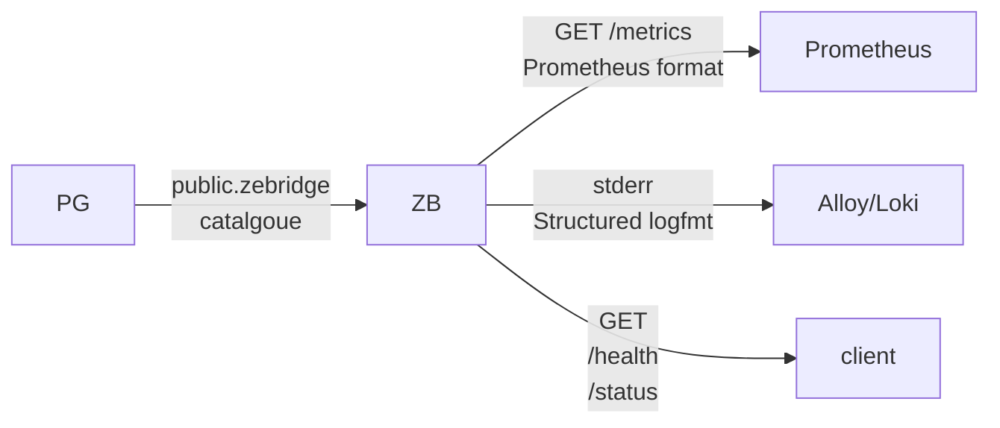

# Monitoring & Telemetry

The bridge provides telemetry through multiple channels:



**Metrics and logs**: Alert on the metric, read the log for the detail.

| | Prometheus (`/metrics`) | Loki (log lines) |
| --- | --- | --- |
| stores | numbers over time | text with labels |
| you get | `bridge_refused_tables 1` | `🔴 SUSPENDING 'orders': a row does not fit in the 4 KB per-event buffer (BASE_BUF=12)` |
| answers | **is** something wrong, since when, how often | **what** is wrong: which table, which LSN, what to change |
| good for | alerting, dashboards, trends | investigating after an alert fires |

_Prometheus physically cannot hold the table name or the fix. Loki can, but is poor at counting and alerting on rates_.


Data emitted by ZeBridge are self-reflection, or owned by ZeBridge (public.zebridge_catalogue in Postgres).

Two exceptions: 

* the consumer fleet count signaling themselves via NATS, a small complement to the NATS-exporter data connected to the NATS server, scraped by Prometheus, 
* the number of slots on the owned publication (for left-overs: Postgres will keep retaining all the WAL data generated beyond the possibly abandonned slot point).

💡 **Check your slots**: The DBA can check directly into Postgres:

```sql
#psql>
SELECT slot_name, active,
         pg_size_pretty(pg_wal_lsn_diff(pg_current_wal_lsn(), restart_lsn)) as lag
  FROM pg_replication_slots
  WHERE slot_name = 'my_slot';
```

💡 Drop one if unused:

```sql
SELECT pg_drop_replication_slot('my_slot');
```

💡 Clean the WAL with:

```sql
#psql>
CHECKPOINT;
```

---

### Metrics

### Prometheus /metrics Endpoint

**HTTP GET** `http://localhost:9090/metrics`, Prometheus text format, each metric with its own `# HELP`/`# TYPE` line.

<details>
<summary>Example output</summary>

```prometheus
bridge_uptime_seconds 331
bridge_wal_messages_received_total 1797
bridge_cdc_events_published_total 288
bridge_last_ack_lsn 25509096
bridge_connected 1
bridge_pg_reconnects_total 0
bridge_nats_reconnects_total 0
bridge_slot_active 1
bridge_wal_lag_bytes 51344
bridge_wal_confirmed_lag_bytes 2048
bridge_queue_usage_percent 0
bridge_cpu_seconds_total 7.600
bridge_max_rss_bytes 1526153216
bridge_refused_tables 0
bridge_refused_events_dropped_total 0
bridge_fleet_poll_timestamp_seconds 1757170200
bridge_fleet_clients_live_total 3
bridge_fleet_clients_live{tenant="kilo"} 2
bridge_fleet_clients_live{tenant="acme"} 1
bridge_fleet_client_last_seen_seconds{tenant="kilo",principal="omar"} 12
bridge_fleet_client_lag_events{tenant="kilo",principal="omar",stream="CDC_kilo"} 0
bridge_fleet_client_lag_events{tenant="kilo",principal="omar",stream="CDC_PUBLIC"} 3
bridge_replication_slots 2
bridge_replication_slot_inventory_timestamp_seconds 1757170100
bridge_replication_slot_active{slot="my_slot",type="logical",self="true"} 1
bridge_replication_slot_retained_wal_bytes{slot="my_slot",type="logical",self="true"} 51344
bridge_replication_slot_active{slot="zb_standby",type="physical",self="false"} 0
bridge_replication_slot_retained_wal_bytes{slot="zb_standby",type="physical",self="false"} 734003200
```

</details>
<br>

Two families come from the bridge's own schedules, not from the WAL loop (NOTES §10dc):

| family | source | cadence | what to read |
| --- | --- | --- | --- |
| `bridge_fleet_*` | the clients' heartbeats in the `live` KV bucket (PROTOCOL §9): each client writes `{principal, tenant, ts, streams: {stream: applied seq}}` every `heartbeatMs` | read every `FLEET_POLL_SECONDS` (60); a client silent for `FLEET_TTL_SECONDS` (90) drops out of the bucket by itself | `clients_live` per tenant, `last_seen_seconds` per client, `lag_events` per client and stream: stream head minus the sequence the client applied, in **messages** (a published batch counts one, not one per row) |
| `bridge_replication_slot_*` | `pg_replication_slots` on the reader's server — every slot, this bridge's marked `self="true"` | every `SLOT_INVENTORY_SECONDS` (300); the first pass lands one interval after boot | an inactive slot whose retained WAL climbs is an abandoned instance holding the disk; `bridge_replication_slots` is the count |

The four worth alerting on:

| metric | fires when | what it means |
| --- | --- | --- |
| `bridge_refused_tables` | `> 0` | a table is **suspended** — no primary key, an undecodable column type, or a row larger than the event buffer. The log line names which and why. |
| `bridge_refused_events_dropped_total` | `increase() > 0` | rows are being discarded right now for a suspended table |
| `bridge_fleet_clients_live{tenant}` | drops | clients heartbeating inside the live bucket's TTL (PROTOCOL §9); a fleet going quiet is visible here before anyone complains |
| `bridge_fleet_client_lag_events{tenant,principal,stream}` | `> N` for minutes | that client is falling behind on that stream — stream head minus what it applied, in messages |
| `bridge_replication_slot_active{slot,type,self}` | `== 0` with retained WAL climbing | a slot nobody reads — an abandoned instance (NOTES §10da): `SELECT pg_drop_replication_slot(...)` once you are sure |
| `bridge_replication_slot_retained_wal_bytes{slot,type,self}` | growing for an inactive slot | WAL PostgreSQL keeps for that slot; every slot on the server, not only this bridge's |
| `bridge_wal_confirmed_lag_bytes` | rising steadily | **the bridge is behind**: WAL it has not confirmed yet. This is the backlog number. |
| `bridge_wal_lag_bytes` | large and growing across checkpoints | WAL PostgreSQL is _retaining_ on disk for the slot, until `max_slot_wal_keep_size` |
| `bridge_connected` | `== 0` | the replication stream is down |

💡 **How do you read the lag**? The two lag metrics are not the same.

*  `bridge_wal_lag_bytes` measures from the slot's `restart_lsn`, which PostgreSQL only advances at `CHECKPOINT` — so it plateaus at a few MB on a perfectly healthy bridge and cannot tell you whether the bridge is keeping up.

* `bridge_wal_confirmed_lag_bytes` measures from `confirmed_flush_lsn`, which moves the moment the bridge ACKs.

❗️ Alert on the confirmed one for "the bridge is stuck", on the retained one for "the disk will fill".

**How busy is the bridge**?

* `bridge_queue_usage_percent` is the ring buffer's fill level: sustained high values mean NATS is not draining as fast as PostgreSQL produces, and the bridge is about to back-pressure the WAL reader.
* `bridge_cpu_seconds_total` is a counter over all threads, so `rate(bridge_cpu_seconds_total[1m])` gives cores used — `0.31` is a third of a core,
`1.0` is one core saturated, and a single-threaded reader that pins a whole core is telling you it is the bottleneck.
The same figure appears _in the log_ as `cpu=31%` on each `LOOP` line, which beats trying to isolate one process in `htop`.
* `bridge_max_rss_bytes` is peak RSS: expect it to sit near `2^BASE_BUF × RING_BUFFER_COUNT` plus metadata, since the slab is pre-allocated at startup.

**Configure Prometheus to scrape this endpoint**:

```yaml
scrape_configs:
  - job_name: 'cdc_bridge'
    static_configs:
      - targets: ['localhost:9090']
```

### JSON /status Endpoint

**HTTP GET** `http://localhost:9090/status` — the same data as `/metrics` above but shaped as JSON for a human or a shell script rather than a scraper.

<details>
<summary>Example output</summary>

```json
{
  "status": "connected",
  "uptime_seconds": 331,
  "wal_messages_received": 1797,
  "cdc_events_published": 288,
  "last_ack_lsn": "0/1832ce8",
  "is_connected": true,
  "pg_reconnect_count": 0,
  "nats_reconnect_count": 0,
  "slot_active": true,
  "wal_lag_bytes": 51344,
  "wal_lag_mb": 0,
  "wal_confirmed_lag_bytes": 2048,
  "cpu_seconds": 7.600,
  "max_rss_mb": 1455,
  "queue_usage_percent": 0,
  "refused_tables": 0,
  "refused_events_dropped": 0
}
```

</details>

---

## Logs

### Writing the log to a file

**Every log line goes to stderr** — including the periodic `METRICS` line and any panic with its stack trace.
Nothing is written to stdout, so `> logs.txt` captures an empty file. Redirect with `2>`:

```bash
zebridge --slot my_slot --pub my_pub 2>> bridge.log
```

`LOG_LEVEL` (`debug|info|warn|err`, default `info`) decides what reaches the file.
At `info` the volume is small — the `METRICS` line every 15 s is ~5 700 lines/day — and everything worth keeping is included.
**Do not point a file sink at `debug`.**

⚠️ The level _names_ differ between input and output: you set `LOG_LEVEL=warn` but the lines read `warning(scope):`.
Both spellings are accepted for the variable; when grepping or writing alert rules, match what the lines actually print:

```bash
grep -E '^(warning|error)\(' bridge.log
```

Rotate it, or it grows forever:

<details>
<summary><code>/etc/logrotate.d/zebridge</code></summary>

```conf
/path/to/bridge.log {
    daily
    rotate 14
    compress
    missingok
    copytruncate      # the bridge holds the fd open; it has no reopen-on-SIGHUP
}
```

</details>
<br>

Under `systemd`, skip the redirect entirely: `journald` captures stderr, and `journalctl -u zebridge -p warning` gives the severity filter for free.
### Structured Log Metrics (for Grafana Alloy/Loki)

As said, ZeBridge writes **every log line to stderr**, including the periodic metric line below (every 15 seconds) and any panic with its stack trace.

➡ Nothing is written to stdout — so redirect with `2>` or `2>&1`, not `>`:

```bash
bridge --slot my_slot --pub my_pub 2>> /var/log/bridge/bridge.log
```

```log
info(bridge): METRICS uptime=376 wal_messages=67 cdc_events=6 lsn=0/217e280 connected=1 pg_reconnects=0 nats_reconnects=0 lag_bytes=17816 slot_active=1
```

In the logs, the `LOOP` line next to `METRICS` is written every 15 s, which is the reader's profile:

```txt
LOOP iters=1407805 idle=10274 recv_ms=139 proc_ms=1494 cpu=31%
```

 field | reading |
| --- | --- |
| `iters` | WAL loop iterations in the interval |
| `idle` | iterations that found nothing and slept 1 ms — **high `idle` is good**: the bridge is waiting on PostgreSQL, not struggling |
| `recv_ms` | ms inside `receiveMessage` (libpq + framing) |
| `proc_ms` | ms decoding tuples and packing them into the ring buffer |
| `cpu` | process CPU over the interval, all threads |

It is emitted from the WAL loop, starts once replication is running.

When you are ready to ship these to Loki, point Grafana Alloy at the file. Every line is `level(scope): message`, and both halves make useful labels:

<details>
<summary>Grafana Alloy config</summary>

```hcl
loki.source.file "bridge" {
  targets    = [{__path__ = "/var/log/bridge/*.log", job = "zebridge"}]
  forward_to = [loki.process.bridge.receiver]
}

loki.process "bridge" {
  // "error(event_processor): 🔴 SUSPENDING 'orders': …"
  stage.regex {
    expression = "^(?P<level>debug|info|warning|error)\\((?P<scope>[a-z_]+)\\):"
  }
  stage.labels {
    values = { level = "", scope = "" }
  }
  // A panic is one event spread over ~10 lines; keep it as one entry.
  stage.multiline {
    firstline = "^(debug|info|warning|error)\\("
  }
  forward_to = [loki.write.default.receiver]
}
```

</details>
<br>

The queries that matter are `{job="zebridge", level="error"}` and `{job="zebridge", scope="refused"}` — every suspension the bridge has ever declared.

⚠️ Do **not** use Alloy's `stage.metrics` to re-derive counters from the `METRICS` line. Prometheus already scrapes those numbers from `/metrics`; a second, lossier copy that only updates every 15 seconds is worse in every respect.

---

## Health Check Endpoint

**HTTP GET** `http://localhost:9090/health`
Use for Docker health checks, Kubernetes probes, or load balancers.

Returns:

```json
{"status":"ok"}
```

Status: `200 OK` when bridge HTTP server is running.


---