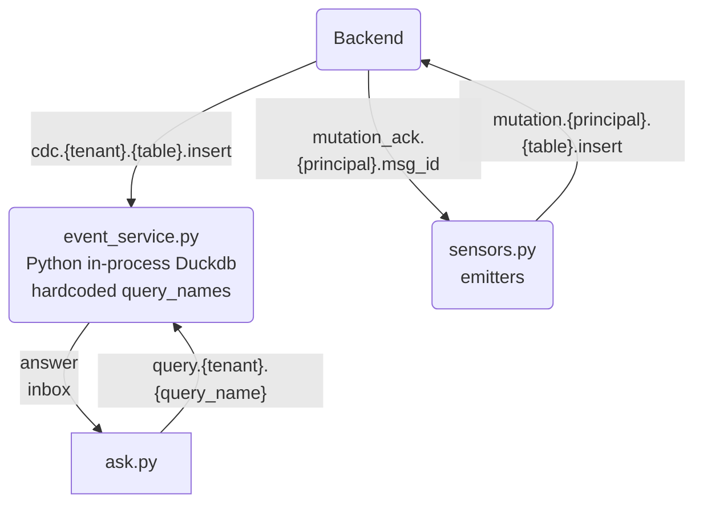
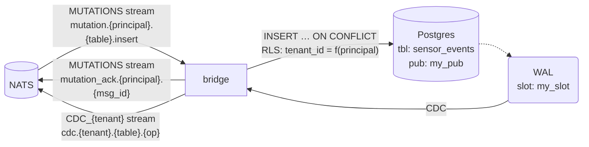
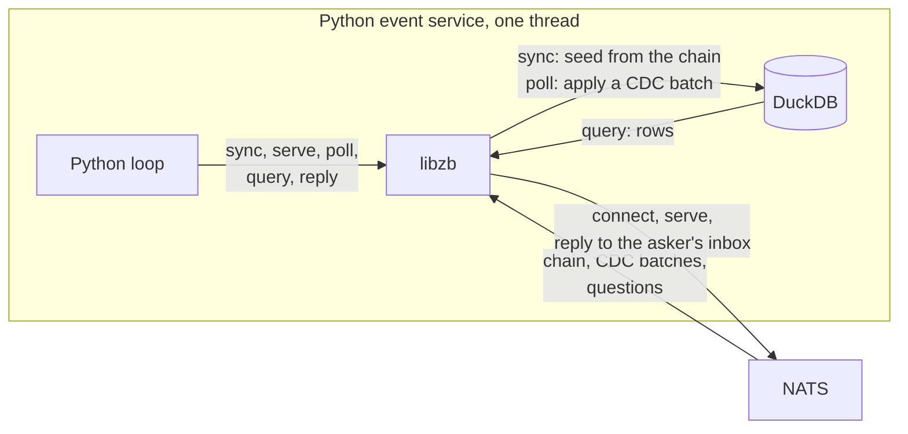

# 09 — sensor events: a time series on a DuckDB replica

Simulated sensors send a reading every 20 ms. The readings are stored in PostgreSQL, copied to a DuckDB file, and a small service answers questions about them: how fresh is the data, what is the moving average, what happened each minute. PostgreSQL stores the rows and never runs one of those queries.

The example has three parts, and this page walks through them in order:

1. **The emitter** (`sensors.py`): a plain NATS connection that publishes each reading as a *mutation*, a request to write a row.
2. **The backend** (PostgreSQL + the bridge + NATS): writes the row, answers the sender with a verdict, and publishes the row's change (CDC) to a stream.
3. **The event service** (`event_service.py`): Python driving `libzbcore.dylib`, the libzb library. It keeps a DuckDB copy of the table and answers questions, all in one thread.

A fourth script, `ask.py`, asks the questions.



The data model follows TimescaleDB's [events-uuidv7](https://github.com/timescale/timescaledb/tree/main/docs/getting-started/events-uuidv7) walkthrough: each row's key is a UUIDv7, and a UUIDv7 carries the time it was made.

## Run it

You need the dev stack running (PostgreSQL, nats-server, the bridge) and libzb built with DuckDB. The `events` credential comes from `scripts/native/jwt-bootstrap.sh`.

```sh
cd libzb && zig build -Doptimize=ReleaseFast -Dduckdb=true && cd ..
set -a && . ./.env.admin && set +a
PY=scripts/scenarios/.venv/bin/python

$PY examples/09-event/provision.py           # create the table; waits until the bridge has it
$PY examples/09-event/event_service.py &     # part 3: the DuckDB copy and the answers
$PY examples/09-event/sensors.py &           # part 1: 20 sensors × 50 readings/s, for 60 s
$PY examples/09-event/ask.py watch           # ask every second; prints the lag and a moving average
```

One question at a time:

```sh
$PY examples/09-event/ask.py moving_avg '{"kind": "humidity", "window_s": 30}'
$PY examples/09-event/ask.py per_minute '{"kind": "pressure", "minutes": 5}'
$PY examples/09-event/ask.py alarms '{"kind": "temperature", "above": 30}'
```

`provision.py teardown` drops the table.

## Part 1 — the emitter: publish a mutation

A real sensor would sit behind MQTT or an HTTP gateway. To keep the example simple, `sensors.py` opens its own NATS connection with `nats-py` and publishes directly. It logs in as `bob`, a client of the tenant `globex`.

A mutation is a MessagePack message on a subject that says **who** writes, **which table** and **which operation**:

```txt
mutation.<principal>.<table>.<operation>      →   mutation.bob.sensor_events.insert
```

NATS checks the subject against bob's credential before accepting it, so bob cannot write as anyone else. The body says **which row** and **what values**:

```python
eid = uuid.uuid7()                      # the reading's id AND its time (Python 3.14)
row = {"event_id": str(eid), "tenant_id": "globex", "sensor_id": 7,
       "kind": "temperature", "value": 21.43, "updated_at": "2026-09-27T09:40:01.123456Z"}

await js.publish(
    "mutation.bob.sensor_events.insert",
    msgpack.packb({"key": {"event_id": row["event_id"]},   # the primary key
                   "data": row,                            # the full row
                   "version": row["updated_at"],           # the version column's value
                   "client_id": "sensor-7"}),              # breaks ties between writers
    headers={"Nats-Msg-Id": eid.hex},                      # JetStream drops duplicates
)
```

`js.publish` is a JetStream publish. It returns once the message is safely stored in the `MUTATIONS` stream, before PostgreSQL has seen it. The bridge's verdict comes later, on a subject the sensor listens to:

```python
await nc.subscribe("mutation_ack.bob.*", cb=on_verdict)   # {"status": "accepted", ...}
```

Each simulated sensor keeps its own clock and sends every 20 ms. Its value is a cosine with a 2 s period around a base (21 °C, 45 %, 1013 hPa), plus a slow random walk about 10% of the wave's size, a little noise, and a rare spike. The shape makes the queries easy to check by eye: a 1 s average holds half a wave and swings each second, while a 10 s moving average holds five whole waves and shows only the slow walk.

## Part 2 — the backend: PostgreSQL, the bridge and NATS

This part runs on its own; the example only creates the table. For each mutation:

1. The bridge takes the message from the `MUTATIONS` stream.
2. It reads the principal from the subject and checks the table and columns against its catalogue, the list of tables it serves.
3. It writes the row in PostgreSQL with `INSERT … ON CONFLICT`, using its own writer role but on bob's behalf: it passes bob's name to the transaction, and row-level security limits the write to `globex` rows.
4. It answers on `mutation_ack.bob.<msg_id>`: `accepted`, `stale`, `rejected`, and so on.
5. PostgreSQL's write-ahead log (WAL) records the new row. The bridge reads it through a replication slot and publishes the change on `cdc.globex.sensor_events.insert` in the stream `CDC_globex`. Several rows can share one message (the `.batch` subject).

**tenant: globex**



The bridge also cuts a **chain** every few minutes: compressed snapshots and deltas of the table in a NATS object store. A new replica loads the chain first, then follows the stream from where the chain ends.

The table, created by `provision.py`:

```sql
CREATE TABLE public.sensor_events (
    event_id   uuid PRIMARY KEY DEFAULT uuidv7(),  -- the reading's time, to the millisecond
    tenant_id  text NOT NULL,                      -- which tenant owns the row
    sensor_id  integer NOT NULL,
    kind       text NOT NULL,                      -- temperature | humidity | pressure
    value      double precision NOT NULL,
    updated_at timestamptz NOT NULL DEFAULT now(), -- the version: the newer write wins
    deleted_at timestamptz                         -- set instead of deleting the row
);
SELECT zebridge_enable('public.sensor_events',
    tenant_col => 'tenant_id',
    writable => true,
    version_col => 'updated_at',
    tombstone_col => 'deleted_at',
    publication => 'my_pub',
    dry_run => false
);
```

`zebridge_enable` does the setup: grants, row-level security, the index the bridge needs, the catalogue row, and adding the table to the publication. `provision.py` also maps the service's principal `events` to `globex`, so libzb knows which tenant it follows.

There is no timestamp column. PostgreSQL 18 and DuckDB both read the time back with `uuid_extract_timestamp(event_id)`. Keys arrive in time order, so every insert lands at the end of each index, the cheapest place.

`deleted_at` is the tombstone. A retention job would set it on old readings. The delete then travels like any other change, and the bridge's sweeper removes the row later.

## Part 3 — the event service: libzb from Python



`event_service.py` loads `libzbcore.dylib` with `ctypes`.
Every libzb call takes a handle and JSON text, and returns JSON text that the caller frees with `zb_free`:

```python
lib = ctypes.CDLL("libzb/zig-out/lib/libzbcore.dylib")

def take(ptr):                       # every libzb answer: read the JSON, then free it
    try:
        return json.loads(ctypes.string_at(ptr).decode())
    finally:
        lib.zb_free(ptr)
```

The service uses six calls:

| call | what it does |
| --- | --- |
| `zb_client_connect(opts)` | opens the local database and the NATS connection; returns a handle |
| `zb_client_sync(h)` | loads the chain into DuckDB, then catches up on the stream |
| `zb_client_serve(h, opts)` | subscribes to `query.globex.<name>` for each query it answers |
| `zb_client_poll(h, wait_ms)` | applies the next batch of changes; returns any questions that arrived |
| `zb_client_query(h, sql, params)` | reads the DuckDB copy with SQL |
| `zb_client_reply(h, id, answer)` | sends one answer back to whoever asked |

Here is the service with its bookkeeping removed. It is the same code as in `event_service.py`, where `card` wraps the calls above:

```python
# 1. Open: a DuckDB file that follows one table, as the principal `events`.
card = Card(lib, {"natsUrl": "nats://127.0.0.1:4222",
                  "credsPath": "scripts/native/creds/events.creds", "principal": "events",
                  "dbPath": "/tmp/events-service.duckdb", "engine": "duckdb",
                  "tables": ["sensor_events"], "seedStreaming": True})

# 2. Catch up: load the chain, then the stream, until the copy is current.
card.sync()

# 3. Announce the questions this service answers, in the queue group "events".
card.serve(["globex"], ["alarms", "freshness", "moving_avg", "per_minute"], "events")

# 4. The loop. One thread does everything, one step at a time.
while True:
    report = card.poll(50)          # apply the next CDC batch to DuckDB (or wait ≤ 50 ms)
    for q in report.get("requests", []):                   # questions that arrived meanwhile
        answer = QUERIES[q["name"]](card, q["payload"])    # each runs card.query(sql, params)
        card.reply(q["id"], answer)                        # back to the asker
```

And one of the queries, a 10-second moving average per sensor:

```python
def v7_boundary(t):                  # the smallest UUIDv7 of a moment (epoch seconds)
    h = f"{int(t * 1000):012x}"
    return f"{h[:8]}-{h[8:12]}-7000-8000-000000000000"

def moving_avg(card, q):
    return card.query("""
        WITH b AS (SELECT sensor_id,
                          time_bucket(INTERVAL 1 SECOND, uuid_extract_timestamp(event_id)) AS t,
                          avg(value) AS v
                   FROM sensor_events
                   WHERE kind = ? AND event_id >= ?::UUID
                   GROUP BY ALL)
        SELECT sensor_id, t, v,
               avg(v) OVER (PARTITION BY sensor_id ORDER BY t
                            RANGE BETWEEN INTERVAL 10 SECOND PRECEDING AND CURRENT ROW) AS moving_avg
        FROM b""", [q.get("kind", "temperature"), v7_boundary(time.time() - 60)])
```

The time filter compares the key itself with the smallest UUIDv7 of "60 seconds ago". It could extract the time from every key instead, `uuid_extract_timestamp(event_id) >= …`, and get the same rows, but slower: see [the boundary](#the-uuidv7-boundary) below.

**Why one thread.** `poll` does two jobs: it writes the next batch of changes into DuckDB, and it hands over the questions that arrived. The loop then answers them before the next `poll`. Writes and reads never overlap, so no lock is needed. This also fits DuckDB, which **allows only one process to write a file**: the process that writes the copy is the one that reads it.

**Where the answers go.** A question is a NATS request: the asker listens on a private inbox, and `reply` publishes the answer there as a plain message, not into a stream. libzb compresses the answer first. An answer over 256 KiB is stored as an object instead, and the reply carries its name; the asker's libzb fetches it without the asker noticing.

**Several instances.** Start a second service with its own file. Both join the queue group `events`, and NATS gives each question to one of them:

```sh
ZB_DB=/tmp/events-2.duckdb $PY examples/09-event/event_service.py --label second
```

**The credential.** `events` is a *responder*: it can read `globex` like a client and answer `globex` questions, but it cannot write.

### Asking

`ask.py` logs in as `bob` again. It keeps no copy of the table: it declares the table *on demand*, so nothing is loaded, and asks with one call:

```python
answer = take(lib.zb_client_request(h, b"query.globex.moving_avg", b'{"kind": "humidity"}', 5000))
```

## The queries

| name | parameters | answer |
| --- | --- | --- |
| `freshness` | none | rows, `sum(value)`, the newest reading's time, and its age when answered |
| `moving_avg` | `kind`, `window_s` 10, `since_s` 60, `sensor_id`, `series` | per sensor, 1 s buckets and their moving average; the latest point, or one sensor's series |
| `per_minute` | `kind`, `minutes` 10 | per minute: readings, sensors, avg, min, max, stddev |
| `alarms` | `kind`, `above` 30, `since_s` 60 | the sensors above a threshold: how many readings, the highest, the last |

The newest reading's age measures the whole path: sensor, NATS, bridge, PostgreSQL, CDC, DuckDB. Since the sensors send every 20 ms, the age also includes up to one period.

## Measured (2026-09-27)

Everything on one Mac: PostgreSQL 18, nats-server, the bridge, the service and the sensors. Two 60-second runs in a row on the same copy. "Newest age" is sampled every second while the sensors write.

| sensors | readings/s | verdicts | ack p50 / p99 | newest age p50 / p90 | question round trip p50 |
| --- | --- | --- | --- | --- | --- |
| 20 | 1,000 | 60,000 accepted | 1.8 / 3.0 ms | 9 ms | 4.4 ms |
| 100 | 5,000 | 299,996 accepted | 3.5 / 14.1 ms | 11 / 13 ms | 6.7 ms |

After both runs PostgreSQL and the DuckDB copy agreed exactly: 359,996 rows, the same `sum(value)`. One sensor's 1 s average swung by about a degree each second, as the 2 s wave predicts, while its 10 s moving average stayed within 0.3 of the base.

## Compared with TimescaleDB

| TimescaleDB | here |
| --- | --- |
| hypertable, chunks by time | one table; the UUIDv7 key orders it by time |
| `time_bucket` | DuckDB's `time_bucket` |
| continuous aggregate | `per_minute`, recomputed on each question |
| columnstore compression | DuckDB's own columnar storage |
| `to_uuidv7_boundary` | none built in; a small function does it (below) |
| retention policy | a job that sets `deleted_at`; the sweeper removes the rows |
| queries on the primary | queries on a copy; PostgreSQL only stores |

### The UUIDv7 boundary

TimescaleDB's `to_uuidv7_boundary(t)` gives the smallest UUIDv7 of a moment: its millisecond, then version 7, variant 10 and zeros. DuckDB has none, and the service cannot create a macro: `zb_client_query` runs reads only. So `event_service.py` builds the boundary in Python, `v7_boundary(t)` above, and binds it as a parameter. Building it from an epoch number also keeps time zones out of the comparison.

Every time filter in the service is written `event_id >= ?::UUID`. DuckDB keeps a min and max key for each block of rows, so it can skip a whole block from those two numbers. A function of the key, such as `uuid_extract_timestamp(event_id) >= t`, hides them, and every row is read. The newest reading is found the same way, as `max(event_id)`, with the time extracted once.

Measured on 20M synthetic readings, keeping the last 200k, both forms returning the same rows:

| query | extracting the time | the boundary |
| --- | --- | --- |
| count and average | 19.3 ms | 1.3 ms |
| 10 s moving average | 31.3 ms | 13.7 ms |

The moving average gains less because its window still runs over every row that passes the filter. The gain relies on rows sitting in the file roughly in key order, which holds here: sensors mint their keys as they read, and the copy appends them as they arrive.

Outside the service, in a DuckDB shell that can create objects, the same boundary is a macro:

```sql
CREATE MACRO to_uuidv7_boundary(ts) AS (
  WITH h AS (SELECT lpad(printf('%x', epoch_ms(ts)), 12, '0') AS x)
  SELECT (x[1:8] || '-' || x[9:12] || '-7000-8000-000000000000')::UUID FROM h);
```
