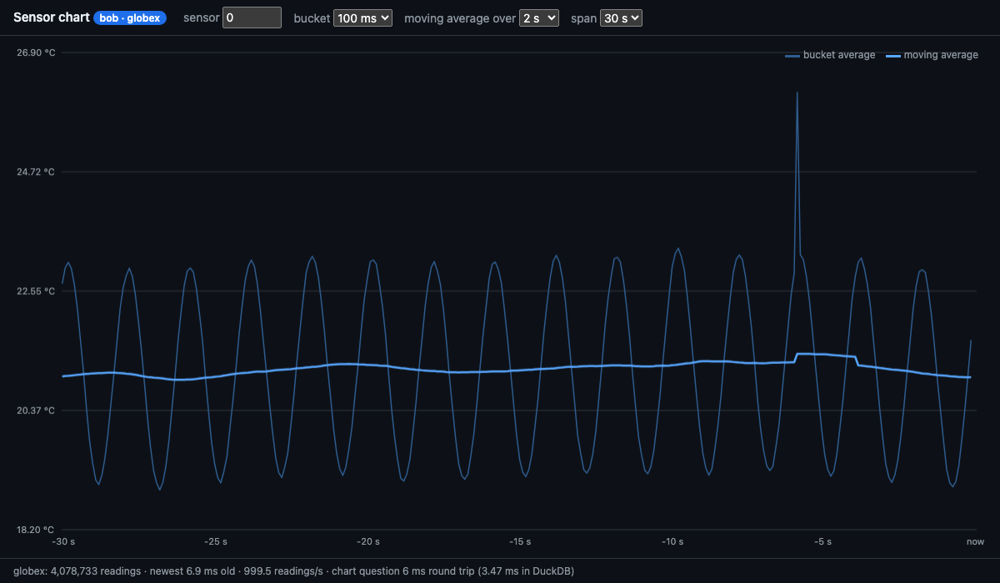

# 09-event in a browser: one sensor as curves

A page that draws one sensor's readings live, asked from the event service. It keeps no copy of the table: `sensor_events` is declared on demand, so only its schema arrives. Every half second the page asks `query.<tenant>.moving_avg` for one sensor's series and redraws it; every second it asks `freshness` for the footer.



The thin line is the average of each 100 ms bucket: the sensor's 2 s cosine. The thick line is the moving average over 2 s, one whole wave, so the wave cancels and only the slow random walk remains. In the picture a rare spike lands in one bucket and lifts the moving average for exactly the 2 s it stays in the window.

## Run it

The event service and some sensors must be running (see [the example's README](../README.md#run-it)). Then, from this directory:

```sh
pnpm install --ignore-workspace     # the repo's pnpm-workspace.yaml lists no packages
pnpm dev                            # http://localhost:5176/?principal=bob&tenant=globex
```

`?principal=` and `?tenant=` pick who asks. A principal can only ask about its own tenant: `?principal=alice&tenant=acme` works, `?principal=alice&tenant=globex` is refused by NATS before the service sees it.

The page talks only to its own origin, as in `08-map/web`: Vite proxies the NATS websocket at `/nats`, and `public/creds` is a symlink to `scripts/native/creds`.

## What it asks

```ts
const zb = new ZeBridge({ natsUrl, principal, creds, ondemandTables: ['sensor_events'] });
await zb.connect();

const ans = await zb.request(`query.${tenant}.moving_avg`, {
  kind: 'temperature', sensor_id: 0, series: true,
  since_s: 32,       // the span, plus one window, so the first point has a full window
  window_s: 2,       // the moving average's width
  bucket_ms: 100,    // 100 ms buckets draw the wave; 1 s buckets average half of it away
});
```

`zb.request` returns the parsed answer. The service compresses answers over 512 bytes and stores those over 256 KiB as objects; the library undoes both without the page knowing.

The controls change the sensor (its kind is `sensor_id % 3`), the bucket, the window and the span. The footer shows the tenant's row count, how old its newest reading was when the service answered, the write rate, and the chart question's round trip with the part spent in DuckDB.
