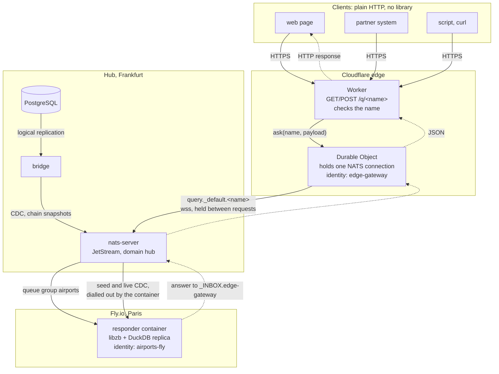
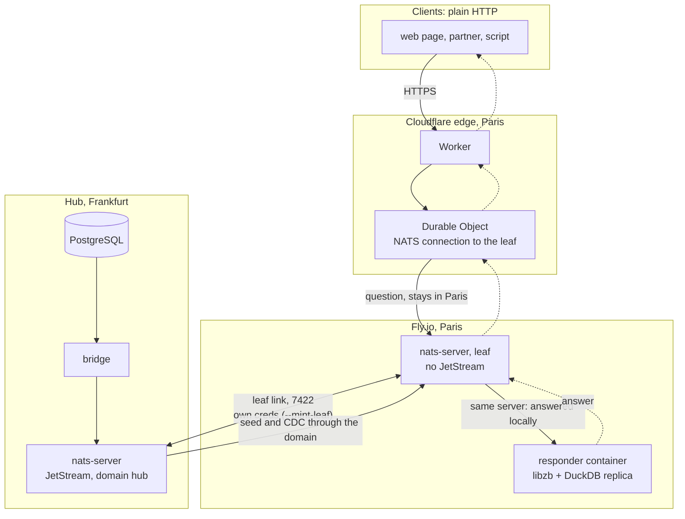

# 11 — an HTTP front at the edge for ZeBridge's responders

A Cloudflare Worker that turns a plain HTTP request into a question to a ZeBridge responder,
over NATS: `GET /q/<name>?…` or `POST /q/<name>` with a JSON body asks `query.<tenant>.<name>`
and returns the answer. A client needs no library, no enrollment and no NATS: a web page, a
partner's system, a script.

```
GET /q/airports_near?lat=50.11&lng=8.682&radius_km=100&limit=5
{"columns":["code","name",…],"rows":[["FRA",…],…],"count":5,"ms":6.6,
 "connect_ms":0,"request_ms":31}
```

The Worker hands each request to one Durable Object, which holds the NATS connection between
requests: the first request connects, the next ones cost the question alone. The airports
service of [10-airports](../10-airports) answers here; any responder does.

## Run it

```sh
npm install
PYTHONPATH=../../zb-python/src python3 enroll.py --bridge https://bridge.example.com \
    --invite <code> --ws wss://ws.example.com
npx wrangler dev                    # Cloudflare's runtime (workerd), on this machine
curl 'http://localhost:8787/q/airports_near?lat=50.11&lng=8.682'
```

`enroll.py` redeems an invite once, with libzb, on your machine, and writes the principal's
creds to `.dev.vars`, where `wrangler dev` reads local secrets. The Worker never enrolls and
never contacts the bridge: it reads the creds from its secrets. Deployed, they are Worker
secrets (`wrangler secret put ZB_CREDS_B64`, and `ZB_PRINCIPAL`, `ZB_NATS_WS_URL`), never in
its code or configuration. `ZB_TENANT` chooses whose services it asks: `_default`, the open
tenant, when unset.

## What it shows

* **The connection is held.** Deployed (2026-10-05), from Cloudflare's Paris location to the
  hub in Frankfurt: every request after the first reports `connect_ms: 0`, and the question
  takes 26–32 ms, DuckDB's ~7 ms included. The first request connects, about 190 ms (the
  WebSocket, TLS, the server's challenge signed with the seed). A stateless Worker, connecting
  on every request, paid 65–240 ms each time. Measured from a laptop with `curl`, the whole
  HTTP call went from 240–450 ms to about 115 ms, most of it curl's own new connection to
  Cloudflare; a client that keeps its HTTP connection sees close to the question alone.
* **It speaks the grants.** Replies come to `_INBOX.<principal>`, the only inbox a client may
  use, and the question's name must be one subject token (letters, digits, `_`): a dot or a
  wildcard could widen the subject. NATS's grants still decide what the identity may ask.
* **Answers are compressed.** The service sends zstd frames; the gateway decodes them with
  fzstd, as zb-client-ts does. An unknown question gets NATS's own answer: no responders.

## With an edge responder

The gateway asks whatever answers on the subject. Here the responder is the container of
[12-edge-container-fly](../12-edge-container-fly): libzb and a DuckDB replica on Fly.io, with no
public port. Each half is measured; this exact combination was not run together.



Clients carry nothing; the Worker only checks the name; the Durable Object keeps the
connection; the container keeps its replica current from the hub and answers as one member of
queue group `airports`. PostgreSQL never sees a question: it only feeds the replica.

As drawn, every question detours through Frankfurt: Cloudflare, the hub, the container in
Paris, the hub, Cloudflare. Example 12 measured that detour (52 ms against 33 for the hub's
own responder). A responder serves fast the askers on its own NATS server, so the layout that
keeps a Paris question in Paris puts a NATS leaf beside the container, and has the Durable
Object dial the leaf. Not built:



The question never leaves Paris; only the replica's updates cross to Frankfurt, through the leaf
link. The pieces exist: `deploy/ansible/leaf.yml` sets up a leaf on a host,
`deploy/airports-responder.Dockerfile` the responder beside it (`NATS_JS_DOMAIN=hub`), and on
`leaf1` the pair answered the leaf's own askers. On Fly it would be two processes, a leaf and the
responder, in one machine or two.

## What it does not do

* **Authenticate users.** Everyone who reaches the URL asks with the gateway's one identity.
  Before exposing a tenant's services, put your own authentication in the Worker (your app's
  session or token) and choose the tenant from it.
* **Writes, replicas, live updates.** It asks; the local-first app with the library keeps the
  replica, the outbox and the CDC.
* **Renewal.** The creds of an invite last a day (`ENROLL_JWT_TTL_SECONDS`); a phone renews its
  own through `/renew`, but a Worker cannot rewrite its secret. In production: a longer-lived
  identity, or the JWT kept where the gateway can renew it (the Durable Object's storage).
* **Cost.** An open outbound WebSocket keeps the Durable Object in memory: it is billed by
  duration while it holds the connection.
