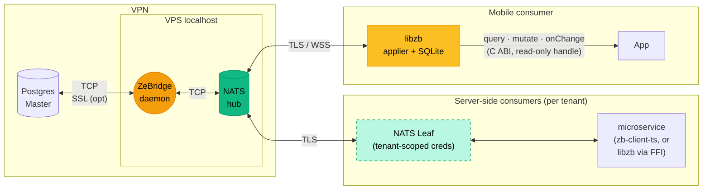

```mermaid
flowchart LR
     subgraph VPN["VPN"]
        PG[("Postgres<br>Master")]
        subgraph Localhost ["VPS localhost"]
            Bridge(("ZeBridge <br> daemon"))
            NATS[("NATS <br>hub")]
        end
        PG <-- "TCP<br>SSL (opt)" --> Bridge
        Bridge <--> |"TCP"| NATS
    end

    NATS <-- "TLS" --> NATS_L
    NATS <-- "TLS / WSS" --> Lib


     subgraph Edge["Server-side consumers (per tenant)"]
        NATS_L["NATS Leaf<br>(tenant-scoped creds)"]
        NATS_L <--> Svc["microservice<br>(zb-client-ts, or<br>libzb via FFI)"]
    end

    subgraph Mobile["Mobile consumer"]
        Lib["libzb<br>applier + SQLite"]
        Lib -- "query · mutate · onChange<br>(C ABI, read-only handle)" --> App["App"]
    end

    style Bridge fill:#f59e0b,stroke:#d97706,color:#000
    style Lib fill:#fbbf24,stroke:#f59e0b,color:#000
    style NATS fill:#10b981,stroke:#059669,color:#000
    style NATS_L fill:#b8f8e3,stroke:#059669,stroke-dasharray:5 5,color:#000
```